# Gauss–Seidel（高斯-赛德尔）迭代

原创 sonadorje AI之Myth 2026-02-12 13:14 云南

> 原文地址: [https://mp.weixin.qq.com/s/CVC1sPVLFILOiyYCb94BdQ](https://mp.weixin.qq.com/s/CVC1sPVLFILOiyYCb94BdQ)

 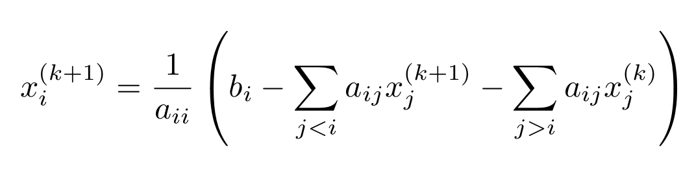  
编辑

（图1 **Gauss–Seidel 公式）**

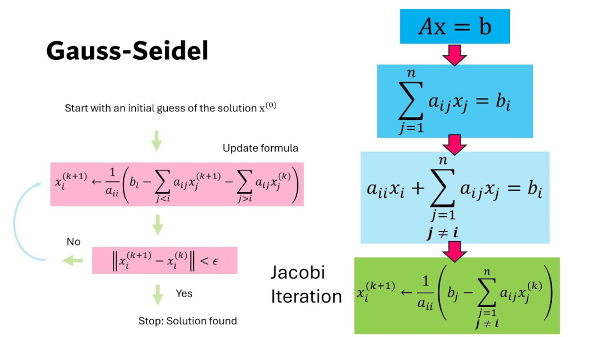  
编辑

（图2 **Gauss–Seidel 和雅可比****公式）**

  

这张图把 **Gauss–Seidel（高斯-赛德尔）迭代**讲成了一个“按行解方程、边算边更新”的流程。核心是：把线性方程组 Ax=b 的每一行都当成一个“解”的小公式，然后**按 i=1,2,…,n 顺序更新**，并且**立刻用上刚算出来的新值**。

* * *

## 1）从 Ax=b 到“按行更新”的公式（图右蓝色框）

第 i 行是：

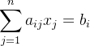

把 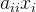 单独拎出来：

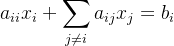

于是可以解出：

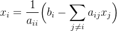

**迭代法**就是：右边的 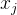 先用“当前已有的近似值”代替。

如果你不熟悉雅可比迭代，可先去读这篇文章《Jacobi（雅可比）迭代法》。

  

* * *

## 2）Gauss–Seidel 的关键：新旧值“混用”（图中的 j<i 与 j>i）

当你在第 k+1 次迭代里更新第 i 个分量时：

-   对 **已经更新过的分量**（j<i），用 **新值** 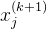
    
-   对 **还没更新到的分量**（j>i），只能用 **旧值** 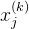
    

所以更新公式就是图左粉色框那条：

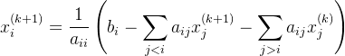

这就是它比 Jacobi 更“快”的常见原因：**信息利用更及时**（同一轮里就传播开了）。

  

* * *

## 3）和 Jacobi（图右绿色框）的区别一句话讲清

-   Jacobi：一轮里所有 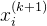 都只用上一轮的 （完全“旧值”）
    
    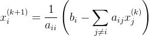
    
    → 易并行，但通常收敛慢些。
    
-   Gauss–Seidel：一轮里按顺序更新，**能用到同一轮刚更新的新值**  
      → 通常更快，但本质是“串行/就地更新”。
    

  

* * *

## 4）矩阵分裂的标准写法（更本质的看法）

把矩阵分成：

-   A=D+L+U  
      D：对角；L：严格下三角；U：严格上三角
    

那么：

-   Jacobi：
    
    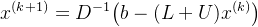
    
-   Gauss–Seidel：
    
    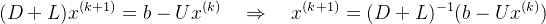
    

这句很重要：**每一轮 Gauss–Seidel 等价于解一个下三角方程 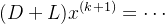** ，所以它天然就是“从上往下顺序算”。

* * *

##   

## 5）停止条件（图左的 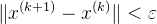）

图里用的是“相邻两次迭代的变化量很小就停”：

实际工程里也常用更稳的 **残差**：

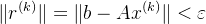

（因为有时 x 变化小不代表已经满足方程。）

* * *

##   

## 6）什么时候会收敛？（你需要记住的两条“够用条件”）

高斯-赛德尔并不是对所有 A 都收敛。常用的充分条件：

1.  [严格对角占优](https://mp.weixin.qq.com/s?__biz=MzkzODgwODczMw==&mid=2247490646&idx=1&sn=5769460bc8c2378f0d8c9a3e40c7381b&scene=21#wechat_redirect)：
    
    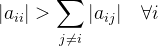
    
2.  对称正定（SPD）：A 对称且 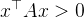（除 x=0 外）
    

  

更一般地说：迭代矩阵的谱半径  才收敛，但上面两条更“可直接检查”。

  

* * *

## 7）用一个 3×3 小例子走两轮（把“新旧混用”变成直觉）

设

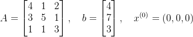

**第 1 轮（k=0→1）按顺序更新：**

-   i=1：  
    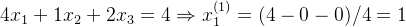
    
-   i=2：这里就用到刚更新的 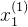   
    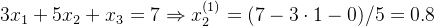
    
-   i=3：再用到 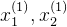   
    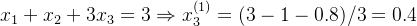
    

所以

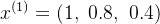

**第 2 轮（k=1→2）同理：**

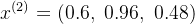

你能看到：同一轮里更新出来的数会立刻影响后面的分量，这就是 Gauss–Seidel 的“信息传递更快”。

  

我们把 **Gauss–Seidel** 用“几何 + 误差传播 + 为什么更快 + 还可以怎么改进”继续讲透。

* * *

## 8）几何直觉：一行方程就是一个“超平面”，迭代就是“沿坐标轴去贴近它”

线性方程组 Ax=b 的第 i 行：

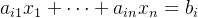

在 n 维空间里是一张 **超平面**（2D 是直线、3D 是平面）。

### “更新 ”在几何上干了什么？

当我们更新  时，其它分量先当作固定常数。也就是在当前点 x 的基础上：

-   只允许你沿着 **第 i 个坐标方向**（只动 ）移动
    
-   目标是让第 i 行方程 **精确满足**
    

所以每一步就是：

> 在“只动 ”这条直线上，找到与第 i 个超平面的交点。

你可以把它想象成：  
**先用第 1 行把点“拉到”满足第 1 行的位置（只动 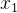），再用第 2 行拉一次（只动 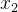），……一轮下来把所有行都过一遍。**

* * *

## 9）为什么 Gauss–Seidel 通常比 Jacobi 快：同一轮里误差就能“往后传”

回忆差别：

-   Jacobi：这一轮计算的所有  都只用 （旧值），所以“改正信息”要到下一轮才传播。
    
-   Gauss–Seidel：算  后，算 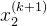 立刻就用上 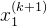，算 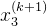 又用上前面新的……
    

几何上就是：

-   Jacobi：每个超平面给出的“修正”都基于**同一个旧点**，像是“同时提建议但不立刻采用”
    
-   Gauss–Seidel：**边听边改**，后面的行是在一个已经变好的点上继续修正
    

因此在很多常见情形（比如对角占优、SPD）下，GS 往往更快、更稳定。

* * *

##   

## 10）把它和“坐标下降 / 逐坐标优化”联系起来（非常有用的理解）

如果 A 是对称正定（SPD），那么解 Ax=b 等价于最小化一个二次函数：

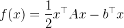

这时 Gauss–Seidel 做的事情，几乎就是：

> **每次只沿一个坐标  方向，把 f(x) 在这条线上最小化**（精确一维最优）。

也就是说它本质是 **坐标下降法（coordinate descent）** 的一个特殊例子。

这也解释了为什么在 SPD 情况下它很“靠谱”：  
二次函数是“碗形”的（凸），每次沿一个方向做到最优，整体自然会往最低点走。

  

* * *

## 11）误差传播视角：收敛到底看什么？

设真实解是 ，误差 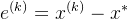。

Gauss–Seidel 可以写成：

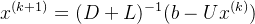

于是误差满足：

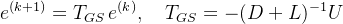

关键结论：

> 只要 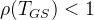（谱半径小于 1），误差就会几何级数衰减，算法收敛。

你前面问过谱半径的意义，这里正好用上：  
ρ(T) 可以理解成“误差每轮能被放大到多大”的最坏尺度；小于 1 才会越迭代越小。

  

* * *

## 12）“顺序很重要”：为什么 GS 对变量顺序敏感？

因为 GS 是“就地更新”，顺序决定了“谁先修正、谁后修正”。  
如果把变量重新排序（等价于重排方程/列），迭代矩阵 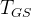 会变，收敛速度也会变。

工程里常见技巧：

-   重排让矩阵更接近对角占优
    
-   对稀疏矩阵，用图划分/带宽缩减（比如减少耦合距离）让传播更快
    

* * *

##   

## 13）一个更强的版本：SOR（超松弛）——给 GS 加“油门”

在 GS 更新完一个“候选新值” 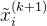 后，不是直接用它，而是做加权：

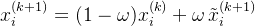

-   ω=1：就是 Gauss–Seidel
    
-   0<ω<1：欠松弛（更稳但可能更慢）
    
-   1<ω<2：超松弛（常常更快，但太大会发散）
    

直觉：  
GS 像“走到交点就停”，SOR 像“朝交点方向多走一点”（ω>1），有时能更快逼近解。

* * *

##   

## 14）你可以用一个 2D 小画面想象它（脑补即可）

设两条直线（两个方程）在平面上交于解 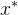。

-   Jacobi：从旧点出发，同时分别算“满足第一条线的 x1”和“满足第二条线的 x2”，但它们都用旧点的信息 → 走法像“交替偏保守”
    
-   Gauss–Seidel：先沿 x1 方向走到满足第一条线，再立刻从新点沿 x2 方向走到满足第二条线 → 像“折线贴近交点”，通常更快
    

  

我们用 **3D**（三个未知数 x1,x2,x3）把 Gauss–Seidel 的“走法”讲成你能在脑中“看见”的动画。

  

* * *

## 1）3D 里：每一行方程是一张平面，解是三张平面的交点

对 Ax=b（3×3）来说：

-   第 1 行：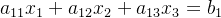 是一张平面 P1
    
-   第 2 行是平面 P2
    
-   第 3 行是平面 P3
    

真实解 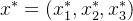 就是 **三张平面唯一交点**（一般情形）。

* * *

##   

## 2）关键动作：更新  = “沿着第 i 个坐标轴方向走到某张平面上”

假设你当前在点 x=(x1,x2,x3)。

### 更新 x1 的几何意义

你把 x2,x3 **冻结不动**，只允许 x1 变。  
这等价于：从当前点出发，沿着与 x1 轴平行的直线移动：

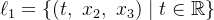

然后你要满足第 1 行（落在平面 P1 上）。  
所以你做的是：

> 沿着 ℓ1 去找它与平面 P1 的交点。

那交点的 t 值就是新的 。

同理：

-   更新 x2：沿 ℓ2={(x1, t, x3)} 去撞 P2
    
-   更新 x3：沿 ℓ3={(x1, x2, t)} 去撞 P3
    

* * *

##   

## 3）把一整轮 Gauss–Seidel 画成 3D “折线动画”

从初始点 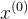 开始，一轮（从 k→k+1）是三段折线：

1.  第一段（改 x1）  
      从  沿 x1 方向走到 P1 上，得到点    
      （此时第 1 行严格满足）
    
2.  第二段（改 x2）  
      从 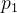 沿 x2 方向走到 P 上，得到点 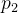   
      （此时第 2 行严格满足；第 1 行可能又被“轻微破坏”，但别怕）
    
3.  第三段（改 x3）  
      从  沿 x3 方向走到 P3P\_3P3 上，得到 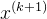 
    

所以你会看到一条 **轴对齐的三段折线**（像在 3D 里走“曼哈顿路线”）不断向三平面交点靠拢。

> 这就是“就地更新”的直觉：每撞完一个平面，立刻从新位置继续撞下一个平面。

* * *

##   

## 4）为什么它通常比 Jacobi 快：同一轮就把“修正”传递到后面

**Jacobi** 在 3D 的直觉是这样的：

-   你计算“如果只考虑第 1 行，x1 应该到哪”
    
-   计算“如果只考虑第 2 行，x2 应该到哪”
    
-   计算“如果只考虑第 3 行，x3 应该到哪”
    

但这三步都基于同一个旧点 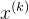。  
几何上更像：你并不是走三段折线，而是“从旧点算出一个新点”，更新是一次性跳过去，**信息在这一轮里不传播**。

而 **Gauss–Seidel** 是：第一段走完的位置会立刻影响第二段和第三段的落点——所以常见情况下更快。

  

* * *

## 5）用一句“更硬核但很好用”的话总结 3D 动画

在 3D 里，Gauss–Seidel 每轮做的是：

> 依次用三个坐标方向的直线，把点拉到 P1、再拉到 P2、再拉到 P3，形成一条轴对齐折线，折线端点逐轮逼近三平面交点。

### \### 它和雅可比 (Jacobi) 迭代的区别

这是初学者最容易混淆的地方：

-   雅可比迭代：在计算所有  时，统一全部使用上一轮迭代的旧值。
    
-   高斯-赛德尔迭代：一旦算出了某个分量的新值，**立刻**把它投入到同一个迭代步的下一个分量计算中。
    

**优点**：通常情况下，高斯-赛德尔迭代比雅可比迭代收敛得更快，且占用的内存更少。

  

### \### 适用场景

这个公式通常在以下情况使用：

1.  大型稀疏矩阵：当矩阵太大，无法使用直接法（如高斯消去法）时。
    
2.  对角占优矩阵：如果矩阵满足严格对角占优，该算法保证收敛。
    
3.  工程仿真：如流体力学或结构力学中的有限元分析。