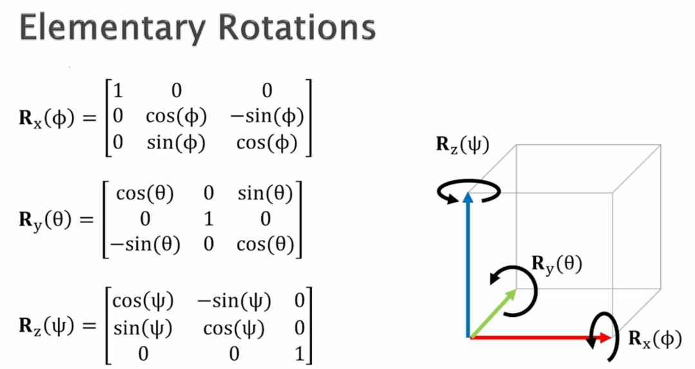

# 3D中，如何用矩阵乘法分别完成绕 x 、y、z 轴旋转？

> 原文地址: [https://mp.weixin.qq.com/s/qfXifhf8vB0h9z04AdHAdQ](https://mp.weixin.qq.com/s/qfXifhf8vB0h9z04AdHAdQ)

我会先把三维向量的“绕轴旋转”讲成：哪个坐标保持不变、另外两维按二维旋转公式变化；然后给出 Rx/Ry/Rz 三个标准旋转矩阵，并用一个具体数值例子逐项算给你看。

在三维里，“绕某个轴旋转”的核心规律是：

-   **绕 x 轴**
    
    x 坐标不变，(y, z) 在 **yz 平面**里做二维旋转
    
-   **绕 y 轴**
    
    y 坐标不变，(x, z) 在 **xz 平面**里做二维旋转
    
-   **绕 z 轴**
    
    z 坐标不变，(x, y) 在 **xy 平面**里做二维旋转
    

  

下面我用最常见的约定：**列向量**，矩阵左乘 ，角度正方向遵循**右手定则**。

* * *

## 1) 绕 x 轴旋转 ϕ

##   

乘开就是（你能清楚看到 x 不变）：

所以

* * *

## 2) 绕 y 轴旋转 θ

##   

乘开：

所以

* * *

## 3) 绕 z 轴旋转 ψ

  

乘开：

所

* * *

## 4) 一个具体数值例子（绕 z 轴转 ）

##   

取向量 ，令 ，则 

这正是“在 xy 平面里把 (1,2) 逆时针转 90° 变成 (-2,1)，z 保持 3”。

* * *

## 5) 旋转的“矩阵乘法串起来”

如果你要先绕 x，再绕 y，再绕 z（注意顺序非常关键）：

-   **右边的矩阵先作用**
    
    （因为它离  最近）
    
-   旋转一般 **不可交换**：
    

  

我们把“**连续绕轴旋转**”这件事讲透：**怎么把多个旋转用矩阵乘起来、为什么顺序会改变结果、以及（很重要）你到底是在旋转向量还是旋转坐标系**。

* * *

## 6) 连续旋转 = 矩阵相乘（右边先作用）

我们用列向量约定：。

如果你要 **先绕 x 轴转 ** ，再 **绕 y 轴转 ** ，再 **绕 z 轴转 ** ，那么：

关键点只有一句话：

-   **离  最近的矩阵先作用**
    
    （所以是先 ，再 ，再 ）
    

* * *

## 7) 顺序为什么会影响结果（旋转一般不可交换）

旋转矩阵通常 **不满足交换律**：。

给你一个一眼看懂的数值反例：

取初始向量 （指向 x 轴正方向），角度都取 。

### 情况 A：先绕 x，再绕 y

-   绕 x 轴转 ：因为点在 x 轴上，**不变**
    

-   再绕 y 轴转 （）：
    

  

所以

### 情况 B：先绕 y，再绕 x（换个顺序）

-   先绕 y 轴转 ：
    

-   再绕 x 轴转 ：这是在 yz 平面旋转，把  旋成 
    

所以

同样两次旋转，只是顺序换了，结果就从  变成 。  
这就是“**旋转不可交换**”最直观的原因。

* * *

## 8) 常见的“Yaw–Pitch–Roll”（绕 z-y-x）合成

很多工程里用：

-   yaw（偏航）：绕 z
    
-   pitch（俯仰）：绕 y
    
-   roll（横滚）：绕 x
    

并且表示为：

这是一个非常常见的约定（尤其是“把向量在固定世界坐标系里转动”的理解方式）。

* * *

## 9) 一个超实用性质：逆旋转 = 转置

旋转矩阵是正交矩阵，所以：

含义很直观：

-   你把一个向量旋转过去：
    
-   你想“旋回去”：
    

* * *

## 10) 很容易混的点：你是在“旋转向量”还是“旋转坐标轴”？

-   **旋转向量（主动旋转 / active）**
    
    （我们上面一直在用这个）
    
-   **旋转坐标系（被动旋转 / passive）**
    
    同一个几何向量不动，但坐标轴转了，坐标会变成（注意是转置/逆）
    

很多“怎么顺序不对”的困惑，其实就出在 active vs passive 以及“绕的是世界轴还是自身轴”。

下一步按图里那种“先 、再 、再 ”的顺序，把 **合成矩阵 **  逐项乘出来（得到每个元素都是  的组合），这样你就能直接把三个角度塞进去算最终姿态。那就用 做演示， 这种最直观的。

我们把  全代进去，按之前说的顺序

这里默认 **列向量**，右手定则为正方向。

* * *

## 11) 先写出三个 90° 的旋转矩阵

因为 ，所以

### 绕 x 轴

### 绕 y 轴

### 绕 z 轴

* * *

## 12) 逐步相乘得到合成矩阵

先算中间矩阵 ：

再算 ：

你会发现一个很有趣的结果：

也就是说：在这个特定角度组合下，三次旋转“合起来”刚好等效于 **一次绕 y 轴 90°**（这不是一般规律，只是这个组合巧合抵消了部分效果）。

* * *

## 13) 直接看它对坐标的作用（最直观）

对任意 ，

所以最终映射是：

* * *

## 14) 再给你一个具体向量算一遍（验证顺序“右边先做”）

##   

取 

1.  先绕 x：
    

2.  再绕 y：
    

3.  再绕 z：
    

也等于一次用合成矩阵：

我们把这组“全 90°、顺序 ”再往下讲到**几何直觉**和**坐标轴/向量两种理解**，最后再用一个“换顺序就变了”的反例收尾。

* * *

## 15) 看它怎么“搬动三根坐标轴”（最直观）

我们已经得到合成结果：

并且对任意向量：

现在用标准基向量来“看见旋转”：

-   
    
     经过旋转：**x 轴被转到了 -z 方向**
    

-   
    
    **y 轴完全不动**
    

-   
    
    **z 轴被转到了 x 方向**
    

  

这三条一起看，你会马上认出来：  
这就是“**绕 y 轴转 ** ”的效果：y 不变，x 和 z 在 xz 平面里互相转过去（并带一个符号翻转）。

* * *

## 16) 用右手定则把它讲成一句话

绕 y 轴 （右手大拇指指向 +y）：

-   原来的 **z** 会朝 **x** 转过去：
    
-   原来的 **x** 会朝 **\-z** 转过去：
    

刚好和上面算的一模一样。

* * *

## 17) “旋转向量” vs “旋转坐标系”（最容易混的点）

### A. 旋转向量（我们一直在做的 active）

几何对象（箭头）真的被你转了：

在这组 90° 下：

### B. 旋转坐标系（passive）

几何箭头不动，但你把坐标轴转了，于是“同一个箭头”的坐标会变。这个时候用的是：

因为旋转矩阵满足 。

对我们这个 ，转置是：

所以坐标系旋转版本的坐标变换是：

> 你以后只要记一句：  
> **“向量动用 ，坐标轴动用 ”**。

* * *

## 18) 为啥你会看到“三次 90° 竟然等效一次绕 y 轴 90°”？

不是一般规律，只是这组角度太特殊。  
用“轴搬动”的视角看：先绕 x、再绕 y、再绕 z，每一步都在改“后面旋转看到的方向”，在  这种极端角度下，会出现某些效果恰好抵消/重合，于是最后看起来像只剩一根轴的旋转。

* * *

## 19) 反例：同样全 90°，换乘法顺序立刻变结果

如果你改成：

算出来是：

对应的映射变成：

你看：仅仅换了顺序，y 还会多一个负号翻转——这就是“旋转不可交换”在你面前直接发生。