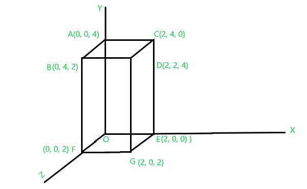
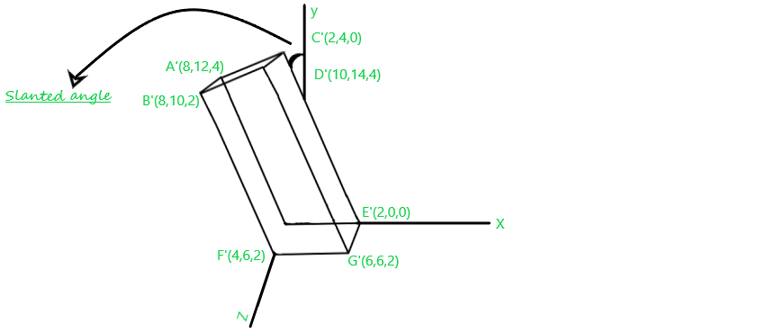
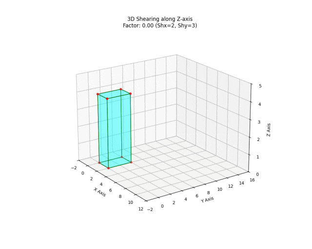

# 3D中，如何用矩阵乘法完成沿 z 轴剪切？


> 原文地址: [https://mp.weixin.qq.com/s/hYR-B0FCChOWRwMIfBauMQ](https://mp.weixin.qq.com/s/hYR-B0FCChOWRwMIfBauMQ)

### 什么是[剪切变换](https://mp.weixin.qq.com/s?__biz=MzkzODgwODczMw==&mid=2247491037&idx=1&sn=34cbd3249abe3f239f3cd94385208414&scene=21#wechat_redirect)？

剪切变换（Shear Transformation）是一种几何变换，它可以让物体“倾斜”或“扭曲”，但不会改变其体积。通俗地说，就像你把一叠书从侧面推一下，底部固定不动，上部滑动，形成一个斜的形状。这在计算机图形学中常用，比如模拟变形或视角效果。

剪切可以用矩阵乘法实现，因为它是一种线性变换（在齐次坐标下是仿射变换）。

剪切变换与二维空间中的剪切变换类似，但三维空间中需要考虑 x、y 和 z 轴，而二维空间中只需要考虑 x 和 y 轴。剪切是指在三维空间中沿 x、y 或 z 方向倾斜物体的过程。剪切会改变（或变形）物体的形状。由于我们讨论的是三维空间，因此剪切也可以沿以下三个方向中的任何一个方向进行。下面列出了剪切变换的类型。

-   X 方向剪切。
    
-   Y 方向剪切
    
-   Z 方向剪切。
    

  

X 方向剪切：X 坐标保持不变，而 Y 和 Z 坐标发生变化。

剪切变换通过剪切变换矩阵实现，该矩阵表示如下。


  考虑三维空间中的点 P\[x, y, z\]，对其进行 X 方向剪切变换，得到 P'\[x, y, z\]。 

 Y 方向剪切：Y 坐标保持不变，而 X 和 Z 坐标发生变化。剪切变换通过剪切变换矩阵实现，该矩阵表示如下。

  

考虑三维空间中的点 P\[x, y, z\]，对其进行 Y 方向剪切变换，得到 P'\[x, y, z\]。 

 Z 方向剪切：Z 坐标保持不变，而 X 和 Y 坐标发生变化。剪切变换通过剪切变换矩阵实现，其在 Z 方向上的剪切变换矩阵如下所示。   


考虑三维空间中的点 P\[x, y, z\]，对其进行 Z 方向的剪切变换，变换后得到 P'\[x, y, z\]。  



图1



图2

这两张图片展示了一个长方体在三维空间中的**剪切变换（Shear Transformation）**。

从图1（原始状态）到图2（变换后），可以看到物体的底面（在 z = 0  
 平面的点，如 E 和 C）保持坐标不变，而随着 z 坐标的增加，顶层点的 x 和 y 坐标发生了线性偏移。这正是典型的沿 z 轴的剪切。

### 变换分析

对比两张图的坐标：

-   **底面 ():**
    
     ，坐标未变。
    
-   **顶面 ():**
    
      
    

-   x 的偏移：。
-   y 的偏移：。

剪切系数计算：

-   
-   

  

### 1\. 寻找“参照点”：顶点 D

我们观察长方体右上角的那个顶点，在两张图中它都有明确的坐标标注：

-   **图 1（原始状态）：**
    
     顶点 D 的坐标是 ****。
    

-   
-   
-   
    
      
    

-   **图 2（变换状态）：**
    
     变换后的顶点记作 D'，坐标变成了 ****。
    

-   
-   
-   
    
    （注意：z 轴坐标没有变，说明是沿 z 轴剪切）
    

* * *

### 2\. 计算位移量（）

（Delta）在数学中表示“变化量”。我们用“末状态”减去“初状态”：

-   **X 轴方向的变化：**  
      
    
    这表示由于剪切，该点在 x 方向向右平移了 **8** 个单位。
    
-   **Y 轴方向的变化：**  
      
    
    这表示该点在 y 方向向上平移了 **12** 个单位。
    

* * *

### 3\. 为什么这个位移与 z 有关？

在 3D 剪切变换中，位移的大小取决于你离“基准面”有多远。沿 z 轴剪切的公式是：

，

我们将 D 点的数据代入公式来求剪切系数 Shx 和 Shy：

-   **求 Shx：**  
    
-   **求 Shy：**  
    

###   

### 结论

-   **底面 ():**
    
     位移为 ，所以底面不动。
    
-   **中间 ():**
    
     位移为 ，位置适中。
    
-   **顶面 ():**
    
     位移达到最大值 ，也就是你看到的 。
    

  

从上面两张图看：**底面（）基本不动，上面的截面（z越大）在x、y 方向被“推走”**，于是整根柱子沿着  方向越高越倾斜——这就是典型的

> **“以  为自变量的剪切（shear wrt ”**  
> 也常被口语化叫成“沿  轴剪切”：沿高度  增加，水平位移线性增加。

* * *

## 1) 用公式把图说清楚：每一层  都整体平移

最常见的定义（也与图一致）是：


含义很直观：

-   当 ： ——底面不动
    
-   当 ：水平位移是  ——顶面整体被推走
    
-   中间层 ：位移是顶面的一半 ——所以侧面成斜的平行四边形
    

* * *

## 2) 写成矩阵乘法（3×3）

把点写成列向量 ，上面的变换就是：


你可以逐行对照矩阵乘法：

-   第一行：
    
-   第二行：
    
-   第三行：
    

* * *

## 3) [齐次坐标](https://mp.weixin.qq.com/s?__biz=MzkzODgwODczMw==&mid=2247493117&idx=1&sn=70a84f2bb24ddb4fde7436eb50967afa&scene=21#wechat_redirect)（4×4）版本：方便和位移/旋转拼在一起

如果你还想把它和“平移、旋转、缩放”统一到一个矩阵里（图形学常用）：


* * *

## 4) 用图里的“读数”快速反推剪切系数（怎么选 ）

图里明显是：**同一条竖棱，z 越大，x，y 位移越大**。

例如图2里底面点E'(2,0,0) 不动，而某个 z = 2 的点，比如 F'(4,6,2)相对其原本位置F(0,0,2) 出现了水平位移：

-   
    
    ，且   
    
    
-   
    
    ，且   
    
    

这就得到一个“和图的倾斜趋势一致”的剪切矩阵：


（如果取别的点来算，原则一样：**用“某层的水平位移 / 该层的 z”得到系数**。）

* * *

## 5) 容易混淆的一点：另一种“沿 z 方向的剪切”定义

有些教材把“沿 z 轴剪切”理解成：**位移方向是 z**，也就是


这会让物体在“竖直方向”发生斜切（顶面高度随  改变）。  
**但这两张图明显是“高度越高，水平越偏”**，所以更符合前面那种 x,y 随 z 变的剪切。

我们就拿**图1**里标出来的点，做一次“从坐标到剪切后坐标”的完整算例，把它吃透。

我先沿用前面从图2那种“越高越往  方向偏”的感觉，取一组剪切系数：


对应矩阵（列向量 ）：


* * *

## 6) 先把“乘矩阵”这件事说成一句人话

这类“沿 z 轴剪切”（更准确说：**以 z 为自变量的水平剪切**）的核心就是：

> 每个点都沿水平面被推一下；推多少只看它的高度 z。  
> 高度翻倍，水平位移也翻倍。

因为 。

* * *

## 7) 把图 1 的点逐个算出剪切后的坐标

图里给的点：

-   
-   
-   
-   
-   
-   
-   
-   原点 
    

套公式 ：

点

原坐标 


你会发现几个非常“像图形学直觉”的现象：

-   所有 **** 的点： 完全不动（因为位移 ）。
    
-   所有 **** 的点：统一加了 。
    
-   所有 **** 的点：统一加了 。
    

也就是说：同一高度的“截面”，整体平移；高度越高平移越大，所以柱子就“斜”了。

* * *

## 8) 为什么侧边会变斜但仍然“直线保持直线”？

因为这是线性变换。

比如看竖直边 ：

-   
-   

这条边原来沿 z 方向，剪切后变成一条斜线方向向量：


再看另一条同样“竖直”的边 ：

-   
-   


## 8.1) 向量怎么从两点算出来？

如果有两点 、，那么


“箭头从  指向 ”——就用  ** 减 ** 。

* * *

## 8.2) 套到这条边 

我们前面算的是：

-   
-   

所以


* * *

## 8.3) 为什么这样算有意义？

因为“方向向量”描述的是：

-   从起点走到终点，分别在  方向走了多少。
    

这里就是：

-   x 方向走了  
-   y 方向走了  
-   z 方向走了  

  

所以这条原本竖直的棱，剪切后变成了“往  方向偏”的斜棱。方向完全一样，所以所有竖棱会“整齐地”一起倾斜，形成图2中的斜柱效果。

* * *

## 9) 图里写的 “Slanted angle” 怎么从系数读出来？

对“原本竖直”的线（沿 z 方向），每上升 ：

-   
-   

水平位移大小是：


所以“倾斜程度”（相对竖直）可以用


这就是：剪切系数越大， 越大，柱子越“躺”。

* * *

### Python 动画代码

我们将使用 `matplotlib` 的 `FuncAnimation` 来实现这个动态剪切过程。

根据图片数据（ 时，），得出剪切系数为 。

```
import numpy as np
```

  

