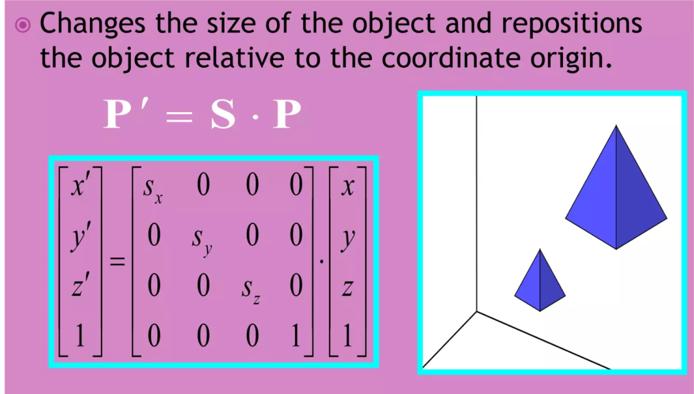
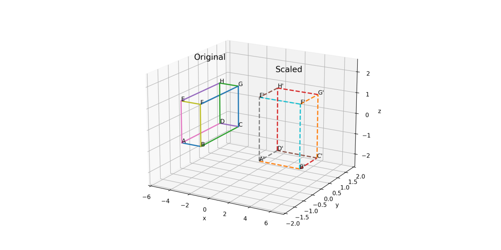
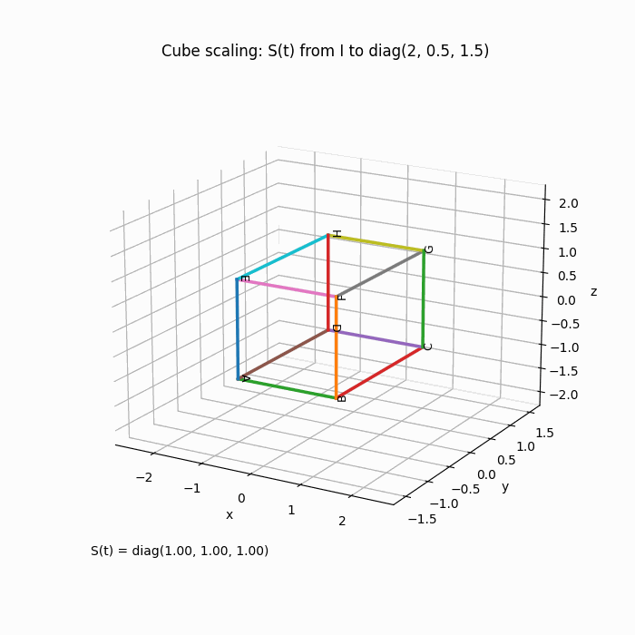
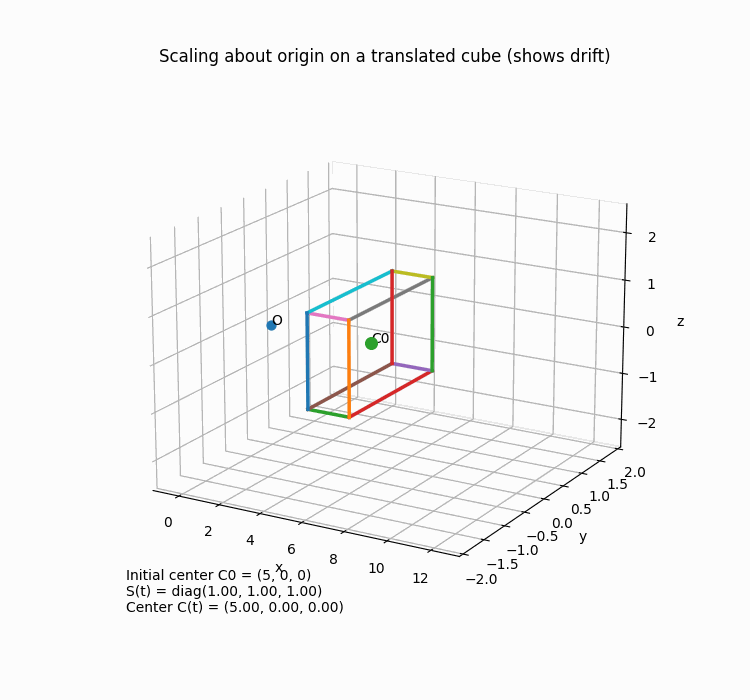
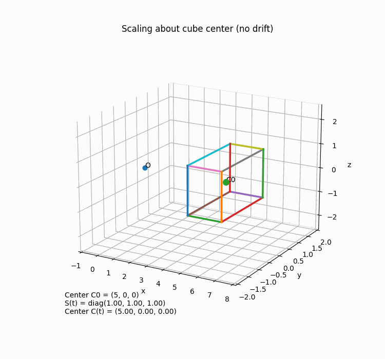
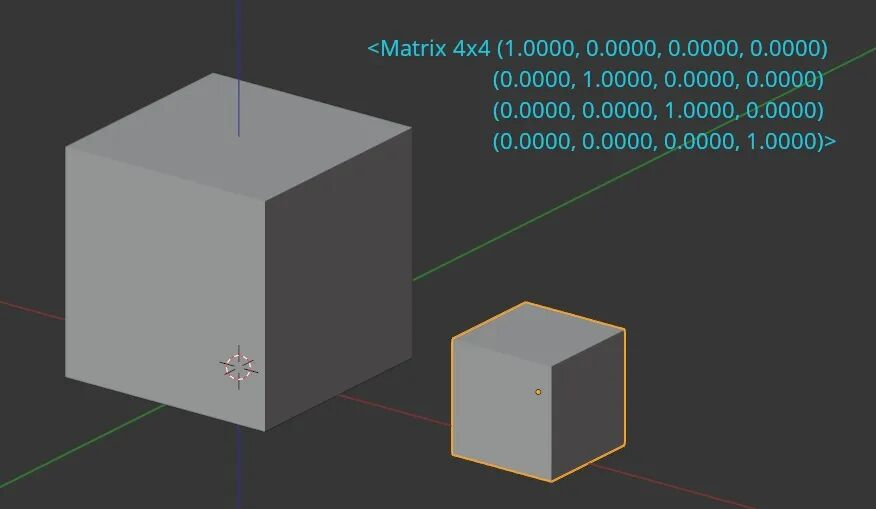

# 3D中，如何用矩阵乘法完成缩放？

> 原文地址: [https://mp.weixin.qq.com/s/skJsTsACCu8kcRwpjE4D1Q](https://mp.weixin.qq.com/s/skJsTsACCu8kcRwpjE4D1Q)

三维空间里的“缩放（scaling）”，本质上就是把点（或向量）的各个坐标分量按比例放大/缩小，所以最自然的实现方式就是**用一个对角矩阵去左乘坐标向量**。

* * *

## 1) 以原点为中心的 3D 缩放（最常见）

把点  写成列向量：

\*\*非均匀缩放（x/y/z 不同比例）\*\*矩阵：

矩阵乘法就是：

所以：

-   
    
     控制沿 x 轴方向的放大/缩小
    
-   
    
     控制沿 y 轴方向
    
-   
    
     控制沿 z 轴方向
    

**均匀缩放**就是 ：

* * *

## 2) 为什么“会重新定位到原点附近/远离原点”？

因为  会把点到原点的“坐标分量”整体乘倍数。

例如 ：

-   原来  变成 ，离原点更远  
    如果 ，则更靠近原点。
    

这就是图里那句 “repositions relative to the coordinate origin”。

* * *

## 3) 用齐次坐标（4×4）把缩放塞进统一的 3D 变换框架

在图形学里通常用齐次坐标，把点写成：

对应的 4×4 缩放矩阵：

这和图片里的形式完全一致：前三行负责缩放，最后一行把齐次坐标的 1 保持不变。

* * *

## 4) 围绕“某个点 C”缩放（而不是绕原点）

很多人第一次做缩放会踩坑：**默认是绕原点缩放**。  
如果你想绕某个中心点  缩放，要做“三步走”：

1.  平移到原点：
    
2.  缩放：
    
3.  平移回来：
    

用 4×4 矩阵写就是：

其中平移矩阵：

这会保证“缩放中心”是 ，而不是原点。

* * *

## 5) 一个具体数值例子（看得最清楚）

设点 ，做非均匀缩放 。

解释：

-   x 方向放大 2 倍：
    
-   y 方向缩小一半：
    
-   z 方向乘 ：不仅缩放，还发生**关于  平面的镜像翻转**（符号反了）
    

  

* * *

## 6) 图里那句“changes size + reposition”到底对应什么？

-   **改变大小**
    
    对角线上的  改变各方向的长度尺度；
    
-   **相对原点重新定位**
    
    因为缩放是以原点为参照，坐标离原点的“数值”被乘倍数，所以看起来物体整体更靠近/更远离原点（如果中心不在原点，视觉上更明显）。
    

  

我继续用“带顶点标号的立方体 A–H”做一个完整算例：先给出坐标与缩放矩阵，再分别演示绕原点缩放和绕立方体中心点缩放，最后把 A'–H' 的结果列出来对比。

下面我用**带顶点标号的立方体 A–H**做一个“从坐标→矩阵→结果”的完整缩放算例，并且对比两种情况：

-   **情况 1：绕原点缩放**
    
    （最容易“跑位”）
    
-   **情况 2：绕立方体中心缩放**
    
    （最符合“在原地变大/变小”的直觉）
    

* * *

## 7) 先定义立方体 A–H 的坐标（边长 2）

取一个最常用、最干净的立方体：中心在原点，顶点坐标是  组合。

我用这个标号规则（底面 z = -1，顶面 z = +1）：

-   **底面**
    
      
      
      
      
    
    
-   **顶面**
    
      
      
      
      
    
    

* * *

## 8) 定义一个非均匀缩放（更能看出区别）

设缩放因子：

对应 3×3 缩放矩阵：

对任意点 ：

* * *

## 9) 情况 1：绕原点缩放（直接左乘）

对 A 点举例：

同理所有顶点都按  变：

-   
-   
-   
-   
-   
-   
-   
-   

  

已按前面定义的立方体 A–H（中心在原点、边长 2）和缩放矩阵  
S\=diag(2, 0.5, 1.5)，用 Matplotlib 生成了“从单位矩阵逐步过渡到 S”的立方体缩放 GIF（淡色线框是原始立方体参照）

\*\*你会发现：\*\*这个立方体“以原点为中心”变形——因为它本来中心就在原点，所以看起来“没跑位”。  
但如果物体中心不在原点，就会出现图里说的“relative to origin”的“跑位感”。

所以我们再做一个“物体不在原点”的版本。

* * *

## 10) 把立方体整体平移到远离原点：再看“跑位”现象

把整个立方体平移到中心点

也就是每个点都加上 。例如：

-   新的  变成 
    
-   新的  变成 
    
-   ……
    

### 10.1 仍然“绕原点缩放”：

看中心点会怎样：

中心从 x=5 变到 x=10 —— **物体整体远离原点了**，这就是“跑位”。

* * *

## 11) 情况 2：绕物体中心  缩放（不跑位）

关键公式（用 3D 向量写最直观）：

意思是：

1.  先把点相对中心表示：
    
2.  对这个“相对中心的偏移量”缩放：
    
3.  再加回中心：
    

这样中心点就不会动：

11.1 用这个公式算几个点（你会立刻看懂）

仍用平移后的立方体（中心 ）：

-   

-   

同理可得 8 个点：

-   
-   
-   
-   
-   
-   
-   
-   

**观察：**

-   中心仍在  不动
    
-   只是相对中心的尺寸改变：x 方向拉长到 2 倍，y 压扁到一半，z 拉长到 1.5 倍
    

* * *

## 12) 用 4×4 齐次矩阵把“绕点缩放”写成一行（图形学最常用）

设平移矩阵 ：

缩放矩阵（齐次）：

绕点  缩放的总矩阵：

对点 ：

### 最常见的几种情况

想要的效果

矩阵写法

sₓ

sᵧ

s\_z

生活中的类比

整体等比例放大2倍

均匀缩放（uniform scale）

2

2

2

把玩具模型放大两倍

x方向拉长3倍，其他不变

非均匀缩放（non-uniform）

3

1

1

把正方体变成长方体

只在y方向压扁一半

非均匀缩放

1

0.5

1

把人压成“纸片人”

整体缩小到原来1/2

均匀缩小

0.5

0.5

0.5

3D打印模型缩小一半

z方向压成薄片

极端非均匀缩放

1

1

0.1

把3D模型压成薄饼

####   

#### 非常重要的一点：缩放是以原点为中心进行的

如果物体不在原点，直接缩放会同时产生“位移”的感觉。

（左侧大立方体在原点，右侧小立方体被均匀缩放后明显向原点靠近）

#### 小总结 · 一句话记住

**3D缩放 = 对x、y、z三个坐标分别乘以不同的系数，用对角矩阵实现。**

越靠近对角线的数字，就是哪个轴被拉伸/压缩的倍数。

希望这个解释 + 图片让你对3D缩放有清晰的画面感。