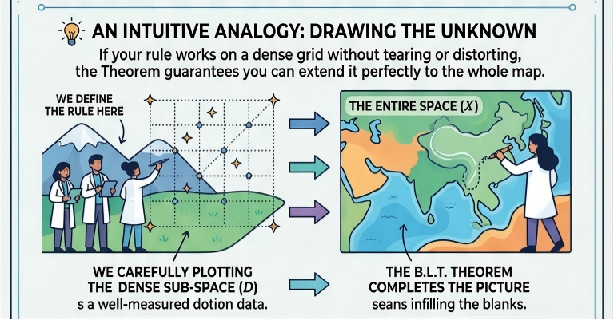
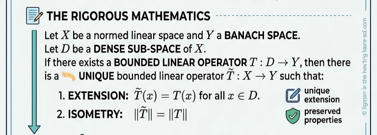
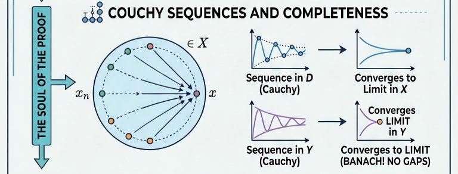

# B.L.T. 定理：从直觉到严谨（上）

原创 sonadorje AI之Myth 2026-07-08 07:15 云南

> 原文地址: [https://mp.weixin.qq.com/s/dnMXvYIEZ8blJrsY6XCi-w](https://mp.weixin.qq.com/s/dnMXvYIEZ8blJrsY6XCi-w)

# I 概述

“B.L.T. 定理”听起来像是一个关于培根、生菜和番茄三明治的定理，但它实际上是泛函分析中一个非常核心、也非常优雅的工具——**有界线性延拓定理**（Bounded Linear Transformation Theorem）。

为了真正把这个定理谈透，我们可以先从一个直观的生活隐喻开始，然后再深入其背后的严谨逻辑。毕竟，好的数学解释既需要直觉的火花，也不能丢失理论的基石。

### 1\. 通俗隐喻：如何画出一张完整的地图？

想象你正在绘制一张极其复杂的星空图。整个星空（空间 ）太大、太复杂了，你无法一次性测量所有星星的位置。但是，你找到了一个**“稠密”的参考网格**（子空间 ）。这意味着，虽然你只测量了网格上的星星，但星空中的任何一颗未知星星，它的旁边都无限趋近于你已经测量过的星星。

现在，你有一个**“规则”**（算子 ），可以把参考网格上的星星映射到另一张画布（空间 ）上。这个规则有两个很好的特性：

-   **线性（Linear）：** 映射的过程是均匀的，不扭曲、不折叠。
    
-   **有界（Bounded）：** 映射是温和的，相邻很近的星星，映射到新画布上后，依然离得很近（即连续性，不会发生“撕裂”）。
    

**B.L.T. 定理告诉你的结论是：**既然你在稠密的网格上已经把规则定好了，而且这个规则既不扭曲也不撕裂，那么你就可以**“顺理成章”且“唯一”地**把这个规则推广到整个星空，把整张地图画完。而且，推广后的新规则，其“拉伸程度”（范数）和原来完全一样。

不过，这里有一个关键前提：你的目标画布  必须是**“完备的”**（没有漏洞的），否则你顺理成章推导出来的位置，可能刚好落在画布的破洞里。

* * *

### 2\. 严谨的数学表达

在拓扑和泛函分析的框架下，我们对逻辑的咬合度要求极高。B.L.T. 定理的正式表述如下：

设  是一个赋范线性空间，且  是一个**巴拿赫空间（Banach Space）**。 设  是  中的一个**稠密子空间（Dense Subspace）**。 如果存在一个有界线性算子 ，那么存在**唯一**的有界线性算子 ，满足：

1.  对于所有的 ，都有 （即  是  的延拓）。
    
2.  （算子范数保持不变）。
    

* * *

### 3\. 为什么这个定理如此重要？

从理论推导的角度来看，B.L.T. 定理是一个终极的**“偷懒工具”**。

在高等数学中，很多算子在整个空间上直接定义是非常困难的，甚至会引发无穷大或者发散的灾难。遇到这种情况，我们标准的处理范式是：

1.  **找软柿子捏：** 先在一个性质极其良好、平滑的稠密子空间（比如具有紧支集的连续函数空间，或者 Schwartz 空间）上定义算子。
    
2.  **证明有界性：** 证明你在这个子空间上的操作是有界的（连续的）。
    
3.  **一锤定音：** 召唤 B.L.T. 定理，直接宣告该算子可以完美延拓到整个庞大且复杂的空间（如  空间）。
    

比如，**傅里叶变换**在  空间上的定义，就是 B.L.T. 定理最经典的实战演练。我们无法直接对所有  函数进行黎曼积分，所以我们先在极其听话的 Schwartz 空间上做变换，证明它满足帕塞瓦尔定理（Parseval's identity，保证了有界性/等距性），然后用 B.L.T. 定理将其延拓到整个  空间。

### 4\. 证明的灵魂：柯西列的传递

这背后的拓扑逻辑其实非常清晰，主要依赖于“完备性”和“柯西列”的完美配合：

-   对于  中任何一个不在  中的点 ，因为  是稠密的，所以必然存在一个数列 ，使得 。
    
-   因为收敛列必然是**柯西列**，所以  在  中是柯西列。
    
-   因为  是**有界的（因此是均匀连续的）**，它会把柯西列映射为柯西列。所以  在  中也是柯西列。
    
-   **高潮来了：** 因为  是巴拿赫空间（完备的！），所以  必然在  中收敛到一个具体的点 。
    
-   我们顺理成章地定义  即可。
    

B.L.T. 定理完美展示了泛函分析的美学：用空间的拓扑性质（稠密与完备）去解决分析学中局部到全局的推广问题。

* * *

# II 图解

这张图讲的是泛函分析里一个非常重要、但第一次看到名字会有点“吓人”的定理：

# 有界线性变换延拓定理（B.L.T. Theorem）

它的核心意思其实非常朴素：

**如果一个线性规则已经在“足够稠密的一小块地方”定义好了，而且这个规则还很稳定（有界），那么它就能唯一地、无缝地推广到整个空间。**

你可以把它理解成：

**先在“容易处理的好函数/好向量”上定义，再自动延伸到所有对象上。**

这正是现代分析里特别常见的一种思路。

* * *

# 一、先看图的整体结构：它到底想表达什么

这张图分成四大块：

## 1\. 直观类比：先画局部，再补全全图

上半部分用“画地图”做比喻：

-   左边：我们只在一个“稠密子空间”  上工作
    
-   右边：整个空间 
    
-   箭头表示：如果你在这块稠密区域上的画法是稳定的、不乱来的，那么就能把它补成整张地图
    

这其实是在说：

-    虽然不是整个 ，
    
-   但它在  里“非常密”，
    
-   所以  里任何点，都能被  里的点逼近。
    

于是，只要你的算子  对“逼近”这件事反应良好，就可以把  在  上的定义，扩展到整个 。

* * *

## 2\. 严格数学表述

图中间给出了正式版本：

设

-    是赋范线性空间
    
-    是 Banach 空间
    
-    是稠密线性子空间
    
-    是有界线性算子
    

那么存在唯一的有界线性算子

满足：

并且

这就是“延拓”和“范数保持”。

* * *

## 3\. 证明灵魂：柯西序列 + 完备性

图下半中间强调了证明的核心：

-   取任意 
    
-   因为  稠密，所以能找一列 ，使得 
    
-   再看  在  里会不会收敛
    

关键来了：

-   因为  有界，所以  若越来越靠近， 也会越来越靠近
    
-   所以  是柯西列
    
-   因为  是 Banach 空间，也就是“完备”的，所以柯西列一定收敛
    
-   因此可以定义
    

这就是延拓的构造方式。

* * *

## 4\. 为什么重要：现实中的工作流

图最下面说它是“理论懒人”的工具，意思不是偷懒，而是：

**你不必一开始就在整个复杂空间上硬做。**

你往往只要：

-   先在“简单对象”上定义算子
    
-   证明它有界
    
-   再用 B.L.T. 定理自动延拓
    

这在傅里叶变换、积分算子、偏微分方程、函数空间理论中都非常常见。

* * *

# 二、先把定理里每个词翻成“人话”

* * *

## 1\. 什么叫“赋范线性空间” 

就是一个能做两件事的地方：

-   能加减、数乘（线性）
    
-   能测长度 （赋范）
    

比如：

-   连续函数空间 
    
-   平方可积函数空间 
    
-   序列空间 
    

* * *

## 2\. 什么叫“稠密子空间” 

意思是：

**虽然  可能不是全部 ，但它在  中到处都“挤得很满”。**

更准确地说：

对任意 ，都能找到  中的元素  使得

直观上像：

-   有理数在实数里稠密  
    任何实数都能被有理数逼近
    
-   多项式在某些函数空间里稠密  
    很多函数都能被多项式逼近
    
-   光滑函数在  中稠密  
    很多“不太光滑”的函数都能被光滑函数逼近
    

图里左边那块“密密麻麻的网格”就是这个意思。

* * *

## 3\. 什么叫“有界线性算子” 

线性是说：

有界是说：

对某个常数  永远成立。

这表示这个算子不会把一个很小的误差突然放大成无限大。

你也可以理解成：

**输入改一点点，输出不会发疯。**

在线性空间里，“有界”基本就等价于“连续”。

这点至关重要，因为延拓本质上依赖“逼近”。

* * *

## 4\. 什么叫 Banach 空间 

Banach 空间就是“完备”的赋范线性空间。

完备是什么意思？

意思是：

**只要一个序列内部越来越挤、越来越靠拢（柯西列），它就一定真的收敛到这个空间里的某个点。**

这非常关键，因为我们定义  的方法是：

如果  不完备，可能  已经“应该收敛了”，但极限却掉到  外面去了，那就没法在  里定义结果。

所以：

-    稠密，保证“能逼近”
    
-    有界，保证“像也跟着逼近”
    
-    完备，保证“极限真的存在于空间里”
    

这三者缺一不可。

我们可以把这件事想象成**“给一片土地（X）绘制海拔地图（Y），但我们先从修好的道路（D）开始测量”**的过程。

这里有三个角色：

### 1. ：整个国家（完整的赋范线性空间）

-   **它是什么**：这是我们最终想要研究的“全集”。它包含了所有的可能性。
    
-   **它的特点**：在这个比喻里，它是**不完美**的。有些地方还没修路，甚至有些地方是沼泽（我们不要求它是完备的，意味着它可能有一些“缺失”或未定义的点）。
    
-   **它的任务**：作为地图的定义域，我们要给这里的每一个坐标点都标上海拔高度。
    

### 2. ：国家里修好的高速公路网（稠密子空间）

-   **它是什么**：这是  的一部分。虽然它只是整个国家的一部分，但它非常关键。
    
-   **它的特点**：它是**稠密**的。这意味着，无论你在国家（）的哪个荒郊野外，只要你开车（在数学上叫取极限），总能通过走高速公路网（）无限逼近那个地方。虽然你可能不能直接站在那个点上，但你离它非常近。
    
-   **它的任务**：它是我们**已知信息**的载体。我们已经掌握了这条路上每一点的海拔数据。
    

### 3. ：海拔刻度表（巴拿赫空间）

-   **它是什么**：这是用来衡量高度的“尺子”或“容器”。所有的海拔数值都属于这个空间。
    
-   **它的特点**：它是**完备**的（巴拿赫空间）。这非常重要！这意味着我们的“海拔刻度表”没有漏洞。如果你沿着一条路一直走，海拔读数一直在变化，最后一定会稳定在一个具体的数值上，绝不会出现“掉进虚空”读不出数的情况。
    
-   **它的任务**：它保证了我们通过公路网推算出的海拔数据是有效的、存在的。
    

* * *

### **故事串联：为什么需要这个定理？**

**情景**： 你是一位制图师。你已经测出了国家里所有**高速公路**（）的海拔（）。现在，你想知道国家里某座**无名小山**（）的海拔。但是这座山脚下没有路，你没法直接测量。

**数学操作（延拓）**：

1.  **逼近**：因为高速公路网（）很密，你可以从山下出发，绕来绕去走出一条越来越接近山顶的小路，这条小路上的点都属于高速公路网（）。
    
2.  **计算**：你看这些靠近山顶的点，它们在地图上的海拔（）分别是多少。
    
3.  **得出结论**：因为这些海拔数据都在一个完美的刻度表（）里，它们会趋于一个稳定的值。这个值就是山顶的海拔（）。
    

**正确的探索过程**：

1.  **起点在山下（逼近）**：你其实是在山下开车。因为你可以在公路网（）上任意驰骋，你可以开出一条路线，让这辆车的位置**无限逼近**山顶。
    

-   第1圈，车停在离山顶1公里的地方（点 ）。
    
-   第2圈，车停在离山顶100米的地方（点 ）。
    
-   第3圈，车停在离山顶1米的地方（点 ）。
    
-   ...
    
-   只要你愿意，这个点（点列 ）可以任意接近山顶。
    

3.  **读取数据（算子作用）**：
    

-   车每到一处，GPS（算子 ）就会给出一个海拔读数。
    

5.  **得出结论（极限运算）**：
    

-   因为 （海拔刻度）是完备的，这一串不断变化的GPS读数，最终会稳定在一个数值上。
    
-   这个数值，就是山顶的海拔（）。
    

**总结**： 我们是从**山下（已知的公路网 ）**出发，一步步去**逼近**山顶（未知的 ）。这个过程体现了“稠密（Dense）”的含义——虽然路没修到山顶，但我们能靠走路（取极限）走到离它无限近的地方。

**定理的意义**： 这个定理告诉你：只要你测准了公路网，只要你用的刻度表没坏（Y是巴拿赫空间），那么你算出来的山顶海拔不仅**唯一**（只有一个正确答案），而且你算出的最终海拔高度**绝对不会超过**公路上测得的最大起伏（范数保持不变 ）。

* * *

# 三、这个定理到底在说什么

可以把它浓缩成一句话：

**一个稳定的线性规则，只要已经在“足够密的测试集”上定义好，就能唯一地推广到整个空间。**

这句话里有三个重点：

## 第一层：不是随便定义一点点就能延拓

必须是在“稠密子空间”上定义。

因为只有稠密，才意味着整个空间都能被它逼近。

* * *

## 第二层：不是任意规则都能延拓

必须“有界”。

因为你要靠极限来定义新点的值。如果规则不稳定，不同逼近方法可能给出不同结果，甚至根本不收敛。

* * *

## 第三层：延拓不只是存在，而且唯一

这特别强。

意思是：  
只要满足条件，整个空间上的扩展版本只有一个，不会有第二种延法。

这很像“把曲线光滑地接下去”，只要你要求连续且稳定，接法就被唯一决定了。

* * *

# 四、图里的证明思路，真正一步一步在干什么

现在进入核心。

* * *

## 第一步：给整个空间中的任意点 ，找逼近序列

因为  在  中稠密，所以对每个 ，存在 ，使得

这一步就是“先在局部采样点上靠过去”。

* * *

## 第二步：把这列送进 

考虑像序列：

我们希望它能收敛。为什么应该收敛？

因为 ，所以  是柯西列，即

又由于  有界，

所以  也是柯西列。

这一步的意义是：

**输入越来越接近，输出也越来越接近。**

* * *

## 第三步：用  的完备性得到极限

因为  是 Banach 空间，柯西列一定收敛，所以存在某个 ，使得

于是定义

也就是

这就把原本只定义在  上的 ，推广到整个  上了。

* * *

## 第四步：为什么这个定义不依赖你选哪条逼近序列

这是最关键的一环。

假设同一个 ，你用了两种逼近方式：

那就有

于是

所以两条像序列有相同极限。

这就说明：

**不管你怎么从  里靠近 ，最后得到的  都一样。**

因此定义是良好的。

* * *

## 第五步：为什么它在线性上也保留下来

设 ，，且都在  中。

那么

并且因为  在线性空间  上本来就是线性的，

取极限就得到

所以  仍然线性。

* * *

## 第六步：为什么它是有界的

由定义和极限性质，

所以

另一方面，因为  在  上等于 ，所以它不可能比  更“小”：

于是

这就是图里的 “ISOMETRY”。

这里特别要注意：

**它不是说  本身是“保长度映射”。**  
而是说：

**延拓前后的算子范数相同。**

这在中文里更准确地说是：

**“算子范数保持不变”**

而不是通常几何里的“等距变换”。

* * *

## 第七步：为什么唯一

假设还有另一个有界线性延拓 ，并且在  上与  一样。

取任意 ，找  使 。

由于  都连续，

所以

唯一性就证完了。

* * *

# 五、为什么这张图一直在强调“Cauchy 序列”和“完备性”

因为整个延拓本质就是：

**用极限补定义。**

而补定义是否可行，取决于两个问题：

## 问题 1：像序列是不是越来越靠近？

这由 **有界性** 保证。

输入是[柯西列](https://mp.weixin.qq.com/s?__biz=MzkzODgwODczMw==&mid=2247537623&idx=1&sn=3f9a0ace412925103a0b364c76323eb1&scene=21#wechat_redirect)，输出也是柯西列。

* * *

## 问题 2：越来越靠近以后，极限是否真的存在于  中？

这由  **的完备性** 保证。

如果  不完备，就可能“趋近于某个洞边”，但那个点不在空间里。

所以图上写 “BANACH: NO GAPS”，意思就是：

**目标空间里不能有洞。**

* * *

# 六、为什么一定要“稠密”？

因为延拓的前提是：

**整个  中每个点都能从  里靠近到。**

如果  不稠密，那么  里会有一大片区域根本无法通过  的点来逼近。  
那你就没法用“极限”来定义那些地方的值。

所以“稠密”就是这座桥能跨过去的原因。

* * *

# 七、最通俗的比喻：先在草稿纸点阵上画，再补成连续图像

你可以把整个定理想成：

-   ：像一张很密的点阵纸
    
-   ：整个连续平面
    
-   ：在点阵上的画法规则
    
-   有界：画的时候手不抖，不会突然把近点画得离很远
    
-   完备：画出来的结果空间没有缺口
    
-   延拓：于是整幅连续图像被唯一决定
    

所以图里说“drawing the unknown”“completes the picture”，是很形象的。

* * *

# 八、一个特别简单的思想模型

虽然图里讲的是抽象空间，但你可以先用下面这个思路感受：

假设你只会在“简单函数”上定义某个操作，比如：

-   对分段连续函数定义
    
-   对光滑函数定义
    
-   对有限项序列定义
    
-   对多项式定义
    

而真实世界里你想处理的是：

-    里的函数
    
-    里的无限序列
    
-   一般连续函数
    
-   更粗糙的对象
    

这时怎么办？

办法就是：

1.  先证明简单对象在大空间里是稠密的
    
2.  再证明你的规则是有界的
    
3.  用 B.L.T. 定理自动延拓
    

这就是为什么这个定理特别常用。

* * *

# 九、图里提到的傅里叶变换，为什么和这个定理有关

这张图下面举的一个典型应用是 Fourier transform。

这是因为很多变换最开始只在“好函数”上容易定义，比如：

-   光滑函数
    
-   快速下降函数
    
-   紧支撑函数
    

但我们真正想研究的往往是更大的空间，比如 。

于是常见策略就是：

-   先在一个稠密的好函数类上定义傅里叶变换
    
-   证明这个变换在某个范数下是有界的，甚至保持范数
    
-   然后用延拓定理把它推广到整个 
    

这就是图上那句：

“Extending from clean function class to ”

意思是：

**从干净、好操作的小类函数，推广到更大的函数空间。**

* * *

# 十、为什么这叫“理论懒人的工具”

这句话很幽默，但意思很深。

因为在分析中，整个空间往往太大、太乱、太难直接操作。  
于是数学家很喜欢这样做：

-   先只在“好对象”上算
    
-   在那上面把性质证明出来
    
-   最后用定理推广到整个空间
    

这不是偷懒，而是非常高明的策略。

相当于：

**先在简单模型里把机制看清楚，再把结果合法地搬到复杂世界。**

* * *

# 十一、这张图的真正主线，可以压缩成四句话

你可以把整张图记成下面四步：

## 第一句

 在  中稠密，所以任何  都能被  中元素逼近。

## 第二句

 有界，所以逼近序列的像也会稳定地逼近。

## 第三句

 完备，所以这些像序列一定收敛到  中某个点。

## 第四句

于是  能唯一扩展为 ，并且范数不变。

这四句就是整张图的骨架。

* * *

# 十二、如果用“中学生能听懂”的一句话总结

这一定理就是说：

**只要你在一群“足够密、足够代表整体”的简单对象上，制定了一个稳定的线性规则，那么整个复杂空间上的规则其实已经被唯一决定了。**

* * *

# 十三、最后给你一个“记忆口诀版”

你可以记成：

**稠密保证能靠近，  
有界保证不乱飞，  
完备保证极限在，  
于是延拓且唯一。**