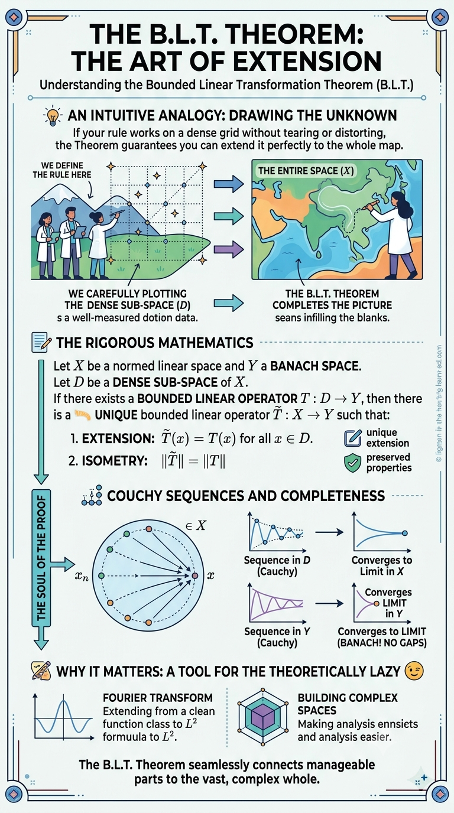

# B.L.T. 定理：从直觉到严谨（下）

原创 sonadorje AI之Myth 2026-07-11 09:30 云南

> 原文地址: [https://mp.weixin.qq.com/s/Xw3f4PQwOCFWIBX1UW5ftQ](https://mp.weixin.qq.com/s/Xw3f4PQwOCFWIBX1UW5ftQ)

好，我们继续把这张图里的**“严格证明”部分单独拆开**，按“每一步为什么这样做”给你讲到完全透。

上一步我们已经把这张图的**整体意思**讲清楚了。这一步，我就专门把图中最核心的那一块：

# “THE SOUL OF THE PROOF”

# 证明的灵魂

给你**一层一层彻底拆开**。

你可以把这一部分理解成：

> **为什么一个只在稠密子空间  上定义的算子 ，竟然能被“合法地补全”到整个  上？**

* * *

# 一、先说结论：证明到底要完成什么任务？

我们已知：

-    是赋范线性空间
    
-    是稠密子空间
    
-    是 Banach 空间
    
-    是有界线性算子
    

我们要证明：

存在唯一的有界线性算子

使得

并且

* * *

这件事听起来像是在做三件事：

## 任务1：把  定义出来

因为  只对  中的点有定义，所以如果 ，我们必须想办法说明：

**“那  到底应该等于谁？”**

* * *

## 任务2：保证这个定义不会乱

也就是说：

-   你不能今天用一种方法逼近 ，得到一个值
    
-   明天换一种逼近方法，又得到另一个值
    

否则定义就不合法。

* * *

## 任务3：证明新定义出来的  仍然很好

也就是证明它：

-   线性
    
-   有界
    
-   在  上跟原来的  一样
    
-   而且唯一
    

* * *

# 二、整套证明的核心想法：用极限“补定义”

这是整张图最重要的一句话：

> **对于不在  里的点 ，我们用  里的点列去逼近它，再把  作用到这些逼近点上，最后取极限。**

也就是：

1.  先找 ，使得 
    
2.  再看  会不会收敛
    
3.  如果收敛，就定义
    

这就是整套证明的主线。

* * *

# 三、第一步：为什么总能找到逼近序列 ？

因为  在  中是**稠密的**。

稠密的定义就是：

对任意 ，都存在  中的一列点 ，使得

* * *

## 通俗理解

这就像：

-   你虽然只有“有理数工具箱”
    
-   但你想处理任意实数
    
-   没关系，因为任意实数都能被有理数逼近
    

比如：

虽然  不是有理数，但它可以被有理数列逼近。

同样地：

-    里的元素也许只是“简单对象”
    
-   但  里的任何元素都能由它们逼近
    

所以只要  稠密，我们就有“通向全空间的桥”。

* * *

# 四、第二步：为什么要考虑 ？

因为我们最终想定义的是：

但是  可能不在  里，原来的  根本没有定义。

那怎么办？

办法就是：

-   既然 ，所以  是有定义的
    
-   如果  有极限，那这个极限就很自然地可以作为  的“像”
    

也就是：

* * *

## 这很像什么？

很像你只知道函数在“网格点”上的值，但如果这些值变化得足够平滑、稳定，你就可以把整条曲线补出来。

* * *

# 五、第三步：为什么  一定会收敛？

这里是整个证明最关键的技术点。

注意：

我们不是直接知道  收敛，我们先证明它是**柯西列**。

* * *

## 先回忆：什么叫柯西列？

一个序列  是柯西列，意思是：

随着  变大， 和  会越来越接近。

也就是：

通俗说：

> 它不一定已经告诉你“收敛到谁”，但它内部成员彼此越来越挤在一起。

* * *

## 为什么  会推出  是柯西列？

这是分析中的基本事实：

任何收敛序列一定是柯西列。

因为如果 ，那  和  都靠近 ，所以彼此也靠近。

也就是：

所以  是柯西列。

* * *

## 那为什么  也是柯西列？

因为  是有界线性算子。

由线性性：

再由有界性：

而 ，所以

于是  是柯西列。

* * *

## 这一步的通俗意义

这一步其实就在说：

> **输入彼此越来越接近，输出也必须彼此越来越接近。**

而这正是“有界/连续”的本质。

如果没有有界性，就可能发生这种灾难：

-    明明已经很稳定地逼近某个 
    
-   结果  却乱跳、发散、甚至取决于逼近路径
    

那就根本没法延拓。

所以：

**有界性 = 防止算子把小误差无限放大**

* * *

# 六、第四步：为什么柯西列  一定真的收敛？

因为  是 **Banach 空间**，也就是**完备空间**。

完备的意思就是：

> 只要一个序列是柯西列，它就一定在这个空间里收敛。

既然我们已经证明  是柯西列，而  又完备，所以必存在某个 ，使得

于是我们就可以定义

也就是

* * *

## 这一步为什么离不开完备性？

因为如果  不完备，就可能出现这种情况：

-    明明越来越靠近某个“极限”
    
-   但那个极限不在  里面
    

就像一个有洞的空间，序列靠近洞口，但掉不进去。

这样你就没法说 。

所以图中才强调：

**BANACH = NO GAPS（没有缺口）**

* * *

# 七、第五步：为什么这个定义不会依赖“逼近方式”？

这是最容易被忽略，但实际上最重要的一步。

因为同一个 ，你可能有很多种逼近方式：

-   一种序列 ，满足 
    
-   另一种序列 ，满足 
    

如果你用第一种逼近，得到极限 ，用第二种逼近，得到极限 ，而 ，那完了——

这个“延拓”根本没定义好。

* * *

## 所以我们必须证明：

无论怎么逼近，最后极限都一样。

* * *

## 证明怎么做？

因为 ，，所以

于是由有界性，

这说明：

所以两列 、 的极限只能相同。

* * *

## 通俗理解

这就是说：

> 不管你从哪条路慢慢走向 ，在  的世界里，终点都是同一个地方。

因此  的定义是**良好的**。

* * *

# 八、第六步：为什么  在  上真的等于原来的 ？

这个其实很自然。

如果 ，那我们可以直接取常值序列：

那么

所以

因此  的确是  的延拓，而不是另起炉灶搞了个新东西。

* * *

# 九、第七步：为什么  仍然是线性的？

这一步也是顺着极限走。

假设：

并且 。

那么对于任意标量 ，有

因为  是线性子空间，所以 。

而原来的  在线性子空间  上是线性的，所以

取极限得到：

再利用极限与加法、数乘可交换：

所以  也是线性的。

* * *

## 通俗理解

原来  在“稠密草稿区”里 obey 线性规则，而延拓是用极限平滑地补过去的，所以线性关系会被完整保留下来。

* * *

# 十、第八步：为什么  还是有界的？

我们要证明：

存在常数 ，使得对任意 ，有

事实上我们还能证明：

* * *

## 证明思路

取 ，使得 。

由定义：

于是

利用范数和极限的连续性，可以写成

又因为  有界，

所以

而  时，，因此

所以  有界，并且

* * *

# 十一、第九步：为什么实际上有

上一步只证明了：

那另一边怎么来？

因为  在  上就是 。

所以  的表现， 全都“继承”了。

更具体地， 的算子范数是

而对于这些 ，有

所以

对所有  取上确界，就得到

和前面的不等式合起来：

* * *

## 这里再提醒一次

图里写 “ISOMETRY”，很容易让人误会成：

“ 是保距离变换”。

其实这里的意思是：

> **延拓前后，算子范数不变。**

准确说是：

**算子范数保持。**

* * *

# 十二、第十步：为什么延拓是唯一的？

这一步是“压轴收尾”。

假设还有另一个有界线性算子

也满足：

-    在  上与  一样
    
-   也就是说  对所有  成立
    

我们要证明：

* * *

## 怎么证？

任取 。

因为  稠密，找一列 ，使得 。

由于  和  都是有界线性算子，所以都连续。

因此：

而在  上，，所以

另一方面，由  的定义：

于是

因为这对任意  都成立，所以

* * *

## 通俗理解

在稠密子空间上，规则已经完全固定了；而且连续性要求你“不能跳”。所以整个空间上的延拓就只能有一种接法。

* * *

# 十三、把整个证明浓缩成一条“逻辑链”

你现在可以把整套证明记成下面这条链：

* * *

## 第1环：稠密

任意  都能找到  中的逼近序列 

↓

## 第2环：有界

因为  有界，所以  是柯西列时， 也是柯西列

↓

## 第3环：完备

因为  完备，所以柯西列  必收敛

↓

## 第4环：定义延拓

定义

↓

## 第5环：良定义

不同逼近序列得到同一个极限

↓

## 第6环：性质继承

 线性、有界、范数不变、在  上等于 

↓

## 第7环：唯一

任何别的连续延拓都必须和它一致

* * *

# 十四、一个超直观“小例子”帮你抓住味道

虽然 B.L.T. 是抽象定理，但你可以先用一个半抽象的小例子体会。

设：

-   （有理数）
    

在  上定义

这是一个线性算子，而且有界。

* * *

## 问题：

能不能把它从有理数推广到整个实数？

当然能，直觉上就是：

* * *

## 为什么这是合法的吗？

因为对于任意实数 ，都能找有理数列 。

于是：

所以自然定义

而且无论你选哪列有理数去逼近 ，最后极限都一样。

* * *

## 这跟 B.L.T. 的结构完全一样

-    在  中稠密
    
-    是线性的且有界
    
-    完备
    
-   所以延拓存在且唯一
    

* * *

# 十五、再给一个“函数空间味道”的例子

这个更接近实际分析。

设：

-    或 
    
-    是多项式空间
    
-   多项式在很多空间里是稠密的
    

假设你先在多项式上定义某个线性算子 ，并证明：

那么 B.L.T. 告诉你：

> 这个  不用只停留在多项式上，它能自动延拓到整个大空间。

这就是为什么实际工作中，数学家常常：

-   先在简单函数上定义
    
-   再延拓到复杂函数上
    

* * *

# 十六、你可以怎样记住“为什么需要这三个条件”

这三个条件非常关键，我给你做成一个“角色表”：

* * *

## 1\. 稠密子空间 

作用：**让你能碰到整个** 

没有稠密，很多点根本无法被逼近，延拓无从谈起。

* * *

## 2\. 有界算子 

作用：**让逼近在像空间里也稳定**

没有有界性，输入靠近不代表输出靠近，极限可能崩掉。

* * *

## 3\. Banach 空间 

作用：**让像序列的极限真的留在空间里**

没有完备性，极限可能“跑到空间外面”，定义失败。

* * *

## 一句口诀

**稠密负责“能靠近”，有界负责“别乱飞”，完备负责“接得住”。**

* * *

# 十七、如果把图中“Cauchy sequences and completeness”翻成最朴素的话

图上这一块其实就在讲下面这句：

> 我们不是直接知道  会收敛，而是先知道它会“越来越挤”，再利用目标空间没有漏洞，才能保证它真正收敛。

这就是为什么图里反复强调：

-   Sequence in  (Cauchy)
    
-   Sequence in  (Cauchy)
    
-   Converges to limit in 
    

* * *

# 十八、最后把“证明灵魂”压成一版考试/复习答案

如果你以后想快速复述这个定理的证明，可以用这版：

* * *

设 。因为  在  中稠密，存在  使得 。由于收敛列必为柯西列， 是柯西列。又因为  有界，

所以  是  中的柯西列。由于  完备， 收敛，故可定义

再证明此定义与逼近序列的选择无关，所以  良定义。进一步由极限与线性运算可交换，得  线性。由有界性估计得 ，又因  在  上成立，故 ，于是

最后若  是另一个有界线性延拓，则对任意 ，取  使 ，由连续性有

故 。所以延拓存在且唯一。

* * *

# 十九、这一页图最值得你真正带走的思想

这比公式更重要。

这张图最本质的思想其实是：

> **在数学里，很多时候你不需要一开始就在“大而复杂的世界”里工作。**
> 
> 你只要先在一个“简单、稠密、容易控制的小世界”里把规则建立好，再借助连续性和完备性，就能把它稳稳地推广到整个大世界。

这其实是现代分析中非常核心的一种思维方式。