# Eckart-Young-Mirsky 定理


> 原文地址: [https://mp.weixin.qq.com/s/WvdTsvcXBB\_hKWjQQjQchg](https://mp.weixin.qq.com/s/WvdTsvcXBB_hKWjQQjQchg)

 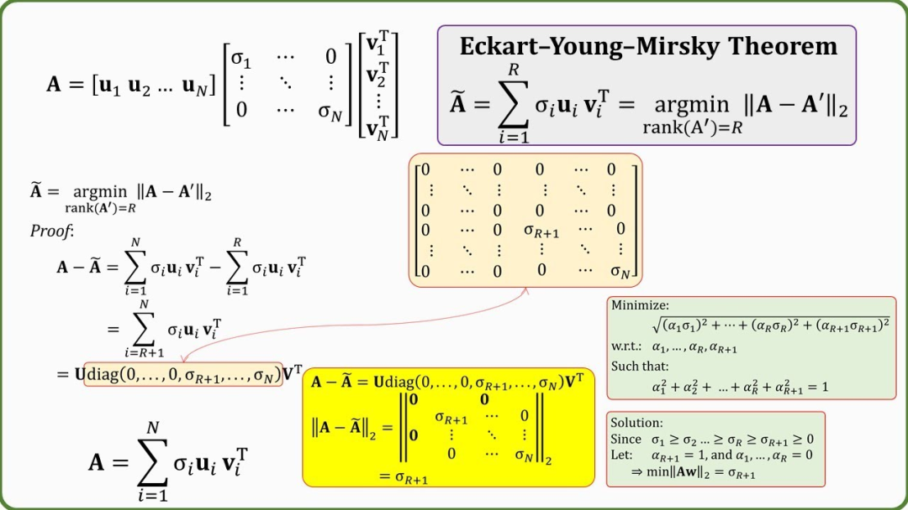  
编辑

以下是对图片中 **Eckart-Young-Mirsky 定理**（谱范数版本）的完整、透彻讲解。图片展示的是该定理在 **2-范数（谱范数）** 下的形式，即矩阵的最佳低秩逼近问题。我会先陈述定理，然后逐部分解释图片中的内容，并将所有公式用标准的 LaTeX 格式重新呈现，便于阅读。

### 定理陈述

设  是一个矩阵，其奇异值分解（SVD）为

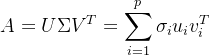,

其中 p=min⁡(m,n) ，奇异值满足 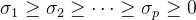，U 和 V 的列分别是左、右奇异向量（单位正交）。

**Eckart-Young-Mirsky 定理（谱范数版本）**：

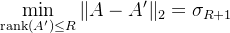,

并且最小值由**截断 SVD** （下面会解释）达到：


其中：

  

-   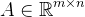
    
     是给定的原始矩阵（假设其奇异值 ，p=min⁡(m,n) ，秩为 rank⁡(A)≥R ）。
    
      
    
-   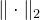
    
     是**谱范数**（矩阵的最大奇异值）。
    
      
    
-   
    
     是 A 的第 R+1 个奇异值。
    

### 这个最小化问题是什么意思？

这是一个**优化问题**：

  

-   **目标**
    
    找到一个矩阵 A′ ，使得 A′  与原始矩阵 A  在谱范数下的**误差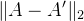****最小**。
    
      
    
-   **约束**
    
    A′  的秩必须**不超过**R 即 rank⁡(A′)≤R ，这意味着 A′ 是“低秩”的）。
    
      
    
-   **结果**
    
    在所有满足秩 ≤ R 的矩阵 A′ 中，能达到的最小误差恰好等于 A 的第 R+1 个奇异值 。
    
      
    
-   并且，这个最小值**可以达到**，达到它的 A′ 正是**截断 SVD**（取前 R项奇异值和对应的奇异向量）：
    
    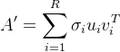
    
      （其中 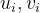 是左、右奇异向量）。
    

简单说：**用一个秩不超过 R 的矩阵去尽可能好地逼近 A**（在谱范数下），最好的逼近误差就是 ，没有更小的了。

### A' 是什么？（关键问题）

-   A' 是优化变量：它代表**任意**一个满足 rank⁡(A′)≤R  的矩阵。
    
-   在这个最小化问题中，我们在**所有可能的**秩 ≤ R 的矩阵中进行搜索，寻找那个使误差  最小的矩阵。
    
-   A' **不是固定的**，它是我们“要找的”低秩矩阵（低秩逼近）。
    
-   定理不仅告诉我们最小误差是多少，还告诉我们**最佳的 A' 是什么**：就是截断 SVD 的结果。
    
-   你可以把 A' 想象成一个“候选逼近矩阵”，我们遍历所有可能的低秩候选，最终选出误差最小的那个。
    

  

### 为什么误差正好是 σR+1 ?

定理的证明分为两部分（上界 + 下界）：

1.  上界
    
    （存在性）：取截断 SVD 的 （秩正好为 R），计算误差：
    
    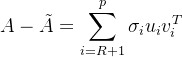
    
      这个误差矩阵的谱范数（最大奇异值）就是 。所以存在一个 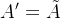 使误差 = 。
    
2.  下界
    
    （最优性）：对**任意**秩 ≤ R 的矩阵 A′ ，误差 。
    

-   证明思路：考虑前 R+1 个右奇异向量张成的子空间 S （维度 R+1 ）。
    
-   任何秩 ≤ R 的 A′ ，在 S 上至少有一个单位向量 x 被“抹平”（A′x=0 ）。
    
-   在这个方向上，误差至少是 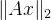，而  在 S 上的最小值正是 σR+1 （对应最弱的方向 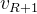）。
    
      
    

两者结合：最小误差既能达到 σR+1，又不可能小于它，所以等于 σR+1。

### 直观理解

-   奇异值 σi  衡量矩阵在第 i 个主方向上的“能量”或“增益”。
    
-   保留前 R 个最大奇异值，就去掉了最小的“尾巴”，但谱范数关心的是**最大**残余增益，所以误差就是下一个奇异值 σR+1。
    
-   这比 Frobenius 范数版本（误差是剩余奇异值的平方和开根）更“保守”，因为谱范数只看最坏情况（一个方向上的最大误差）。
    

  

### 图片内容逐部分解释

#### 1\. SVD 分解与截断逼近（上界）

图片左侧写出了矩阵的完整 SVD：

![$\begin{array}{c} A = [u_1 \, u_2 \, \dots \, u_N] \begin{bmatrix} \sigma_1 & \dots & 0 \\ \vdots & \ddots & \vdots \\ 0 & \dots & \sigma_N \end{bmatrix} \begin{bmatrix} v_1^T \\ \vdots \\ v_N^T \end{bmatrix} = \sum_{i=1}^N \sigma_i u_i v_i^T \end{array}$](https://mmbiz.qpic.cn/mmbiz_png/jlXjovro0toickjjVgXAvD7YLm2da0GaGX2eO7QOzEM4YwXtuUkudT4gF19w1zGFNfnEcCWONn9Pmg1IJxkz9xQ/640?wx_fmt=png&from=appmsg)

截断前 R  项得到低秩逼近：

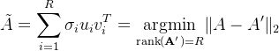

**误差计算（上界证明）**：

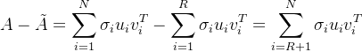

用矩阵形式写成：


这是一个对角矩阵（除前 R 行/列全零外），乘以酉矩阵 U  和 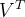 不改变奇异值。因此误差矩阵的奇异值恰好是 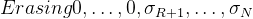，最大奇异值是 ，故谱范数

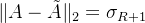

这证明了**上界**：存在一个秩至多 R 的矩阵使逼近误差等于 。

  

#### 2\. 下界证明（关键部分，图片右下黄色框）

要证明定理的完备性，还需说明**任何**秩 ≤ R 的矩阵 A′  都满足

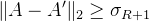

图片用一个极小化问题巧妙地给出了下界：

考虑子空间 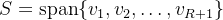（由前 R+1 个右奇异向量张成），维度为 R+1 

对任意秩 ≤ R 的矩阵 B （这里用 B  表示任意的 A′ ），由秩-零度定理，B  的像空间维度 ≤ R ，因此限制到 S  上的 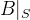的像维度 ≤ R ，从而其核维度

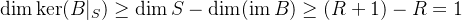

于是存在单位向量 x∈S ，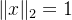，使得 Bx=0 

此时

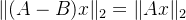

因此谱范数

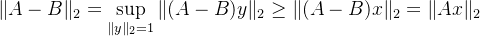

关键是：对**任意**这样的 B ，总存在这样的 x∈S ，，使上式成立。要得到对所有 B  都成立的统一下界，我们取最坏情况，即  在单位球面上的**最小值**：

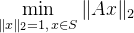

  

任意 x∈S ， 可写成 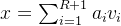，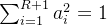，则

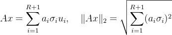

图片中正是求这个最小值：

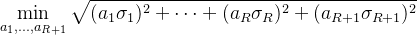

约束

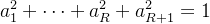

由于 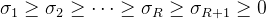，目标函数在单位球上的最小值在“最弱方向”取得：取 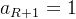，其余 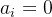，得到最小值 .

因此，对任意 B （秩 ≤ R ），总有

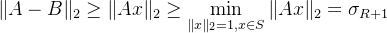

这就证明了**下界**。

  

**\\tilde{A}和 A′的关系是：\\tilde{A}是 A′这个“集合”中我们要找的那个“最优解”。**

我们可以从图片中的关键公式和逻辑来精确理解这个关系：

### 1\. 从定理陈述看：角色定义

图片右上角的紫色方框中明确写道：

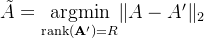

这个等式清晰地定义了两者的关系：

-   A′ 是一个**占位符**，它代表**所有可能的、秩为R的候选近似矩阵**的集合。你可以把它想象成“任意一个满足条件的备选方案”。
    
      
    
-    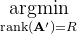 这个数学符号的意思是：在所有满足 rank(A′)=R条件的矩阵 A′中，**寻找**（arg）那个能使目标函数 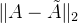 达到**最小值**（min）的那个**特定矩阵**。
    
      
    
-   **\\tilde{A}** 就是这个寻找过程的**结果**，是那个被找到的、独一无二的**最佳候选者**，即**最优低秩近似矩阵**。
    

**简单说**：A′代表“任何一个秩为R的矩阵”，而 \\tilde{A}是“所有秩为R的矩阵中，最逼近A的那一个”。

  

### 2\. 从证明结构看：两步验证

图片的证明过程正是验证了 A满足“最优解”这一定义。这个过程分为两步：

-   第一步（构造候选解）：图片左侧和中间部分，我们**显式地构造出**一个具体的秩R矩阵，即通过截断SVD得到的 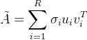。然后计算了它的近似误差 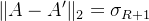。这一步回答了“**有没有一个好的候选者？**” 答案是：有，就是 A，它的误差是 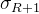。
    
-   第二步（证明最优性）：图片右侧的“Minimize: ...”部分，考察了**任意**一个秩R的候选矩阵 A′。通过分析它必须满足的约束（存在一个单位向量在其零空间中），推导出**任何**这样的 A′所导致的误差 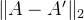 都**不可能小于**。这一步回答了“**有没有比它更好的候选者？**” 答案是：没有，是误差的理论下限。
    

**结论**：我们构造的 A的误差（σR+1）达到了所有可能候选者 A′的误差下界，因此 A就是我们要找的那个最优的 A′。

  

### 一个生动的比喻

想象一场“最像蒙娜丽莎”的画作比赛（原画是矩阵A）：

-   比赛规则：参赛作品（A′）只能用R种颜色的颜料（秩为R）。
    
-   A′ 代表**任何一幅**符合规则的参赛画。
    
-   A 是**最终获胜的那幅画**——它是在所有符合规则的画中，被认为最像蒙娜丽莎的那一幅。
    

定理不仅宣布了获胜者是 A（通过截断SVD得到），还通过严格的数学证明（图片左右两部分）解释了为什么它必定获胜，且没有其他画能比它更像。

  

### 截断 SVD（Truncated SVD）该如何理解？

截断 SVD 是奇异值分解（Singular Value Decomposition, SVD）的**低秩版本**，它是矩阵低秩逼近的核心工具。简单来说，它通过“丢掉”较小的奇异值，来用一个更简单的（秩更低的）矩阵去逼近原始矩阵，同时保持尽可能多的“信息”。

下面我从基础到深入，一步步讲清楚。

#### 1\. 先回顾完整 SVD

任意矩阵 （假设 m≥n ）可以写成外积和形式：

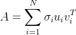

每个 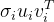 是一个秩-1 矩阵，σi  表示该方向的“重要性”或“能量”。

完整 SVD 重构的矩阵与原矩阵完全相等（误差为 0），但秩保持不变。

  

#### 2\. 什么是截断 SVD？

**截断 SVD**（Truncated SVD）就是只保留前 R  个最大的奇异值（R<N ），丢掉后面的小奇异值，得到一个秩为 R  的逼近矩阵：

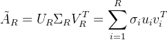

-   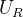：U 的前 R 列。
    
-   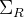：前 R 个奇异值构成的对角矩阵。
    
-   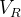：V 的前 R 行（因为 的前 R 行）。
    

**为什么叫“截断”？** 因为它相当于把 Σ 的对角线上从第 R+1 个奇异值开始全部“截断”为 0。

  

#### 3\. 截断 SVD 的核心意义：最佳低秩逼近

根据 **Eckart-Young-Mirsky 定理**（我们之前讨论过的）：

-   在 **Frobenius 范数** 下：（像欧氏范数），截断 SVD 是**最佳**的秩 ≤ R 逼近，误差精确为
    
    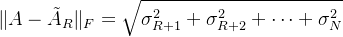
    
-   在 **谱范数** 下：（最大奇异值），截断 SVD 也是**最佳**的，误差精确为
    
    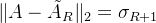
    

这意味着：**没有任何其他秩 ≤ R 的矩阵能比截断 SVD 逼近得更好**（在相应范数下）。

直观理解：

-   大的奇异值对应矩阵的“主要结构/信号”。
    
-   小的奇异值往往对应“噪声”或次要细节。
    
-   截断 = 保留主要信号，丢弃噪声 → 数据压缩 + 去噪。
    

  

#### 4\. 数值例子（真实计算）

拿一个 5×4 的随机矩阵 A 用 NumPy 计算）：


其奇异值：

![$\sigma = [2.199, \, 0.798, \, 0.671, \, 0.261]$](https://mmbiz.qpic.cn/mmbiz_png/jlXjovro0toickjjVgXAvD7YLm2da0GaGibYYzPuMOSk5HibSiccN8RPLbxInAEqJduYVYUKvetQokL1CibtzGFQN5g/640?wx_fmt=png&from=appmsg)

**完整 SVD** 重构误差 ≈ 0（完美恢复）。

**截断到 R=2**（保留前两个最大奇异值）：


误差：

-   Frobenius 范数误差 ≈ 0.720，**精确等于**
    
-   谱范数误差 ≈ 0.671，**精确等于**σ3=0.671 
    

###   第一行数字的详细计算演示

在截断 SVD 中，

这意味着  的每一个元素 ![$\tilde{A}_2[i,j] = \sigma_1 u_1[i] v_1[j] + \sigma_2 u_2[i] v_2[j]$](https://mmbiz.qpic.cn/mmbiz_png/jlXjovro0toickjjVgXAvD7YLm2da0GaGSS4ZE8NvS9F5P94BeMdRtZV9qhwoCLTHIaY4XewdUq2sJFuibBuvOyQ/640?wx_fmt=png&from=appmsg)（注意：这里索引从 1 开始， 是左奇异向量， 是右奇异向量）。

**第一行**（对应原始矩阵的第 1 行，索引 0）只取决于左奇异向量的**第一个分量**  ![$u_1[1]$](https://mmbiz.qpic.cn/mmbiz_png/jlXjovro0toickjjVgXAvD7YLm2da0GaGTZOGuvMnm8RQGSSnyHkRSiadSfDiaibbYEWmySBJg5Af8HpZdypbslMPQ/640?wx_fmt=png&from=appmsg) 和 ![$u_2[1]$](https://mmbiz.qpic.cn/mmbiz_png/jlXjovro0toickjjVgXAvD7YLm2da0GaGicicSI07hAmV7bQarmeXcc2F47KricicUMGTXXXva9HpqvystU9Bmt50pQ/640?wx_fmt=png&from=appmsg)（数学上记为 ，）。

计算公式（针对第一行的四个元素）：

![$\tilde{A}_2[1,j] = \sigma_1 \cdot u_1^{(1)} \cdot v_1^{(j)} + \sigma_2 \cdot u_2^{(1)} \cdot v_2^{(j)} \quad (j=1,2,3,4)$](https://mmbiz.qpic.cn/mmbiz_png/jlXjovro0toickjjVgXAvD7YLm2da0GaGfRcRKpbm6nmfy6PwNCbsL0Iox0JAibZnhGahrxO3qGc38d6UOeyCf2w/640?wx_fmt=png&from=appmsg)

#### 实际数值（从 SVD 计算得出，保留 8 位小数以确保精确）

-   σ1=2.19883767 
    
-   σ2=0.79754450 
    
-   左奇异向量分量（第一行对应）：
    

-   
    
    （u1 的第一个元素）
    
      
    
-   
    
    （u2 的第一个元素）
    
      
    

-   右奇异向量（ 的四个元素，即  的分量）：
    

-   v1=\[−0.44345491,−0.57693828,−0.30334020,−0.61520297\] 
    
-   v2=\[0.04833458,0.35373578,0.63877887,−0.68153967\] 
    
      
    

#### 步骤 1: 计算第一项贡献（）

先计算标量部分：

然后乘以 v1 的每个分量（得到一个向量）：

\[−1.305763×−0.44345491,−1.305763×−0.57693828,−1.305763×−0.30334020,−1.305763×−0.61520297\] = \[0.578937,0.753202,0.396015,0.803157\]

  

#### 步骤 2: 计算第二项贡献（）

标量部分：

然后乘以 v2 的每个分量：≈\[0.413855×0.04833458,0.413855×0.35373578,0.413855×0.63877887,0.413855×−0.68153967\]

\=\[0.020004,0.146401,0.264373,−0.282070\]

####   

#### 步骤 3: 两项相加得到第一行

\[0.578937+0.020004,0.753202+0.146401,0.396015+0.264373,0.803157−0.282070\]

\=\[0.598941,0.899603,0.660388,0.521087\]

四舍五入到 4 位小数（与之前展示一致）：

**第一行 ≈ \[0.5989, 0.8996, 0.6604, 0.5211\]**

这就是  第一行的精确来源：**两个秩-1 矩阵（每个对应一个大奇异值）在外积后，在第一行的贡献之和**。

其他行同理，只需换成对应的  和  即可。

可见，截断后矩阵“看起来相似”，但更简单（秩只有 2），误差完全由被丢掉的奇异值决定。

以下是完整的 Python 代码，使用 NumPy 计算原始矩阵 A 的截断 SVD（truncated SVD），保留前 k=2 个最大奇异值，重构得到 。

```
import numpy as np# 定义原始矩阵 A (5x4)A = np.array([    [0.375, 0.951, 0.732, 0.599],    [0.156, 0.156, 0.058, 0.866],    [0.601, 0.708, 0.021, 0.970],    [0.832, 0.212, 0.182, 0.183],    [0.304, 0.525, 0.432, 0.291]])# 计算 SVD# full_matrices=False 表示使用紧凑形式（U: 5x4, Vt: 4x4），更高效U, s, Vt = np.linalg.svd(A, full_matrices=False)# 设置截断秩 k=2k = 2# 重构截断矩阵 \tilde{A}_2# U[:, :k] 是前 k 列左奇异向量# np.diag(s[:k]) 是前 k 个奇异值构成的对角矩阵# Vt[:k, :] 是前 k 行右奇异向量转置A_trunc = U[:, :k] @ np.diag(s[:k]) @ Vt[:k, :]# 输出结果print("原始矩阵 A:")print(A)print("\n奇异值（从大到小）:", np.round(s, 6))print("\n截断 SVD 重构的 \\tilde{A}_2 (保留前 2 个奇异值):")print(np.round(A_trunc, 4))
```

  

### 总结

-   上界：截断 SVD 给出误差恰好 。
    
-   下界：利用前 R+1  个右奇异向量张成的子空间和秩-零度定理，证明任何低秩逼近误差至少 。
    

两者结合，截断 SVD 正是谱范数意义下最佳的秩 ≤ R  逼近，误差精确为第 R+1 个奇异值。

（注：存在另一个版本用 Frobenius 范数 ，此时最佳误差是 ，证明更直接，但图片展示的是谱范数版本。）

这个证明非常经典且精炼，子空间维数比秩多 1 是关键，使得总能找到一个方向被低秩矩阵“抹平”，而在该方向上 A 的增益至少是 。