# Frobenius内积的几何意义


> 原文地址: [https://mp.weixin.qq.com/s/qnAeFeuOaLx8pf1LhTi\_Ug](https://mp.weixin.qq.com/s/qnAeFeuOaLx8pf1LhTi_Ug)

Frobenius内积（Frobenius inner product）就是给矩阵赋予“几何生命”的工具。它让两个矩阵之间可以谈长度、夹角、相似度，就像我们熟悉的向量点积一样。

把矩阵当成一个“超长向量”来看，Frobenius 内积就是**对齐程度**的度量；它把我们熟悉的向量几何（角度、投影、正交、长度）原封不动搬到“矩阵空间”里。

* * *

### 1) “矩阵 = 向量”：Frobenius 内积就是[点积](https://mp.weixin.qq.com/s?__biz=MzkzODgwODczMw==&mid=2247488659&idx=1&sn=d0a34aa06e78d517070d7c3fecffa72c&scene=21#wechat_redirect)

把 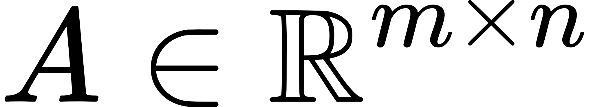 的所有元素按某种固定顺序摊平成一个向量 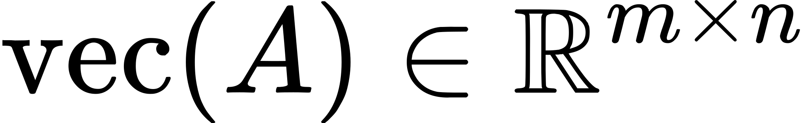

那么

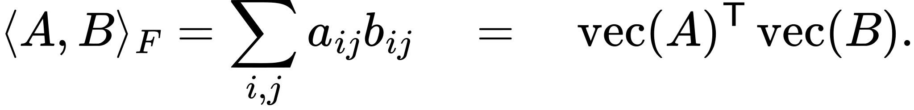

**直白说：把对应位置的元素一一相乘，然后全部加起来。 这和向量点积一模一样，只不过矩阵被“拉平”成了超级长的向量！**

**几何意义：**

-   当 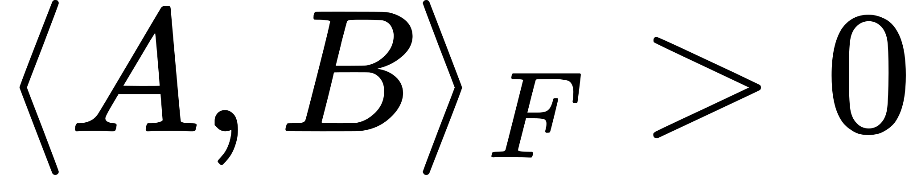：两者“同向偏多”，整体上元素同号、同涨同跌。
    
-   当 ：两者“反向偏多”，整体上元素相反。
    
-   当 ：两者在这个 m×n  维空间里**正交**，也就是“模式不相关 / 不对齐”。
    

###   

### 核心几何意义（把矩阵想象成高维箭头）

所有 m×n 的矩阵，天然构成一个 **m×n 维的欧氏空间**（就像 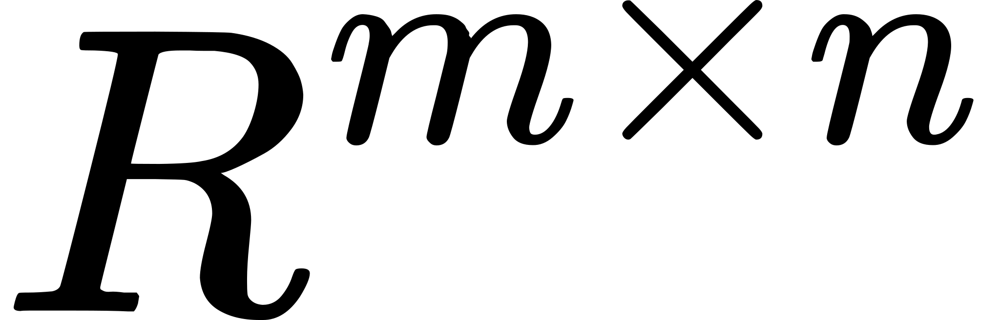）。 每个矩阵就是一个“点”或“箭头”，它的坐标就是矩阵里的每一个元素。

-   **长度（Frobenius范数）**
    
    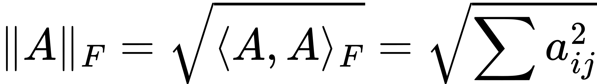
    

    几何上：从原点到这个矩阵“点”的距离。越大，矩阵元素整体“能量”越强（像图片越亮）。

-   **夹角与相似度**
    
    （最核心的几何意义！）：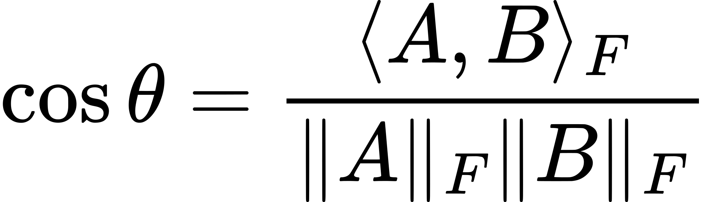
    

-   θ ≈ 0° → 两个矩阵“方向完全一致”（模式超级相似）
    
-   θ = 90° → 内积 = 0，正交！（完全无关，像互相抵消）
    
-   θ ≈ 180° → 完全相反方向
    

**这和普通向量点积的几何一模一样**——只不过现在是在矩阵的“高维世界”里发生。

* * *

### 2) 角度：矩阵之间也有“夹角”

定义 Frobenius 范数

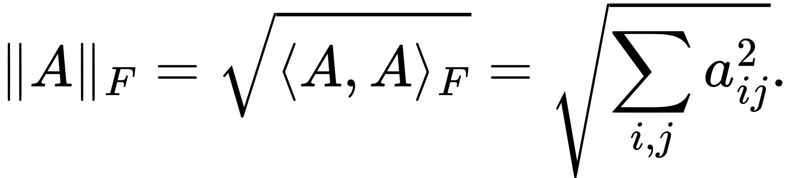

于是完全类比向量点积：

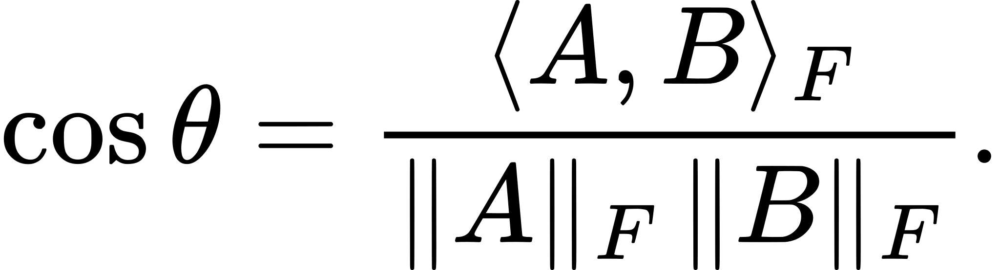

**几何意义：**

-   θ 小：A 与 B 描述的“整体结构/模式”很相似（强对齐）。
    
-   θ = 90°：不相关（正交）。
-   θ 接近 180°：几乎是“整体取负”的关系。
    

* * *

### 3) 投影：把 A 沿着 B 的方向分解

同样可做[投影](https://mp.weixin.qq.com/s?__biz=MzkzODgwODczMw==&mid=2247489081&idx=1&sn=9c11b39f9d77ecc0d8f035beb199c6d7&scene=21#wechat_redirect)/分解：

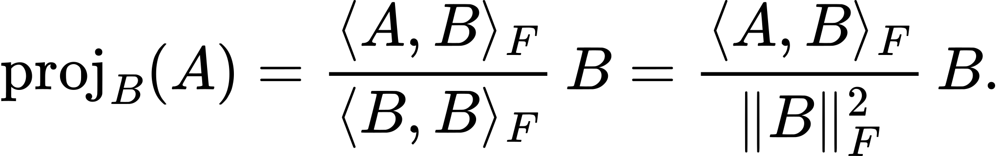

并且

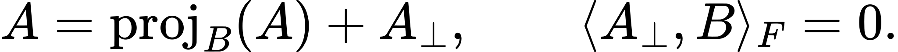

**几何意义：**

-   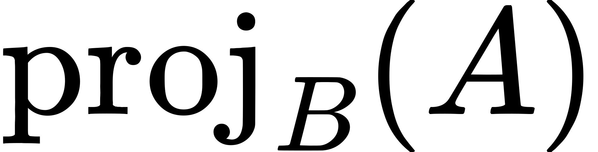
    
     是 A 中“沿着 B 这个模式”的那部分。
    
-   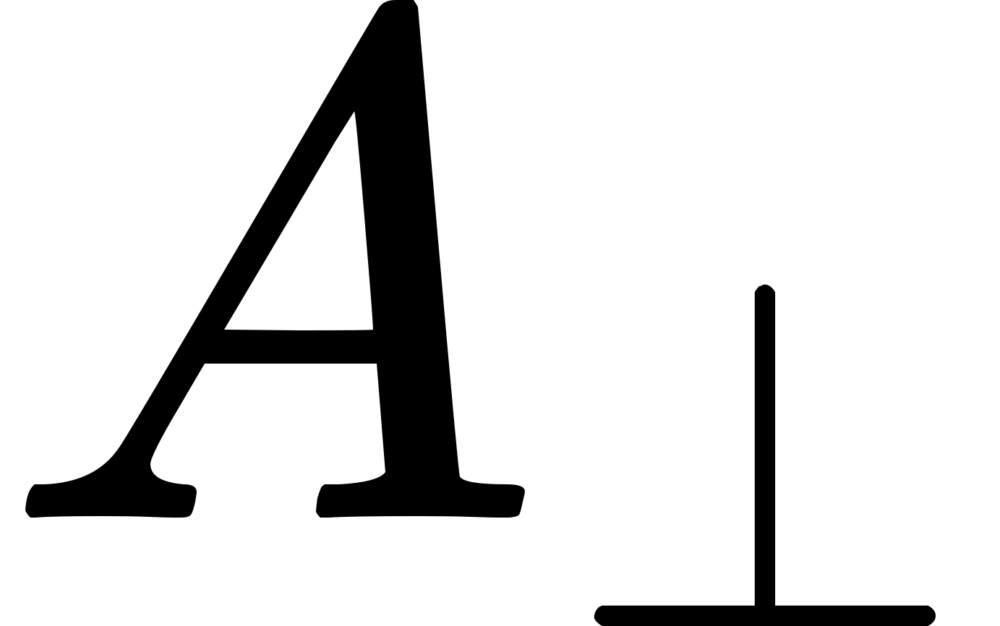
    
     是“与 B 模式无关”的剩余部分。
    

这正是很多最小二乘/匹配的核心：你在找“某个模板矩阵 B ”在数据 A 里占了多少成分。

* * *

### 4) 距离：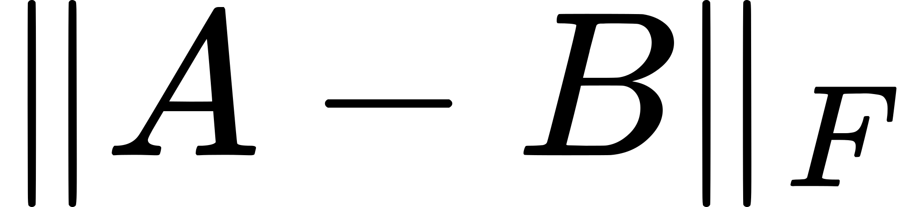 就是欧氏距离

因为它就是向量空间里的欧氏范数：

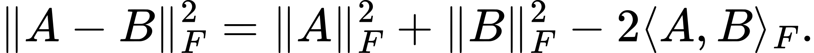

**几何意义：**  
Frobenius 范数让“矩阵之间的差异”变成一个标准的欧氏距离——非常直观：逐元素误差平方求和再开根号。

* * *

### 5) 为什么等于 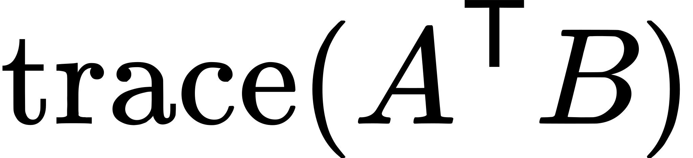：把“点积”写成更“坐标无关”的形式

###   

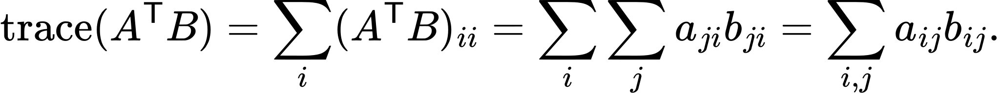

用 trace 写出来的好处是：它和线性代数的运算（旋转/正交变换、微分、优化）特别合拍。

一个很重要的几何性质是：对任意正交矩阵

 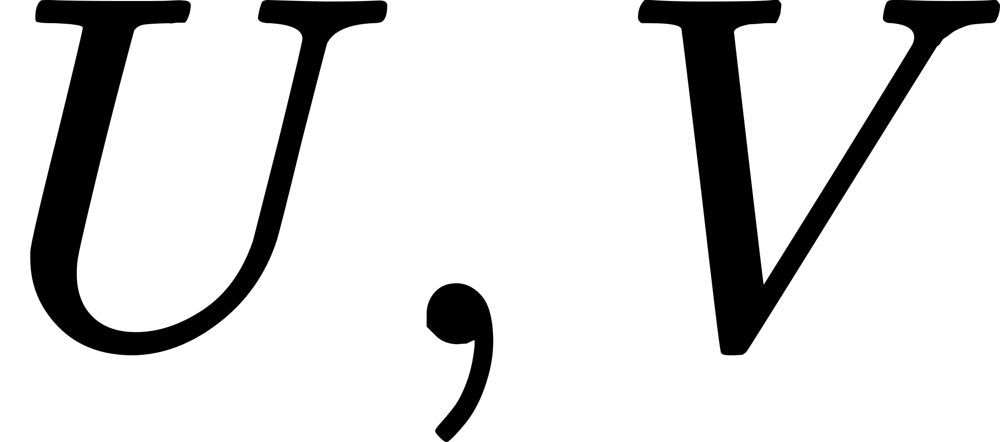（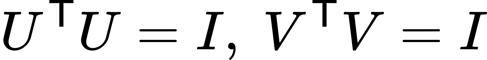），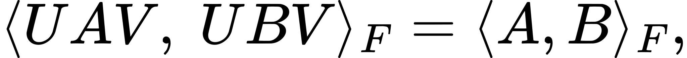

也就是在左右做“旋转/反射”不会改变内积——这就是“真正的欧氏几何”的味道。

* * *

我们就用一个**3×3 全整数**的小例子，把 Frobenius 内积的“对齐/夹角/投影/正交分解”一次讲透。

* * *

### 例子选取

令

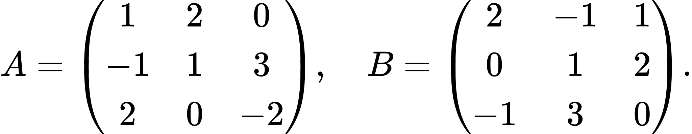

* * *

### 1) Frobenius 内积：逐元素相乘再求和

###   

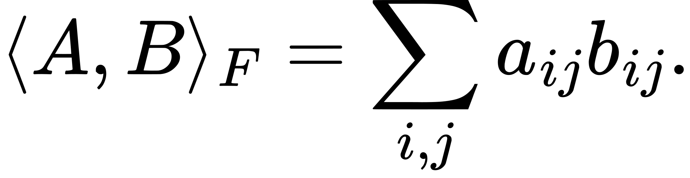

逐项算（按行）：

-   第1行：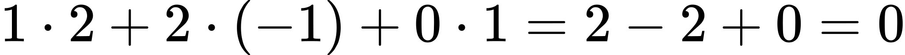
    
-   第2行：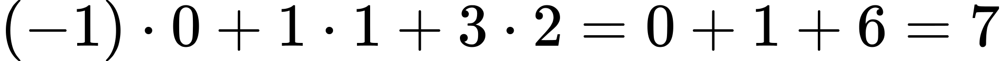
    
-   第3行：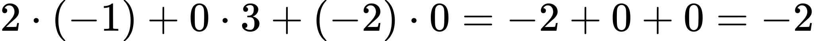
    

合起来：

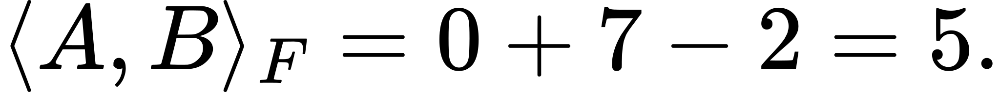

**几何解释**：整体是正的（=5），说明 A 与 B 的“元素模式”总体偏同向（有一定对齐）。

* * *

### 2) Frobenius 范数：矩阵的“长度”

###   

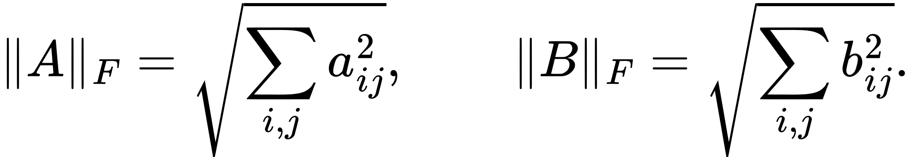

算 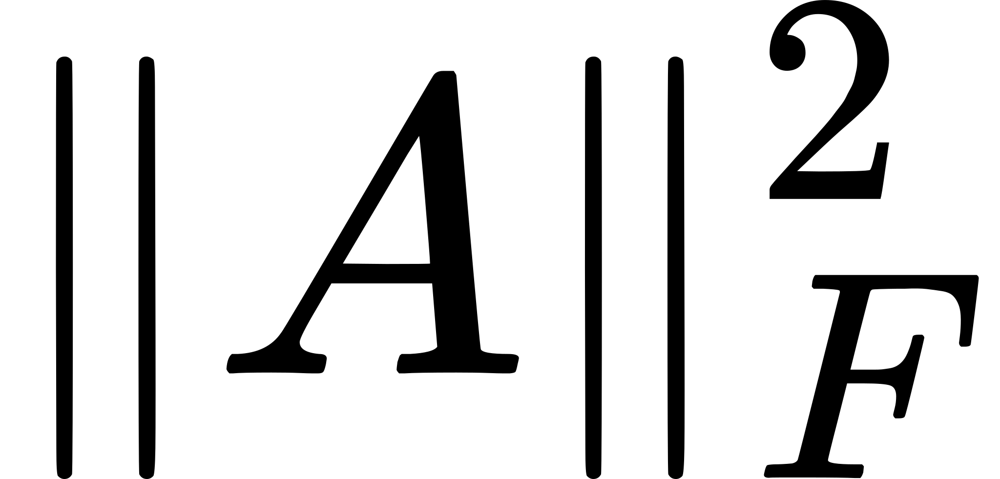（平方先算出来更清楚）：

-   第1行：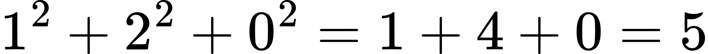
    
-   第2行：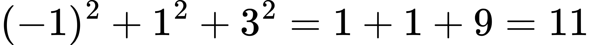
    
-   第3行：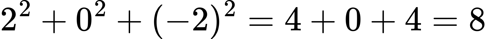
    

所以


算 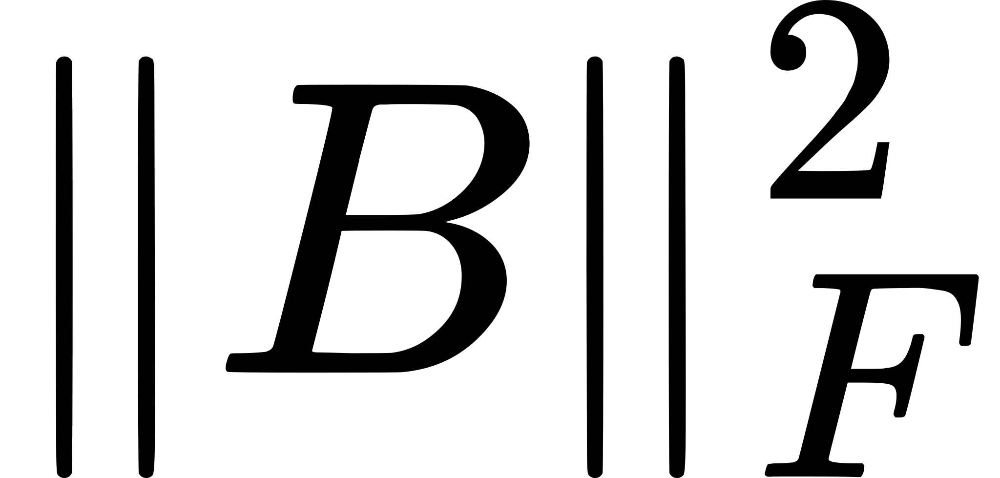：

-   第1行：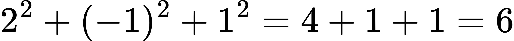
    
-   第2行：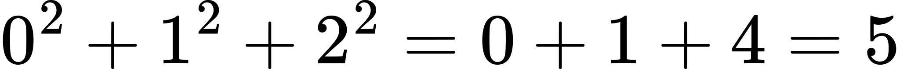
    
-   第3行：
    

所以

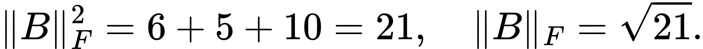

* * *

### 3) “夹角”：矩阵之间的 cos

###   

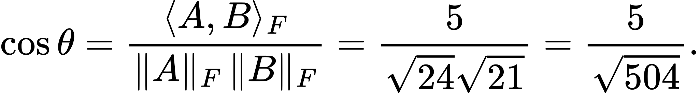

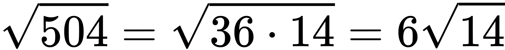，

所以

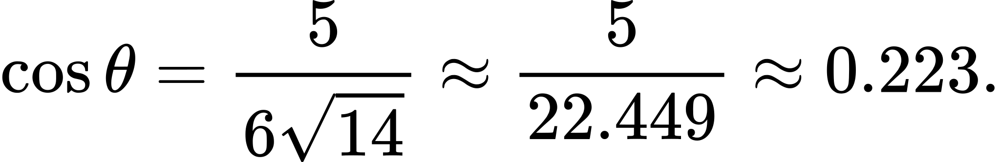

**几何解释**：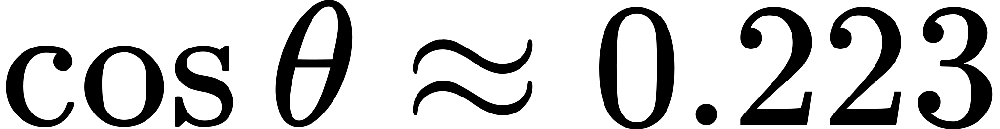，说明确实有对齐，但不强（夹角偏大）。

* * *

### 4) 投影：A 在 B 方向上的那一部分

###   

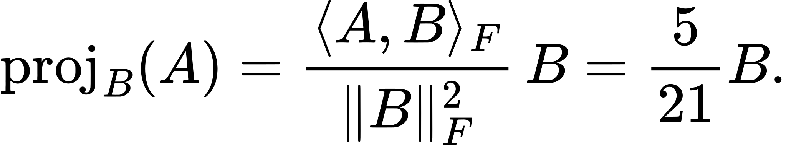

也就是

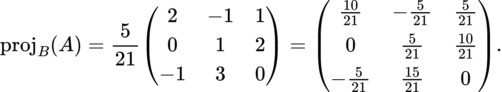

**几何解释**：这是 A 中“沿着 B 这种模式”的分量大小。

* * *

### 5) 正交分解：剩余部分与 B 正交

令

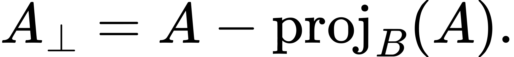

逐元素减（我把结果直接写出来）：

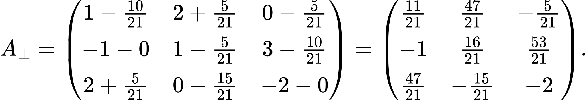

并且按理论一定满足

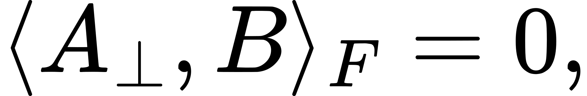

这就是“投影 + 正交剩余”的几何结构：**把 A 拆成一块沿 B，一块完全不含 B 成分**。

* * *

我已经把这个例子生成 **三维几何图**（把 9 维的 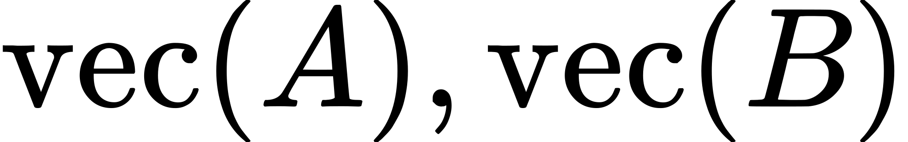 等通过 **PCA 投影到 3D**），并且用 **4 种不同颜色**表示四个向量，同时在**顶部 legend** 做了颜色标注：

-   蓝：A (vec)
    
-   橙：B (vec)
    
-   绿：proj\\\_B(A)
    
-   红：A\\\_perp
    

  


### 一句话总结（记住这个就够了）

Frobenius 内积 **5** 告诉我们 A 和 B **正向对齐**（夹角 77°，cos≈0.223），我们可以用它把 A **投影** 到 B 上得到“影子”，再用 **[正交分解](https://mp.weixin.qq.com/s?__biz=MzkzODgwODczMw==&mid=2247489540&idx=1&sn=90593d2b79425be1b6b01e1ec3fce6e6&scene=21#wechat_redirect)** 把 A 拆成“平行于 B”（同方向）和“垂直于 B”（完全无关）的两块矩阵——这正是把矩阵空间当成高维向量空间的最直观几何体现！

Frobenius内积和欧几里得内积有什么关系？

**Frobenius内积就是“矩阵版的欧几里得内积”！**一句话总结关系：**Frobenius内积 = 矩阵向量化后的欧几里得内积**。 它们本质上是同一个东西，只是“包装”不同。

### 1\. 最直白的解释（像把矩阵拉直成向量）

欧几里得内积（Euclidean inner product）就是我们初中学的**向量点积**：

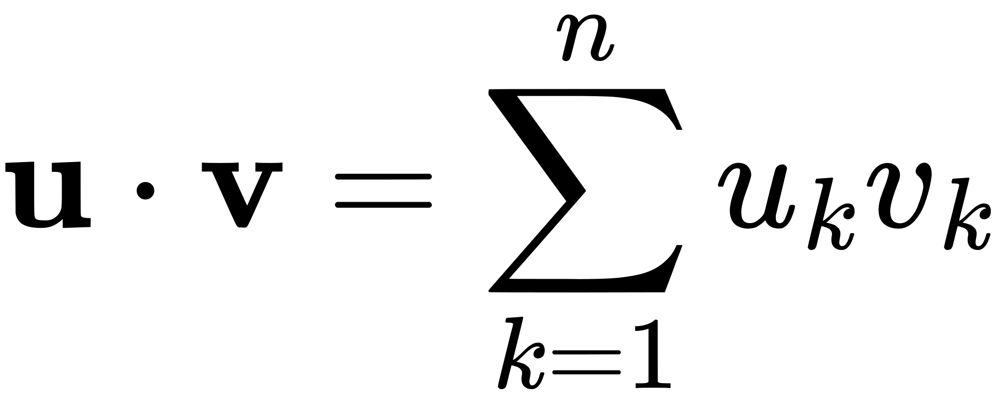

Frobenius内积对矩阵A和B：

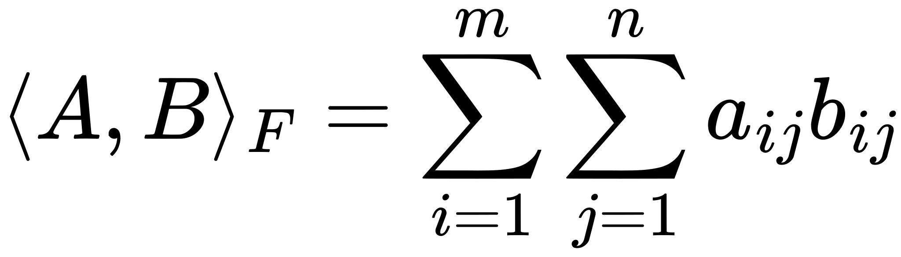

**关键操作：向量化（vec）**把矩阵**按列（或按行）拉直**成一个超级长的列向量。例如一个 3×3 矩阵变成 9 维向量：

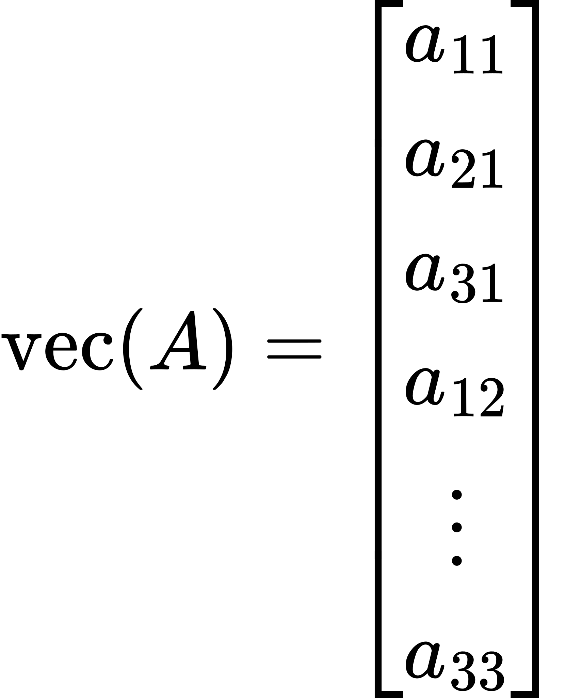

这时：

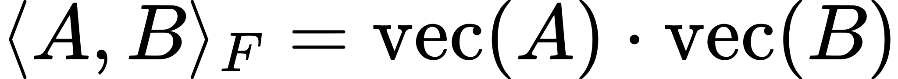

**完全等于**普通欧几里得内积！

### 2\. 几何意义（完全一样的高维空间）

-   所有 m×n 矩阵构成一个 **mn 维欧氏空间**（带Frobenius内积）。
    
-   这个空间和标准的 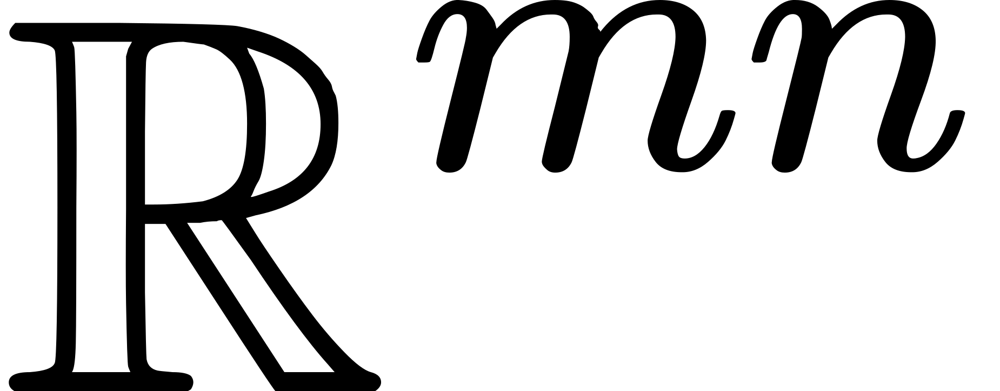（带欧几里得内积）**完全等距同构**。
    

-   长度：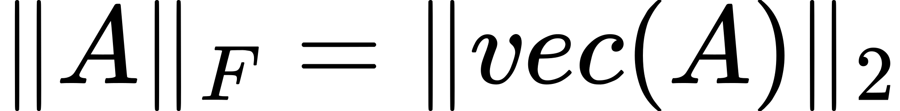（欧氏范数）
    
-   夹角、投影、正交分解……所有几何性质一模一样！
    

-   简单说：**Frobenius内积就是欧几里得内积在矩阵空间的“官方实现”**。
    
      
    

### 3\. 其他等价写法（方便计算）

-   矩阵形式：⟨A, B⟩\_F = trace(AᵀB)
    
-   行向量形式：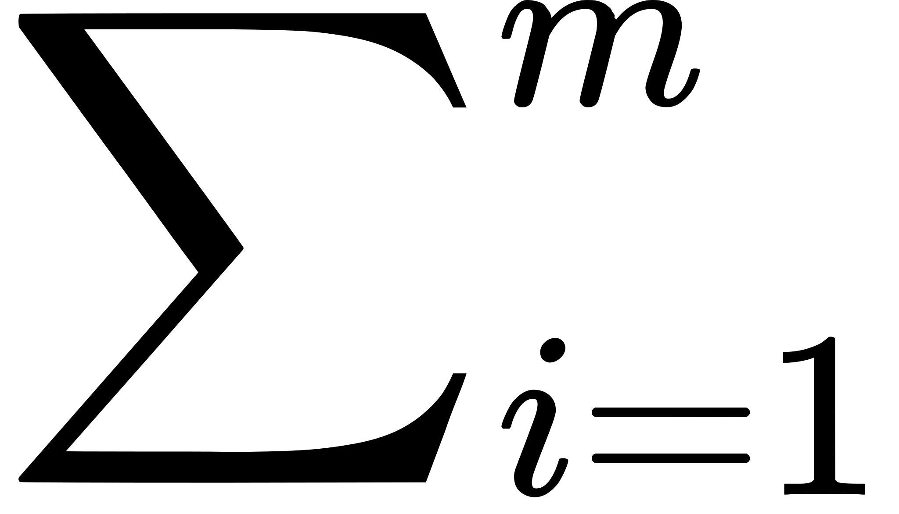 (A的第i行 · B的第i行)
    
-   列向量形式：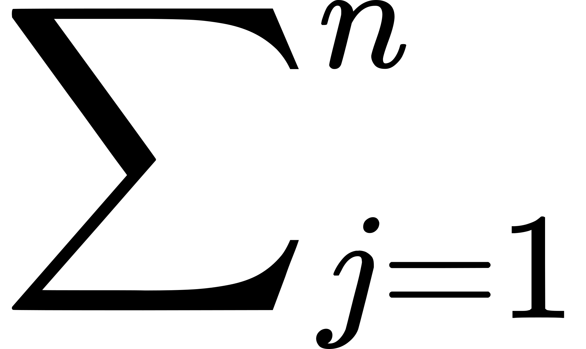 (A的第j列 · B的第j列)
    

**全部等价**，本质都是把元素一一对应做欧氏点积。

### 4\. 用之前的例子验证（A和B）

我们算过的 A 和 B：

-    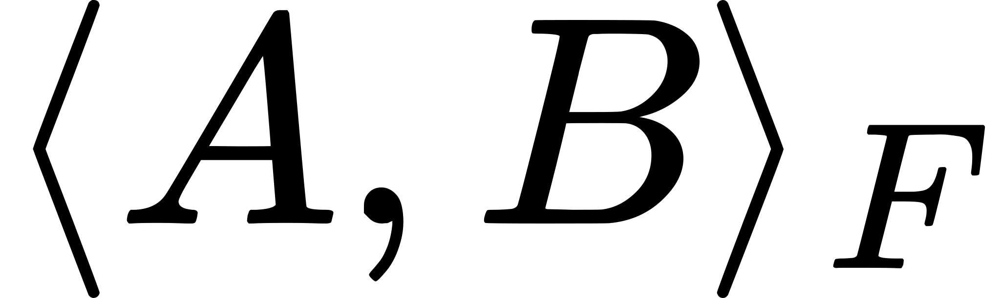 = 5
-   vec(A) = \[1, -1, 2, 2, 1, 0, 0, 3, -2\]ᵀ（列拉直）
    
-   vec(B) = \[2, 0, -1, -1, 1, 3, 1, 2, 0\]ᵀ
    
-   欧氏点积：1×2 + (-1)×0 + 2×(-1) + …… = **正好5**
    

完全一样！如果你用Python/numpy：

Python

```
np.sum(A * B)          # Frobenius内积
```

结果一模一样。

### 5\. 为什么叫“Frobenius”？

历史原因：Ferdinand Georg Frobenius在19世纪定义的矩阵内积。但本质上，它就是欧几里得内积在矩阵上的自然推广。 现代机器学习、图像处理、优化里，**大家直接把矩阵看成向量**，用的就是这个等价关系。

**总结一句话记住**：**Frobenius内积 = 欧几里得内积（只是把矩阵先拉直成向量）**。 所以所有向量几何（长度、夹角、投影、正交分解）直接搬到矩阵上就行——这就是为什么我们前面能用“高维箭头”来理解矩阵！