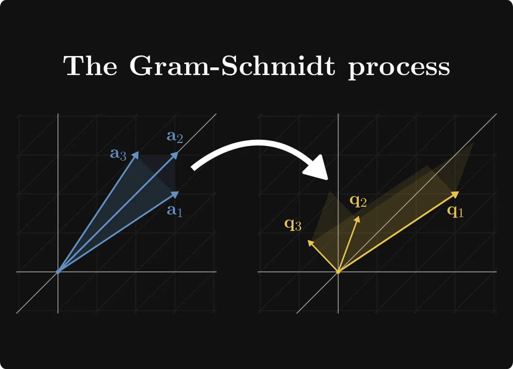
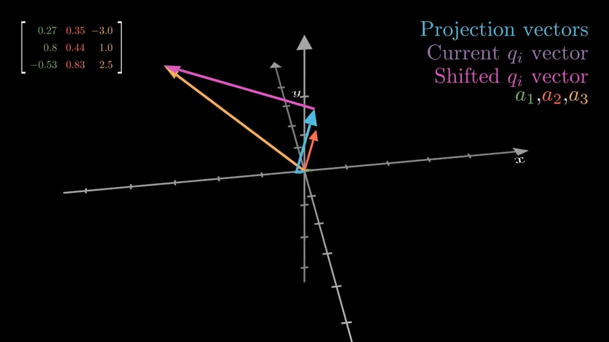
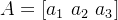
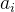
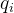

# Gram-Schmidt 正交化过程简介

> 原文地址: [https://mp.weixin.qq.com/s/1tLvAn\_qCjGbsNGJpDLQ4Q](https://mp.weixin.qq.com/s/1tLvAn_qCjGbsNGJpDLQ4Q)

 Gram-Schmidt 正交化（简称 GS 过程）是一种线性代数中的方法，用来把一组不一定垂直的向量，转化成一组互相垂直（正交）的向量组。它就像是“整理房间”：原本向量可能歪歪扭扭地指向各种方向，经过 GS 后，它们会像坐标轴一样，整齐地互相垂直，还可以选择让它们的长度变成1（归一化），这样就成了正交规范基。

为什么需要这个过程呢？在数学和工程中，正交向量计算起来超级方便。比如，在解决最小二乘问题（找最佳拟合线）、矩阵分解（QR 分解）或信号处理中，它能简化很多计算，避免向量间的“干扰”。

  
编辑

这张图片的标题是“The Gram-Schmidt process”（Gram-Schmidt 过程），它用一种视觉化的方式展示了 Gram-Schmidt 正交化过程的核心原理。图片分为左右两部分，中间用一个白色弯曲箭头连接，象征从“原始状态”到“处理后状态”的转变。背景是黑色网格坐标系，看起来像是在二维或三维空间中（实际上是平面投影，模拟向量在空间中的关系）。整体风格简洁、抽象，用颜色和箭头来表示向量。

让我一步步通俗易懂地拆解图片的内容，并结合 Gram-Schmidt 过程解释其含义。想象一下，这就像把一堆歪歪扭扭的棍子（向量），通过“拉直”和“垂直摆放”变成整齐的坐标轴。

  

1. **左侧部分：原始向量组（a1, a2, a3）**

  

-   **视觉描述**
    
    左侧显示三个蓝色调的向量，从原点（坐标系中心）出发。
    
      
    
    -   **a1**
        
        最下面的向量，蓝色，指向右下方，长度中等。它像是一根基础的“支柱”。
        
          
        
    -   **a3**
        
        中间的向量，蓝色，指向左上方，稍短，和 a1 有明显夹角。
        
          
        
    -   **a2**
        
        最上面的向量，蓝色，指向右上方，长度较长，和其他两个都不垂直。
        
          
        
    
      
    
-   **这些向量是渐变的蓝色，带有阴影效果，看起来像锥形箭头，强调方向和幅度。**
    
      
    
-   **含义解释**
    
    这些是“输入”的原始向量组 {a1, a2, a3}，它们线性独立但不正交（互相不垂直，点积不为0）。在现实中，这可能代表数据点、力向量或基向量，但这里它们“乱糟糟”的，计算起来不方便。Gram-Schmidt 过程就是从这里起步，目标是“矫正”它们。
    

  

2. **中间箭头：转变过程**

  

-   **视觉描述**
    
    一个白色的大弯曲箭头，从左侧指向右侧，像是一个“魔法箭头”，表示“应用 Gram-Schmidt 过程”。
    
      
    
-   **含义解释**
    
    这象征了算法的执行。Gram-Schmidt 不是瞬间完成的，而是逐步投影和减法：从每个向量上扣除它在前向量上的“影子”（投影分量），让剩下的部分垂直于之前的向量。过程像“剥洋葱”——一层一层去除干扰。
    

  

3. **右侧部分：正交向量组（q1, q2, q3）**

  

-   **视觉描述**
    
    右侧显示三个黄色调的向量，也从原点出发。
    

-   q1：最右侧的向量，金黄色，指向右下方，和左侧 a1 方向类似，但调整了。
    
-   q3：中间的向量，金黄色，指向上方，几乎垂直于 q1。
    
-   q2：最左侧的向量，金黄色，指向左上方，和其他两个形成正交关系。
    
      
    

-   这些向量是渐变的黄色，同样带有阴影箭头，但看起来更“整齐”，互相垂直（90度角）。注意，q 的顺序可能不完全对应 a（取决于计算），但整体从蓝到黄的颜色变化象征“净化”。
    
-   含义解释：这些是“输出”的正交向量组 {q1, q2, q3}（通常是归一化后的，长度为1）。它们-span（张成）相同的空间，但现在互相垂直，便于计算（如内积矩阵是 diagonal）。在图片中，你可以看到它们像“标准基”一样，整齐分布，没有重叠或倾斜。
    

  
编辑

我先把图里每种颜色的向量/文字对应到 Gram–Schmidt 的步骤，然后用“投影→减掉→得到正交→再单位化”的直觉把整个流程串起来，并结合图左上矩阵说明它在做什么。

这张图其实把 \*\*Gram–Schmidt（格拉姆–施密特正交化）\*\*最核心的一句做成了动画：

> **把“当前向量”在已经得到的正交基上投影（找影子），再把这些影子减掉，剩下的就会和它们都垂直。**  
> 最后再把剩下的向量“单位化”（长度变成 1）。

* * *

## 先读图：每种颜色在表达什么

-   左上角的 3×3 矩阵：三列分别是三根输入向量 **a1,a2,a3**（图里也用绿色/红色/橙色标出来）。也就是：
    
    
    
-   右上角图例：
    
      
    
    -   **Projection vectors（灰色）**：投影出来的“影子”（沿着已有的 q1,q2,…方向）
        
          
        
    -   **Current （紫色）**：当前还没“去影子”的向量（通常就是某个  或者处理中间态）
        
          
        
    -   **Shifted （粉色）**：把投影影子减掉后的“剩余部分”（已经和之前的 q 垂直了）
        
          
        
    
      
    
-   图中央那根**很长的橙色**就是 a3。图展示的重点很像是在做第 3 步：把 a3 里“沿着前面基向量的成分”剔除掉，得到新的正交方向。
    

  

* * *

## Gram–Schmidt 在干嘛：一句话直觉

把每个新向量  想成一根“木棍”，你要让它变成“只指向一个全新方向”的棍子：

1.  先把它在旧方向上“贴地投影”——得到几个**影子**（灰色）
    
2.  再把这些影子从原向量里**减掉**
    
3.  剩下那一截（粉色）就只包含“新方向”，所以会与旧方向都**正交**
    
4.  最后把它缩放到长度 1，得到单位正交基  
    

* * *

## 公式对应图里的“影子→减掉”的动作

### 投影（影子）是什么？

把 v 投到某个单位向量 q 上，投影就是：

-     是“在 q 方向上走多远”（一个标量）
    
-   乘回 q 就得到那根“灰色影子向量”
    

### “Shifted ”（粉色）怎么来？

当我们已经有了 ，处理第 i 个向量时：

这句就对应图里：**紫色 current** 减去若干条 **灰色投影**，得到 **粉色 shifted**。

最后单位化：

* * *

## 用这张图的三列向量，把步骤写成“人话版”

给定三列 a1,a2,a3（就是图左上矩阵的三列）：

**第一根基向量**

（第一根没得减，直接单位化）

**第二根：先去掉沿 q1 的部分**

**第三根：去掉沿 q1 和 q2 的部分**  
（这一步就是图里最显眼的：长橙色 a3 被“挪”成粉色那根）

* * *

## 你可以把它理解成“做 QR 分解”

Gram–Schmidt 的输出常写成：

-   Q=\[q1,q2,q3\]：列向量两两正交、长度为 1（正交归一）
    
-   R：记录“投影系数”（那些 ）
    

并且满足：

所以这不只是几何小把戏，它是很多数值算法（解线性方程、最小二乘、正交化、SVD/特征相关预处理）的基础。

我们就拿图左上角那组 **3 个列向量**（也就是矩阵的三列）来把 Gram–Schmidt **按数值一步步走完**，并把每一步和图里的“灰色投影 / 粉色 shifted”对上。

矩阵（列向量）是：

所以

* * *

##   

## 1）先把 a1 变成单位向量 q1

长度：

单位化：

直觉：第一根没得“去影子”，直接归一化就行。

* * *

##   

## 2）处理 a2：减掉它在 q1 上的“影子”（图里的灰色投影）

投影系数（就是“在 q1 方向走多远”）：

投影向量（灰色那根）：

减掉影子，得到“shifted”（粉色那根，本质是去掉旧方向成分后的剩余）：

再单位化：

**关键观察（对应你看到的图形感觉）**：  
c12≈0.0066 非常小 ⇒ **a2 本来就几乎已经和 a1 垂直**，所以减掉的灰色“影子”很短，粉色几乎和原来的 a2 重合。

* * *

##   

## 3）处理 a3：同时减掉它在 q1 和 q2 上的两个影子（图里多根灰色）

先算在 q1 上的投影系数：

投影：

再算在 q2 上的投影系数：

投影：

把这两个“旧方向影子”都减掉：

单位化：

**这一步就是图里最“戏剧化”的地方**：  
a3（橙色长矢量）里面包含了不少沿 q1,q2 的成分（灰色投影都不短），所以减完之后方向明显“挪”走了（粉色 shifted）。

* * *

## 最终结果：得到一组正交归一基 Q=\[q1,q2,q3\]

它满足：

-     
    
-   （互相垂直）
    
-     
    
-   （长度为 1）
    

* * *

## 额外加深一层：这其实就在做 QR 分解

如果把这些投影系数收集起来，会得到一个上三角矩阵 R，使得：

A=QR

在我们这组数里，关键的 R 里就包含：

-   R11=∥a1∥≈0.996895
    
-   R12=c12≈0.006621
    
-   R13=c13≈−1.339158
    
-   R22=∥u2∥≈1.002475
    
-   R23=c23≈1.470227
    
-   R33=∥u3∥≈3.506435
    

也就是说：**图里的“灰色投影长度”本质上就是 R 里的那些系数**。

# 它为什么一定会正交?

这件事用**最短的推导**讲透，然后再补两块你看动画时最容易卡住的点：**为什么要单位化**、以及 **经典 Gram–Schmidt 为啥会数值不稳定（以及改进版 MGS）**。

* * *

##   

## 4）为什么“减掉投影”后一定正交？（核心原理，3 行就够）

先看最简单的：只有一个旧方向 q1。

我们定义

现在检验它和 q1 的点积：

因为 q1 是单位向量，所以 ，于是

**点积为 0 ⇒ 垂直（正交）**。这就解释了图里：把“灰色影子”减掉后，粉色那根一定和 q1 垂直。

* * *

##   

## 5）多个旧方向时也一样：一次减掉一堆“影子”

第 3 根的公式是：

验证它与 q1 正交：

同理与 q2：

所以 **u3 同时垂直于 q1,q2q**。这就是动画里“减掉多个灰色投影”后，粉色向量一下子“换方向”的数学保证。

* * *

##   

## 6）那为什么还要“单位化”？不单位化行不行？

-   不单位化也能正交：u1,u2,u3 已经互相垂直了（只是不一定长度 1）。
    
-   但单位化有两个现实好处：
    

  

1.  **投影公式变简单**  
      如果 q 是单位向量，投影是 。  
      如果不是单位向量 u，投影要写成：
    

多了一个除法，计算更麻烦、误差也更大。

  

1.  **得到正交矩阵 Q**（对数值算法超级友好）  
      带来很多稳定性质，QR 分解、最小二乘都靠它。
    

* * *

##   

## 7）图里那句“Projection vectors / Shifted vector”到底在做什么几何事？

把空间分成两部分：

-   由旧基 q1,q2 张成的平面（或子空间）——你可以叫“旧世界”
    
-   与这个平面垂直的方向——“新世界”
    

对任意 a3，都能唯一拆成：

  
编辑

这句就是之前提到的那种表达的“正确版本”：

其中 b⊥ 就是“垂直于 span(a) 的那一部分”。

* * *

##   

## 8）一个非常重要的“坑”：如果向量几乎线性相关会怎样？

如果某一步算出来的  很小（），说明：

-     基本上已经被前面子空间表示出来了（几乎在同一平面/直线上）
    
-   这时候新的“独立方向”几乎没有了  
      ⇒ **矩阵列向量近似线性相关 / 秩不满 / 条件数很差**
    

数值上会出现：单位化时除以很小的 ，误差被放大。

* * *

##   

## 9）为什么“经典 Gram–Schmidt”有时不稳定？（以及改进版 MGS）

经典版（CGS）写成一次性减：

它的问题：当向量之间夹角很小、或数值尺度差异大时，\*\*“大数减大数”\*\*容易丢精度，导致算出来的 qiq\_iqi 看起来不够正交。

改进版叫 **Modified Gram–Schmidt (MGS)**：  
它不是“先算完所有投影再一次性减”，而是**一边投影一边减**，像这样：

-   
    
-   对 ：  
      
    
    
-   最后  
    

直觉：**每次只去掉一根旧方向的影子**，不断“纠偏”，更稳。

  

总之这张图用3D向量展示了类似过程：橙色是原始向量，紫色是投影，蓝色是调整后的正交向量。你可以看到如何通过减去投影来“矫正”方向。