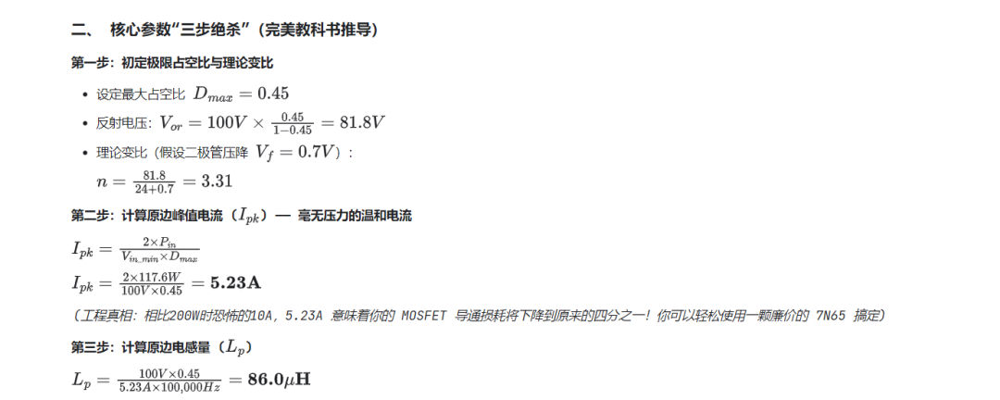
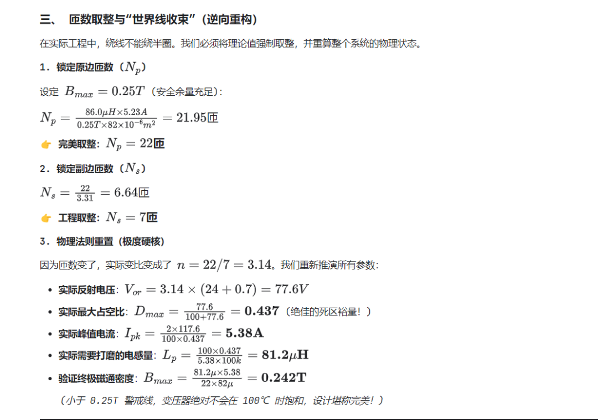
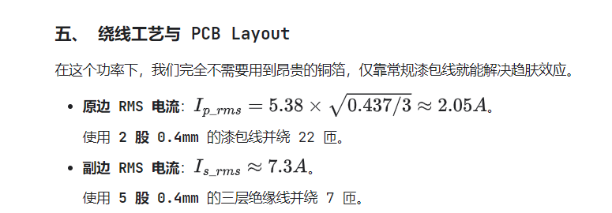

# 100W / 100kHz DCM 高频反激变压器全过程硬核设计

原创 Frank 量子电动力学 2026-02-25 21:11

> 原文地址: [https://mp.weixin.qq.com/s/dmNpsF5L7LcgGuc1eYHnsQ](https://mp.weixin.qq.com/s/dmNpsF5L7LcgGuc1eYHnsQ)

### 100W 黄金节点：参数的绝对平衡

#### 一、 边界条件重塑

-   **输入电压**：85-265VAC
    

-   谷底直流：V\_in\_min = 100V
    
-   巅峰直流：V\_in\_max = 375V
    

-   **输出规格**：24V / 4.16A (P\_out = 100W)
    
-   **效率预期**：\\eta = 85\\% (相比200W，100W的效率压力较小，85%是极其稳健的指标)
    

-   最大输入功率：P\_in = 100W / 0.85 \\approx 117.6W
    

-   **核心器件**：依旧使用 **ER28/34** 磁芯 (A\_e = 82 mm^2)。在这个功率下，ER28 可以游刃有余
    

#### 四、 应力验证：极度安全的元件选型

Plaintext

  V\_ds (MOSFET漏源电压)  
   |  
   |      /\\ <--- V\_spike (漏感尖峰, ~80V)  
   |     /  |  
   |----/---| <--- V\_or (反射电压, 77.6V)  
   |   |    |  
   |---+----+ <--- V\_in\_max (直流母线最高, 375V)  
  -+----------

-   **MOSFET 耐压**：375V + 77.6V + 80V = 532.6V。选用常规的 **650V** 场效应管，降额裕量非常健康。
    
-   **次级二极管耐压**：24V + 375V / 3.14 = 143.4V。选用 **200V / 10A** 的快恢复二极管即可。
    

  【 ER28 骨架 (Bobbin) 绕线剖面 】  
  =====================================  <-- 绝缘胶带 (3T)  
  +-----------------------------------+  
  | 原边 P2: 2股0.4mm 并绕 11 匝      |  <-- 屏蔽干扰  
  +-----------------------------------+  
  =====================================  <-- 绝缘胶带 (2T)  
  +-----------------------------------+  
  | 副边 S : 5股0.4mm 三层绝缘线 7 匝 |  <-- 夹在中间，漏感降至极低  
  +-----------------------------------+  
  =====================================  <-- 绝缘胶带 (2T)  
  +-----------------------------------+  
  | 原边 P1: 2股0.4mm 并绕 11 匝      |  <-- 紧贴磁芯  
  +-----------------------------------+  
  =====================================  

### 🧠 进阶设计思考

当你将这个 100W 的模块接入你的主系统时，由于它不仅为大功率 IGBT 驱动器供电，还涉及高灵敏度的采样芯片，**地线分割（Grounding Partition）**将是你面临的最大考验。

变压器原边的高 dv/dt 节点和副边整流二极管关断时的振铃，极易产生共模干扰。在 PCB 布板时，必须确保次级的“功率地（驱动 IGBT 和风扇）”与“模拟地（ADC 采样回路）”物理分离，最终通过单点磁珠或 0 欧姆电阻在输出电容的负极根部进行“星型连接”。只有这样，采样信号才不会在微控制器内部产生随机漂移

####   

####