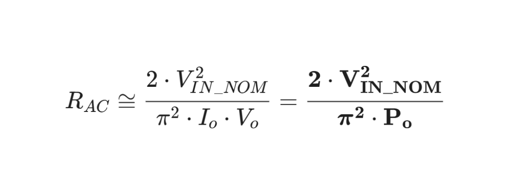

# 280W 半桥 LLC 设计指南（下）：揭秘 LLC 谐振腔的“万能钥匙”与选型终局

原创 Frank 量子电动力学 2026-04-04 09:33 浙江

> 原文地址: [https://mp.weixin.qq.com/s/A0Fe\_rIUejm-NStCvArtWg](https://mp.weixin.qq.com/s/A0Fe_rIUejm-NStCvArtWg)

这个推导，直接把复杂的 LLC 谐振参数设计，降维成了一个极其简单的**平台化工程法则**。

### 📌 步骤 15：突破物理表象，寻找  的真身

在设计初级阶段，我们认为等效交流阻抗  是由变比  和负载  决定的：

做了一次极其精妙的变量代换： 已知 ，且变比  。 把这两个等式代入  的公式中，忽略微小的二极管压降 ，我们得到了一个令人震惊的化简结果：

💡 这个公式为什么伟大？（平台化设计的万能钥匙）

看一眼最终的公式，你会发现： **的值仅与“输入电压”和“总功率”有关！**  它和你的输出电压是 14V、24V 还是 48V 完全没有关系！

既然谐振参数  都是根据  推算出来的 ，这就意味着一个终极的工程捷径：

**只要你的输入电压（比如 PFC 输出的 400V）不变，只要你的总功率（比如 280W）不变，你设计出的一套谐振腔参数（），就可以作为“万能平台”直接通用！**

-   如果客户要  的电源，你用这套谐振腔，只需把变压器圈数改成 。
    
-   如果明天客户改需求，要 （依然是 280W），**你的初级谐振电感、电容、励磁电感完全不需要重新算！** 你只需要把变压器次级圈数改成  圈即可。
    

这才是吃透了电力电子底层物理的资深工程师才能总结出的**模块化、平台化设计降维打击**