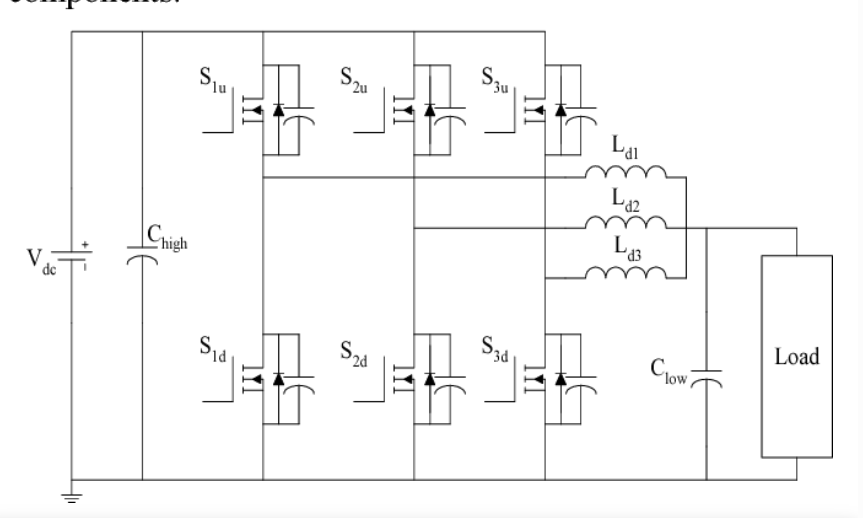

# 三相交错并联同步 Buck 可调电源

原创 Frank 量子电动力学 2026-05-07 15:49 中国台湾

> 原文地址: [https://mp.weixin.qq.com/s/Www6Dg40-eenBjvCl5bvIg](https://mp.weixin.qq.com/s/Www6Dg40-eenBjvCl5bvIg)

## 设计规格：输入与输出参数

在进行任何电路设计前，明确“边界条件”是成功的首要步骤 。

**参数类别**

**具体项**

**设定值**

**输入特性**

输入电压 ()

**58V DC**

**输出特性**

输出电压 ()

**0 ~ 55V 可调**

  

输出电流 ()

**最大 120A 可调**

  

最大输出功率 ()

**1800W**

**系统参数**

开关频率 ()

**100kHz**

  

目标效率 ()

  

交错相数 ()

**3 相**

* * *

## 📐 核心计算过程与深度讲解

### 第一步：每相电流分配

由于采用三相交错技术，总电流被均匀分配到三个通道中 。

-     
    

**计算公式**：

-     
    

**讲解**：在满载 1800W 且输出为 29V 时，总电流约为 62A，则每相均流约为 **20.7A** 。而在极限 120A 输出时，每相需承担 **40A** 。

### 第二步：确定计算工况点

-     
    

**关键逻辑**：对于 Buck 拓扑，电感电流纹波在**占空比**  时达到最大峰值 。

-     
    

**工况选择**：选择 ， 作为设计电感值的核心参考点 。

### 第三步：功率电感量 () 计算

为了保证电流平稳，设计者将电流纹波率 () 设定为 **30%** 。

-     
    

**计算公式**：

-     
    

**过程**：基于纹波电流  进行计算，得出  。

-     
    

**选型讲解**：工程实践中通常取标准值，因此最终选定  。

### 第四步：峰值电流 () 与饱和电流 ()

这是决定电源在高负载下是否会“烧管”的关键 。

1.    
    

**峰值电流**：每相均流纹波电流。计算得 **42.5A** 。

2.    
    

**安全余量**：为防止磁饱和，饱和电流需满足  。

3.    
    

**最终选型**：要求电感 ，且直流内阻（DCR）控制在  以内，以确保  的高效率目标 。

* * *

## 💡 技术精要：为什么要这样设计？

1.    
    

**三相交错的艺术**：通过三相错位  触发 PWM，输出端的总电流纹波会相互抵消，从而大幅减小输出电容的压力，让 120A 的大电流输出像直流电池一样平稳 。

2.    
    

**效率与散热的平衡**：选择  的极低内阻电感 ，是为了在 80A 甚至 120A 级别下，减少电感自身的发热，这是实现  功率密度且不发生热失控的前提 。

3.    
    

**占空比的考量**：在你的实际应用中（如 500V 降至 110V），占空比过小会导致控制震荡。而威廉电源的这份设计（58V 降压）占空比分布更均匀，控制线性度更好 。