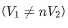

# 驾驭能量的潮汐：双有源桥（DAB）拓扑的物理本质与数字控制进阶

原创 Frank 量子电动力学 2026-04-29 06:32 浙江

> 原文地址: [https://mp.weixin.qq.com/s/c-YyaNhIASkCKRUCRxPlzw](https://mp.weixin.qq.com/s/c-YyaNhIASkCKRUCRxPlzw)

在隔离型双向 DC-DC 变换器的世界里，**双有源桥（Dual Active Bridge, DAB）** 绝对是当之无愧的无冕之王。从储能系统、电动汽车 V2G，到复杂的自动化供电网络，只要涉及大功率、高效率的能量双向流动，DAB 都是首选。

但 DAB 也是出了名的“理论极其优雅，落地极其凶险”。今天，我们将撕开理论的包装，直接深入 DAB 的物理底层，并从底层数字控制（DSP）的视角，剖析如何驾驭这个大功率的“能量怪兽”。

## 一、 物理直觉：两个“泵”与一根“弹簧”

在传统的反激（Flyback）或正激拓扑中，变压器主要负责单向传输能量。但在 DAB 中，拓扑极其对称：**原边一个全桥，副边一个全桥，中间夹着一个高频隔离变压器和串联电感。**

要理解 DAB，必须打破传统变压器的思维定势。在 DAB 中，**变压器的漏感（或外加的串联电感 L\_s）不再是需要被消除的寄生参数，而是整个系统传递能量的绝对核心。**

我们可以用一个极其形象的物理模型来理解：

-   **原边全桥**
    
     是一个交流电压源（产生占空比 50% 的方波 $V\_1$）。
    
-   **副边全桥**
    
     也是一个交流电压源（产生占空比 50% 的方波 $V\_2$）。
    
-   **串联电感 L\_s**
    
     就是连接这两个源的一根\*\*“弹簧”\*\*。
    

**能量是如何流动的？**

完全取决于这两个方波的\*\*相位差（Phase Shift, 移相角）\*\*。

如果原边全桥的波形超前于副边，原边就是在“拉”这根弹簧，能量从原边流向副边；如果副边超前，能量就反向回流。

这就引出了 DAB 最经典的核心功率方程（单移相控制 SPS 下）：

P\=2⋅fs⋅Lsn⋅V1⋅V2⋅d⋅(1−∣d∣)

_(其中 d为移相比，范围 -0.5 到 0.5；n为变压器匝比；f\_s为开关频率)_

这个公式无比优美：**你只需要在代码里改变移相比 d 的正负和大小，就能随心所欲地控制这几十千瓦能量的流向和大小。**

## 二、 从公式到代码：DSP 程序员视角的移相控制

理论很丰满，但在用 C 代码控制硬件时，这个“移相”到底是怎么实现的？

对于负责闭环算法的底层控制工程师来说，DAB 的控制本质上是对 **PWM 模块时基（Time-Base）和相位（Phase）寄存器**的精准拿捏。

假设我们使用 TI C2000 系列的 DSP：

1.  **原边发波（基准）：**
    
     配置 EPwm1 和 EPwm2 控制原边全桥的超前/滞后桥臂，死区设好，固定输出 50% 占空比的方波。这就是系统的绝对时间零点。
    
2.  **副边发波（移相）：**
    
     配置 EPwm3 和 EPwm4 控制副边全桥。关键在于，你要让 EPwm3 接收 EPwm1 的同步信号（SYNC），并将 PI 控制器计算出来的移相指令写入 EPwm3 的 **`TBPHS`（相位寄存器）** 中。
    
3.  **闭环逻辑：**
    
     外围的 AD7606 等高速 ADC 实时采样输出端的 80A 巨量电流或目标电压。当负载突变导致电压跌落时，数字 PI 调节器迅速增大输出，软件将更大的值写入 `TBPHS`，副边波形进一步滞后，电感这根“弹簧”被拉得更开，瞬间泵入更多的能量。
    

## 三、 鲜血换来的工程排坑指南

在实际驱动诸如 FF450R12ME4 这种重载 IGBT 模块去跑 DAB 时，理论上的“完美波形”会被现实打得粉碎。以下是几个极其致命的工程陷阱：

### 陷阱 1：单移相（SPS）的“无功诅咒”与软开关丧失

前面提到的方程基于\*\*单移相控制（SPS）\*\*，即四个桥臂全开 50% 占空比，仅调节原副边相位差。

-   **致命弱点：**
    
     当原边电压和折算后的副边电压不匹配
    
    
    
    或者系统处于轻载时，电感中会产生极其巨大的\*\*环流（Circulating Current）\*\*。
    
-   **工程灾难：**
    
     能量在原副边之间来回空跑，毫无输出贡献（无功功率极大）。同时，重载 IGBT 会在轻载时完全丢失零电压开通（ZVS）条件，变成硬开关。伴随高频开关带来的巨大开关损耗，即使输出只有 10A，你的 IGBT 和变压器也可能因为发热而烧毁。
    
-   **进阶破局：**
    
     软件工程师必须抛弃简单的 SPS，引入\*\*扩展移相（EPS）、双重移相（DPS）或三重移相（TPS）\*\*。这就要求不仅要调原副边相位差（外移相），还要在原边或副边的全桥内部制造相位差（内移相，即产生阶梯波而非纯方波），以此来极小化环流电流并拓宽 ZVS 范围
    

### 陷阱 2：死区时间吃掉你的“移相角”

重型 IGBT 的开通/关断延迟很长，通常需要设置 2~3μs 的死区时间。

在 10kHz 的开关频率下，100us的周期里死区占了极小部分；但如果频率推到大几十 kHz，死区时间的占比将变得极其可观。

-   **现象：**
    
     当 PI 控制器给出一个很小的移相指令时，你会发现输出功率为 0！也就是出现了严重的\*\*“死区非线性/控制盲区”\*\*。因为极小的移相角直接被硬件死区时间“吞噬”了，电感根本没有建立起有效的压差。
    
-   **对策：**
    
     必须在控制算法中加入**死区补偿算法**，根据电流极性和大小，对下发的移相指令进行前馈补偿。
    

### 陷阱 3：DAB 的阿喀琉斯之踵——直流偏磁

我们在反激或 LCL 谐振变换器中讨论过的“直流偏磁”，在 DAB 中依然是顶级杀手。

原副边全桥哪怕存在纳秒级的发波不对称、驱动芯片延迟差异，或者 ADC 采样的零点漂移，都会在变压器的高频交流波形上叠加一个微小的直流电压（伏秒积不平衡）。

对于 DAB 的高频变压器（原边直流电阻极小），零点几伏的偏置足以产生巨大的直流偏置电流，瞬间把磁芯推向单向饱和。一旦饱和，电感量消失，下一个开关周期迎来的就是超出 IGBT 极限的爆炸性尖峰电流。

-   **对策：**
    
     硬件上必须串联隔直电容（Blocking Capacitor）；软件上，必须通过高频 ADC 实时监控电感电流的平均值（I\_DC），一旦发现偏离零轴，立刻在对应的桥臂上微调占空比（打破 50% 限制）进行主动纠偏
    

  

## 四、 结语

DAB 拓扑将大功率变换的“硬件艺术”与“软件算法”紧密地缝合在了一起。在这个拓扑里，变压器不再是静态的隔离元件，而是动态的能量中枢；DSP 也不再是简单的发波工具，而是精密调度能量潮汐的“大脑”。

从推演移相公式，到死磕寄存器时序，再到对抗偏磁和环流发热——跨越这些雷区，你才能真正掌控这座双向奔赴的“能量之桥”。