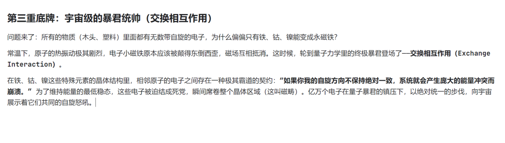

# 永磁铁的谎言：绝对静止的表面下，是疯狂的量子风暴

原创 Frank 量子电动力学 2026-05-06 07:23 浙江

> 原文地址: [https://mp.weixin.qq.com/s/ggClpEbCglkkvQ\_G3EkLuA](https://mp.weixin.qq.com/s/ggClpEbCglkkvQ_G3EkLuA)

有读者在上一篇文章留言问了一个极其硬核的问题：_“既然你说磁的本质是运动的电荷（相对论效应），那永磁铁一动不动，它的磁和运动电荷的磁是一回事吗？”_

答案是极其肯定的：**是一回事。这个宇宙中不存在第二种磁。**

你之所以觉得永磁铁“静止”，是因为你被它宏观的“肉身”欺骗了。如果你能把视角缩小到原子级别，你会发现，那块冷冰冰、硬邦邦的黑石头里，正上演着一场永不休止的、整齐划一的量子狂飙。

为了听懂永磁铁的秘密，我们需要揭开物理学的四重底牌。

### 第一重底牌：安培的疯狂脑洞（分子电流假说）

其实在两百年前，物理学家安培也被这个问题折磨过。他坚信大自然的底层逻辑必须是统一的。于是他开了一个极其超前的脑洞：**永磁铁内部，一定有无数个微小的、我们看不见的“环形电流”。**

他认为，构成磁铁的每一个分子，都是一个永远在绕圈跑的微型电流。这些小圈圈如果方向乱七八糟，磁性就互相抵消了；如果它们全都被某种力量强迫着“向右看齐”，千千万万个微小磁场叠加在一起，就成了一块宏观的永磁铁！安培猜对了结局，但他没猜中过程，因为那时人类连原子是什么都不知道。

### 第二重底牌：电子的“天生反骨”（自旋）

等到量子力学诞生后，物理学家终于看清了安培口中的“微小电流”到底是什么——**它是核外电子的运动。**

电子在原子里会产生两种磁场：

1.  1. **轨道磁矩：** 电子绕着原子核公转，这就等于微型电流。
    
2.  2. **自旋（Spin）：** 这是量子力学中最诡异的属性。你可以粗暴地把它理解为：每一个电子，从大爆炸诞生的那一刻起，就是一个绝对完美的、永远在疯狂旋转的微型条形磁铁。
    

**结论呼之欲出：** 永磁铁的磁，绝大部分来源于内部兆亿个电子的“自旋”。因为电子天生在“转”，所以它天生带磁。这依然完美符合“磁是电荷运动的产物”这一铁律。

### 第四重底牌：热力学的反杀（为什么烧红的磁铁会吸不住？）

既然这位量子暴君如此强大，那永磁铁的磁性是永恒的吗？ 你可以在家做一个极其暴力的实验：把一块吸铁石放在煤气灶上烧。当它被烧得通红时，你会发现，它突然变成了一块普通的废铁，再也吸不住任何东西了。或者，你拿着锤子对着它疯狂地猛砸，它的磁性也会大幅减弱。

**这在微观层面，是一场热力学与量子力学的殊死搏斗。** “热”的本质，就是微观粒子的剧烈运动和震荡。当你给磁铁加热时，里面的原子开始像发疯一样剧烈抖动。随着温度越来越高，这种代表着混乱的“热能”，开始与代表着秩序的“交换相互作用”正面硬刚。

当温度达到一个极其临界的致命点（比如铁的临界点大约是 **770°C**，物理学称之为**居里温度**），热力学的混乱之力终于彻底掀翻了量子力学的暴君统治。 那一瞬间，晶体内的电子全部失控，它们整齐划一的自旋瞬间被打散，指向四面八方。宏观上的磁性，就在这一瞬间烟消云散。猛烈地摔打或敲击，也是同样的道理——机械冲击力强行震碎了内部整齐的磁畴排列。

### 终局：静止的幻象

所以，永磁铁并不安静。它的内部是电子天生自带的量子自旋，是量子力学用铁腕把原本混乱的微观运动，强行定格成了一座宏观的丰碑。而打碎这块丰碑的，恰恰是日常生活中最常见的热量与撞击。