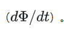
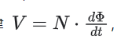

# 硬核拆解：连“线圈”都没有，平面变压器凭什么能“变压”？

原创 Frank 量子电动力学 2026-02-25 22:48

> 原文地址: [https://mp.weixin.qq.com/s/kZHOaZ4ePeCez3kMT\_YFNQ](https://mp.weixin.qq.com/s/kZHOaZ4ePeCez3kMT_YFNQ)

当我们习惯了传统变压器那种“在骨架上一圈一圈绕漆包线”的立体画面后，突然面对一块只有平面的 PCB，确实会产生一种物理直觉上的断层：“线都没了，拿什么变压？”

要把这个弯绕过来，我们需要回到电磁学的最底层逻辑：变压器之所以能变压，根本不在于那根导线是圆的还是扁的，也不在于它是立体的还是平面的。它只认两个东西：**匝数比（Turns Ratio）\*_和\*_共享的交变磁通（Magnetic Flux）**。

在平面变压器中，物理定律（法拉第电磁感应定律）完全没有变，改变的仅仅是“制造线圈的物理形态”。我们一步步把这个 2D 画板如何实现变压的过程拆解开：

### 1\. 从“绕线”到“画圈”：什么是 2D 的一匝？

在传统变压器中，漆包线绕磁芯一圈，叫作一匝。在平面 PCB 中，一根覆铜走线围绕着 PCB 上的一个圆孔（或者方孔）画一个螺旋状的闭合环，这就叫一匝。

-   **承流能力**：你的二维走线宽度（Trace Width）决定了这“根”线能扛多大的电流。
    
-   **截面积**：你的覆铜厚度（比如 2oz 或 3oz）决定了导体的截面积。
    

### 2\. 跨层叠加：如何凑齐需要的匝数？

假设你在设计一个高频开关电源，原边需要 12 匝，副边需要 4 匝。但在 PCB 上，一层可能只能画 3 圈（因为铜箔要足够宽以通过大电流）。怎么办？

**利用过孔（Via）把多个平面串联起来！**

-   **原边（12匝）**：你在 Top 层画 3 圈，打个过孔下到 Inner 1 层继续画 3 圈，再下到 Inner 2 层画 3 圈... 把 4 层 PCB 的走线串联，你就得到了物理上绝对精准的 12 匝。
    
-   **副边（4匝）**：你在另外几层 PCB 上，用更宽的走线（扛更大的输出电流）画 4 圈。
    
-   **匝数比确立**：12 匝 : 4 匝 = 3:1。只要这个比例在，降压或升压的物理基础就成立了。
    

### 3\. “隐形”的磁芯：磁场如何将 2D 平面缝合？

只有 2D 的 PCB 铜线是不能变压的（那只能算空心电感）。平面变压器之所以叫变压器，是因为它**依然拥有实体的铁氧体磁芯**，只是磁芯的形状变了。

平面变压器常用的磁芯（比如 E-E 型或 E-I 型）是非常扁平的。PCB 的中间会被掏空一个大洞，两侧再掏空两个长条洞。平面磁芯就像一个汉堡的上下两片面包，从 PCB 的上下两侧扣合在一起，刚好穿过 PCB 上预留的孔洞。

### 4\. 变压过程：电磁感应的降维打击

当你在原边的 PCB 走线上施加高频交流电压（比如 100kHz 的 PWM 波）时：

-   **电生磁**：原边 2D 铜线中的交变电流，会在穿过 PCB 中孔的铁氧体磁芯中激发出强烈的交变磁通
    
    
    
-   **磁共用**：这些磁力线被死死束缚在扁平的铁氧体磁芯内部，并在闭合的磁路中流转，这就意味着这些交变磁力线同时、垂直地穿过了副边的 PCB 铜线。
    
-   **磁生电**：根据法拉第定律   
    
    
    
      
    ，交变的磁场在副边的 2D 铜线上感应出电动势。因为原边是串了 12 圈，副边是串了 4 圈，副边感应出的电压自然就是原边的 1/3。
    

**阶段总结**：平面变压器并不是“没有线圈”，而是把立体的圆柱状线圈，压扁成了平面上的“蚊香圈”。它依然通过匝数比来定义电压转换比例，依然通过磁芯来传递能量。所有的物理原理，与你在实验室里手绕的变压器没有任何区别。

* * *

### 灵魂拷问 1：硬件换成平面变压器后，对控制软件是无缝切换吗？

**不是绝对的“无缝”，但绝对是“降维打击”般的爽快。**

当你沉浸在 C 代码里调校数字 PI 环路、配置 ePWM 的死区和相位时，传统手工绕线变压器最大的噩梦就是**寄生参数的随机性**。上一批板子的漏感是 5\\mu H，下一批可能就变成了 8\\mu H。这种物理层面的不确定性，会导致你的被控对象传递函数发生漂移，原本稳定的闭环突然在某台机器上开始轻微振荡。

换上平面变压器后，软件端会感受到以下变化：

1.  **极度一致的被控对象**：只要 Gerber 文件没改，第一万个平面变压器的漏感和层间电容跟第一个几乎一模一样。你的控制代码不再需要为了兼容硬件的公差而牺牲动态响应，环路增益可以调得更加激进。
    
2.  **噪声与采样的调整**：平面变压器通常通过交错层叠（Interleaving）将漏感压得极低。漏感小了，开关瞬间的 di/dt 会变大。这可能意味着在 ADC 采样时，你需要稍微调整一下软件里的 Blanking Window（消隐窗口）或前置的数字滤波算法，以避开更为尖锐的高频干扰。
    

### 灵魂拷问 2：我就不能自己手工 DIY 平面变压器吗？

**能做，但开发模式和传统的“手摇绕线机”完全是两个世界。**

传统变压器打样：找个骨架，拿几根漆包线，在实验室桌子上摇几圈，贴上绝缘胶布，花 10 分钟就能绕出一个来测电感量。不合适？剪断重绕。

平面变压器 DIY 的壁垒在于**迭代周期**：

1.  **画板取代绕线**：你必须在 Altium Designer 或 KiCad 这种 EDA 软件里，一层一层地画出螺旋走线、过孔和铺铜。
    
2.  **等待制板**：画完后，你必须把 Gerber 文件发给 PCB 厂家（比如嘉立创）打样。这意味着你的每一次“绕线修改”，都需要等待 2 到 4 天的快递周期。
    
3.  **核心物料采购**：你需要单独去买匹配的平面磁芯（如 E-I 磁芯），并自己涂抹导热硅脂或夹上金属弹片将其组装在 PCB 上。
    

所以，个人完全可以 DIY，只是它将你的工作重心从“手工操作”转移到了“EDA 设计”上，并且由于打样成本和时间的限制，要求你在画板前把电流密度和层级分布计算得极其精确，丧失了“随绕随测”的灵活性。