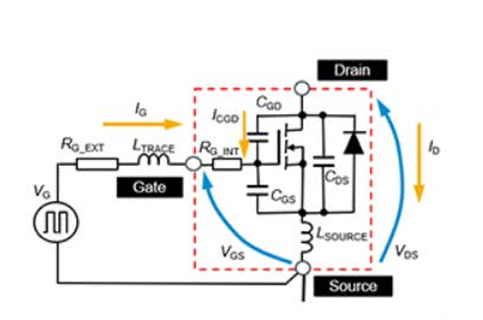
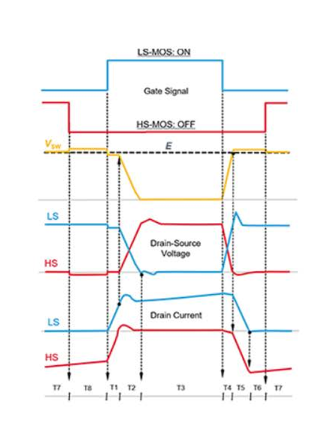

# SiC MOSFET 开关瞬态全景图

原创 Frank 量子电动力学 2026-05-02 08:15 浙江

> 原文地址: [https://mp.weixin.qq.com/s/GFuUn0kr9AxWXV-C7vt0sw](https://mp.weixin.qq.com/s/GFuUn0kr9AxWXV-C7vt0sw)

  

  

在电力电子的真实战场上，SiC MOSFET 极少孤军奋战，它们通常以“半桥（Half-Bridge）”的形态成对出现。在这个结构中，开通与关断不再是一个管子的私事，而是一场牵扯到无数寄生元件的“电荷接力赛”。

今天，我们拔掉一切花哨的修饰，直接对着官方提供的等效电路和瞬态波形，用“第一性原理”来拆解这场纳秒级的物理搏杀。

#### 一、 战场地图：不可忽视的寄生元件

要真正看懂桥式电路中的开通和关断操作，我们必须先审视包含栅极驱动电路寄生组件的等效电路 。

在这个隐秘的物理网络中，除了你的栅极信号（），还潜伏着 SiC MOSFET 内部栅极线路的电阻（）、封装带来的源极电感（）、栅极电路走线的电感（）以及外部栅极电阻（） 。为了统一分析的视角，电路中的栅源电压（）和漏源电压（）都是以源极（Source）引脚作为参考点来定义的 。

#### 二、 开通瞬间（Turn-on）：权力的交接

让我们把放大镜对准低边（LS）管子的开通动作。这是一个从高边（HS）手里硬生生抢夺电流的过程。

**1\. T1 阶段：电流的此消彼长** 为了开启 LS 侧，系统会施加一个正向电压  作为 LS 侧的栅极信号 。此时，栅源电容（）开始充电，导致  不断上升 。当电压终于越过 SiC MOSFET 的栅极阈值电压（）时，极其关键的物理现象发生了：LS 侧的漏极电流（）开始流动，而与此同时，原本在 HS 侧从源极流向漏极的  开始减小 。这个电流换向的时间段，就是波形图底部标示的 T1 区间 。

**2\. T2 阶段：中点电位的“跳水”** 紧接着，当 HS 侧的  彻底降至零，且其寄生二极管关断时，半桥的中点电压（）开始迅速下降 。随着  的急剧跌落，HS 侧的漏源电容（）和漏栅电容（）被迫开始充电，这就是 T2 阶段 。 在 HS 侧的  充电完成（同时 LS 侧完成放电）后，当 LS 侧的  达到特定电压值，LS 侧的开通操作才算真正大功告成 。

#### 三、 关断轮回（Turn-off）：撤退与反扑

关断操作远比想象中惊险，因为这牵扯到强大的电感续流和电位的剧烈反弹。

**1\. T4 阶段：死扛高压的米勒平台** 关断操作始于 LS 侧  上积累电荷的释放 。当电压下降到 SiC MOSFET 的平台电压（即进入米勒效应区间）时，LS 侧的  开始飙升，与此同时中点电压  也同步上升 。 注意波形图上的 T4 阶段，在这个时间点，几乎所有的负载电流依然死死地流经 LS 侧，HS 侧的寄生二极管中还没有任何换向电流流过 。

**2\. T5 阶段：强制换流的瞬间** 这是最暴力的物理节点。当 LS 侧的  充电（同时 HS 侧放电）完成后， 猛地超过了输入电压（），这直接迫使 HS 侧的寄生二极管导通 。直到此时，LS 侧的  才终于开始向 HS 侧进行换流（T5 阶段） 。

**3\. T6 & T7 阶段：死区与重获新生** 历经磨难后，LS 侧的  终于降到了零，电路正式进入死区时间（T6 阶段） 。为了维持系统的连续运行，系统随后向 HS 侧的 MOSFET 施加正向的  信号使其导通，从而进入同步操作阶段（T7 阶段） 。

**硬核总结：**

无论是在图纸上还是在示波器里，每一次完美的波形切换，背后都是电荷在 、 和  之间剧烈流转的结果。看懂了这些寄生参数在 T1 到 T7 阶段的物理动作，你才算真正拿到了驾驭高频电力电子大门的钥匙。