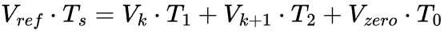
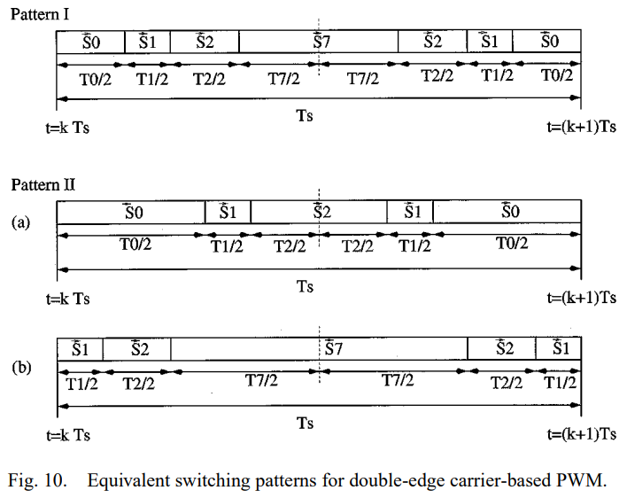
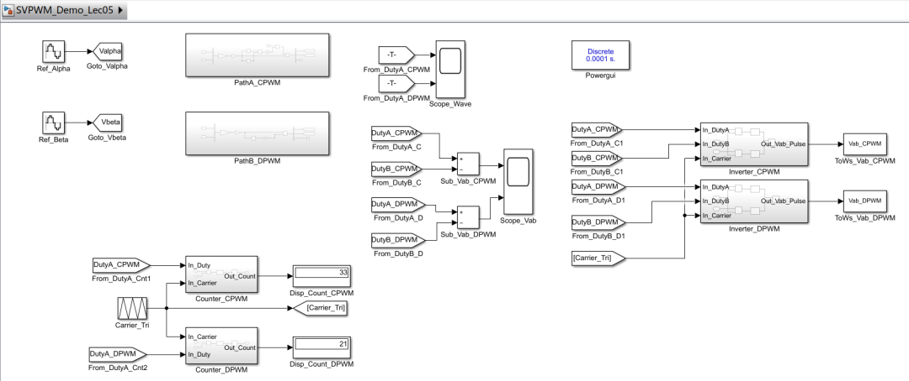
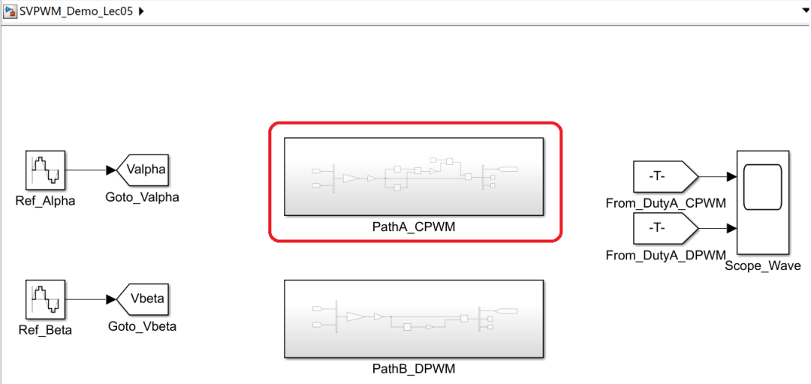
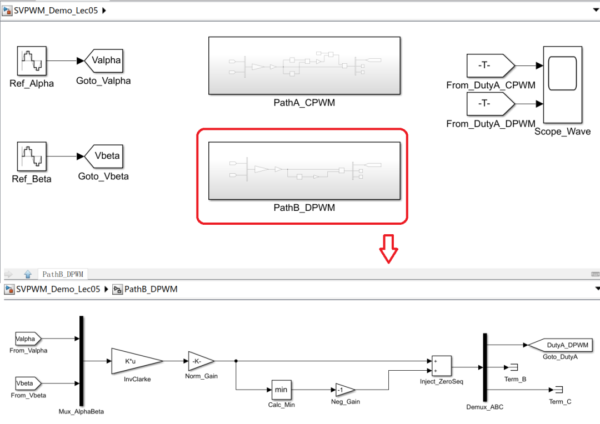
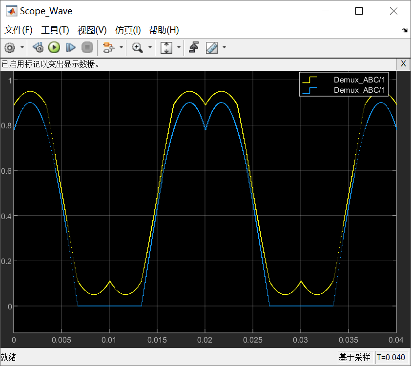
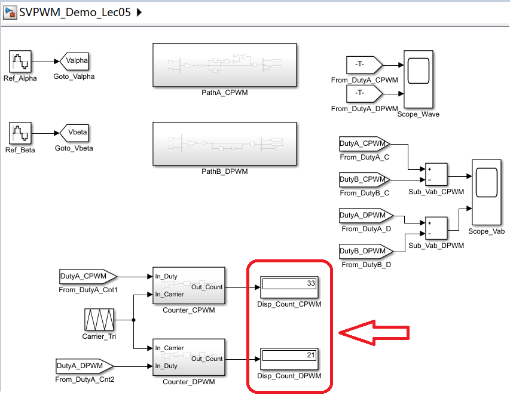
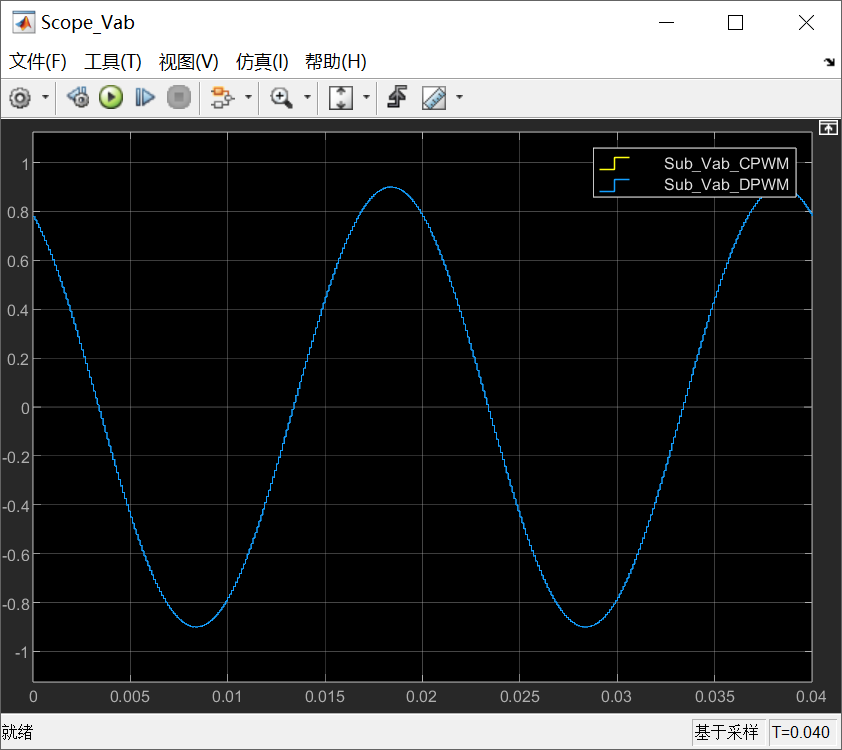
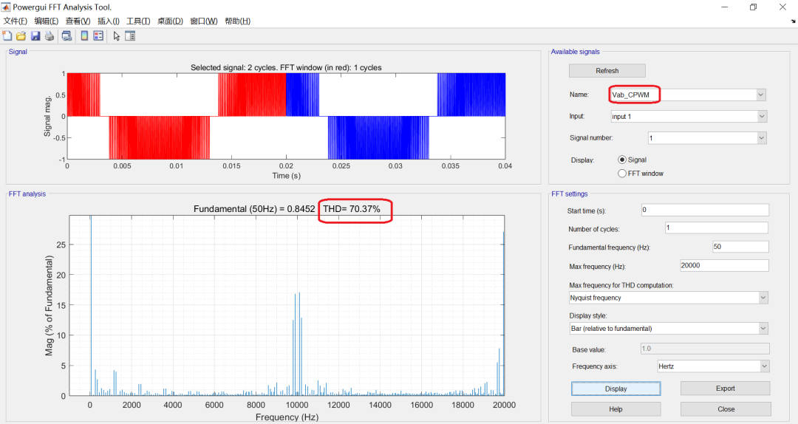
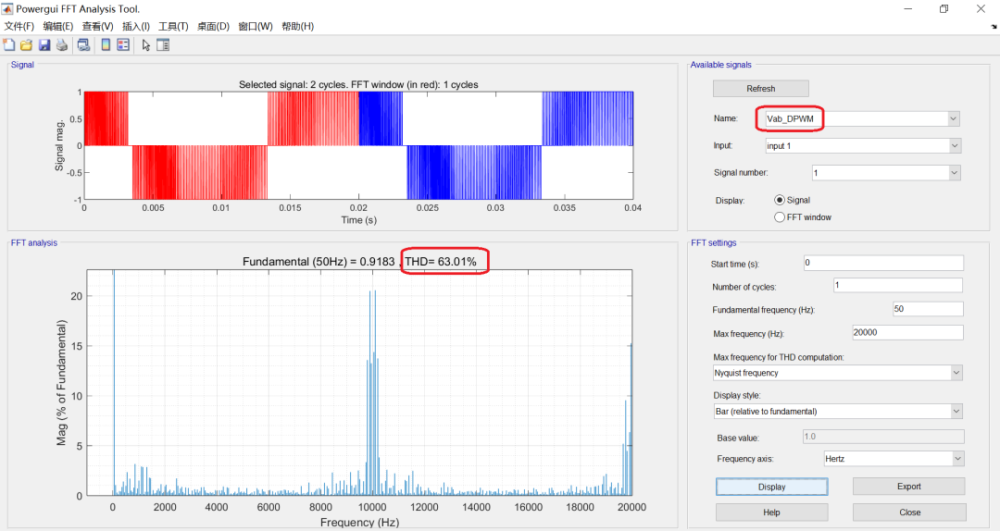

# 《零序注入SVPWM这件小事》｜05讲：零矢量的分配权——连续PWM与不连续PWM的分水岭

原创 傅存敬 电磁散人 2026-02-05 07:06 广东

> 原文地址: [https://mp.weixin.qq.com/s/vxwMN6CCJSc9V9KGjr7VlA](https://mp.weixin.qq.com/s/vxwMN6CCJSc9V9KGjr7VlA)

各位同仁，[上一讲](https://mp.weixin.qq.com/s?__biz=MzE5MTYzNjgzOA==&mid=2247485391&idx=1&sn=9a4cd46ec0014e8e08df1c1e60cf6fdb&scene=21#wechat_redirect)，咱们把min-max居中注入这个“黑魔法”给彻底解密了，发现它就是个聪明的“居中”操作。通过它，我们可以在不判扇区的情况下，完美等效出经典的对称SVPWM。

这种SVPWM，我们通常称之为**连续PWM（Continuous PWM, CPWM）。**

为什么叫“连续”？这个词到底是在形容什么？

要回答这个问题，咱们得回到最原始的扇区法SVPWM。回忆一下，在一个PWM周期 Ts 里，我们要做的是合成一个参考电压矢量 Vref。我们把它分解成三个部分：

这里的 T1 和 T2 是相邻两个有效矢量的作用时间，它们是由 Vref 的位置和幅值**唯一确定的**，我们没得选。这就像我们本讲文章封面页上的宣传语所说的，这是**“命运写好的主句”**。

但是，剩下的那个零矢量时间 T0 = Ts - T1 - T2，我们怎么用？这就有讲究了。

我们有两个零矢量可选：

-   V0，开关状态是 (0,0,0)，三相下管全开。
    
-   V7，开关状态是 (1,1,1)，三相上管全开。
    

这个 T0 时间，我们是全部分给 V0？还是全部分给 V7？还是两个都用，一人一半？

**这就是SVPWM里唯一的，也是最重要的“自由度”——零矢量的分配权。**

我们仔细查看一下文末参考文献的 Figure 10 中的 Pattern I ：

这是一个在第一扇区的典型开关序列。你看它的排布：

V0 → V1 → V2 → V7 → V2 → V1 → V0

整个周期 Ts 被分成了七段。零矢量时间 T0 被劈成了两半，T0/2 放在周期的最开始（用 V0 实现），另外 T0/2 放在周期的最中间（用 V7 实现）。

这种排布方式，有几个非常好的特性：

1.  **脉冲中心对称：**你看三相的PWM波形，都是关于 Ts/2 这个中心点对称的。这能消除很多偶次谐波，让电流更干净。
    
2.  **开关次数最少：**从 V0 到 V1，从 V1 到 V2，从 V2 到 V7，每一步都只切换一个桥臂。这是最平滑的过渡方式。
    

这种**同时使用了****V0****和****V7****两个零矢量**的SVPWM，就叫**连续PWM**。

为什么叫“连续”？一种比较直观的解释是，从电机的中性点电位来看。在CPWM下，中性点电位在一个周期内会在 +Vdc/3 和 -Vdc/3 之间平滑地（相对于DPWM）来回摆动，看起来比较“连续”。

更工程化的理解是：在这种模式下，**三相桥臂，在平均意义上，每个PWM周期都在进行开关动作。**没有哪一相是“停下来休息”的。

咱们上一讲学的 **[min-max居中注入](https://mp.weixin.qq.com/s?__biz=MzE5MTYzNjgzOA==&mid=2247485391&idx=1&sn=9a4cd46ec0014e8e08df1c1e60cf6fdb&scene=21#wechat_redirect)**，它等效的，就是这种**对称的、使用了两个零矢量的、连续的SVPWM**。那个“居中”的操作，天然地就把零矢量时间 T0 对称地分配到了周期的两端和中间。

好，既然有“连续”，那就一定有**“不连续”**。

**不连续PWM（Discontinuous PWM, DPWM）**，顾名思义，就是它在某些地方“断开了”。断开的是什么？

DPWM的核心思想是：**在一个PWM周期内，我只用一个零矢量，要么只用****V0****，要么只用****V7****，绝不同时用。**

比如，在一个周期里，我决定只用 V0。那么整个 T0 时间，都由 (0,0,0) 这个状态来填充。开关序列可能就变成了：

V0 → V1 → V2 → V0

这样做，会发生一件非常有意思的事情。

咱们来看，当开关状态是 V0(0,0,0) 时，三相输出都是低电平。

当开关状态是 V1(1,0,0) 时，A相是高，B、C是低。

当开关状态是 V2(1,1,0) 时，A、B是高，C是低。

你发现没？在 V0, V1, V2 这几个状态之间来回切换，**C相的输出，始终是低电平！**它根本就没动过！

这就意味着，在某一个扇区（或者说，某60度的电角度区间内），我们可以让其中一相桥臂**“躺平”**，完全不开关，就一直钳位在直流母线的正端（钳位到+Vdc）或者负端（钳位到-Vdc 或 GND）。

**核心结论：DPWM的本质，就是通过只使用一种零矢量，来实现某一相在一段时间内的“钳位不开关”。**

这个特性，简直是为工程师量身定做的“福利”：

1.  **开关损耗降低：**三相轮流休息，总有一个在“摸鱼”。一个周期内，总开关次数少了。从平均来看，总的开关频率可以降低 **1/3！**对于大功率、高开关频率的应用，这省下来的热量和损耗，是非常可观的。
    
2.  **采样窗口变大**：当某一相被钳位时，另外两相还在开关。在钳位期间，电流的纹波特性会发生变化，有时候[会产生更长、更“干净”的时间窗口，非常适合ADC进行电流采样](https://mp.weixin.qq.com/s?__biz=MzE5MTYzNjgzOA==&mid=2247485037&idx=1&sn=34ad9c107aae358b358629b54af0ab22&scene=21#wechat_redirect)[。](https://mp.weixin.qq.com/s?__biz=MzE5MTYzNjgzOA==&mid=2247485037&idx=1&sn=34ad9c107aae358b358629b54af0ab22&scene=21#wechat_redirect)
    

这就是我们这讲文章封面中宣传语句的意义：T1 和 T2 是必须完成的任务，但 T0 这个“**停顿”**，你是选择在办公室（比如V0）和家（比如V7）之间来回跑，还是选择干脆就在办公室（只用V0）趴着睡一觉？这个选择，决定了你的“通勤成本”（开关损耗）和“工作状态”（波形特性）。

空口无凭，得上Simulink。

**Simulink 演示**

咱们用Simulink来直观地感受一下“连续”和“不连续”的区别。

1.  **信号源：**继续用那个旋转矢量。
    

2.  **两条并行路径：**
    

-   **路径A（CPWM）**：使用我们上一讲已经验证过的min-max居中注入法。
    

-   **路径B（DPWM）：**我们来实现一种最简单的DPWM。比如，我们规定，在一个PWM周期内，找到三相调制波 ua\*, ub\*, uc\* 中最小的那一相，然后注入一个零序，让它正好被“钳位”到-1。这个零序就是 e = -1 - u\_min。
    

3.  **观测：**
    

-   **看三相PWM门极信号：**你会清晰地看到，在路径B（DPWM）中，总有一相的门极信号，在一段比较长的时间内（通常是60度或120度电角度），是一条直线（要么全高，要么全低）。而CPWM的三相信号，则一直在密集地跳变。
    

-   **看开关次数：**用一个边沿计数器，分别统计两条路径在一个电周期内的总开关次数。你会发现，DPWM的开关次数，大约是CPWM的 **2/3**。
    

-   **看线电压：**对比两条路径的线电压波形和频谱。你会发现，它们的**基波分量仍然几乎一样！**但是，DPWM的谐波含量会比CPWM略高一些，谐波分布也不同。
    

这个实验，就把CPWM和DPWM最核心的区别——**开关行为**——给暴露无遗了。

理解了连续和不连续的区别，下一讲，我们就要进入DPWM的“花花世界”了。只用一个零矢量，是只用V0还是只用V7？在哪个扇区钳位哪一相？这些不同的选择，就衍生出了一个庞大的DPWM家族，比如DPWMMAX, DPWMMIN, DPWM1等等。它们各自有什么样的“性格”和“特长”？咱们下一讲再来细聊。

好，今天就到这里。大家可以思考一下，在各位同仁的项目里，是更看重“电流纹波小”（CPWM的优势），还是更看重“开关损耗低”（DPWM的优势）？这个问题没有标准答案，全是工程上的权衡。

  

参考代码：https://github.com/rombrew/phobia/tree/master/src/phobia

参考文献：

\[1\] Zhou K , Wang D .Relationship Between Space-Vector Modulation and Three-Phase Carrier-Based PWM: A Comprehensive Analysis.\[J\].IEEE Transactions on Industrial Electronics, 2002.

文献链接：

https://pan.baidu.com/s/1R6veKtYAG86LhfOXaLKJxw?pwd=rdf7 提取码: rdf7

模型链接：https://pan.baidu.com/s/17bol8oTjhUNPmDNpi33Edw?pwd=djb7 提取码: djb7