# 《零序注入SVPWM这件小事》｜06讲：DPWM三兄弟——钳位相的选择，决定损耗与噪声

原创 傅存敬 电磁散人 2026-02-06 07:06 广东

> 原文地址: [https://mp.weixin.qq.com/s/czUThh2Vj1g4kkJwSDajHw](https://mp.weixin.qq.com/s/czUThh2Vj1g4kkJwSDajHw)

各位同仁，上一讲，咱们打开了新世界的大门，知道了除了“三相都在忙活”的连续PWM（CPWM），还有一种可以让某一相“轮流摸鱼”的不连续PWM（DPWM）。

DPWM的核心思想，就是在一个PWM周期里，**只用一种零矢量**（要么V0，要么V7），从而让某一相的桥臂被“钳位”在直流母线的正端或负端，实现“不开关”。

这个思想很简单，但魔鬼藏在细节里。问题来了：

1.  **钳哪一相？** A相，B相，还是C相？
    
2.  **怎么钳？** 是钳位到上管常开（钳到+Vdc），还是下管常开（钳到-Vdc或GND）？
    
3.  **什么时候钳？** 是在一个电周期内，固定钳某一个相，还是随着转子位置变化，轮流着钳？
    

这些不同的选择，就催生出了一个庞大的DPWM家族。今天，咱们就来认识一下其中最出名的“三兄弟”：**DPWMMAX, DPWMMIN, 和 DPWM1。**这几个名字，在很多论文和代码里都能看到，搞懂它们，就等于掌握了DPWM的主要玩法。

咱们先来看文末参考文献里的 **Fig. 8. Modulation signals of discontinuous PWM**。

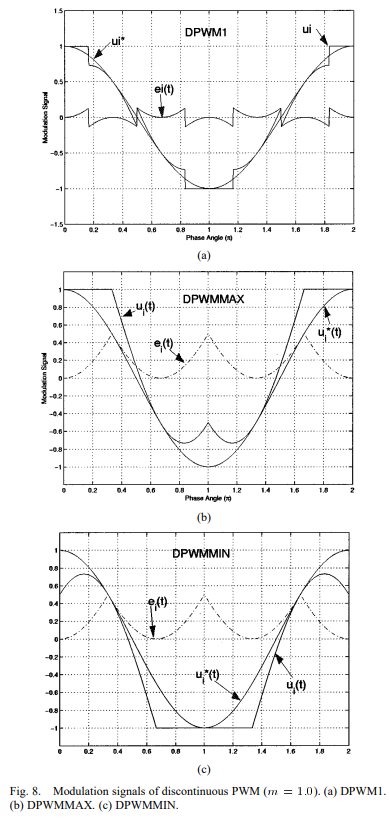

各位同仁请看这三张图，它们都是DPWM，但长相完全不同：

(a) DPWM1：波形在某些60度区间被钳到了+1，在另一些区间被钳到了-1。

(b) DPWMMAX：三相波形都被钳在了+1这条“天花板”上。

(c) DPWMMIN：三相波形都被钳在了-1这条“地板”上。

这些不同的“钳位姿势”，就是通过注入不同的零序信号 e(t) 实现的。咱们一个一个来看。

**大哥：DPWMMIN (Discontinuous PWM MIN)**

-   **策略：**在任何时刻，都把三相中最“矮”的那一根“棍子” umin，直接拉到“地板” \-1 上。
    
-   **零序注入公式：**
    

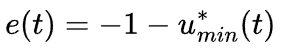

（如果是占空比域\[0, 1\]，就是 e(t) = 0 - umin\*(t)）

-   **效果：**加上这个偏置后，umin 这一相的最终调制波就变成了\-1。这意味着，在它作为最小值的这段时间里，它对应的桥臂**下管常开**，被钳位在直流母线负端。
    
-   **对应零矢量：**因为下管常开，所以使用的零矢量必然是 V0(0,0,0)。DPWMMIN在整个电周期里，都只使用 V0 这一个零矢量。
    

**二哥：DPWMMAX (Discontinuous PWM MAX)**

-   **策略：**和大哥相反，在任何时刻，都把三相中最“高”的那一根“棍子” umax，直接顶到“天花板” +1 上。
    
-   零序注入公式：
    

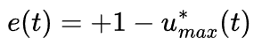

-   **效果：**加上这个偏置后，umax 这一相的最终调制波就变成了+1。这意味着，在它作为最大值的这段时间里，它对应的桥臂**上管常开**，被钳位在直流母线正端。
    
-   **对应零矢量：**因为上管常开，所以使用的零矢量必然是 V7(1,1,1)。DPWMMAX在整个电周期里，都只使用 V7 这一个零矢量。
    

**三弟：DPWM1 (也被称为 Conventional DPWM)**

DPWM1比他俩哥哥要“聪明”或者说“复杂”一点。他觉得，老是钳一个方向（要么全钳上，要么全钳下）有点单调，而且可能在某些应用场景下（比如有中性点电流）不太好。他选择**轮流钳位**。

-   **策略：**在一个电周期的**前180度**，采用和DPWMMAX一样的策略，把最大相钳到+1；在**后180度**，采用和DPWMMIN一样的策略，把最小相钳到\-1。 （更常见的实现是按60度扇区来划分，比如在扇区I, II, III钳上管，在扇区IV, V, VI钳下管。）
    
-   **效果：**三相桥臂会交替地经历“钳上管”、“正常开关”、“钳下管”这三种状态。各位看论文 **Fig. 8(a)** 的波形，它既有顶到+1的平顶，也有踩在\-1的平底。
    
-   对应零矢量：它在某些扇区只用 V7，在另一些扇区只用 V0。
    

这“三兄弟”，性格各异，但都达成了DPWM的共同目标：**在一个电周期内，平均开关次数降低了1/3。**

**那么，我们该如何选择呢？**

这没有标准答案，全是工程上的权衡。

-   **开关损耗分布：**DPWMMAX主要让功率器件的上管发热，DPWMMIN主要让下管发热，而DPWM1和CPWM则让上下管的热量分布更均匀。如果你系统的散热设计有偏向，就可以利用这个特性。
    
-   **电流纹波：**不同的DPWM策略，会在不同的相电流上，在不同的时刻，产生大小不同的纹波。通常，DPWM的电流纹波会比CPWM稍大一些。DPWM1的纹波特性通常被认为在各种DPWM里是比较均衡的。
    
-   **直流母线电容纹波：**DPWM也会影响直流母线上的电流纹波，这关系到母线电容的寿命和发热。
    
-   **噪声：**开关频率和模式的变化，会影响电机的电磁噪声，也就是我们常说的“啸叫声”。DPWM的噪声频谱和CPWM不同，有时候可能会在人耳敏感的频段产生更强的噪声。
    

咱们再看手里（参见文末的共享地址）的代码 pm.c。函数 pm\_voltage() 里的 PM\_VSI\_EXTREME 策略，它的逻辑是：

```
uDC = (bMIN + bA < bMAX) ? 1.f - uMAX : 0.f - uMIN;
```

这是一个**带条件的二选一**。它在 1-uMAX（钳上管）和 0-uMIN（钳下管）之间做选择。这个选择的条件，还和电流幅值 bA,bB,bC 有关。这说明，它不是一个纯粹的理论DPWM，而是一个**工程化的、自适应的DPWM策略**。它的目的是在满足某种性能指标（[比如采样窗口](https://mp.weixin.qq.com/s?__biz=MzE5MTYzNjgzOA==&mid=2247485037&idx=1&sn=34ad9c107aae358b358629b54af0ab22&scene=21#wechat_redirect)）的前提下，动态地选择钳上还是钳下。这比固定的DPWMMAX/MIN要更灵活。

空口无凭，还是得上Simulink。

**Simulink 演示**

咱们来把这“三兄弟”的性格，在Simulink里彻底扒开。

**1\. 信号源：**模仿数字信号系统里随着中断时间的递增产生的角度和旋转的uα和uβ。

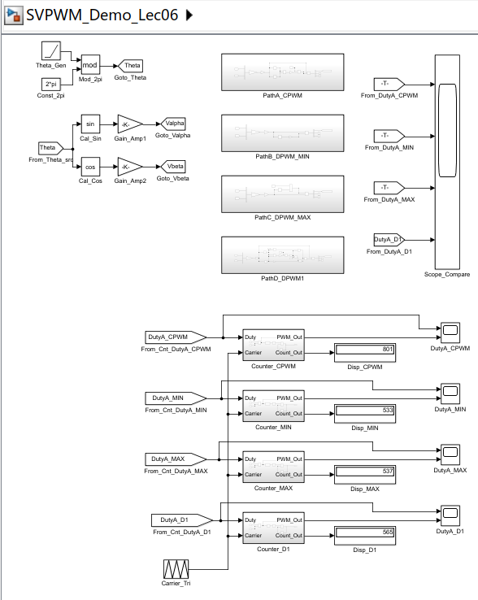

**2\. 四条并行路径：**

-   **路径A (CPWM)：**min-max居中注入。
    

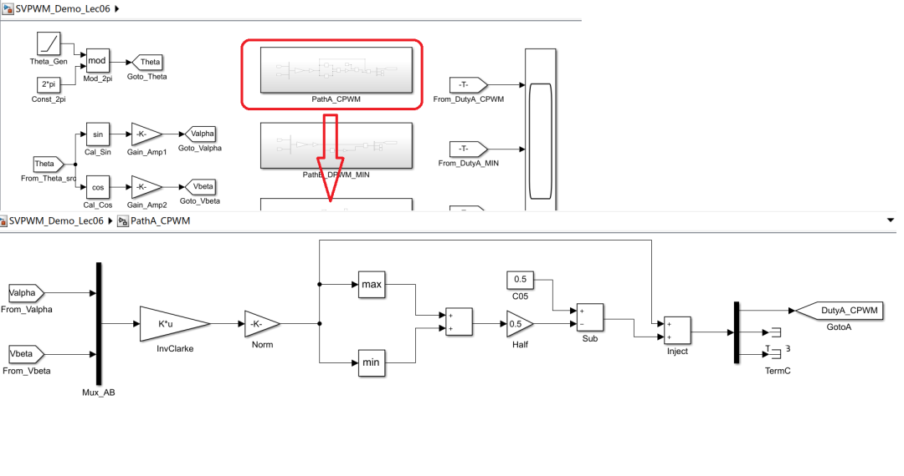

-   **路径B (DPWMMIN)：**注入 e = -u\_min（假设占空比域\[0,1\]）。
    

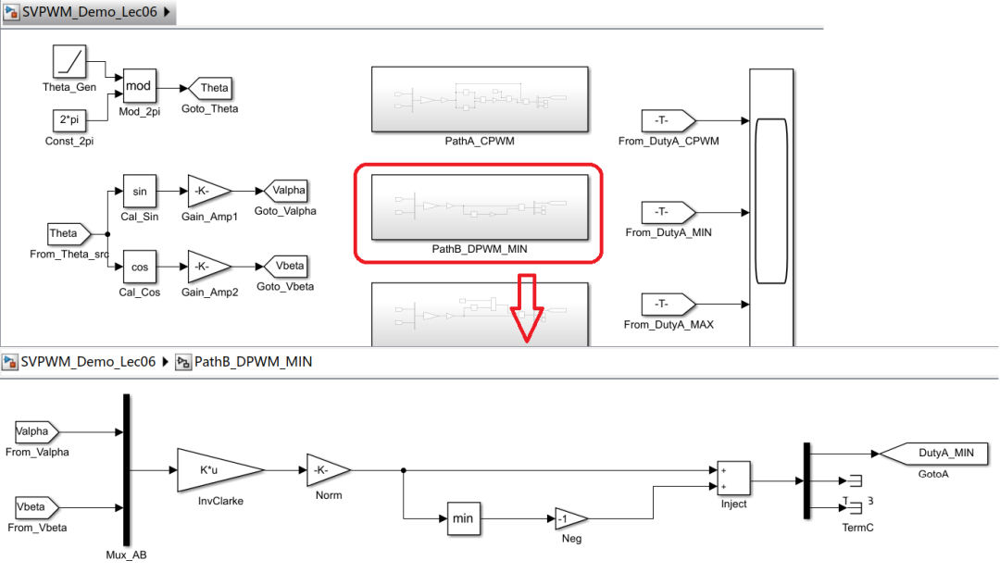

-   **路径C (DPWMMAX)：**注入 e = 1 - u\_max。
    

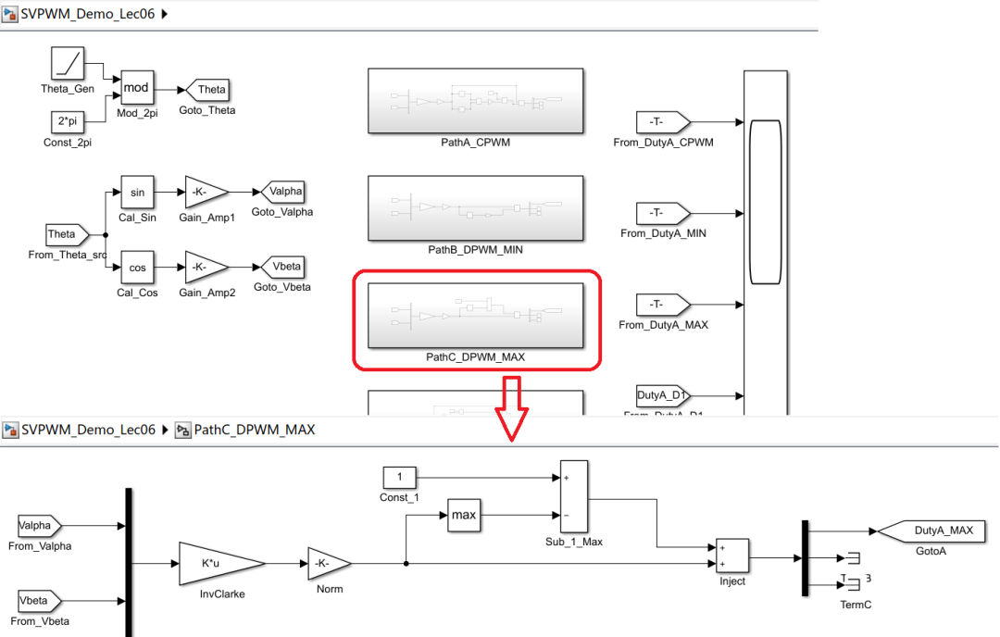

-   **路径D (DPWM1)：为了避免****开关硬切换带来的调制波过零点阶跃**，我们来实施“**加权平均（Soft Switching）**”方案。我们需要一个混合因子 k (0~1)，用来在 uDC\_Max 和 uDC\_Min 之间平滑过渡。
    

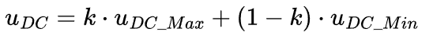

这个 k 怎么来？

它应该取决于 Max + Min 的值。

-   当 Max + Min 明显大于 0 时（正半周峰值），k 应该接近 1（全选 Max）。
    
-   当 Max + Min 明显小于 0 时（负半周峰值），k 应该接近 0（全选 Min）。
    
-   当 Max + Min 接近 0 时（过零点），k 应该在 0.5 附近平滑过渡。
    

其实这就是一个 **Sigmoid 函数** 或者 **饱和线性函数**。

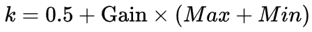

然后把 k 限制在 \[0, 1\] 之间。这个 Gain 决定了过渡区的宽度。Gain 越大，过渡越陡峭（越像硬切换）；Gain 适中，就能实现平滑过渡。

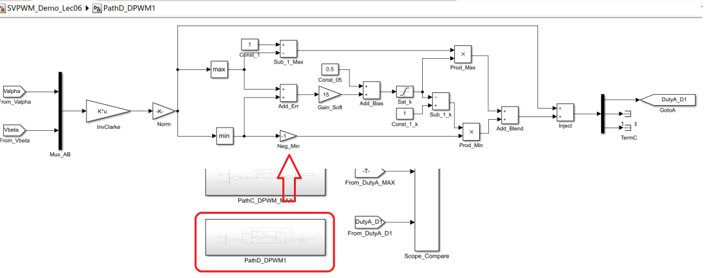

**3\. 观测：**

-   **看三相占空比/门极信号：**清晰地对比四种策略下，哪一相、在何时、被如何钳位。
    

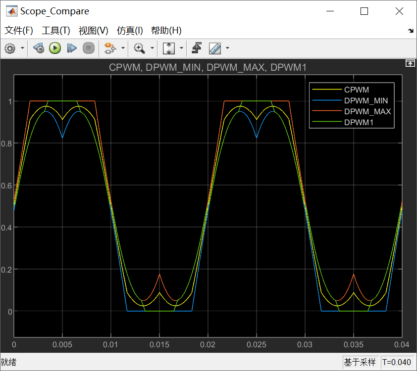

-   **看开关次数：**用计数器验证三种DPWM的开关次数都约等于CPWM的2/3。
    

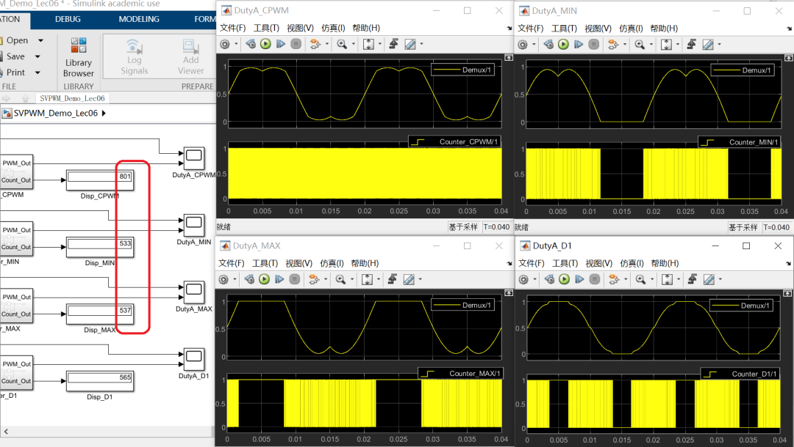

这个实验做完，各位同仁对DPWM的理解，就不再是纸上谈兵了，而是有了直观的体感。

到此为止，我们已经把SVPWM的理论核心和主要的“流派”都过了一遍。从下一讲开始，咱们就要一头扎进 pm.c 这片深水区，开始逐行解剖那段凝聚了无数工程智慧的代码，看看理论是如何在现实的约束下，被“打磨”成最终可量产的样子的。

好，今天就到这里。大家可以想一想，DPWM的这个“钳位”特性，除了降损耗，还能在什么地方派上用场？（提示：想想ADC采样）

  

参考代码：https://github.com/rombrew/phobia/tree/master/src/phobia

参考文献：

\[1\] Zhou K , Wang D .Relationship Between Space-Vector Modulation and Three-Phase Carrier-Based PWM: A Comprehensive Analysis.\[J\].IEEE Transactions on Industrial Electronics, 2002.

文献链接：

https://pan.baidu.com/s/1R6veKtYAG86LhfOXaLKJxw?pwd=rdf7 提取码: rdf7

模型链接：https://pan.baidu.com/s/1qcSJ0klisr6gvAiRvn4goA?pwd=n36z 提取码: n36z