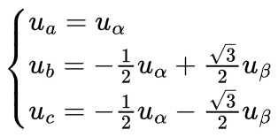
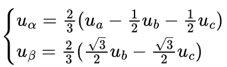
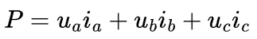
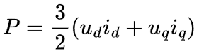
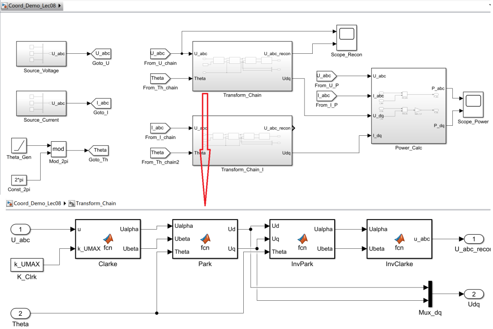
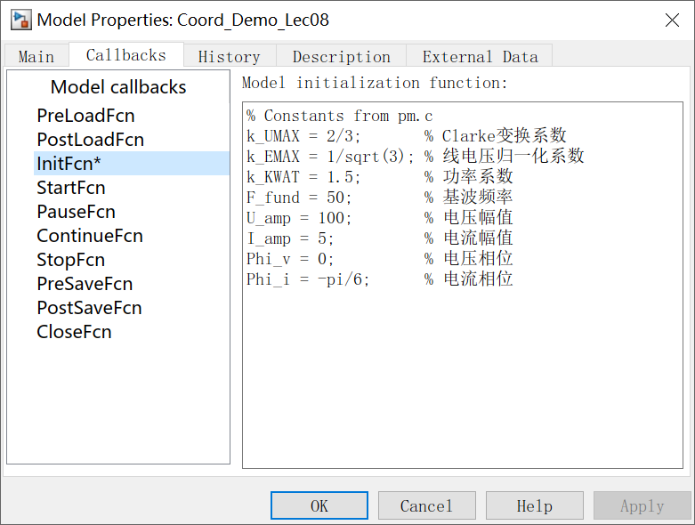
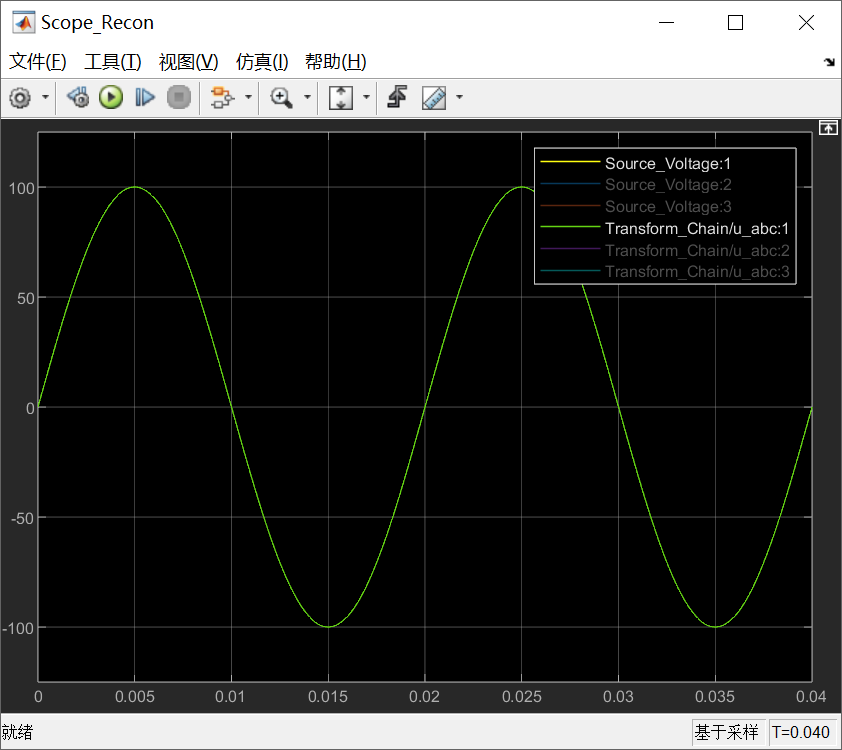
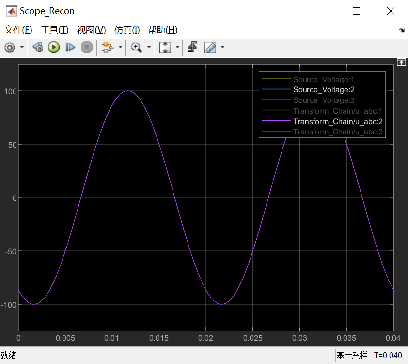
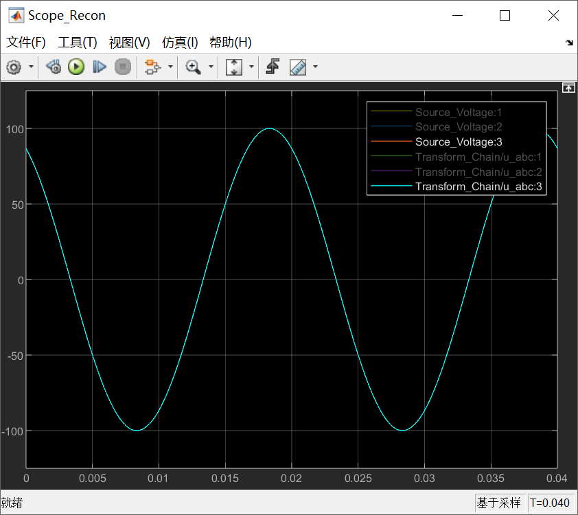
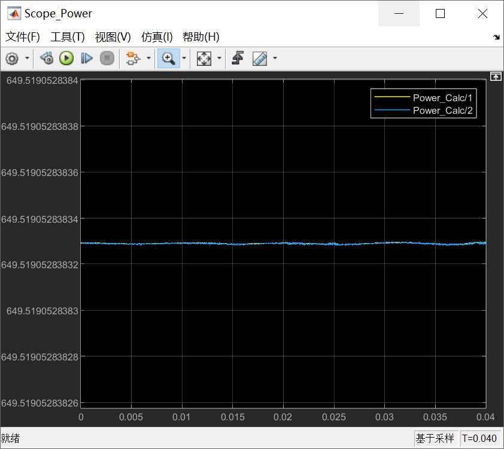

# 《零序注入SVPWM这件小事》｜08讲：常数里的世界观——0.577、1.154、2/3到底在对齐什么

原创 傅存敬 电磁散人 2026-02-10 07:06 广东

> 原文地址: [https://mp.weixin.qq.com/s/7pXrzTjTRtfzzCmi\_9\_cIA](https://mp.weixin.qq.com/s/7pXrzTjTRtfzzCmi_9_cIA)

各位同仁，代码已就位，咱们的“放大镜”也准备好了。从这一讲开始，咱们就正式进入 pm\_voltage() 这条“电压之路”的第一个站点，看看那些看似平平无奇的数字背后，到底藏着怎样的“世界观”。

咱们做工程师的，最怕的就是“魔法数”（Magic Number）。一个来路不明的 0.577，一个不知道从哪冒出来的 1.5，写在代码里，过两个月自己都忘了是干啥的。

今天，咱们就把文末共享代码中的 pm.c 这个文件里，和我们调制模块相关的几个关键“常数”，彻底给它“刨根问底”，搞清楚它们的“户口”和“血缘关系”。

**第一个站点：pm\_quick\_build() —— 参数的“预处理车间”**

在 pm.c 里，有一个叫 pm\_quick\_build() 的函数。这个函数，你可以把它想象成FOC算法启动前的“**参数预处理车间**”。它会把一些用户配置的、原始的参数（比如电感值、母线电压），预先计算成一些在控制循环里可以直接使用的、更高效的“**中间变量**”或者“**倒数**”。这样，在每个PWM周期里，就能省去大量的除法和重复计算。

我们今天的焦点，就在这个函数里定义的几个和SVPWM强相关的常数。

看下 pm\_quick\_build() 函数中的这段代码：

```
if (PM_CONFIG_NOP(pm) == PM_NOP_THREE_PHASE) {
```

（NOP = Number of Phases，代码里是默认的宏定义是3）

咱们来一个个“破案”。

1.  **k\_EMAX = 0.57735027f (即 1/√3****)**
    

这个数字，咱们在[第3讲](https://mp.weixin.qq.com/s?__biz=MzE5MTYzNjgzOA==&mid=2247485372&idx=1&sn=3ee38fce56f546abc23c253d53955520&scene=21#wechat_redirect)已经见过它了。它就是**SVPWM线性调制区的“天花板”——六边形内切圆的半径。**

-   **它的物理意义**：在 Vdc/2 被归一化为1的体系下，一个旋转的电压矢量，它的长度如果超过了 1/√3，那么无论你怎么注入零序，都必然会导致相电压调制波的瞬时值超出 \[-1, +1\] 的范围，从而产生饱和和畸变。
    
-   **它在代码里的作用：**pm\_voltage() 里的**内切圆限幅**就是用它作为基准。
    

```
uDC = m_hypotf(uX, uY); // uDC此时是矢量长度
```

-   所以，k\_EMAX 就是SVPWM线性区的**“守门员”**。
    

2.  **k\_UMAX = 0.66666667f (即 2/3)**
    

这个 2/3 是怎么来的？这就要涉及到 **Clarke变换的“等幅值”版本**了。

我们知道，Clarke变换是把三相 abc 坐标系，变到两相静止 αβ 坐标系。这个变换，有好几个版本，主要是**系数**不一样。

-   **等功率变换：**变换前后功率不变。系数里会有 √(2/3)。
    
-   **等幅值变换：**如果输入的三相正弦波幅值是 A，那么变换后得到的 αβ 矢量，它的旋转半径也是 A。这个版本的逆Clarke变换是：
    



而Clarke变换是：



看到了吗？那个 2/3 出现了！

-   **它的物理意义：**k\_UMAX 代表了在“等幅值”变换的坐标系下，**单位长度**的电压矢量（比如那6个基本有效矢量之一），在 α 轴上的最大投影。在三相系统中，这个值就是 2/3。
    
-   **它在代码里的作用：**这个常数在 pm.c 的调制部分用得不明显，但在其他地方，比**如功率计算、电压补偿、参数辨识**里，它会作为不同坐标系之间转换的**“标尺”**。它定义了整个系统对“电压矢量长度”的度量衡。
    

3.  **k\_KWAT = 1.5f (即 3/2)**
    

这个 3/2 更是FOC里的老朋友了。它来自于**功率计算公式**。

三相瞬时功率是：



在 dq 坐标系下，经过一系列推导，这个公式可以简化为：



看到了吗？3/2 出现了！

-   **它的物理意义**：它是从 abc 三相功率，变换到 dq 两相功率时，必须引入的坐标系变换系数。
    
-   **它在代码里的作用**：在 pm\_wattage() 和 pm\_torque\_equation() 函数中，
    

```
wP = pm->k_KWAT * (pm->lu_iD * pm->lu_uD + pm->lu_iQ * pm->lu_uQ);
```

无论是计算功率 wP，还是计算电磁转矩 mQ，都用到了这个 k\_KWAT。

所以，各位同仁请看，这三个常数，**每一个都不是凭空来的，它们分别代表了：**

-   k\_EMAX (1/√3)：SVPWM**线性区**的几何边界。
    
-   k\_UMAX (2/3)：Clarke变换**坐标系**的度量衡。
    
-   k\_KWAT (3/2)：dq坐标系下**功率/转矩**的计算系数。
    

代码作者把它们在 pm\_quick\_build() 里预先定义好，就相当于在代码的最开始，就明确了整个FOC算法的**“世界观”**：我们用的是哪种Clarke变换，我们的功率怎么算，我们的电压极限在哪里。

这就像一个乐队在演出前，先一起对一下音准，定一下节拍。后面不管你怎么即兴发挥，大家都在同一个调上。

**第二个站点：pm\_voltage() —— 逆Clarke变换的实现**

现在我们再来看 pm\_voltage() 里的逆Clarke变换部分（在 pm\_voltage() 函数中）：

```
uA = uX;
```

0.8660254f 就是 √3/2。

这不就是我们前面写的“等幅值”逆Clarke变换的公式吗？这再次印证了，这个工程选择的是“**等幅值**”这套坐标体系。

同样的，在 pm\_voltage() 函数末尾的“电压重建”部分：

```
pm->vsi_X = uA;
```

0.577... 是 1/√3，1.154... 是 2/√3。

这个看起来有点奇怪的变换，其实是利用了 uA + uB + uC = 0 这个约束，从 uA 和 uB 两相重建 αβ 的一种简化写法，它和我们前面说的 2/3 系数的Clarke变换是等价的。

在一个高质量的FOC工程里，所有的“魔法数”背后，都有一套自洽的、统一的**标幺化和坐标系定义**。搞懂了这些常数，你就拿到了解读这份代码的“**第一把钥匙**”。

除了阅读代码外，还是使用simulink演示能更加清楚一些。

**Simulink 演示**

今天咱们的Simulink实验，就是要来亲手验证这些常数是如何“对齐”的。

**1\. 搭建一个完整的坐标变换链：**abc → Clarke → Park → 逆Park → 逆Clarke → abc'



**2\. 设置系数：**在Clarke和功率计算模块里，严格按照 pm.c 的系数来设置（比如Clarke用 2/3，功率用 3/2）。



**3\. 输入：**给一个三相平衡正弦电流和电压 abc。

**4\. 观测：**

-   对比原始的 abc 和最终重建的 abc'，看它们是否完全重合。如果不重合，说明各位同仁的坐标变换链里，某个环节的系数用错了，“**口音”没对上**。当然，我分享给各位同仁的模型里，肯定是能对上的。
    







-   用 P = ua\*_ia + ub\*_ib + uc\*ic 计算三相瞬时功率，看它是不是一个常数。
    
-   用 P = 1.5 \* (ud\*_id + uq\*_iq) 计算 dq 功率，看它是不是和三相功率相等。
    



这个实验，能让各位同仁对FOC里这些基础但至关重要的坐标变换，有一个非常扎实的体感。

下一讲，咱们就要沿着 pm\_voltage() 的流水线继续往下走，去解剖那两道最关键的“安全门”——**内切圆限幅**和**六边形限幅**。看看代码是如何用最简单的方式，守住物理世界的边界。

好，今天就到这里。

  

参考代码：https://github.com/rombrew/phobia/tree/master/src/phobia

参考文献：

\[1\] Zhou K , Wang D .Relationship Between Space-Vector Modulation and Three-Phase Carrier-Based PWM: A Comprehensive Analysis.\[J\].IEEE Transactions on Industrial Electronics, 2002.

文献链接：

https://pan.baidu.com/s/1R6veKtYAG86LhfOXaLKJxw?pwd=rdf7 提取码: rdf7

模型链接：https://pan.baidu.com/s/1FFD24DAVuXjEr5AXfzOmtQ?pwd=t4ey 提取码: t4ey