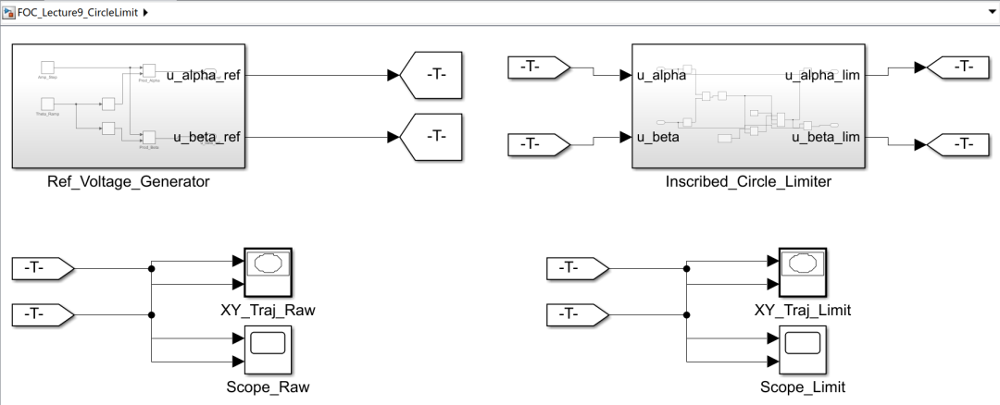
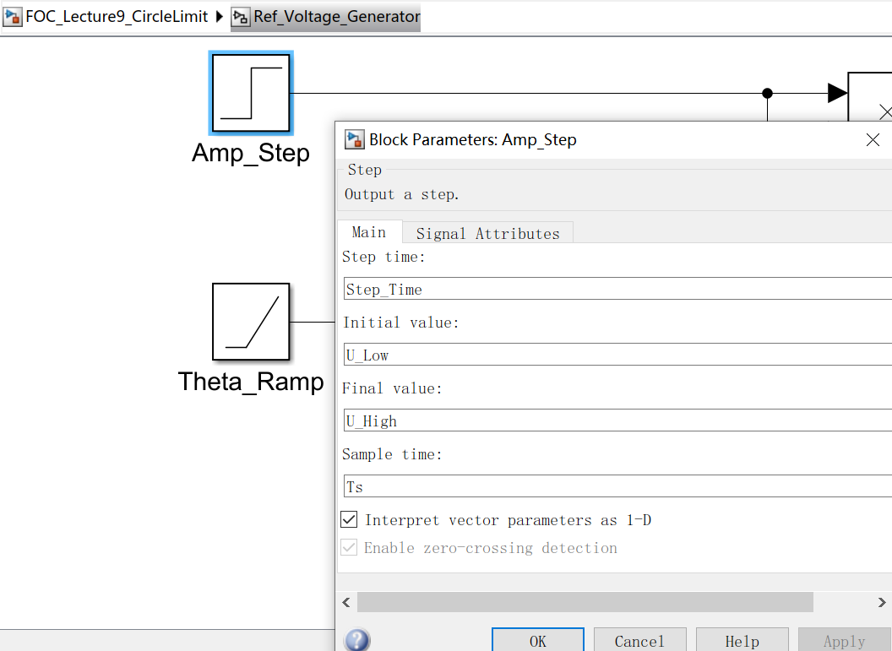
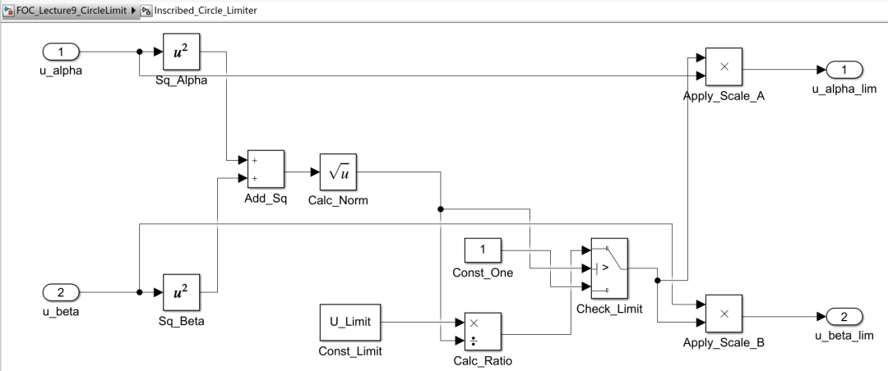
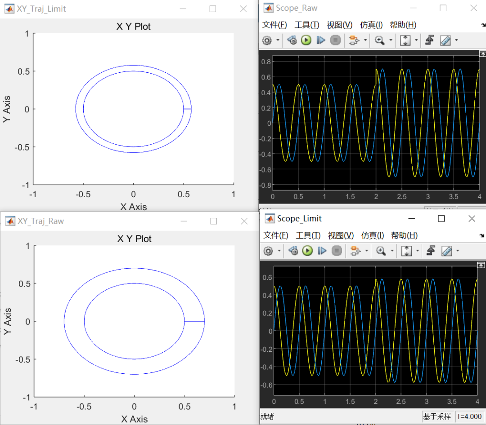

# 《零序注入SVPWM这件小事》｜09讲：先把矢量收进圆里——内切圆限幅的温柔护栏

原创 傅存敬 电磁散人 2026-02-11 07:06 广东

> 原文地址: [https://mp.weixin.qq.com/s/eo17yZeRMR-6HDnH06pPxQ](https://mp.weixin.qq.com/s/eo17yZeRMR-6HDnH06pPxQ)

[上一讲](https://mp.weixin.qq.com/s?__biz=MzE5MTYzNjgzOA==&mid=2247485468&idx=1&sn=a2251088d58ed1dc33104edd867037f8&scene=21#wechat_redirect)，咱们把代码里的那些“魔法常数”都给“验明正身”了，搞清楚了整个系统的“世界观”和“度量衡”。从今天开始，咱们就要正式进入 pm\_voltage() 这条流水线的核心地带，看看一个理想的电压指令，是如何被现实的约束一步步“打磨”的。

咱们要过的第一道关卡，就是**限幅（Limitation）**。

在FOC的电流环里，PI控制器算出来的电压指令 uX, uY (也就是 uα, uβ)，理论上可以是任意大的。比如电机堵转时，电流误差巨大，PI的输出可能就是一个非常大的电压值。

但我们前面几讲已经反复强调了，逆变器不是万能的，它的能力边界就是那个**六边形**。如果我们把一个超出六边形的电压指令直接送去做调制，结果必然是**过调制**，产生严重的谐波，轻则电机抖动、效率降低，重则电流失控、炸毁器件。

所以，任何一个负责任的调制器，在执行指令之前，都必须先做一个“安检”：**这个指令，我们干得了吗？**

pm\_voltage() 这个函数里，就设置了两道“安检门”。今天我们来看第一道，也是更“温柔”的一道：**内切圆限幅。**

**为什么要先限幅到“圆”？**

我们知道，SVPWM的线性区是整个六边形。那为什么不直接限幅到六边形边界，而是先限幅到一个更小的内切圆呢？

这背后是一种非常经典的工程权衡：**性能平滑性 vs 极限电压利用率。**

-   **六边形区域：**虽然整个区域都是线性的，但是当你靠近六边形的“角”和“边”时，电压矢量和相电流的**谐波含量会发生变化**。如果你想在整个工作范围内都保持非常一致的、低谐波的性能，那么最好让你的电压矢量轨迹始终保持为一个**完美的圆形**。
    
-   **内切圆**：它是在六边形内部，我们能画出的**最大的那个完美的圆**。只要你的电压矢量尖尖，始终在这个圆的内部或边界上运动，你就能保证输出的线电压始终是纯净的正弦波，谐波特性非常稳定。
    

所以，很多对性能要求非常高的场合，比如高精度伺服，工程师会选择一种更“保守”的策略：**我宁可牺牲一点点极限电压，也要保证在99%的工作时间里，我的输出都是最干净、最可预测的。**

这就好比开车，虽然高速公路的最左侧车道能开到120km/h，但如果你想开得最稳、最省心，可能会选择在110km/h的车道上巡航。那个内切圆，就是SVPWM的“**巡航车道**”。

**代码如何实现“内切圆限幅”？**

这个“温柔护栏”在文末共享代码的 pm.c 文件里，是由一个配置开关 config\_VSI\_CLAMP 控制的。如果这个开关打开，限幅逻辑就会生效。

```
uX *= pm->quick_iU; // 先归一化到母线电压标幺
```

咱们来逐行解剖这段代码的精妙之处：

-   uDC = m\_hypotf(uX, uY);：用勾股定理算出当前电压矢量 Vref 的**长度（模）**。这个操作，在几何上就是测量矢量尖尖到坐标原点的距离。
    
-   pm->vsi\_DC = uDC / pm->k\_EMAX;：这里的 k\_EMAX 就是我们[上一讲](https://mp.weixin.qq.com/s?__biz=MzE5MTYzNjgzOA==&mid=2247485468&idx=1&sn=a2251088d58ed1dc33104edd867037f8&scene=21#wechat_redirect)说的**内切圆半径 (1/√3)**。所以这一步，是在判断“**我当前的矢量长度，是内切圆半径的几倍？**” 如果结果大于1，就说明“出圈”了。
    
-   if (uDC > pm->k\_EMAX)：这就是“安检门”，检查是否出圈。
    
-   uDC = pm->k\_EMAX / uDC;：如果出圈了，就计算一个**缩放因子**。比如，内切圆半径是0.577，你现在跑到了0.6，那缩放因子就是 0.577 / 0.6，一个略小于1的数。
    
-   uX \*= uDC; uY \*= uDC;：把矢量的 α 和 β 分量，**同时乘以这个缩放因子**。这个操作，在几何上，就是把那个跑出圈的矢量，**沿着它原来的方向，等比例地缩回到圆的边界上。**矢量的**方向不变**，只是**长度变短**了。
    

这套操作，行云流水，非常高效。它用最简单的乘法，就实现了把一个任意点拉回到一个圆上的功能。

这就是“温柔护栏”的含义：它不会粗暴地把你的矢量砍掉，而是**温柔地、保持着你原来的方向，把你引导回安全的“巡航车道”内。**

**Simulink 演示**

这个“拉回”的过程，必须在Simulink里动态地看，才最有感觉。

1.  **信号源**：继续用那个旋转的电压矢量，但这次咱们让它的**幅值跳变**。比如，前2秒幅值是0.5（在圆内），然后突然跳到0.7（在圆外）。
    



  



2.  **限幅模块：**搭建一个和代码逻辑完全一样的“内切圆限幅”模块。
    

-   输入 uα，uβ。
    
-   计算模长 norm = sqrt(u\_alpha^2 + u\_beta^2) 。
    
-   用一个 switch 判断：如果 norm > k\_EMAX，则计算 scale = k\_EMAX / norm，然后输出 u\_alpha \* scale 和 u\_beta \* scale。否则，原样输出。
    



**3\. 观测结果**：



各位同仁请看**左下角 XY\_Traj\_Raw（原始指令）**：两个同心圆。内圈是 0.5（2秒前），外圈是 0.7（2秒后）。这就是咱们本讲文章封面图中说的“试图把车开到路外的夜色里”。指令毫无顾忌地冲到了 0.7 的位置。

再看**左上角 XY\_Traj\_Limit（限幅后）**：圈依然是 0.5（安全区，不做处理）。**关键看外圈**，请注意，这个外圈明显比下面的原始外圈小了一圈。内圈半径 0.5，限幅边界是1/√3≈0.577。在左下图（原始指令）里，外圈（0.7）和内圈（0.5）的间距很大（0.2），在左上图（限幅后）里，外圈（0.577）和内圈（0.5）的间距很小（0.077）。这说明算法成功把那个试图冲到 0.7 的矢量，死死按在了 0.577 的边界上。而且形状依然是**完美的圆形**，没有变成六边形，这就是“内切圆限幅”的特征。

我们再看**右上角 Scope\_Raw（原始指令）**的示波器图形，2秒处，波形幅值陡然增大，峰值达到 0.7。而**右下角 Scope\_Limit（限幅后）**的示波器图形中，2秒处，波形幅值也增大了，但没那么大（被限制在了 0.577 左右），这就是咱们前面提到的“温柔”，它保持了电压的方向（相位）不变，只是缩短了长度，所以输出依然是纯净的正弦波，谐波极低。

以上这个实验，就把内切圆限幅的“**保真**”作用，展现得淋漓尽致。

当然，“温柔”的代价就是“保守”。如果我们确实需要更大的电压，比如在弱磁区或者需要爆发力的时候，总是在内切圆里打转就不够了。那时候，我们就需要冲出“巡航车道”，去挑战更极限的边界——**六边形。**

这就是我们下一讲要聊的：pm\_voltage() 里的第二道，也是更“刚硬”的安检门——**六边形贴边限幅**。

好，今天就到这里。大家可以思考一下，在各位同仁的FOC算法里，电流环PI的输出，有没有做过类似的限幅处理？如果没有，那它在某些工况下，可能正在“开着夜车往前冲”。

  

参考代码：https://github.com/rombrew/phobia/tree/master/src/phobia

参考文献：

\[1\] Zhou K , Wang D .Relationship Between Space-Vector Modulation and Three-Phase Carrier-Based PWM: A Comprehensive Analysis.\[J\].IEEE Transactions on Industrial Electronics, 2002.

文献链接：

https://pan.baidu.com/s/1R6veKtYAG86LhfOXaLKJxw?pwd=rdf7 提取码: rdf7

模型链接：https://pan.baidu.com/s/1w7l6tWXoCHdFLwrcVoO2hw?pwd=h3jq 提取码: h3jq