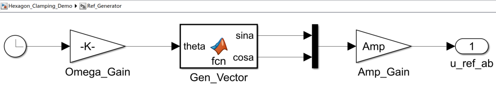
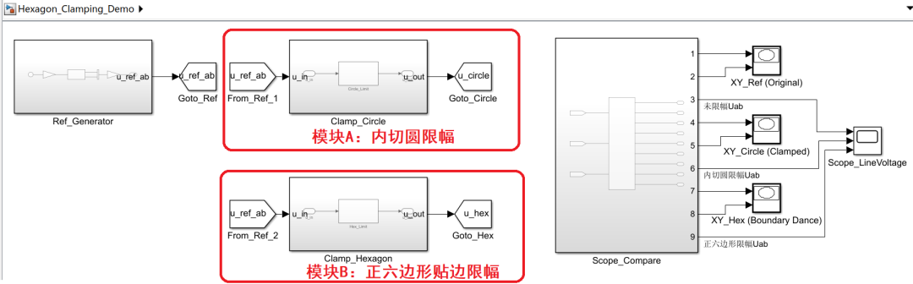
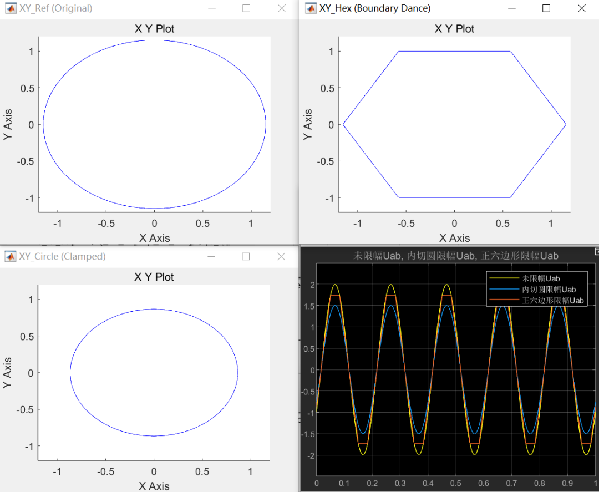

# 《零序注入SVPWM这件小事》｜10讲：把电压用到极致——六边形贴边限幅的边界之舞

原创 傅存敬 电磁散人 2026-02-12 07:06 广东

> 原文地址: [https://mp.weixin.qq.com/s/14ERJRaGsQB4T8RSIou3ZQ](https://mp.weixin.qq.com/s/14ERJRaGsQB4T8RSIou3ZQ)

各位同仁，[上一讲](https://mp.weixin.qq.com/s?__biz=MzE5MTYzNjgzOA==&mid=2247485477&idx=1&sn=e4d55088200fca0acb67a5f1198d2cd7&scene=21#wechat_redirect)，咱们聊了 pm\_voltage() 里的第一道“安检门”——内切圆限幅。它像个温柔的护栏，保证我们的电压矢量始终在“安全巡航区”内，输出最干净的波形。

但做工程的都明白，有时候，“稳”是不够的，我们还需要“猛”。当电机需要最大的转矩，或者在高速下需要抵抗更强的反电动势时，每一伏的母线电压都弥足珍贵。这时候，再守着内切圆那点“家底”，就有点太保守了。

我们必须冲出内切圆，去探索逆变器能力的真正极限——那个由六个基本矢量构成的**正六边形**。

今天，咱们就来解剖 pm\_voltage() 里的第二道，也是最后一道、最“刚硬”的安检门：**六边形贴边限幅**。

**为什么是“六边形”，而不是更大的什么形状？**

咱们再回顾一下那个[最根本的物理约束](https://mp.weixin.qq.com/s?__biz=MzE5MTYzNjgzOA==&mid=2247485306&idx=1&sn=bf7ba061acfec735abe64e7545c31d6b&scene=21#wechat_redirect)。除了“相电压不能过±1”之外，还有一个更隐蔽的约束，来自于**线电压**。

A相和B相的电压差 uA - uB，它的物理实体，是A相桥臂输出点和B相桥臂输出点之间的电压。这个电压，最大能有多大？

-   极端情况1：A相上管开（+Vdc/2），B相下管开（\-Vdc/2）。电压差是 Vdc。
    
-   极端情况2：A相下管开（\-Vdc/2），B相上管开（+Vdc/2）。电压差是 \-Vdc。
    

所以，任何两相之间的**平均电压差**，它的绝对值，都不可能超过直流母线电压 Vdc。

如果我们把 Vdc 归一化为2（因为相电压是从-1到1），那么任何两相调制波的差值，比如 ma - mb，它的范围必须在 \[-2, +2\] 之间。

如果用占空比域 \[0, 1\] 来描述，那么任何两相占空比的差值，比如 da - db，它的范围必须在 \[-1, +1\] 之间。

这个约束，[在空间矢量图上](https://mp.weixin.qq.com/s?__biz=MzE5MTYzNjgzOA==&mid=2247485306&idx=1&sn=bf7ba061acfec735abe64e7545c31d6b&scene=21#wechat_redirect)，就定义了那个**正六边形**的六条边。每一条边，都对应着一个“两相电压差达到极限”的边界。

所以，六边形就是逆变器能力的**最终物理边界**。任何超出了六边形的电压指令，都是“**物理上不可实现的**”。你给再高的指令，它也只能在六边形的边界上“尽力而为”。

**代码如何实现“六边形贴边限幅”？**

在文末共享的代码的 pm.c 文件里的实现方法，堪称经典，非常巧妙。它没有去用复杂的几何公式判断点和六边形的位置关系，而是回到了最本质的约束上。

我们仔细看下 pm\_voltage() 函数中的这几行代码：

```
// ... 经过了内切圆限幅（可选）和逆Clarke变换
```

注意：代码里的 1.f 是因为代码的标幺体系是基于占空比域\[0,1\]，最大差值是1。

咱们来逐行“品味”这段代码的智慧：

1.  uDC = uMAX - uMIN;：它计算了当前三相理想电压的**最大峰峰值**。这个值，直接反映了我们想要合成的**线电压的最大瞬时值**。
    
2.  if (uDC > 1.f)：这就是在检查，你想要的线电压，是不是已经超过了母线电压的极限？
    
3.  uDC = 1.f / uDC;：如果超了，就计算一个**压缩因子**。比如，你想要1.1的峰峰值，但极限只有1，那压缩因子就是 1 / 1.1，一个小于1的数。
    
4.  uA \*= uDC; uB \*= uDC; uC \*= uDC;：把三相电压，**同时乘以这个压缩因子**。
    

这个操作，在几何上，相当于什么？

它不是像内切圆限幅那样，把矢量往原点拉。它是把整个**电压矢量**，在保持方向不变的前提下，**等比例地缩小，**使得它的尖尖，正好落在六边形的边界上！

这个方法太聪明了。它根本不需要知道矢量在哪条边上超了，也不需要知道六边形每条边的方程。它只抓住了最核心的物理本质：**线电压不能超限。**只要把超限的线电压等比例压缩回边界内，所有问题就都解决了。

这就是**“在城墙边跳舞”**。当你的指令已经冲到了墙外，这段代码会把你稳稳地拉回到墙边，让你紧贴着墙壁，继续你的舞步。你的舞姿（矢量方向）没变，只是离墙的距离变成了零。

**“温柔护栏”与“刚硬城墙”的配合**

现在我们把两道“安检门”连起来看：

1.  **第一道（内切圆，可选）**：追求性能平滑，提前把你限制在“巡航车道”内。
    
2.  **第二道（六边形，强制）**：这是物理底线。不管你前面有没有被限幅，只要你最终的指令触碰到了物理极限，它必须把你拦下来。
    

这种设计，既给了用户选择“稳妥”路线的自由（开启config\_VSI\_CLAMP），又保证了在任何情况下，系统都不会输出物理上不可实现的指令，保证了算法的**鲁棒性**。

**Simulink 演示**

这个“贴边”的过程，动态地看，非常有冲击力。感兴趣的同仁可以把模型下载到自己的电脑上自行体会。

1.  **信号源**：继续用那个旋转矢量，幅值从0一路扫到0.8（远超六边形边界）。
    



2.  **两套限幅逻辑**：
    

-   **模块A（内切圆限幅）**：我们[上一讲](https://mp.weixin.qq.com/s?__biz=MzE5MTYzNjgzOA==&mid=2247485477&idx=1&sn=e4d55088200fca0acb67a5f1198d2cd7&scene=21#wechat_redirect)搭的那个。
    
-   **模块B（六边形贴边限幅）**：严格按照 pm.c 的逻辑，计算 uMAX-uMIN，然后进行缩放。
    



3.  **观测：**
    

**αβ轨迹图**：用XY Graph同时画出三条轨迹：原始指令、内切圆限幅后、六边形限幅后，会看到：



**左下角（内切圆限幅）**：轨迹是一个完美的圆形，半径较小（＜1）。这是最保守的策略，为了保全波形质量，它主动放弃了角落里的电压空间。

**右上角（六边形限幅）**：轨迹变成了一个**标准的正六边形**。各位同仁注意看：它的六个顶点明显比左下角的圆更靠外（贴着最大值1）这说明我们成功“解锁”了逆变器在六个角落的输出能力。这就好比原本只能在操场内圈跑（内切圆），现在允许跑到最外圈的围墙边（六边形）了。

请看右下角的 Scope，不同策略的三条线电压Uab的层次关系非常清晰：

-   **黄色（未限幅的线电压指令，最高）**：这是指令值，幅度约 2.0。它是“理想”，但现实无法企及。
    
-   **蓝色（内切圆限幅，中间）：**这是传统的 SVPWM 线性区极限。它的峰值约 1.5。
    
-   **橙色（六边形限幅，最特殊）**：
    

-   **幅值更高**：它的平顶高度约为 1.732（即 √3），明显高于蓝色的 1.5。**这高出的 15% 就是我们本讲“压榨”出来的性能。**
    
-   **平顶波形**：波峰被削平了。
    

各位同仁请看，为了获得这额外的电压，我们不得不让波形“失真”（削顶）。这就是工程中的权衡：用一点谐波换取了更大的基波幅值和转矩输出。

这个实验，让我们亲眼看到了一个理想的圆形指令，是如何被现实的“城墙”一步步塑造成最终形状的。

到目前为止，我们已经把 pm\_voltage() 的“指令预处理”和“限幅”这两个站点彻底走完了。下一讲，我们就要进入最核心的“调制站”，去看看那三个性格迥异的零序注入策略 CENTER, GND, EXTREME，在代码里到底是如何影响最终占空比的。

好，今天就到这里。大家可以思考一下，在实际项目中，是应该默认开启内切圆限幅，还是把它关掉，去追求更高的电压利用率？这背后的决策依据又是什么？

  

参考代码：https://github.com/rombrew/phobia/tree/master/src/phobia

参考文献：

\[1\] Zhou K , Wang D .Relationship Between Space-Vector Modulation and Three-Phase Carrier-Based PWM: A Comprehensive Analysis.\[J\].IEEE Transactions on Industrial Electronics, 2002.

文献链接：

https://pan.baidu.com/s/1R6veKtYAG86LhfOXaLKJxw?pwd=rdf7 提取码: rdf7

模型链接：

https://pan.baidu.com/s/1Pdzhk4riBW6Edwgku5UHRg?pwd=6rhm 提取码: 6rhm