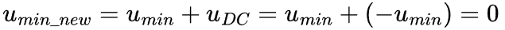
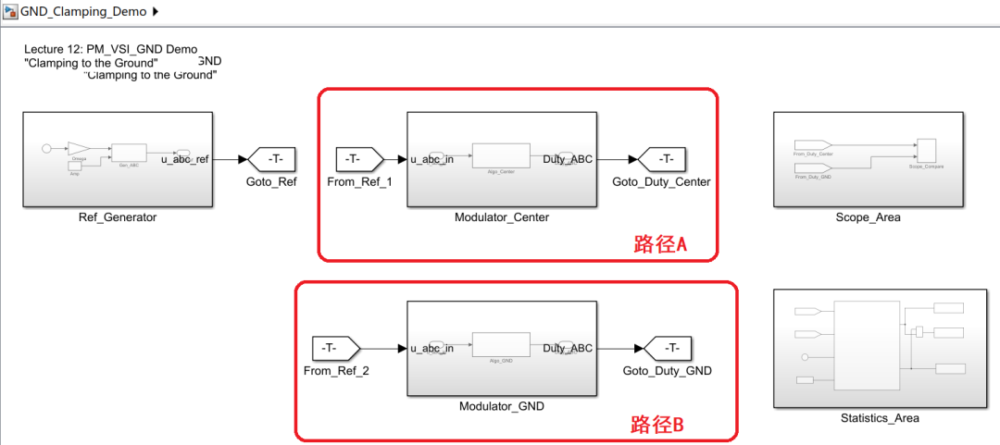
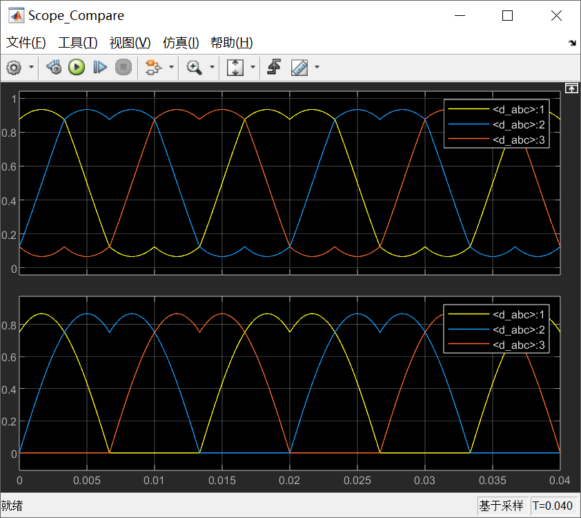
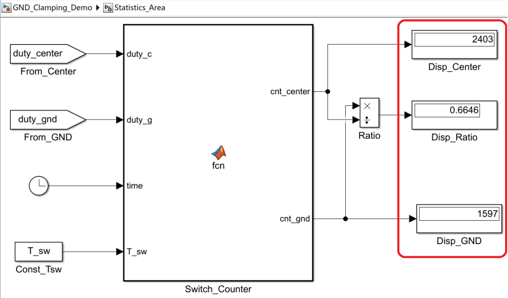

# 《零序注入SVPWM这件小事》｜12讲：偏到地的一边——PM\_VSI\_GND的单侧倾向与工程后果

原创 傅存敬 电磁散人 2026-02-16 07:06 广东

> 原文地址: [https://mp.weixin.qq.com/s/RkfkJVomfhRXzyXQJUjiww](https://mp.weixin.qq.com/s/RkfkJVomfhRXzyXQJUjiww)

各位同仁，[上一讲](https://mp.weixin.qq.com/s?__biz=MzE5MTYzNjgzOA==&mid=2247485494&idx=1&sn=6cd9cf191975f530ed9308ab065d637a&scene=21#wechat_redirect)，咱们把 PM\_VSI\_CENTER 这个“主线剧情”给研究透了，知道它通过“居中”注入，实现了对两个零矢量 V0 和 V7 的平衡使用，从而得到了最对称、谐波最优的连续PWM（CPWM）。

但是，pm.c 的作者还给我们留了另外两个选项：GND 和 EXTREME。这说明，在某些特定的场景下，我们可能不想要那么“平衡”，我们想要一点**“偏见”**。

今天，咱们就来探索第一个“偏见”策略——PM\_VSI\_GND。

* * *

PM\_VSI\_GND**在做什么？**

老规矩，咱们先看代码。这个策略的实现，比 CENTER 还要简单粗暴。

在 pm\_voltage() 函数中：

```
if (pm->config_VSI_ZERO == PM_VSI_GND) {
```

这里的 uMIN 是三相理想电压参考值 uA\*, uB\*, uC\* 中最小的那个。

首先：uDC = -uMIN 。然后，这个 uDC 会被加到三相上。我们来看看，当 uMIN 所在的这一相，加上这个 uDC 之后，会发生什么：



看到了吗？这个策略的目的，就是把三相电压中**最低的那一相，直接拉到 0！**

既然最低的一相都被拉到了0，那其他两相（uA\* 和 uB\*，假设 uC\* 是 uMIN）肯定都在0以上。也就是说，最终的三相占空比 uA, uB, uC，它们的值**永远大于等于0**。

这个操作，在几何上，相当于把我们[第2讲说的那个电梯里“三根棍子”的组合](https://mp.weixin.qq.com/s?__biz=MzE5MTYzNjgzOA==&mid=2247485356&idx=1&sn=d3939720b84ae4d6799cf20a16022201&scene=21#wechat_redirect)，整体向上平移，直到**最矮的那根棍子，正好踩在“地板”上**。

* * *

**“单侧倾向”的物理后果**

这种“永远踩着地板走”的策略，会带来一个非常显著的物理后果：**它会极大地偏爱使用某一个零矢量。**

咱们来分析一下。

-   最终的三相占空比，都被抬升到了 \[0, 1\] 区间内，而且总有一个是0。
    
-   这意味着，三相桥臂的输出，总有一相的下管是**常开**的（或者说，占空比为0的这一相）。
    
-   当我们需要使用零矢量的时候，为了配合那一相“躺平”的下管，系统最自然的选择，就是让其他两相的下管也打开。
    

什么状态是三相下管都打开？

**就是**V0(0,0,0)！

所以，PM\_VSI\_GND 这个策略，它的本质，就是**强制让系统在绝大多数时间里，只使用**V0**这一个零矢量。**它把我们[第5讲说的“零矢量的分配权”这个自由度](https://mp.weixin.qq.com/s?__biz=MzE5MTYzNjgzOA==&mid=2247485406&idx=1&sn=e6dc3f8c27ddbbc8d6e339ecf3c7600d&scene=21#wechat_redirect)，给**完全锁死了**。它告诉系统：“别想着用 V7 了，忘了它吧，以后咱们家就姓 V0 了。”

这种只使用一种零矢量的调制方式，就是一种典型的**不连续PWM（DPWM）**。

因为它总有一相是被钳位在“地”上（占空比为0），所以，这一相的开关动作就大大减少了。和 CENTER 策略相比，它的**总开关损耗，理论上也会降低约1/3**。

* * *

**为什么叫“偏航”？—— 工程后果分析**

既然能降损耗，那 GND 策略是不是就一定比 CENTER 好呢？

不一定。这就是我们本讲封面页宣传语里说的**“偏航”**。它虽然省了油（开关损耗），但也带来了一些新的问题：

1.  **电流纹波增大**：CENTER 策略（CPWM）由于其完美的对称性，产生的谐波是最低的。而 GND 策略打破了这种对称，它引入了更多的谐波分量，特别是低频谐波，这会导致**电流纹波明显增大**。在对电流平滑度要求高的应用里，这是不可接受的。
    
2.  **热量分布不均**：CENTER 策略让三相桥臂的上下管轮流工作，发热比较均匀。而 GND 策略，由于大量使用 V0，并且总有一相被钳位在下管，这会导致**下管的导通损耗和开关损耗，远大于上管**。如果各位同仁的散热设计没有考虑到这种不均衡，可能会导致下管过热。
    
3.  **直流母线电压纹波**：不同的PWM策略，从直流母线取用电流的波形也不同。DPWM通常会比CPWM在母线上产生更大的电流纹波，对母线电容的压力更大。
    
4.  **噪声**：开关模式的改变，会直接影响电机的电磁噪声。GND 策略产生的噪声频谱，和 CENTER 策略完全不同，可能会在某些转速下，产生更刺耳的“啸叫声”。
    

所以，PM\_VSI\_GND 是一种**个性非常鲜明**的策略。它像个偏科生，为了把“降低损耗”这一科考到满分，牺牲了其他科目的成绩。

**什么时候会用它？**

-   在一些对成本极其敏感，或者散热空间极其有限的大功率应用中，降低开关损耗是第一要务。
    
-   在[某些特定的采样策略下](https://mp.weixin.qq.com/s?__biz=MzE5MTYzNjgzOA==&mid=2247484990&idx=1&sn=b8e48d0f82df7398a4a9bd0ac876bce0&scene=21#wechat_redirect)，需要强制在PWM周期的某个固定位置（比如起始点）有一个稳定的零电平窗口。
    

* * *

**Simulink 演示**

咱们来用Simulink，亲眼看看这艘“偏航”的船，航线到底有多“偏”。

1.  **信号源**：继续用旋转矢量。
    
2.  **两条并行路径：**
    

-   **路径A (CENTER)**：我们熟悉的min-max居中注入。
    
-   **路径B (GND)**：注入零序 e = -u\_min（占空比域\[0,1\]）。
    



**3\. 观测：**



我们首先在视觉直观上感受一下，什么是“偏航”：

同仁们，请对比上下两幅图。它们的**线电压**输出能力其实是一模一样的（都能驱动电机转得一样快）。但是，看**相电压**（占空比）的轨迹：

-   上面那个（Center），像是在空中走钢丝，小心翼翼地保持在中间，不去碰地板也不碰天花板。
    
-   下面那个（GND），就是“偏航”了。它彻底放弃了中间路线，**只要有机会，就贴着地板（0电位）走。**
    

再重述一下这种调制方式的工程意义（为什么要贴地）：

注意看下图里的那些**水平直线段**（这里原本应该是波谷出现的地方）。在这段时间里，占空比是 0。这意味着什么？意味着这一相的下桥臂开关是**常开**的，上桥臂是**常关**的。此时**根本没有开关动作！**既然没有动作，就没有开关损耗。每一相都有 1/3 的时间在“休息”。所以，GND 策略能帮我们**节省 1/3 的开关损耗**。这就是它的核心价值。”



**代价是什么？**

天下没有免费的午餐。各位同仁看Scope\_Compare中的上图（Center），波形是对称的、平滑的。而下图（GND），波形被强行拉扯到了底部，变得不对称了。这种‘畸变’虽然不影响基波电压，但会带来**更大的谐波分量**。所以，GND 策略虽然省电（降损耗），但会让电机‘更吵’（纹波大）。这就是我们做工程时必须面对的权衡。

具体的谐波（或THD）演示，请参考咱们[第5讲](https://mp.weixin.qq.com/s?__biz=MzE5MTYzNjgzOA==&mid=2247485406&idx=1&sn=e6dc3f8c27ddbbc8d6e339ecf3c7600d&scene=21#wechat_redirect)中的模型。

以上这个实验，就把 **PM\_VSI\_GND** 的“性格”——**牺牲纹波换损耗**——给刻画得入木三分。

理解了 GND 这个“极端偏科生”，我们下一讲就要去认识那个更“聪明”、更“滑头”的策略——PM\_VSI\_EXTREME。它试图在“损耗”和“性能”之间，找到一个更动态、更工程化的平衡点。

好，今天就到这里。大家可以思考一下，如果有一个策略叫 PM\_VSI\_TOP，你觉得它的公式应该是什么？它又会有什么样的工程后果？

  

参考代码：https://github.com/rombrew/phobia/tree/master/src/phobia

参考文献：

\[1\] Zhou K , Wang D .Relationship Between Space-Vector Modulation and Three-Phase Carrier-Based PWM: A Comprehensive Analysis.\[J\].IEEE Transactions on Industrial Electronics, 2002.

文献链接：

https://pan.baidu.com/s/1R6veKtYAG86LhfOXaLKJxw?pwd=rdf7 提取码: rdf7

模型链接：https://pan.baidu.com/s/12OWpaFub73ox5YZj5tFqgQ?pwd=w6jm 提取码: w6jm