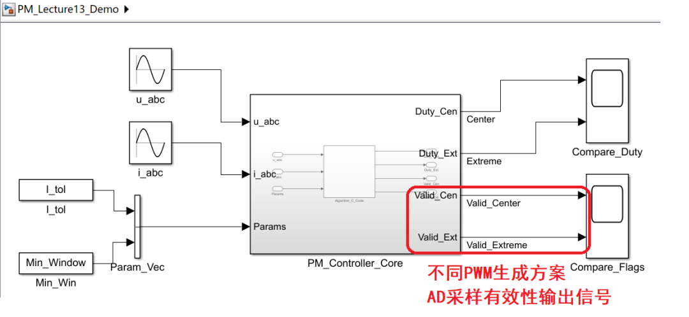
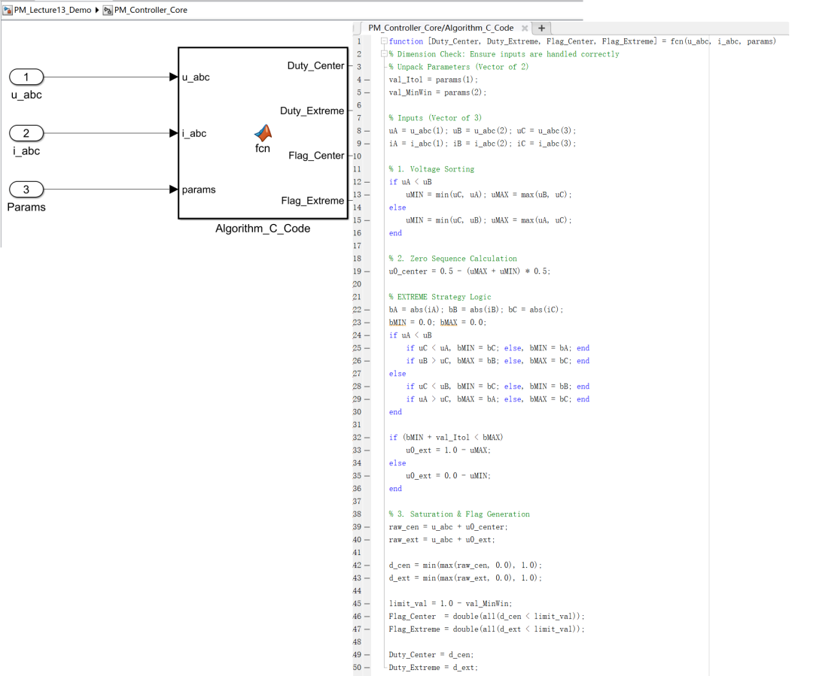
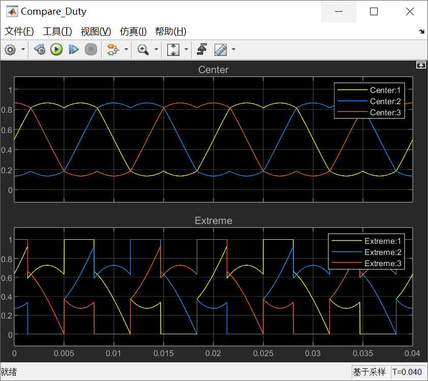
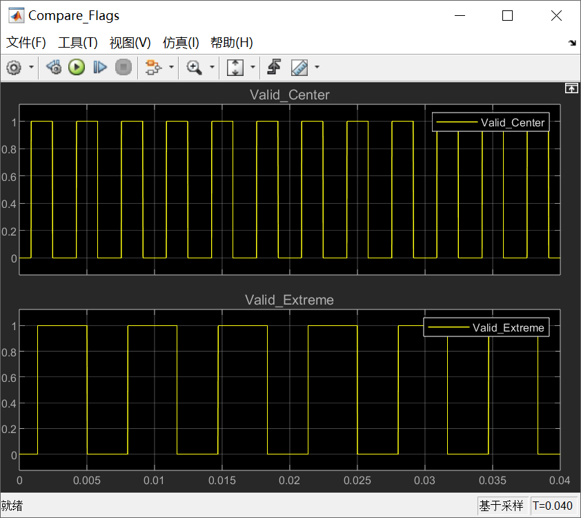
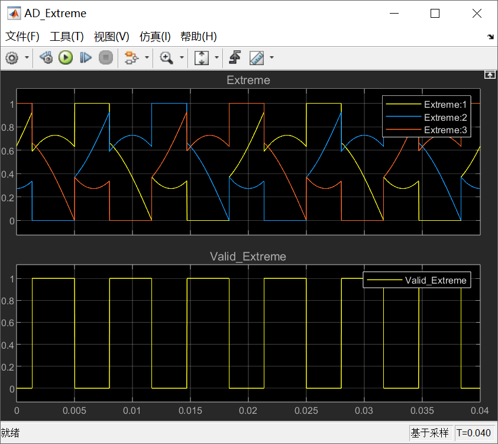

# 《零序注入SVPWM这件小事》｜13讲：极值注入的工程味——PM\_VSI\_EXTREME与“为测量让路”

原创 傅存敬 电磁散人 2026-02-17 07:06 广东

> 原文地址: [https://mp.weixin.qq.com/s/u2\_yTGeV0TZfZa-\_ERcqDg](https://mp.weixin.qq.com/s/u2_yTGeV0TZfZa-_ERcqDg)

各位同仁，前面两讲，咱们认识了 pm\_voltage() 里的两个零序策略：

-   CENTER：品学兼优的“三好学生”，对称、平衡，谐波最低。
    
-   GND：目标明确的“偏科生”，为了降损耗，牺牲了纹波，死磕 V0。
    

今天，咱们要来认识那个最“社会”、最“老练”的策略——PM\_VSI\_EXTREME。

为什么说它“社会”？因为它做决策的依据，不再是纯粹的电压几何关系，它把**电流**这个变量也拉了进来。它不再满足于做一个固定的“好学生”或“偏科生”，它想做一个**能根据现场情况，随时切换策略的“机会主义者”。**

* * *

PM\_VSI\_EXTREME**在做什么？**

咱们直接上 pm\_voltage() 函数中的相关代码，以下这段代码，信息量巨大。

```
else if (pm->config_VSI_ZERO == PM_VSI_EXTREME) {
```

咱们来一步步解剖这个“机会主义者”的思考过程：

1.  **它先看了看“天气”**：它不仅关心三相电压 uA, uB, uC 的大小，还去看了看三相电流的绝对值 bA, bB, bC。这是前两个策略都没做过的事情。
    
2.  **它做了个“沙盘推演”**：它根据电压的大小关系，预判出“如果我钳上管，会影响哪一相？”（uMAX对应的那一相），“如果我钳下管，又会影响哪一相？”（uMIN对应的那一相）。然后它去查这两相对应的电流大小 bMAX 和 bMIN。
    
3.  **它做出了“投机”决策**：uDC = (bMIN + bA < bMAX) ? 1.f - uMAX : 0.f - uMIN;
    

这个策略的核心，是在两个我们非常熟悉的“极端”策略之间做选择：

-   1.f - uMAX：这是什么？这就是 **DPWMMAX** 的零序注入！把最高的那相顶到天花板 1.f。
    
-   0.f - uMIN：这又是什么？这就是 DPWMMIN 的零序注入！（和我们上一讲的 GND 策略一样）。
    

它选择的依据 (bMIN + bA < bMAX) 看起来有点复杂，但它的本质思想，是和**最小化电流纹波**以及**[最大化采样窗口](https://mp.weixin.qq.com/s?__biz=MzE5MTYzNjgzOA==&mid=2247485037&idx=1&sn=34ad9c107aae358b358629b54af0ab22&scene=21#wechat_redirect)**有关的。

**所以，**PM\_VSI\_EXTREME**的本质，就是一个在 DPWMMAX 和 DPWMMIN 之间动态切换的、自适应的DPWM策略。**

它不再像 **GND** 模式那样死磕 V0，也不像 DPWMMAX 那样只认 V7。它会根据当前的电压和电流状况，判断“这一拍，是钳上管带来的好处多，还是钳下管带来的好处多？”

* * *

**“为测量让路”的工程智慧**

这个策略，为什么说它充满了“工程味”？因为它是在为一个非常实际、非常头疼的问题服务——**电流采样**。

我们知道，[电机控制器的电流采样方案有很多种](https://mp.weixin.qq.com/s?__biz=MzE5MTYzNjgzOA==&mid=2247483801&idx=1&sn=54c633fa1c3b60f6a1fa4978b7423636&scene=21#wechat_redirect)，在很多低成本的驱动器方案里，为了省钱，只在两相或三相的下桥臂串联一个采样电阻。这意味着：**只有当对应相的下管导通时，我们才能采到该相的电流。**

-   **CPWM（CENTER策略）**：脉冲在周期中间，存在很窄的情况。当占空比很大时，下管导通时间非常短，ADC可能来不及采样。
    
-   **DPWM**：DPWM通过钳位，可以人为地制造出很长的“下管导通”或“上管导通”时间。
    

PM\_VSI\_EXTREME 的逻辑是：

-   它会评估，如果我用DPWMMAX（钳上管），那么下管的导通时间分布是怎样的？能不能让我采到电流？
    
-   如果我用DPWMMIN（钳下管），下管的导通时间分布又是怎样的？
    
-   然后，它会**选择那个能提供更长、更稳定采样窗口**的策略。
    

这就是我们本讲文章封面宣传语的意义：“有时我们不是在追求最圆的波形，而是在黑暗里借一束月光——让采样看清那一瞬。”

PM\_VSI\_EXTREME 就是那个懂得“借月光”的聪明人。它知道，在闭环控制里，一个**稍微有点畸变但测量准确的信号**，远比一个**波形完美但测量错误或无法测量的信号**，要**有价值**得多。

为了得到一个“可信”的测量值，它不惜牺牲一点点的波形“完美度”，让调制策略为测量服务。这种“**以测量为中心**”的设计思想，是从业余爱好者的代码，到工业级量产代码最关键的思维跃迁之一。

* * *

**Simulink 演示**

1. 搭建一个带采样窗口约束的模型：



2.  两条并行路径：
    

-   路径A (CENTER)：CPWM 模式。
    
-   路径B (一个简化的EXTREME)：比如，当A相电流需要采样，而CPWM提供的窗口不够时，就强制切换到钳A相下管的DPWM模式。
    



3.  仿真并观测：
    

看下不同路径（PWM生成策略）的调制波波形：



上面 Center 模式生成的PWM调制波是三条连续的马鞍波；而下面的 Extreme 模式生成的PWM调制波，

它有明显的“趴地”（Clamped to 0）和“顶天”（Clamped to 1）的特征。这正是 PM\_VSI\_EXTREME 策略的签名动作——为了某种目的（减少开关损耗或优化采样），强制把某一相的开关动作“冻结”在通过或关断状态。

我们再来看一看Scope\_Flags (采样有效性)：



解释一下信号含义：

-   **高电平 (1) —— “采样有效 / 有窗口”**
    
    **此时，三相 PWM 的占空比都没有“顶满”。每一相的下管导通时间都大于了我们设定的最小窗口（Min\_Window，比如 15us）。ADC 有足够的时间稳定信号并完成转换。FOC 算法读到的电流是真实可信的。**
    
-   **低电平 (0) —— “采样无效 / 窗口太窄”**
    
    **此时，至少有一相（或两相）的 PWM 占空比太高了（比如 > 85%）。导致对应的下管导通时间极短**（比如 < 2us）。ADC 根本来不及反应，采到的要么是噪声，要么是错误的瞬态值。算法代码中如果强行用这个值，电流环会震荡。通常算法会在这时**放弃采样**，沿用上一拍的旧值，或者通过复杂的移相来硬凑窗口。
    

图形分析：

-   scope的上图中的 Valid\_Center :
    
    它像方波一样，高电平之间有很宽的 0 (采样无效区）。原因是 CPWM（Center 策略）为了波形圆滑，三相占空比往往都比较高（比如都接近 90%）。这就导致大部分时间下管都在“休息”，根本没空给 ADC 采样。所以咱们会看到大片的“无效区”。
    
    这就是为什么前文中说 Center 模式是“三好学生”，波形是好看，但在下桥臂电阻采样这种“穷日子”里，它根本活不下去。
    

-   scope的啊图中的 Valid\_Extreme :
    
    它虽然也有 0，但 0 的位置和宽度改变了。原因是 EXTREME 策略通过钳位（把某一相拉到 GND，即占空比为 0），强制让这一相的下管 100% 时间导通，看下图就知道了。这相当于人为制造了一个超级宽的采样窗口。虽然可能为了维持电压平衡，其他相的占空比变高了，但它改变了无效区的分布。这就是“机会主义者”。它不是死板地大家都好，而是“拆东墙补西墙”，哪怕牺牲一点波形质量，也要拼命挤出一点采样时间来。
    



以上这个实验，就能让各位同仁深刻体会到，为什么在实际工程中，我们不能只追求理论上的“最优波形”，而必须把**调制、硬件拓扑、采样时序**这三者，作为一个整体来协同设计。

到此为止，我们已经把 pm\_voltage() 里的三条主要“加工工艺”都解剖完了。从下一讲开始，我们就要进入这条流水线的“**质检和打包**”环节，看看那些看似琐碎的 ts\_minimal, ts\_clearance 等约束，是如何保证每一颗出厂的“芯片”（PWM脉冲）都是合格品的。

好，今天就到这里。大家可以思考一下，除了下桥臂采样，还有哪些常见的电流采样方案？它们各自对PWM调制策略，又会提出哪些不同的“要求”？

  

参考代码：https://github.com/rombrew/phobia/tree/master/src/phobia

参考文献：

\[1\] Zhou K , Wang D .Relationship Between Space-Vector Modulation and Three-Phase Carrier-Based PWM: A Comprehensive Analysis.\[J\].IEEE Transactions on Industrial Electronics, 2002.

文献链接：

https://pan.baidu.com/s/1R6veKtYAG86LhfOXaLKJxw?pwd=rdf7 提取码: rdf7

模型链接：https://pan.baidu.com/s/1-powmLj1NyiXcOn6YvydTA?pwd=tkj2 提取码: tkj2