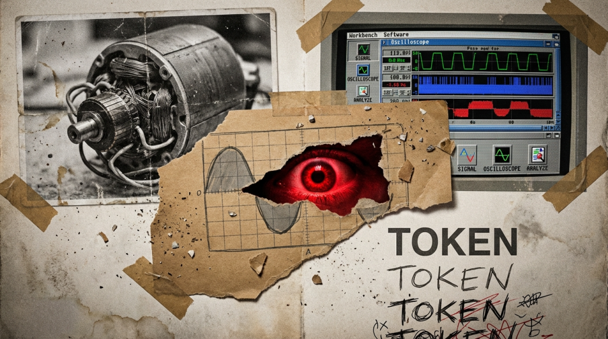

# Token化来袭：电机控制的“黑盒子”正在被强行打开

原创 傅存敬 电磁散人 2026-03-29 07:06 广东

> 原文地址: [https://mp.weixin.qq.com/s/49GUcpPUMI1NBeypQMjMEw](https://mp.weixin.qq.com/s/49GUcpPUMI1NBeypQMjMEw)

最近，有位许久未联系的老同学突然给我发微信，不是文字，而是几个长段语音。

他说："逆了天了，我刚把无感FOC的龙伯格观测器调稳，手底下刚入职的新人竟然用ST的Motor Profiler，点了个'Start Auto Tuning'，十分钟，跟踪误差竟然比我调节的还小。"

"**我感觉自己像个铁匠，打了三十年刀，现在发现钢厂冲压出来的菜刀，比我手打的还快。**"

我没回那条微信。因为我知道，这时候说什么都像是站着说话不腰疼。

直到三天后，我才给他打了个语音电话。我说，你记得十年前咱们怎么用示波器调电流环吗？那时候没有自动整定，我们得凭手感——“听”电机啸叫里的那个2000Hz谐波，判断是不是采样延迟补偿没做好。那种"**手感**"，那种"**听感**"，曾是我们引以为傲的"黑盒子"。公司看不见，摸不透，所以得给我们开高薪，生怕我们跑了。

但现在，芯片原厂（TI、ST、英飞凌）正在做一件事：**他们在打开我们的黑盒子。**

他们把SVPWM、观测器、弱磁控制，封装成了Workbench里的几个下拉菜单。就像当年软件行业的架构师，把Linux和Windows的差异封装成"中间件"，让上层程序员不再需要懂操作系统。你的那个应届生，现在就是你的"中间件"——他不需要懂dq坐标变换的物理意义，他只需要勾选"Enable High Speed Observer"，系统就吐出代码。

**这就是"Token化"**。 我们的经验，被换算成了可计价的计算单元：要么是5000美元的软件License，要么是应届生8000块的月薪。过去公司为我们的"感觉"付费，是因为无法验证；现在他们发现，**实现同样效果的算力成本，比我们的工资便宜。**

游戏版本更新了，只是很多玩家还在用旧版本的攻略打新副本。

我清楚地记得有一位前辈曾在2009年说过一个残酷的道理：当架构部门把驱动层的差异封装完毕，驱动工程师就会从"创作者"变成了"配寄存器的"。更残酷的是，架构部门用大量普通本科生，替代了名校毕业的驱动专家——**因为当技术被量化后，供应是无限的，价格就只能由市场最低的意愿决定。**

今天的电机控制，正站在这个悬崖边。

**如果你今天的工作，还停留在"标准FOC实现、常规工况调试、通用伺服应用"，那么你就是在穿旧鞋走新路。**你以为自己在钻研"寿司之神"的手艺，实际上，MCU厂商已经把你变成了"收银台操作员"——你的工作被拆解、标准化、可复制，最终变得廉价。

但这不意味着我们只能等死。

电机控制还有最后一道物理护城河：**转子的惯量是真实的，磁钢的饱和是真实的，绕组120度温升时的参数漂移也是真实的。** 这些物理世界的熵增，目前还无法被完全抽象成虚拟Token。

**所以，往极端去。**

不要守在"通用伺服"这个已经被Workbench淹没的红海。去航空电调，去搞定那20万rpm的超高速弱磁，去那种磁饱和非线性到AI都算不清的边界；去直驱天文望远镜，去抑制那0.001rpm下的转矩脉动，那种机械谐振和电磁耦合纠缠在一起的混沌；去深海机器人，去宽温域高压强下保持无感控制的鲁棒性。

**在这些地方，物理规律太野，自动工具驯服不了，你的经验仍然是黑盒子。**

或者，**成为那个设计Workbench的人**。不要抗拒量化，要掌握量化的权柄。把你的经验抽象成你们团队内部的"电机控制中台"，让别人在你的架构上做配置，而不是从零写代码。架构师永远比操作员晚一步被替代。

最后，我想对那位老同学说：

我们这一代人，注定要从"手艺人"变成"架构师"，或者变成"操作员"。**中间态是最危险的**。 你闻了十几年的电机绝缘漆味道，看了十几万次的示波器波形，这些不会白费，但前提是——**你得带着这些体感，往更高维度的黑暗里走。**

当FOC算法变成0.5美元一个的IP核时，**知道"什么时候不该用标准FOC"的能力，才是千金不换的。**

别让Workbench定义你的价值。**去定义Workbench。**

