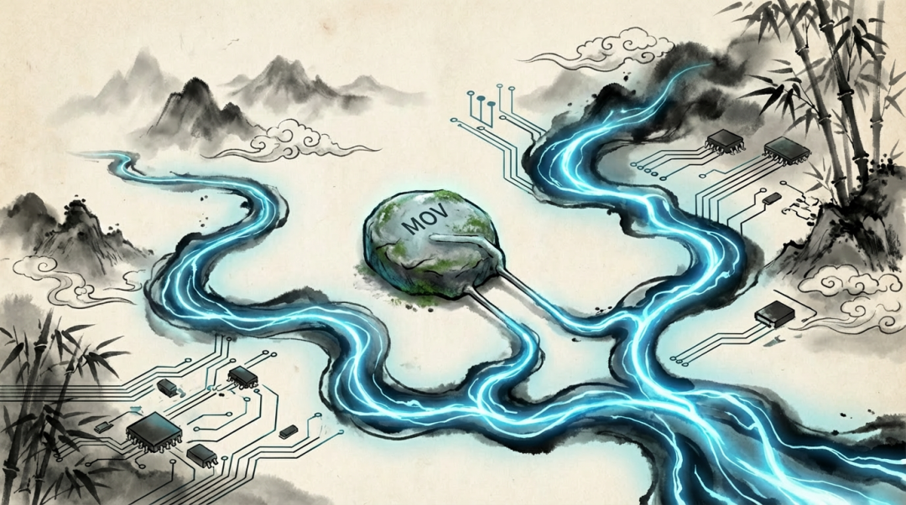
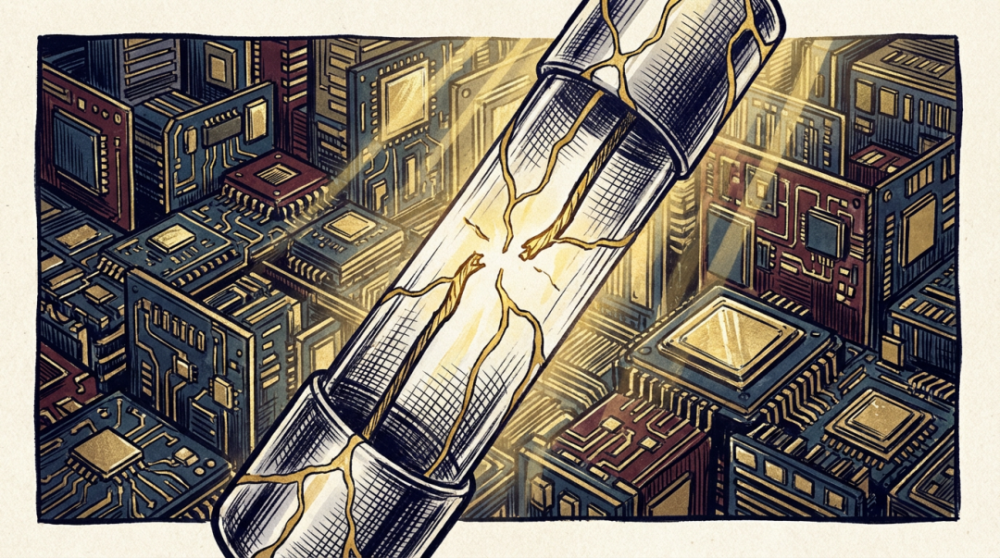
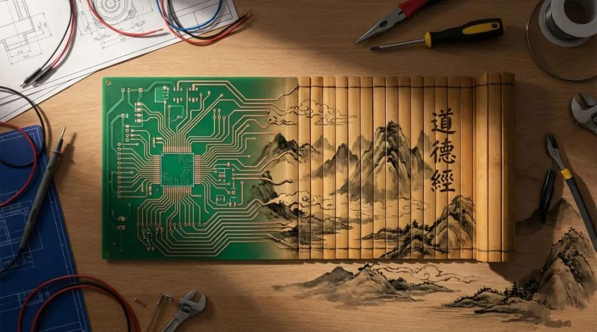

# 一个压敏电阻里的“三宝”：我们电机控制工程师的世界观

原创 傅存敬 电磁散人 2026-01-17 07:06 广东

> 原文地址: [https://mp.weixin.qq.com/s/YVqTWR0zBqhSAISzmF0Dgw](https://mp.weixin.qq.com/s/YVqTWR0zBqhSAISzmF0Dgw)

我最近在研究一款交流输入的电机控制器的原理图。

在L、N输入端，静静地躺着一个保险丝（Fuse）和一个压敏电阻（MOV）。这是教科书式的浪涌保护电路，任何一个合格的硬件工程师都能在三秒内说出它的作用：吸收尖峰，过压自毁，熔断保险丝，保护后级。

这是一个标准答案。但盯着这个由“牺牲”和“守护”构成的精巧组合，我脑子里冒出的，却是几千年前老子的话——“吾有三宝，曰慈，曰俭，曰不敢为天下先。”

一个冰冷的电路，和一部玄妙的《道德经》，它们之间会有什么联系？

我想，这或许就是我们工程师安身立命的世界观。

**第一宝：曰“不敢为天下先”——顺势而为的系统智慧**

什么是“不敢为天下先”？不是退缩，不是跟随，而是不与规律硬抗，懂得“顺势”。

电网的雷击浪涌，就像一场能量巨大的洪水。此时，你会怎么做？筑起一道高墙硬挡吗？结果只会是墙毁人亡。真正高明的做法，是像大禹治水一样，“疏”而不是“堵”。

你看那个压敏电阻（MOV），它就是这么做的。

在正常电压下，它阻抗极高，仿佛不存在，深藏功与名，这便是“不为先”。当几千伏的浪涌袭来，它不选择硬扛，而是瞬间“示弱”，将自己的阻抗降到几乎为零，为汹涌的能量提供一条畅通无阻的泄放通道。它把自己放到了最低的位置，从而引导了能量的流向。

这是一种“处下”的智慧，一种“柔弱胜刚强”的生存之道。

我们做电机控制的，对此应该深有体会。在弱磁区，你想让电机跑得更快，靠的是强行灌入更大的电流吗？不是。你必须去精准地观测反电动势（BEMF）的相位和幅值，然后“顺着”它的方向，注入一个恰到好处的d轴电流去“抵消”它。你越是顺应电机的“脾气”，它就跑得越稳、越快。

无论是产品设计还是市场策略，最高的境界，都不是用蛮力去对抗物理规律或市场趋势，而是洞察其“势”，然后因势利导。这，就是工程师的“不敢为天下先”。

**第二宝：曰“俭”——追求系统最优的舍弃**

老子说的“俭”，不是小气，而是一种深刻的“惜物”和资源最优配置。

当输入电压不是瞬时浪涌，而是持续性异常升高（比如误接380V）时，压敏电阻会持续导通，形成一个巨大的短路电流。这时，它旁边的伙伴——保险丝，就会在瞬间熔断。

结果是什么？压敏电阻烧了，保险丝断了。但后级昂贵的整流桥、大电容、IPM功率模块，以及我们呕心沥血编写算法的MCU，都安然无恙。

这是一种壮士断腕般的“舍弃”。用几块钱的代价，保全了数千元的核心价值。这难道不是最高级的“俭”吗？

我们常常陷入一种“局部最优”的陷阱：试图让每一个零件都坚不可摧，让每一行代码都绝对完美。但一个有生命力的系统，必然存在“熵增”，必然有薄弱环节。

真正的系统设计大师，懂得主动设计那个“薄弱环节”，并让它变得可控、可替换、成本最低。它就像壁虎的尾巴，是系统在面临毁灭性打击时，主动舍弃换取生存机会的最后防线。

作为团队的领导者或行业操盘手，你的“俭”体现在哪里？可能不是砍掉下午茶预算，而是敢于叫停一个看似投入巨大但已偏离航道的项目，用“沉没成本”的舍弃，去保全公司核心战略的实现。这，就是管理者的“俭”。

**第三宝：曰“慈”——以霹雳手段，行菩萨心肠**

《道德经》里说：“慈，故能勇。”

“慈”是什么？是对生命的终极关怀。在我们的世界里，这个“生命”指的是设备的安全、用户的安全，以及整个系统的稳定存在。

为了这份“慈”，必须要有“勇”——敢于在关键时刻做出决断的勇气。

保险丝熔断的瞬间，电光火石，极其“暴力”。软件检测到过流故障，瞬间封锁PWM输出让电机停转，也极其“无情”。这种看似冷酷的“霹雳手段”，恰恰源于设计者最深沉的“菩萨心肠”。

如果保护逻辑有一丝犹豫，阈值设置得过于宽容，换来的可能就是设备起火、人员触电的灾难。那一刻的果决，正是对用户、对产品最大的慈悲。

我们做一线开发的工程师，常常会被挑战：“为什么这个保护这么敏感？客户体验不好！”但我们必须守住这条线。我们写的每一行故障处理代码，都是在践行这份“慈故能勇”。

一个团队的领导者同样如此。你的“慈”，不是对所有人都和和气气，不是对错误视而不见。而是敢于指出问题、坚持标准、淘汰掉队者，这才是对整个团队前途最大的“慈悲”。因为你的“勇”，才守得住团队的战斗力和未来。

从一个压敏电阻开始，我们看到了“不敢为天下先”的顺势，看到了“俭”的舍弃，看到了“慈”的决断。

这“三宝”，不仅是一个电路的设计哲学，更是我们工程师和技术管理者，在面对这个复杂世界时，应有的智慧和操守。

真正的卓越，不是堆砌多少前沿的技术，也不是写出多么炫技的代码。而是我们能从最微小的“器物”中，洞察并践行那些朴素而深刻的“道”。

下一次，当你审视自己的产品、自己的代码、自己的决策时，不妨也问一句：

我的“三宝”，藏在哪里？

