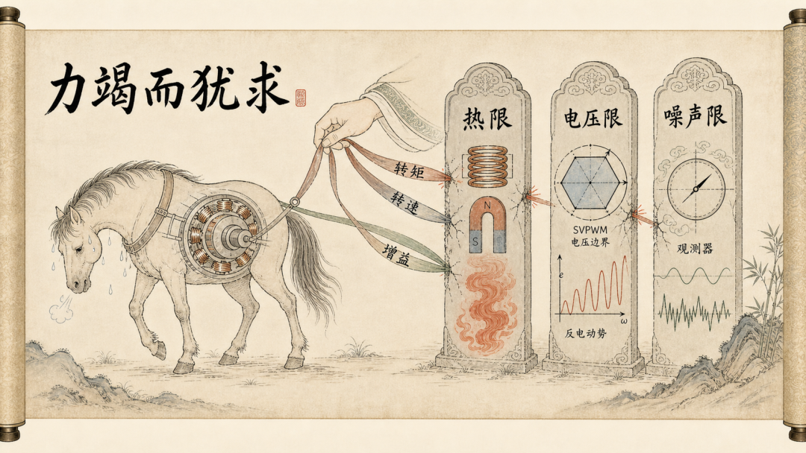
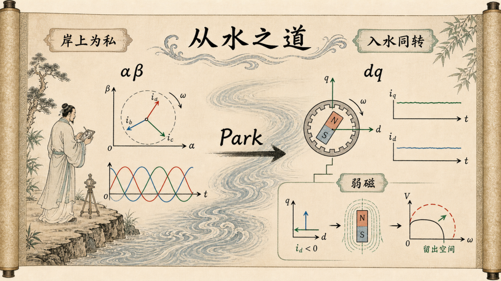
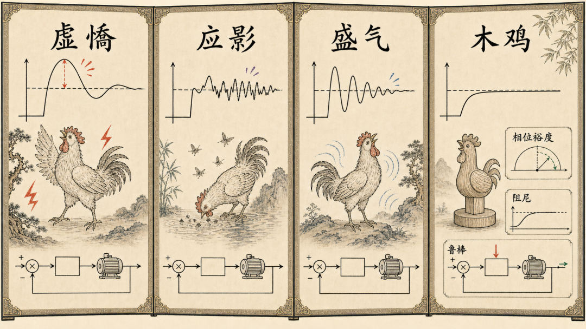
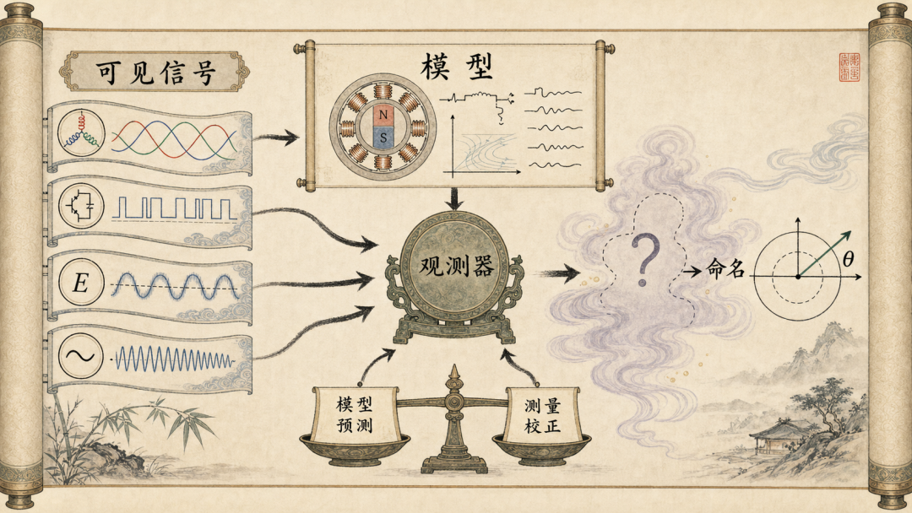
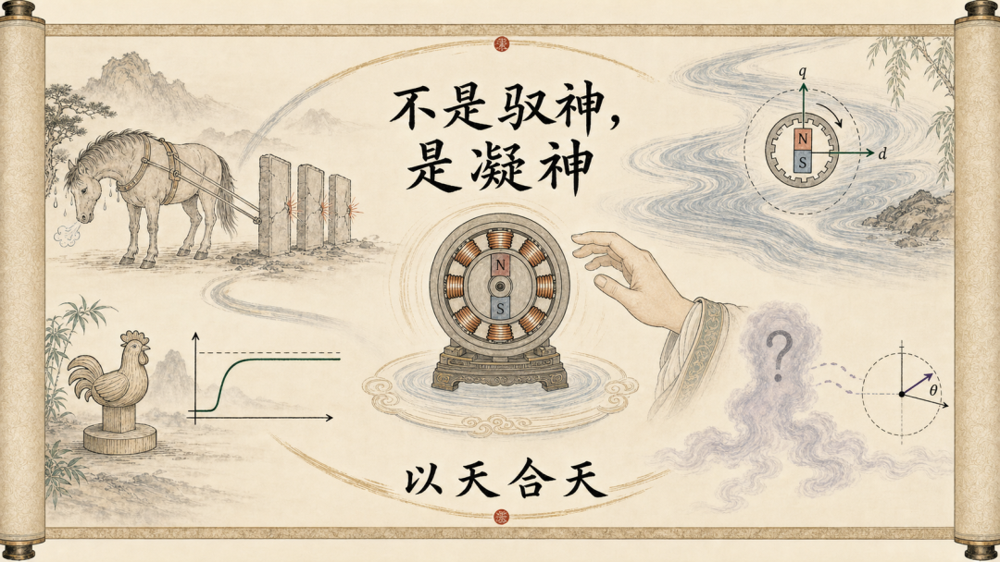

# 不是驭神，是凝神——一位电机控制工程师读《庄子·达生》

原创 傅存敬 电磁散人 2026-06-13 07:06

> 原文地址: [https://mp.weixin.qq.com/s/C9-XOHoVtMge9R1xaQgl0Q](https://mp.weixin.qq.com/s/C9-XOHoVtMge9R1xaQgl0Q)

跟圈外人解释我们这行是做什么的，我有时会动一点"卖弄"的念头。

我会说：电也好，磁也好，你看不见、摸不着，可它确确实实在那里——大得能掀翻一台几十千瓦的机器，小得能藏进一颗指甲盖大的芯片。而我们干的，就是驾驭这两种看不见的力：采样是法器，模型是咒文，PWM 是把意志落到现实的法术。听上去，颇有点像神话里那个能号令百神、驱遣风雷的角色。

这套说辞很受用，对方往往"哦"地一声,露出几分敬畏。

可这行做得越久，我越觉得这幅图景是反的。

真正把电机做好的人，恰恰不是那个把场驭得最狠的人。越想"驭"，越容易出事：电流逼过热限，把磁钢退了磁；反电势顶破母线电压，丢了电流环，直至飞车；观测器增益要得太高，把噪声一并放大，估算角满屏乱跳。你越使劲攥，它越从指缝里溜走。

这道理，两千多年前庄子在《达生》里，早借一个败马的故事讲过了。

## 第一乐章 · 力竭而犹求

有个叫东野稷的人，以驾车的本事去见庄公。他驾起车来，进退之间，车辙直得像墨线弹出来的；左旋右转，弧度圆得像圆规画出来的。庄公看入了神，觉得就算古时最善御的造父，也不过如此，便叫他绕上一百圈再回来。

这时颜阖正好进来，朝跑场上扫了一眼，转身对庄公说："稷之马将败。"——他这马，要垮了。庄公沉着脸，没接话。过不多久，马果然力竭，东野稷败了下来。庄公问：你怎么看出来的？颜阖答："其马力竭矣，而犹求焉，故曰败。"

各位同仁，"力竭而犹求"这五个字，值得我们这些天天跟电机较劲的人，贴在工位上。

因为我们手里那台电机，和东野稷胯下那匹马,是一样的——它有它的力竭之处，而我们，总忍不住"犹求"。

你想要更大的转矩，就得灌更大的 q 轴电流。可铜耗随电流的平方往上涨，绕组和磁钢的温度一路爬；爬过那个拐点，钕铁硼便不可逆退磁，磁力一去不回；器件结温越过额定，管子就在某一瞬炸开。这是热的天花板。马已经热得发烫，你还在要转矩。

你想要更高的转速，就得拿出更高的电压，去顶住越长越大的反电势。可母线电压是死的，逆变器能吐出来的电压矢量,幅值就困在 SVPWM 那个六边形的内切圆里。本来该做的，是弱磁——注一点负的 d 轴电流，把磁场削弱，让反电势低头，给转速让出路来。可你偏要硬顶，一头扎进过调制的深处：指令的电压电机根本给不出，电流环跟丢了参考，轻则电流畸变、转矩抖动，重则磁场定向一歪，直至飞车。这是电压的天花板。马已经跑不动了，你还在抽鞭子。

你想让无感控制的估算角又快又准地咬住真实转子位置，就把观测器的增益往上拧。可增益是一把双刃刀：它放大有用信息的同时，也把电流采样的噪声、反电势里的谐波，一并放大。拧过了头，估算角开始抖、开始飘，相位一错，磁场定向就歪，你想要的转矩非但没来，反而塌了。这是带宽与噪声的天花板。马的耳朵早被你吼蒙了，你还在加大嗓门。

你看，三条路，长得一模一样：你嫌某个量不够——转矩太小、转速太低、角度跟得太慢——于是把它往极限里推；可那个量的背后，都立着一道物理的硬墙：热、电压、噪声。推过去，换来的从来不是"更多"，而是崩。这，就是力竭而犹求。

可真正让我印象深刻的，不是东野稷，而是颜阖。

东野稷败，是因为他坐在马背上，被"进退中绳、左右中规"那套漂亮数据迷住了，看不见胯下的马已经力竭。颜阖站在场外，马还在跑、还没垮，他一眼就断了"将败"。他读的不是位置传感器的圈数和弧度，是那匹马还剩几分力气。

我们这行最值钱的人，往往就是那个颜阖。

新手盯着仿真曲线和台架数据，看转矩响应多快、超调多小，觉得这套参数漂亮极了。老手走过来扫一眼，可能就一句：这么调，夏天满载跑上半小时，要出事。他读的不是那条阶跃曲线，是温升还剩多少余量、是过调制还差几个百分点、是估算角在重载下已经悄悄开始发毛——是这台电机，还剩几分力气。

看出"力竭"在哪，是真功夫。可光躲着极限、不撞墙，还只是不败，谈不上做好。真正把电机做好的人，下一步要问的是：不跟它较劲，那该顺着它的什么方向使劲儿?

## 第二乐章 · 从水之道而不为私

上一乐章末尾那个问题——不跟电机较劲,那该怎么解决——庄子在同一篇《达生》里，借另一个人给了答案。这一回，主角下了水。

孔子在吕梁看水。瀑布从三十仞高处直挂下来，激起的水沫飘出四十里，那是连鼋鼍鱼鳖都游不动的地方。他忽然瞧见一个汉子在那激流里游，以为是想不开寻死，赶紧叫弟子沿着水流去救。谁知那人游出几百步，从从容容上了岸，披着头发，一边走一边唱，在岸下信步。孔子追上去问：我还当你是个鬼，细看才知道是人。请问，你在这样的水里游，有什么门道？那人答：没有，我没什么门道。"与齐俱入，与汩偕出，从水之道而不为私焉"——水往下卷成漩涡，我就跟着它一起沉；水往上翻涌，我就跟着它一起浮；顺着水自己的道走，不拿我自己那一套去强加给它。我能在这瀑布里游，靠的就是这个。

那汉子这句"从水之道而不为私"，细细品味下来，正是我们每天在 dq 坐标系里做的事。

先说什么叫"为私"。在静止的 αβ 坐标系里，你要控制的电流，是一个以电频率不停旋转的正弦量。你站在原地看它，它永远在转、永远在变，就像你站在吕梁的岸上看那股激流——水哗哗地从眼前冲过去，你伸手去抓，什么也抓不住。这时你若硬给它套一个 PI 调节器，会发现 PI 怎么也咬不准：它的全副力气只在直流处(频率为零的地方)使得出来，面对一个不停移动的目标，它永远慢半拍，永远留着一截稳态误差。更要命的是，电机转得越快，目标移动得越快，你就慢得越离谱。站在岸上，拿一把静止的尺子去量一池旋转的水——这就是"为私"：你把"我站着不动"这套私见，强加给了一个本就在旋转的世界。

Park 变换做的事，是让你从岸上下到水里去。它把你整个坐标系旋转起来，转得和转子同步。于是奇妙的一幕发生了：原本在你眼前旋转不休、让你眼花缭乱的那个正弦量，到了这个随磁场一起转的 dq 坐标系里，忽然就静止了——它变成两个不动的直流量，一个励磁分量 id，一个转矩分量 iq。整个旋转的混沌，塌缩成两根安安静静的轴。这时再用那个 PI，它在直流处增益无穷大，轻轻松松就把这两个量按到零稳态误差。

请注意这里的反转：你并没有让磁场停下来。磁场照旧旋转，电机照旧飞转。你只是不再坚持"我要站着不动"，舍了那道岸，跟着水一起转了进去——与齐俱入，与汩偕出。世界之所以静下来，不是因为你按住了它，而是因为你跟着它一起动了。

吕梁那汉子的话里，还有半句"与汩偕出"。水往上翻涌的时候，他不跟水顶牛，而是顺着那股上涌的劲儿就浮了上来。这半句，正对着我们在上一乐章撞过的那道电压的墙。

转速越爬越高，反电势也随之节节攀高，眼看就要顶破母线能供出的那个电压上限——也就是 SVPWM 六边形的那个内切圆。上一乐章里"力竭犹求"的那位，选择硬顶：一头扎进过调制，去要电机根本给不出的电压，结果丢了电流环。可顺着水性的做法，是弱磁。反电势的大小，大致正比于磁链乘以转速。转速是你想要的，不能降；母线电压是死的，不能升；那么唯一能让步的，只剩磁链这一项。于是你注入一点负的 d 轴电流，把气隙磁场削弱几分，反电势便低下头来，转速也就得了路。你不是去硬压那股越来越猛的反电势，而是退一步，从源头上把它放低，给它让道——这正是"与汩偕出"：顺着那股劲走，不跟它对撞。

所以"不为私"，在我们这行里有两副面孔。一副是 Park 变换：不把自己的"静"强加给物的"动"，而是换一个参照系，站到它那边去。另一副是弱磁：不跟自己根本顶不过的东西死扛，而是削它的源头，替它让路。一个换立场，一个退一步，骨子里却是同一件事——都不是用蛮力去驭使，而是顺着电磁本来的脾性，因其固然。

而当你真的开始这样去控制一台电机——找对了坐标系，该让步时让一步——你会撞见一件有点反常的事：它做得越好，看上去反而越平淡，越没有"戏"。没有惊心动魄的过冲，没有此起彼伏的振铃，安静得近乎呆板。

这份"呆板"里到底藏着什么，下一个故事——一只呆若木鸡、却让旁的鸡掉头就走的鸡——会替我们说清楚。

## 第三乐章 · 望之似木鸡

纪渻子替王养斗鸡。养了十天，王问：成了吗？纪渻子说，还不行，它正一身虚浮的傲气，仗着血气方刚("方虚憍而恃气")。又过十天，王再问。还不行：别的鸡一有响动、一晃影子，它就跟着应("犹应向景")。又十天。还不行：它眼神还太凶，一股盛气憋在身上("犹疾视而盛气")。再过十天，王又问。这回纪渻子说，差不多了——如今别的鸡就算在旁边打鸣挑衅，它也纹丝不动，远远望去，像只木头雕的鸡("望之似木鸡矣")，它的德性圆满了("其德全矣")，别的鸡没一个敢应战，看它一眼，掉头就走。

各位同仁，请把这只鸡的四个阶段，在心里和您调过的环路对一对。

一只斗鸡养到顶，不是越来越凶、越来越精神，而是反过来，越来越像一截木头。它最能打的那一刻，看上去最没脾气。它的"德全"，全在它一路褪掉的东西里，不在它新添的东西里。我们调一个电流环、一个速度环，走的是同一条路：从一身躁气，一阶一阶，褪到呆若木鸡。

新手刚把增益往上一拉的环路，就是那只"虚憍而恃气"的鸡。给它一个阶跃指令，它猛地一蹿，一下冲过了目标，再回头，看上去又快又有劲，示波器上那个尖峰甚至有点好看。可那个过冲，是它借来的、自己收不住的力气。

你接着往下调，会撞见那只"应向景"的鸡——带宽要得太宽的环路。它分不清哪个是真指令，哪个是影子：电流采样上的噪声、反电势里的谐波、一点点纹波，它统统当真，统统去追。于是输出开始发毛、抖个不停，定不下来——只因它一直在应那些根本不是指令的东西。做无感控制的同仁对这个尤其熟：滑模观测器那股招牌式的抖振，说穿了，就是一只见影子就扑的鸡。

再往下，是那只"疾视而盛气"的鸡——绷得太紧的环路。阶跃早就过去了，它却收不了势：来回振铃，甚至自己跟自己撞出一个极限环。那股"盛气"，是该泄掉而泄不掉的能量；仗早打完了，它还在原地比划。

把这三样都褪干净,就成了。这时再给它一个阶跃：它干脆利落地应一下，几乎不过冲地爬到位，迅速整定，然后稳稳地、死平地待在那儿。不抖，不振，不闹。你盯着示波器看，只觉得无聊——一条平线，啪地跳到另一条平线，再没下文。望之似木鸡。

可正是这份"无聊"里，藏着它的"德全"。那条死平的线背后，是充裕的相位裕度，是恰到好处的阻尼，是稳稳的鲁棒性。它的静,不是迟钝——真指令一来，它照样第一时间利索地应；它褪掉的，是那些瞎扑腾，不是那份该有的灵敏。它只是不再去应影子，只应那个真东西。

这里有个新手一时很难接受的颠倒：在电机控制里，看上去最"精神"的那条环路——又快又冲、振铃不断、抖个不停——往往恰恰是裕度最薄、最悬的那条；而真正调到家的，看着都像那只木鸡，呆，平，没戏。活泼，常常是破绽；那份呆，才是相位裕度和阻尼都还在，是它根本没在跟自己较劲。老手验一套参数，要的就是这份呆；新手却总舍不得那个又快又冲的尖峰，觉得那才叫本事。

故事最后那句尤其值得玩味："异鸡无敢应者，反走矣。"别的鸡打鸣、挑衅、来回踱步，想撩它，却发现撩不动、无处下嘴，只好掉头走开。换到我们的环路上，这就是抗扰：负载突变、母线跌落、一阵噪声打过来——一条裕度薄的环路，会被这一下激得共振、振铃、放大，等于上了挑衅的当；而那只木鸡般的环路，把这一下稳稳吃下去，平线纹丝不动，不给它任何可以撞响的地方，那股扰动自己就散了。别的鸡掉头就走，正因为这只木鸡不接招。不应，恰恰是它最强的地方。

养鸡的纪渻子，和前面那位场外看马的颜阖，其实是同一种人：真功夫不是往上添，是一阶一阶往下褪，褪到只剩一份从容。

可话说回来——这只木鸡再稳，它好歹还看得见对手。而我们这台电机最深的那个量，从头到尾，我们根本看不见：转子，究竟转到了哪里。再呆、再稳的环路，也得先知道转子在哪，才谈得上控制。怎么去驯一个你压根看不见的东西？别急，我们继续看下一个还没讲的故事——齐桓公在大泽里撞见的那只鬼。

## 收束 · 以天合天

再快的电流环、再稳如木鸡的速度环，都立在一个前提上：你得知道，转子此刻转到了哪里。位置不明，d 轴 q 轴就无从分起，整套 FOC 不过是空中楼阁。可偏偏在无感控制里，这个最要紧的量——转子的电角度——我们从头到尾，一眼都看不见。它藏在最深处：相电流你好歹还能用采样电阻、霍尔、互感器把它转成电压量出来；转子位置不行，它没有一根线接出来给你测。它就是我们这台机器里，藏得最深的那只鬼。

上一乐章末了，我留下了一个还没讲的故事——齐桓公在大泽里撞见的那只鬼。现在就来讲它。

齐桓公在泽中打猎，忽然见了鬼，一把攥住管仲的手：你看见什么没有？管仲说没有。桓公回去就病倒了，好几天不出门。有个叫皇子告敖的来见他，说了一句要紧话："公则自伤，鬼恶能伤公"——是您自己伤了自己，鬼哪伤得了您。一团郁结之气散而不返，堵在心口，就成了病。桓公追问：那到底有没有鬼？皇子告敖没有否认，反而把天下的鬼一一分了类——灶上有什么，门户里有什么，水里、山里、泽里各有什么——最后指着桓公所见，说：那叫委蛇；见着它的人，差不多要称霸了。桓公脸色一变，笑了，整一整衣冠坐起来，不到一天，病不知不觉就好了。

让桓公倒下的，从来不是鬼，是他自己先乱了的那口气；让他重新站起来的，也不是谁打跑了鬼，是皇子告敖给那个不可名状之物，安了一个名分。一个名字落定，鬼就成了可安顿之物。

各位同仁，无感观测器干的，正是皇子告敖这桩活。

滑模也好，扩展卡尔曼也好，MRAS、高频注入也好，它们面对的，都是一个看不见的转子。它们的办法，是从那些看得见、却又间接而含噪的征象里——反电势里的蛛丝马迹，凸极性在高频注入下露的马脚，三相电流的起伏——借着一套电机模型，把那个藏起来的位置反推出来，给它一个确定的角度值。那套电机模型，就是皇子告敖口中那张鬼的分类表：它预先写定了"这台电机在这样的电压电流下，转子理应在何处"。观测器拿现实的信号去比对这张表，最后落定一个名分——此刻的电角度，是 137 度。名分一定，鬼就不再是鬼，它成了 Park 变换里那个可用的 θ，一个能进环、能被处理的对象。

我要特别替观测器说一句话：它做的是辨识，不是法术。

把观测器说成占卜、说成把隐状态"召唤"出来，听着玄，其实是看轻了它。占卜是对着不可知胡乱猜测；皇子告敖却是个清醒的理性派，他靠分类与解释，把一个吓人的异象，还原成可理解、可命名之物——他驱的不是鬼，是齐桓公心里的乱。观测器也一样：它不向虚空祈求，它拿模型与测量彼此印证。扩展卡尔曼那一步尤其见功夫：它既不死信模型的预测，也不全听测量的摆布，而是在两者之间，按各自的可信度去权衡折中——这何尝不是另一种"不为私"？连在最深处给那只鬼安名分时，我们凭的依然不是一己的成见，而是让模型与现实互相校正，各让一步。

请注意，即便到了这最深、最玄的一处，我们做的事，依然不是"驭"。我们没有去推那个转子，没有命令它转到哪里。我们只是,给它起了个名字。

这已经是《达生》里，我们撞见的第二只鬼了。第一只，各位同仁还记得吗，是前面吕梁瀑布下，被孔子错看成鬼的那个汉子。这两只鬼，来历不一样：齐桓公的鬼，是未知带来的恐惧；而吕梁那个"鬼"，是一个把"从水之道"练到了极致的高手，在岸上人眼里，竟显出几分非人的、近乎神异的模样。

原来，功夫到了家，从外面看，是会像鬼神的。

这就要说到《达生》里，我私心最爱的一个匠人——梓庆。

梓庆是个木匠，削木头做鐻——一种悬挂钟磬的架子，要雕成猛兽的样子。他做出来的鐻，见者无不惊叹，说这哪是人工，简直鬼斧神工("见者惊犹鬼神")。鲁侯问他：你是有什么法术？梓庆说，我一个木匠，哪有什么法术。要说有，只一桩：动手之前，我先斋戒静心，把心里的杂念一层层褪掉——褪到不敢再想赏赐俸禄，褪到不敢再计较毁誉、不敢再惦记自己手艺的高下，最后，连自己有四肢、有这副身子，都忘了。到这时候，朝廷没了，旁人的眼光也没了，我满心满眼，只剩这一件事。然后我才走进山林，去看每一棵树天生的样子("观天性")，直看到某一棵，它身上那个鐻仿佛已经天然长成，我才把手放上去("然后成见鐻，然后加手焉")；看不到，我宁可不做。梓庆把这叫"以天合天"——拿我天生的这点本性，去合那树木天生的那点本性。他说，我做的器物之所以像有神，大概就因为这个。

各位同仁，梓庆这番话，值得我们这些做控制的人，反复地读。

那个让见者惊为鬼神的鐻，不是梓庆凭空设计、强加给木头的。他做的，是走进山里一棵一棵地看，直看到某棵树的天性里，本就藏着这个鐻的形状——他不过把它请了出来。

我们这一路调电机，走的竟是同一条道。

dq 坐标系，不是我们发明出来去对付电机的；它是电机那个旋转的物理本性里，本就该有的那个安静的参照系，我们只是换过去、站到了它那边。弱磁，不是我们强按反电势的奇技；它是电压一旦见顶、电机自己就该让出的那条路，我们只是顺势削了磁。那个呆若木鸡的速度环，也不是我们硬调出来的花样；它是这套被控对象，在它的极点、零点、惯量、阻尼里，本就想要的那份从容，我们只是没有用一身躁气去搅它。所谓做好电机控制，到头来，竟不是把一套高明的算法，从外面摁到电机身上；而是把电机那个固有的、本来如此的样子，一点一点看出来，然后顺着它，把手放上去。

这，就是以天合天。一头，是这台电机的"天"——它的电磁规律，它的固然，它在物理里早已写定、不容你违逆的那些脾性；另一头，是工程师的"天"——你常年与它厮磨、终于内化于心的那点直觉与了悟。当这两个"天"严丝合缝地碰在一起，出来的那套控制，在外行眼里，自会显出几分鬼神之相——一如梓庆的鐻，一如吕梁那个汉子。可你我心里清楚，那里头没有半分法术。那不是驭神，那是凝神。

## 尾声

写到这里，开篇那个"号令百神、驱遣风雷"的自我形象，该还它一个真相了。

我们这行，从外面看，确乎有几分神异：把看不见、摸不着的电与磁玩弄于股掌，让一团铁疙瘩听话地转起来、停下去、稳稳出力。外行因此以为，我们是那个能驾驭众神的术士。可做得越久越明白，这幅图景是倒着的。真正把电机做好的人，从来不是把场驭得最狠的那一个。东野稷力竭犹求，把马活活逼垮——那是攥着高增益、跟每一道物理硬墙死磕的我们；吕梁的汉子从水之道而不为私，在岸上人眼里像个鬼，实则只是找对了那个随波同转的坐标系，让数学替他在激流里游泳——那是悟了"因其固然"、肯换参照系、肯在该让处让一步的我们。从前者到后者这一步之差，差的不是力气，是肯不肯放下那个"我要驭使它"的执念。

《达生》全篇，孔子有一句话，几乎可以拎出来当我们这行的箴言。他看痀偻丈人粘蝉，粘得如同探囊取物，赞了一句:"用志不分，乃凝于神。"——心思不分岔，神，就这样凝聚起来了。

请各位同仁品一品这个"凝"字。神，不是你从外面召来、供你号令的东西；神，是你忘了赏罚毁誉、忘了卖弄手段、不再与这电磁之天较劲，只是用志不分地顺着它的固然走下去，到了某一刻，自己从你身上凝出来的那点功夫。

所以我们费尽心力要驯服的，从来不是电机这块铁；是我们自己那颗总想去"驭"的、不肯安分的心。这颗心一旦静下来，与电机的天性合上了，那看不见的电与磁，便不再是缠着齐桓公的鬼，而成了梓庆手里那座令人疑为神工的鐻。