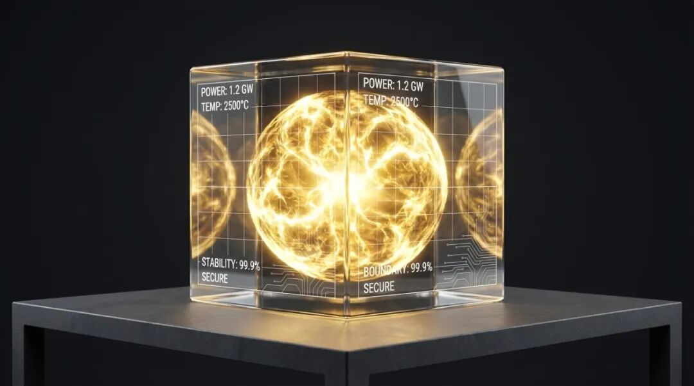

# 以谦驭锋：在激进的行业，寻找一种“安静的确定性”

原创 傅存敬 电磁散人 2026-01-10 07:06 广东

> 原文地址: [https://mp.weixin.qq.com/s/\_gAIck7Ihkqa\_KZhoahc\_Q](https://mp.weixin.qq.com/s/_gAIck7Ihkqa_KZhoahc_Q)

我一直在深圳，做智能控制器。

这座城市，你停一下，就感觉落后了一个身位。尤其我们做技术的，特别是电机控制这种，卷得像麻花。你刚把FOC算法的动态响应又优化了5%，对手已经开始拿“无感启动”的新方案去敲客户的门了。

所以，我们必须“冒尖儿”。做预研的，要去客户那里“布道”；做方案的，要去展会上“秀肌肉”。说白了，就是得会“吹牛”。

但这事儿，一直让我很拧巴。

我们这代人，骨子里或多或少都埋着些老祖宗的东西，比如《易经》里那句“惟谦受福”。它告诉你，要藏，要收，要和光同尘。山不言自高，水不言自深。

可你看深圳的玩法呢？完全是反着来的。你得说，得抢，得让别人看见你的光。谦虚？在商业谈判桌上，谦虚很多时候等于心虚。

一个要“藏”，一个要“露”，到底听谁的？这个冲突困扰了我很久。直到最近，在一个关键项目的攻坚期，我好像有点想明白了。

**我们可能都误解了“吹牛”，也误读了“谦虚”。**

我发现，所谓的“吹牛”分两种。

**第一种，是“低级的吹牛”。** 它的核心是“我”。

“我们的技术最牛。”

“我们的团队背景最强。”

“我们用的MCU是顶配的。”

这种表达，本质是在自我宣传，潜台词是“我很厉害，快选我”。但你越是这么说，客户心里越是打鼓。为什么？因为你只给了他一个情绪化的结论，却没有给他一个理性的支撑。你把压力，全扔给了他。

**第二种，我称之为“高级的吹牛”。** 它的核心是“事”。

它不是在说“我有多牛”，而是在回答“这件事有多靠谱”。

我以前去客户那里，总想着怎么展示我们的算法多精妙，性能多卓越。现在我换了一种方式，我把焦点从“展示自我”切换到“为客户提供确定性”上。

这叫**“专业确定性输出”**。

具体怎么做？其实就是三件事：

**第一，把“感觉”换成“数据”。**

别说“我们的控制器响应很快”，要说“在额定负载下，从0到3000转的加速时间是50ms，超调量小于2%”。别说“我们的方案很可靠”，要说“这是我们连续满载运行5000小时的老化测试报告，温升曲线在这里”。

工程师出身的我们，最擅长的不就是这个吗？把参数、边界、测试用例摆出来，这比任何华丽的辞藻都更有力量。

**第二，主动暴露“不确定性”，并给出“控制方案”。**

这是最关键的一步。以前我认为，把弱点藏起来才是聪明的。后来发现，恰恰相反。

一个真正专业的方案，绝不是宣称自己“完美无缺”，而是清晰地告诉客户：“在超过85度的环境下，我们的输出扭矩会下降10%，这是保护机制。如果您的应用场景确实需要耐高温，我们有另一套采用碳化硅器件的方案B，成本会增加15%，但能稳定工作在125度。”

你看，当你把风险和应对方案一起交出去的时候，你给客户的不是一个“坑”，而是一个“选择题”。客户非但不会觉得你不行，反而会觉得你极其专业和真诚。

**信任，就是在你敢于承认“我不能”的那个瞬间，建立起来的。**

**第三，把“我们厉害”换成“这事怎么落地”。**

客户，尤其是老板，最关心的不是你的技术原理有多优雅，而是这东西怎么用到他的产品里，出了问题怎么办。

所以，少讲一点屠龙之技，多讲一点“交付计划”、“验收标准”、“技术支持SLA（服务等级协议）”和“失效兜底机制”。

当你开始和客户讨论这些“脏活累活”的时候，他知道，你是来一起解决问题的，不是来推销一个黑盒子的。

想明白这三点后，我豁然开朗。

这种“高级的吹牛”，哪里与“谦虚”冲突？它本身就是最高级的谦虚。

它谦虚地承认了客观规律（数据和边界）；

它谦虚地正视了商业合作中的风险（不确定性）；

它谦虚地把客户的需求（落地和保障）放在了自我表达之上。

**真正的谦，不是让我不作为，而是让我“把我的锋芒收住，把‘事’的锋芒放出来”。**

我的角色，不是一个骄傲的孔雀，而是一个专业的“排雷兵”。我的任务不是开屏炫耀羽毛，而是帮客户勘探出一条通往目标的、最安全的道路。

想通了这一点，我再也没有“吹牛”的心理负担了。

我对外积极地展示方案，争取订单，不是为了我个人的虚荣。我是我们预研组的负责人，我必须为团队的弟兄们拿回下一张饭票，为我们耗尽心血研发的技术，争取到下一个迭代和量产的许可证。

这是我的“义”，义不容辞。

所以，如果你也和我一样，是个在技术和市场夹缝中感到拧巴的工程师或管理者，别再纠结了。

大胆地去“吹牛”吧。

只要你吹的，是“事”的牛，而不是“你”的牛。

这，或许就是我们这代技术人，对“惟谦受福”最好的传承。

