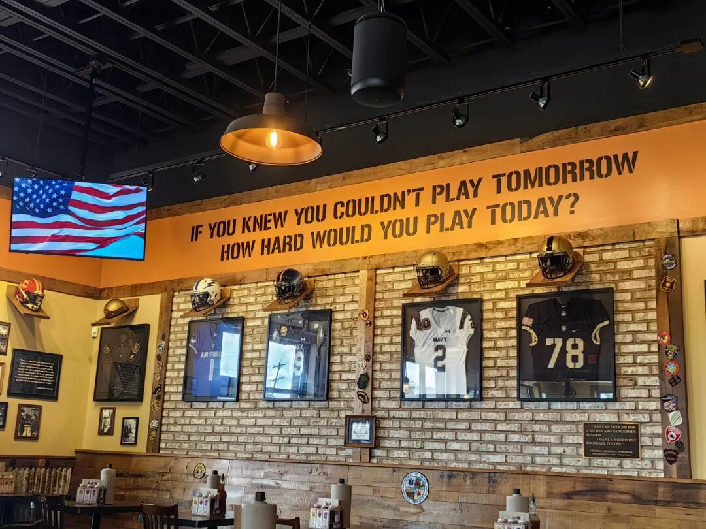
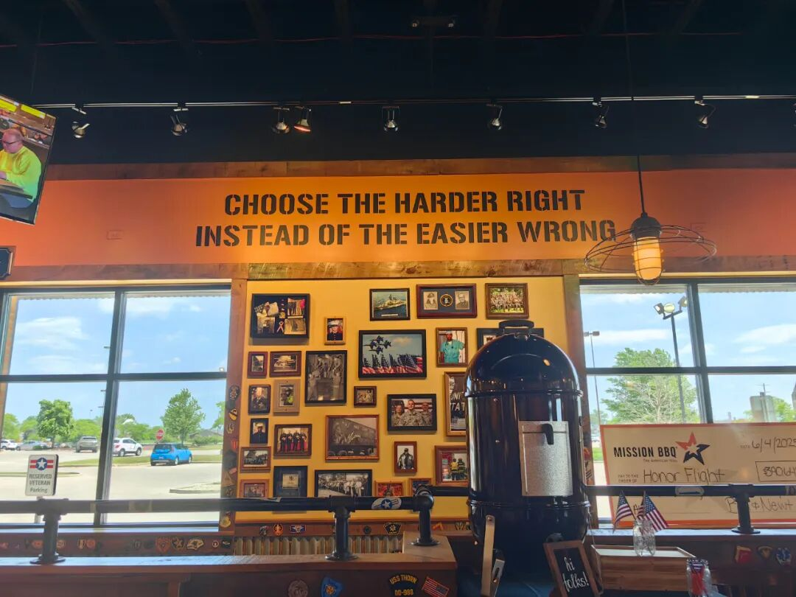
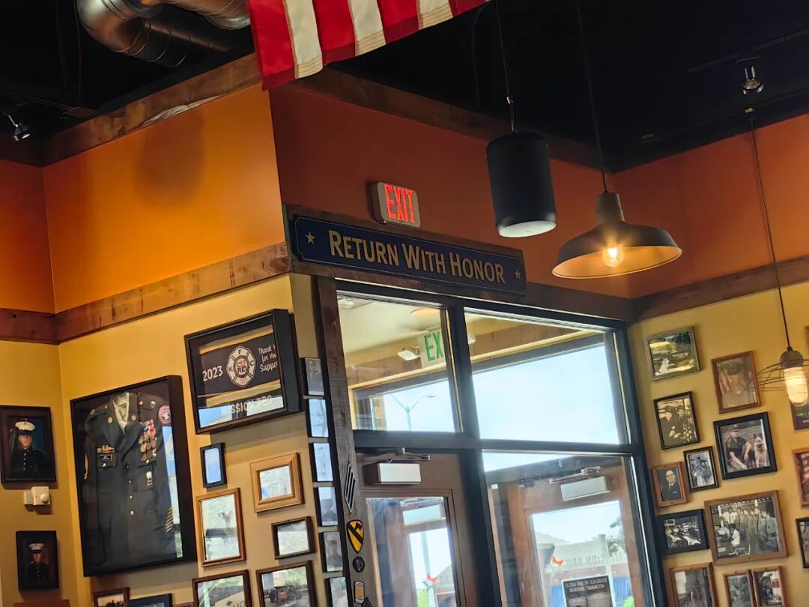

# 岁至不惑前一载，我在终局面前学会了奔跑

原创 傅存敬 电磁散人 2025-11-08 07:06

> 原文地址: [https://mp.weixin.qq.com/s/GHTxpyfwmreIZcT\_Y3ypVA](https://mp.weixin.qq.com/s/GHTxpyfwmreIZcT_Y3ypVA)

立冬虽至，深圳仍是虫鸣不止。不，那不是虫鸣，是写字楼里空调主机沉闷的嗡鸣。岁至不惑前一载，我坐在玻璃幕墙隔出的那一方天地里，头衔是别人眼里的“成功”，心里却是一片荒芜的园子，任由颓唐的蔓草疯长。

日子，好像是被设定了程序的机器，重复着，消耗着。我像个卖力的演员，每天戴上一张叫做“斗志昂昂”的面具，对着老板、同事、还有那些眼眸清亮的后生们。面具下的脸，是什么表情？我想，大概是麻木，或是更深一点的，绝望。

我看到了结局。在这片叫做“职场”的丛林里，我们这些被驯养的野兽，奔跑半生，终点无非两处：要么被更年轻的獠牙取代，逐出领地，谓之“失业”；要么撕下伪装，自己去辟一片荆棘地，谓之“创业”。无论主动被动，都是一场告别。就像庄子说的，“不亡以待尽”，我活着，只是尚未腐朽，在等待那个注定的“尽头”。这念头像一条冰冷的蛇，缠住了我的魂，让我觉得每一次奋力奔跑，都只是在加速抵达那个悬崖。那么，还跑什么呢？这努力，还有什么意义？

矛盾撕扯着我，直到那一次，在大洋彼岸，在完成了对客户的常规商务拜访后，我走进了一家小餐馆。

那餐馆不起眼，却有一种奇异的宁静。老板是个沉默的中年人，据说年轻时打过棒球，后来又去当了兵。他的故事，都挂在四面墙上。那不是什么名贵的装饰，而是一件件被精心装裱起来的旧球衣、旧球帽。白色的棉布已经泛黄，汗渍留下时间的印记，像一幅幅抽象画。它们是沉默的，却又在嘶吼着一段滚烫的青春。

我的目光，被球衣上方的一行字钉住了，像被一道闪电劈开了混沌的脑海。那是一句英文，用粗粝的字体印着：

**IF YOU KNEW YOU COULDN'T PLAY TOMORROW, HOW HARD WOULD YOU PLAY TODAY?**

那一刻，我好像不是站在一家异国的餐馆里，而是站在一片空旷的球场中央，听到了命运的发令枪。

是啊，运动员的生涯，不就是一场早已写好结局的比赛吗？他们的“尽头”比我的来得更早，更残酷。伤病，年龄，状态……每一阵风都可能吹熄他们的火焰。可我从未听说，有哪个伟大的球员，因为知道自己终将退役，就草草应付今天的每一次投篮，每一次挥棒。恰恰相反，是那“终将告别”的宿命，让每一次上场都成了绝版，让每一次汗水都重如黄金。

我错了。

我一直盯着遥远的、不可更改的悬崖，却忘记了脚下的这片土地，才是唯一能让我起舞的地方。我把努力当成了换取未来的筹码，当未来显得虚无缥缈时，这筹码也就变得可笑。可我忘了，努力本身，就是对生命此刻最郑重的回答。

那位老板，少时打球，壮年参军，而后他退役了，脱下了军装，他的人生“球赛”结束了不止一场。可他没有把自己当成一个“失业者”。他只是换了个赛场，把人生的下半场，经营成了一间充满烟火气的餐馆。墙上的球衣，不是遗物，是勋章。它们在告诉每一个食客：看，我曾那样拼尽全力地活过，那段岁月没有因为结束而消失，它成就了今天的我，就像地基成就了大厦。

我的这段职业生涯，我在会议室里的每一次争论，在深夜为下属修改的每一份方案，我戴着面具挤出的每一个微笑……这一切，原来都不是通往“尽头”的消耗，它们本身，就是我的“球衣”。即使有一天，我也会“退役”，离开这个赛场，这件写满了我所有奋斗与挣扎的“球衣”，将是我最宝贵的行囊。我可以把它挂在我人生下半场的墙上，骄傲地告诉自己，也告诉所有人：在那场注定会结束的比赛里，我曾打得如此用力。

我依旧会戴上那张面具，但面具下的表情变了。不再是麻木和绝望，而是一种平静的坚定。此后的努力，不再是为爬得更高，而是为把脚下的每一步都踩得更实。我要为自己今天的“上场”负责，为的是，当终场哨声响起时，我能对自己说：

“嘿，你看，这件球衣，还挺漂亮的。”

亦或，也像这位老板一样，RETURN WITH HONOR。

