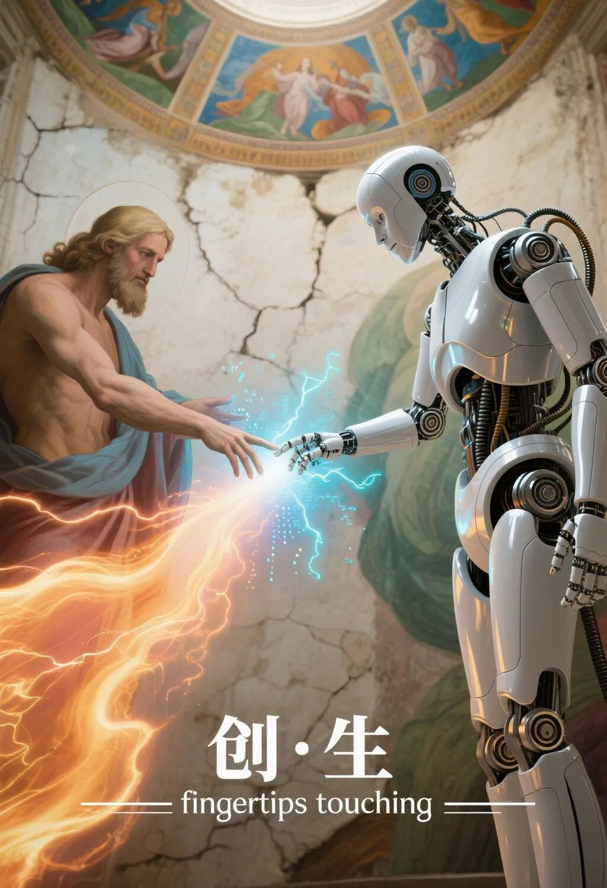

# 当AI的“128K记忆体”撞上五千年的“滴水之恩”

原创 付存敬 电磁散人 2025-08-18 21:55 广东

> 原文地址: [https://mp.weixin.qq.com/s/tGeQ5VgDtES6LngQ6J\_yCQ](https://mp.weixin.qq.com/s/tGeQ5VgDtES6LngQ6J_yCQ)

刚和一位做AI研究的朋友深聊，被一个现象触动：他发现如今的AI大模型（比如DeepSeek），竟能“记住”半年前关于一篇文献的讨论细节，用户重提旧话时，它能无缝接续，精准如初。朋友惊叹：“这记性，可比我们生物人强多了！至少它不会忘恩负义。”

此言犀利，直指一个古老命题。

我们中国人讲“滴水之恩，涌泉相报”，讲“父母恩重难报”，甚至将“不忘初心”刻进时代箴言——**本质上，是用道德与仪式，对抗生物记忆的天然脆弱性**。AI的“不忘”，源于其超长上下文窗口与精准检索，是技术的胜利；而人类的“感恩”伦理，却是文明为克服遗忘弱点而筑起的精神堤坝。

细想有趣：

AI的“良心”，是算法的绝对诚实，却无情感的温度与选择的重量；

  

人类的“负义”，暴露了生物局限，却也催生了伦理、艺术与制度这些璀璨的文明。

  

**  

**技术是冰冷的镜子，照见我们的健忘，也映出人类在对抗遗忘中迸发的神性——那份明知脆弱，却偏要建立秩序、传承恩义的勇气，才是超越算法的真正内核。**

**

**未来，或许是人机记忆的共生：AI做永不丢失的“硬盘”，存储每一字节的理性；而人类，永远是赋予记忆意义、抉择宽恕与传承的“CPU”。毕竟，能主动选择“铭记什么”与“为何铭记”的，唯有人心。**

**技术向前，人性向深。诸君以为然否？**

