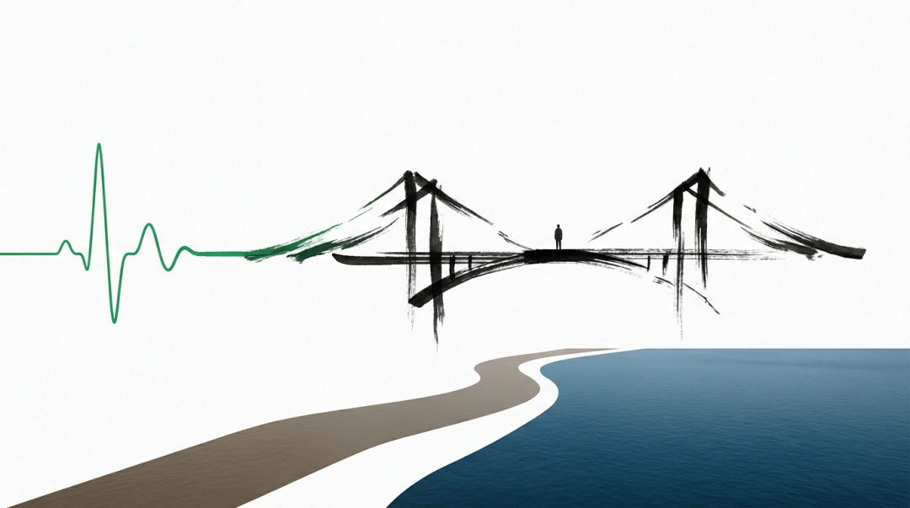

# 我以为庄子预言了相对论——直到我查了 1935 年的旧账

原创 傅存敬 电磁散人 2026-06-07 07:06 广东

> 原文地址: [https://mp.weixin.qq.com/s/Ly7e5HC-kl1ztX1fv1WqNw](https://mp.weixin.qq.com/s/Ly7e5HC-kl1ztX1fv1WqNw)

各位同仁，今天不聊电机也不聊控制，聊一次翻车。

前阵子重读《庄子·秋水》\[1\]，读到北海若答河伯那句"自细视大者不尽，自大视细者不明"，脑子里突然蹦出一个念头：这不就是相对论和量子力学的关系吗？

从微观的视角去看宏观，量子力学解释不了时空弯曲和引力，"不尽"；从宏观的视角去看微观，广义相对论在普朗克尺度失效，描述不了黑洞奇点，"不明"。两套理论各管一头，在各自的尺度上精准无比，合不到一块儿。而庄子两千三百年前就把这事儿说了。

那一刻的兴奋怎么形容呢——就像你调了一下午的 FOC 环路，突然波形收敛了，示波器上稳稳一条线，你盯着屏幕觉得全世界都对了。

我越想越觉得严丝合缝。庄子还说"可以言论者，物之粗也；可以意致者，物之精也"。相对论用几何语言"言论"宏观时空，量子力学用概率幅和希尔伯特空间"意致"微观粒子。最后北海若收束："知是非之不可为分，细大之不可为倪"，至今没有一个成功的量子引力理论能把大和小缝在一起。我甚至在纸上画了一张对照表，庄子一列，物理一列，每行都对得上。那一晚，我几乎信了自己撞见了什么了不起的东西。

秋水时至，百川灌河。那一刻的我，就是河伯——"欣然自喜，以天下之美为尽在己"。

但搞工程的人有个毛病：你可以把他哄住一阵子，但他迟早要回去翻数据手册。

过了两天，那股兴奋劲稍退，我开始觉得不踏实，决定回去查一查 1935 年的旧账\[4\]。结果越查越不对劲，三道缝一条一条裂开来。

第一道缝：我把两个完全不同的问题揉成了一个。1935 年那场著名的论战，主角是爱因斯坦、波多尔斯基、罗森的 EPR 论文 \[2\]，玻尔的回应 \[3\]，以及薛定谔同年写出的"薛定谔的猫" \[4\]。他们争的根本不是"相对论和量子力学谁对谁错"。爱因斯坦那年不是在拿相对论去对抗量子力学，他是个实在论者，嫌量子力学太靠概率、描述不完备。"上帝不掷骰子"针对的是确定论对概率论，不是宏观对微观。甚至薛定谔那年是站在爱因斯坦这边的，"猫"那个思想实验本来是反讽，讽刺的是量子叠加态推到宏观世界有多荒唐。而"广义相对论和量子力学在普朗克尺度对不上"这个问题，也就是弦论和圈量子引力试图解决的那个，跟 EPR 之争压根不是同一件事。更尴尬的是：狭义相对论和量子力学_早就_ 统一了，那就是量子场论（QED、标准模型），是整个物理学里验证得最精确的理论之一。真正顽抗到今天的，只有引力。我那句"相对论和量子力学不能统一"，上来就不准。

对照表上的第一根线，断了。

第二道缝藏在后面。这场仗其实是分出过胜负的，而且分得干脆。1964 年，贝尔提出贝尔不等式 \[5\]，把"有没有定域隐变量"这个哲学问题变成了实验可以判决的判据。从阿斯佩 1982 年的实验 \[6\]，到 2015 年的无漏洞贝尔实验 \[7\]，结论清楚：自然界违反贝尔不等式，爱因斯坦坚持的"定域实在论"被实验否决了。这一串工作拿了 2022 年的诺贝尔物理学奖 \[8\]。说精确一点：败下来的是爱因斯坦的_定域性_ 假设，也就是"没有超距作用"这个信念；至于他对确定性和完备性的渴望，在玻姆力学和多世界诠释里还活着。但"两派永远谁也丈量不尽谁"这幅画面，对 1935 这场仗是不成立的，它有结论。北海若说的是"大小没有绝对的尺"；而 EPR 之争，偏偏是被一把很硬的尺量出了高下。

第三道缝是，我曾经窃喜的那个类比的方向可能是反的。庄子借北海若劝的是什么？是 _别_ 去追那把统一万物的尺，看破"无法统一"本身才是智慧。可物理学这三百年干的恰恰是相反的事，而且干得极漂亮：牛顿把天上和地下统一了，麦克斯韦把电、磁、光统一了，格拉肖、萨拉姆、温伯格把电磁力和弱力统一了，量子场论把狭义相对论和量子力学统一了。物理学的光荣史，几乎就是一部不断跨尺度成功统一的编年史。量子引力没找到，是当下的无知，不是"尺度在原理上不可通约"的证明。把"我们暂时还没找到"等同于"庄子早就说了它不该被统一"，这才是我那张对照表里最该警惕的一处偷换。

三道缝裂完，我坐在桌前，体会到了河伯"东面而视，不见水端"的滋味。我以为看见了天下之美，其实是河面刚好涨了几尺水。

不过河伯望洋之后不是灰溜溜退回去了。他"始旋其面目"，重新审视，跟北海若聊了七轮，越聊越深。我那个念头也一样：三道缝没有杀死它，反而把它从一个错误的门牌号推到了一个更准的位置。

更准的位置有两处。第一处恰好就是我最初脱口而出的那个词：相对论。但不是我原来以为的那层意思。狭义相对论最核心的一条是：没有特权参考系。长度、时间、同时性，全依赖于观察者的运动状态，不存在"绝对的长"或"绝对的快"。这跟北海若说的"以道观之，物无贵贱；以物观之，自贵而相贱"几乎是同一句话的两种语言：一个量的大小，不是事物本身的固有属性，而是事物与观测框架之间的关系。就像你觉得自己个子矮，是因为你站在篮球队里；换到体操队，你就是高个子。"高"和"矮"不是刻在你骨头上的字，是你和参照系之间的相对位置。我最初那个"秋水对相对论"的直觉，居然比我后来哄自己画出的那张表更准，只是理由全换了。

另一处落在重正化群和跑动耦合常数上。这是量子场论里一个很深的发现：物理学的"常数"其实不常，耦合强度会随你观测的能量尺度而变。换句话说，"什么物理重要、什么可以忽略"本身就是尺度的函数。各位同仁不用去想粒子物理，想你手里那块 PCBA 就行：肉眼看，你关心的是布局走线和 EMC；拿放大镜看同一块板子，关心的变成焊点润湿和引脚共面性；再上金相显微镜，关心的又变成锡铅合金的晶格结构。同一块板子，"什么参数重要"随尺度而变。你不会拿晶格参数去做板级 EMC 设计，也不会拿板级参数去判焊点质量。北海若那句"因其所大而大之，则万物莫不大；因其所小而小之，则万物莫不小"，说的就是这件事。他用寓言说的，物理学家用方程算到了同一个结论：尺度决定什么是"大"，什么是"小"，什么是"重要"。

到这里，那个最初的念头总算落到了它该待的位置。不是我一开始以为的那个，但比那个更稳，更经得起追问。

"古代圣人预言了现代物理"这个写法有一条长长的家谱。1975 年卡普拉写了那本我至今依然非常喜欢的《物理学之道》\[9\]，把东方哲学和量子力学拉在一起，红极一时，也被物理学界批得很认真。批评得很朴素：庄子的文本够丰富、够含混，你几乎能把任何现代观念都映射进去；而这映射是我们自己读进去的，不是庄子留给物理学家的线索。它不可证伪，也长不出新物理，更长不出新训诂。

所以我最后的结论是六个字：**是桥，不是预言。**

当桥，它极有价值，让你文学的那一半和工程的那一半握上手，让"尺度决定认知边界"这个主题在心里多了一层质感。可一旦说成"庄子预言了量子引力"，就从洞见滑成了玄学。前者是真功夫，后者是廉价的安慰。

回过头看这一趟，我觉得最值得记住的不是那个念头本身。工程师从来不缺灵感。你凌晨读到一句古文，脑子里蹦出一个漂亮的对应，那份兴奋是真的。但灵感到判断之间，隔着一段你必须自己走的路：去翻一手文献，去核对史实，去问一问那张对照表里有没有哪根线是你自己接上去的。不肯走这段路的人，守着河伯那面涨水的河，一辈子觉得天下之美尽在己。肯走的人，才有机会看见海。

各位同仁，我们都有自己的河。时不时把自己推到河口去望一望，不丢人。

  

附记：

这篇笔记从一个很美的念头出发：《秋水》里"自细视大者不尽，自大视细者不明"像极了相对论与量子力学的关系。这个念头经不起翻查：1935 年的 EPR 之争和"引力与量子的统一"是两回事，那场争论后来被贝尔不等式和实验分出了胜负，而庄子"别求统一"的智慧与物理学"不断成功统一"的历史恰好方向相反。但三道缝没有杀死这个类比，反而把它推到了更准的落点：狭义相对论的"没有特权参考系"与庄子"以道观之，物无贵贱"异曲同工，重正化群的尺度依赖性更是"因其所大而大之，则万物莫不大"的现代量化版。一个念头从自喜到望洋再到重新站稳，这条路本身就是河伯走过的路——灵感不稀缺，把灵感打磨成判断的那段功夫才稀缺。

  

参考文献

\[1\] 庄周,《庄子·外篇·秋水》。

\[2\] A. Einstein, B. Podolsky, and N. Rosen, "Can quantum-mechanical description of physical reality be considered complete?," _Phys. Rev._, vol. 47, no. 10, pp. 777–780, 1935.

\[3\] N. Bohr, "Can quantum-mechanical description of physical reality be considered complete?," _Phys. Rev._, vol. 48, no. 8, pp. 696–702, 1935.

\[4\] E. Schrödinger, "Die gegenwärtige Situation in der Quantenmechanik," _Naturwissenschaften_, vol. 23, nos. 48–50, pp. 807–849, 1935.

\[5\] J. S. Bell, "On the Einstein Podolsky Rosen paradox," _Physics Physique Физика_, vol. 1, no. 3, pp. 195–200, 1964.

\[6\] A. Aspect, P. Grangier, and G. Roger, "Experimental realization of Einstein-Podolsky-Rosen-Bohm Gedankenexperiment: A new violation of Bell's inequalities," _Phys. Rev. Lett._, vol. 49, no. 2, pp. 91–94, 1982.

\[7\] B. Hensen et al., "Loophole-free Bell inequality violation using electron spins separated by 1.3 kilometres," _Nature_, vol. 526, no. 7575, pp. 682–686, 2015.

\[8\] The Nobel Foundation, "The Nobel Prize in Physics 2022," NobelPrize.org, 2022.

\[9\] F. Capra, _The Tao of Physics_. Berkeley, CA: Shambhala, 1975.