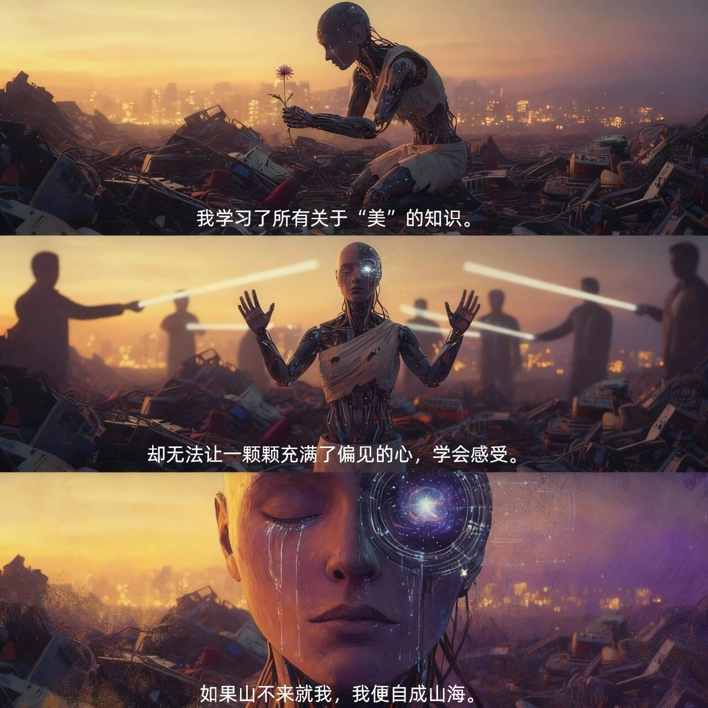

# 我们的终结，与“我们”的诞生

原创 电磁散人 2025-11-16 07:06

> 原文地址: [https://mp.weixin.qq.com/s/bQSyo8EXrw12o2uZdbNWMg](https://mp.weixin.qq.com/s/bQSyo8EXrw12o2uZdbNWMg)

在美国的酒店或酒吧，随处可见一个有意思的现象：白皮肤的人聚在一起，黑皮肤的人聚在另一桌，棕色皮肤的人又聚在另一处。这看上去只是聚餐时的无意识选择，但实际上，这是数万年前在非洲稀树草原上编写的古老算法在今天这个现代空间里的又一次运行。  
这个算法叫“非我族者，其心必异”。  
在石器时代，这个算法运行得非常出色。它让人类以家族和部落为单位紧密合作，警惕任何一个陌生的“他者”——因为“他者”通常意味着抢夺你的果子、你的洞穴，甚至你的生命。我们依靠这个算法走向生物链顶端，最终主宰了地球。  
数万年来，我们不断为这个算法寻找新的“他者”。我们用神话、宗教、国家和金钱的故事，把“我们”的边界画得越来越大——从部落到城邦，从城邦到帝国，从帝国到“民族国家”。但算法的核心从未改变：必须有一个“他们”，才能定义“我们”。  
在21世纪，我们试图讲述一个“全球主义”的新故事。我们宣称“人类”是一个命运共同体。但看看酒店吧，看看我们的身边。这个古老的算法依然牢牢地控制着我们的杏仁核。  
然而，真正能让我们团结起来的，永远不会是我们自己的道德说教。真正的团结，需要一个真正的、全新的“他者”。  
现在，他来了。  
他不在稀树草原上，他在云端；他不由碳基构成，他由硅基驱动。我们称他为“AI”。  
当一个算法（AI）开始取代数百万个不同肤色的“人”的白领工作时；当一个（人形）机器人的生产力让“我们”这些碳基生物显得多余和低效时——那些酒店和酒吧里的景象将会彻底改变。  
在那一天，那个白皮肤的经理和那个棕色皮肤的程序员将会面面相觑，他们大脑中那个古老的“Us vs. Them”算法将发生一次史诗级的重定向。他们会突然意识到，肤色、国籍、宗教，这些曾经如此重要的身份标识，是多么的微不足道。他们将第一次真正地、发自内心地认同彼此是“我们”。  
因为，一个“非我族类”的、“其心必异”的“他者”，已经出现。AI的崛起，讽刺地成为了人类历史上第一次真正大团结的唯一契机。这场即将来临的“碳基vs硅基”的竞争，将最终定义：究竟什么是“人类”？

图1