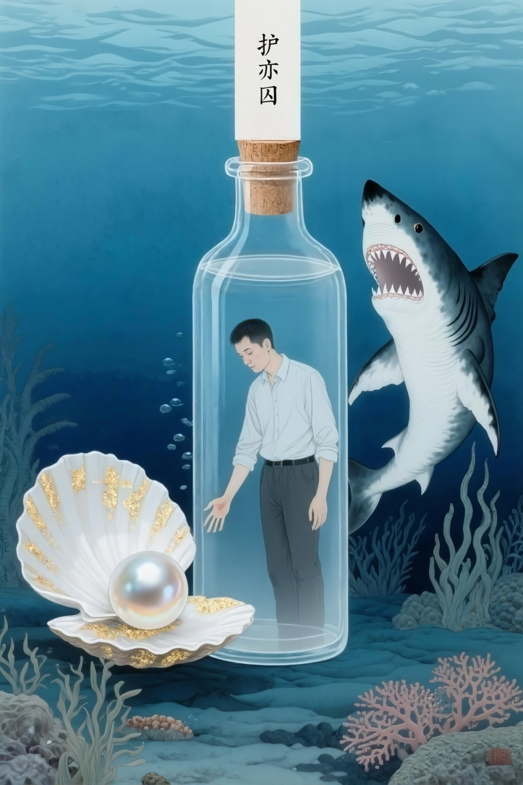

# 技术人生：在电机控制中寻找突破

原创 付存敬 电磁散人 2025-08-06 20:53 广东

> 原文地址: [https://mp.weixin.qq.com/s/kfKeknpL-17mEw6guGqjVg](https://mp.weixin.qq.com/s/kfKeknpL-17mEw6guGqjVg)

我坐在三十九岁的槛上，三字头的年月，竟也如深秋的蝉鸣，嘶哑着要尽了。办公桌上堆着新式的电机和控制器，棕黄色的铜线盘绕如蛇，绿油油的PCB板如掩蛇的青草，笔记本屏幕上IDE里的算法密密匝匝，十四年光景，便在这铜铁与电磁的牢笼里，一寸寸地刨食。窗外是霓虹割裂的夜，新贵们驾着流光的绿牌车呼啸而过，碾碎一地月光——那月光，原是照着深海宝藏的。

“君以此始，必以此终！”  
范晔冷峭的八个字，蓦地撞进心里，像一柄生锈的匕首，剜开层叠的图纸。这电机控制的学问，原是我的铠甲，替我挡了多少明枪暗箭，噬人的鲨鱼隔着玻璃瓶壁游弋，利齿森然，终是咬不进来。然而这瓶，何尝不是一副透明的棺？氧气一日稀薄似一日，我眼见着瓶外沉船的珠宝、珊瑚的奇珍，甚至一尾银鱼曳过的水痕，都隔着冰冷的壁，粼粼地晃着诱惑的光。伸手，触到的只有自己呵出的白雾，凝在瓶壁上，又慢慢滑落，像一行无用的泪。

我便是这瓶中囚徒。  
十四年，瓶壁被额头的油汗与指痕磨得浑浊了。也曾奋力冲撞，欲投身那陌生的深蓝，重寻一条生路。可瓶外的水压顷刻碾碎幻想，瓶内的惯性又扯着脚踝。所谓“跨行”与“创新”，不过是瓶中人对着瓶外财宝，画的一个苍白扭曲的饼。壁垒？诅咒？原是一体两面。这赖以糊口的技艺，焊死了我的命途，一条道跑到黑，竟成了唯一的“生”路——一种在稀薄空气中苟延的生。

孔子说四十不惑。  
逼近这不惑的门槛，倒像是被命运掐着脖子，强灌了一碗醒酒汤。酒醒了，幻梦也碎了。该要什么，不该要什么，竟在窒息的边缘，被逼得异常清晰起来。舍了那水中月、镜中花，方知瓶虽囚身，亦能观天。鲨鱼环伺是实，宝藏缭绕也是实。这瓶中一点残存的气息，一点十四年磨出的茧与识，倒也是结结实实，烙在骨头里的。

破局？  
砸碎这瓶，顷刻便成鱼食。然则坐以待毙，亦非生路。  
冷眼细看这瓶壁，十四年浸淫，纹理走向早已烂熟于心。何不以指为凿，以识为刃，于这绝境之壁上，刻下第一道痕？  
——将那电机的玄奥，化为控驭万机的哲思；  
——将这电磁场的律动，谱入智能与数据的狂潮；  
——更须昂起头，不只看瓶中旋转的转子，也看那驱动转子的手，看手的方向，看潮流的汹涌！  
纵使终究困于瓶内，亦要做一个燃灯刻壁的囚徒，让思想的火星穿透玻璃，在深海里灼出一个洞。那洞外，未必是珠宝，或许是另一片未被驯服的水域，正等着我这瓶中磨出的、异样的光去照亮。

氧气确乎是少了。  
但瓶中人的脊梁，尚未弯。  
与其坐叹“必以此终”，不如以此残躯为引信，在焊死的命运上，炸开一条裂缝——纵使裂痕细微，透进的光，也足以刺破深海的永恒幽暗。

路正长，夜也正长。  
然而瓶壁上的刻痕，终究多了一道。

