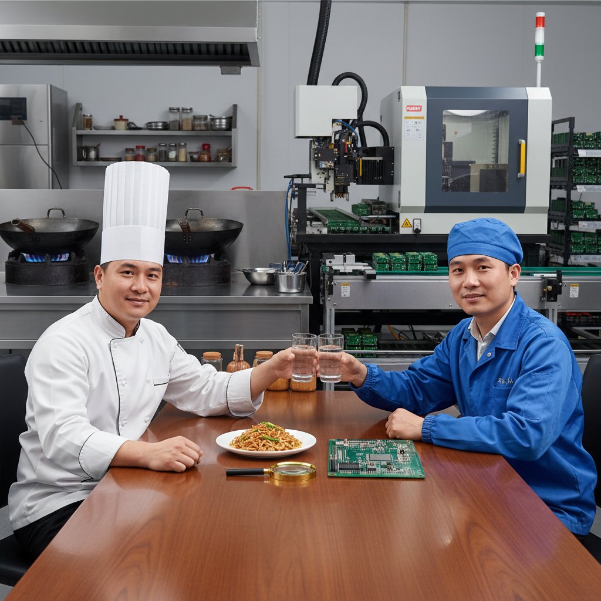

# 文明的锋刃：从砧板到电路板上的千年信约

原创 傅存敬 电磁散人 2025-10-04 21:50 广东

> 原文地址: [https://mp.weixin.qq.com/s/xXiijrOUprPYBbMosOqu8g](https://mp.weixin.qq.com/s/xXiijrOUprPYBbMosOqu8g)

总会有一些不经意的时刻，文明的密码，会在最寻常的烟火处，向有心人悄然显露。

譬如，一位终日与精密电路为伴的工程师，在饭桌上凝视着一片菱形的姜。他看到的，不再是佐料，而是一个古老的契约——关于“有用”与“无扰”，关于“介入”与“隐退”。这枚小小的姜片，竟成了一把钥匙，开启了一场横跨千年的对话，对话的另一端，赫然是我们案头那片沉静无声的PCBA。

这莫非只是一种巧合？不，这是一种文明的“道”，在不同时空的共鸣。

**一、匠心的渡口：从手掌到心传**

我们常说“匠心”，但它的源头何其深邃。它首先不是一种技术，而是一种**体贴**。

那位切姜的厨师，他的刀锋之下，是对食客感受的深切体谅。他知道，姜的使命是赋予菜肴灵魂的香气，却不能让自己的辛辣霸占味蕾。于是，他用一种最费工、最考究的形状，为这份体贴找到了归宿。这与中国古代玉匠琢玉、瓷工制釉时的心境何异？他们穷尽一生，不让一丝多余的刀痕或釉色，惊扰了器物本该拥有的温润与完美。

今天，在各位同仁的手中，这份体贴以一种更精密的方式传承着。那涂抹在电路板上的助焊剂，不正是一位现代版的“调味圣手”吗？它必须在烈火烹油的焊接瞬间，激发出金属之间最牢固的亲和，然后，便应如晨露般悄然蒸发，了无痕迹。任何一点不舍的残留，都是对电路板“洁净之身”的叨扰，是对未来漫长岁月可靠性的潜在背叛。

这里有一种令人动容的守信：极致地奉献，然后彻底地隐退。这不仅是工艺，更是一种德行。

**二、规矩的深处：是自由，而非束缚**

总会有人问，为何要如此执着于形式？一块姜，切碎不也一样入味吗？焊点，连接上不也能通电吗？

这便是“匠”与“工”的区别了。菱形的姜片、精准的钢网开孔，这些看似刻板的“规矩”，恰恰是通往最高级“自由”的路径。

王羲之的《兰亭序》，笔笔皆有法度，却成就了千古无双的潇洒。因为他已将法度化入了呼吸，规矩成了他表达性情的翅膀。同样，当一位工程师对焊锡的张力、助焊剂的活性、炉温的曲线了如指掌，他便获得了创造“完美焊点”的自由。那饱满、光亮如初生湖月的焊点，便是他的书法，他的诗篇。

我们面对的电路，是数字世界的“经脉”。电机控制器的每一次心跳，都经由这些经脉传递。任何一处微小的“虚焊”（如同经脉的阻塞）或“桥连”（如同经脉的错乱），都可能让整个系统瘫痪。我们制定的所有严苛标准，不是为了束缚，而是为了守护一个复杂系统得以优雅运行的根本秩序。这是工业时代的“礼”，一种对规律的敬畏。

**三、无痕的境界：文明跋涉的终点**

于是，我们触摸到了那个核心的词汇——“无痕”。

这是东方美学乃至东方哲学的一种极高追求。好的绘画讲求“气韵生动”，笔法隐于意境之后；好的建筑讲求“天人合一”，人工融于自然之中。我们最高的技艺，是让技艺本身消失。

一片优秀的PCBA，正是如此。当它被装入电机控制器，深藏在汽车的引擎舱或机器人的关节内时，没有人会看到它上面曾发生过多么惊心动魄的物理与化学变化。用户按下一个按钮，电机便精准、安静、有力地运转。这份举重若轻的可靠，正是“无痕”境界在现代工业上的完美体现。

它意味着，我们已经将所有的复杂、所有的挑战，都安顿在了产品诞生之前。最终呈现给世界的，是一种不露声色的强大，一种值得托付的平静。

**结语**

所以，诸位同仁，当我们俯身于显微镜下，或凝视着炉温曲线时，我们参与的，早已不止是一门技术。

我们是在用现代的材料，延续着一个古老的承诺：用最大的诚意，做最隐形的守护。从厨师的砧板到我们的工作台，那条名为“匠心”的河流，从未断流。它流过青铜时代的范铸，流过宋瓷时代的窑火，今天，流到了我们的电路板上。

这条河，流淌的是中国人对“恰到好处”的深刻理解，是对“功成弗居”的集体人格的一种践行。

愿我们都能听见这水流的声音。那么，指尖的每一个焊点，便不仅是技术的达成，更是一次与千年文明的握手。

（AI生图）