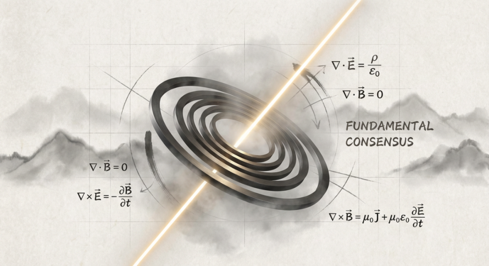

# 是谁，编写了电磁感应的“源代码”？

原创 傅存敬 电磁散人 2025-12-14 07:06 广东

> 原文地址: [https://mp.weixin.qq.com/s/EFI\_dudaqecgzMV6EQisCg](https://mp.weixin.qq.com/s/EFI_dudaqecgzMV6EQisCg)

我是一名电机控制工程师，也是一名技术团队的负责人。

我的日常，是和永磁同步电机、无刷直流电机打交道，思考的是如何用更精妙的算法，让电流与磁场跳出一支更高效、更稳定的舞蹈。我相信在座的各位同行，闭着眼睛都能画出FOC的矢量图，清楚地知道SVPWM的每一个开关状态。

但今天，我想和各位同仁以及技术管理者聊的，不是某个具体的控制难题。而是几日前，在控制现场某个突然抓住我、并从此挥之不去的问题。

那晚，我在搭建一台高精度伺服电机的控制系统仿真模型。看着虚拟示波器上完美的正弦反电动势波形，一个念头毫无征兆地击中了我：

**我们所有的理论、所有的代码，都建立在“电能生磁，磁能生电”这个基石之上。可是，是谁，赋予了电“生”磁的这种“能力”？又是谁，确保了这种“能力”在整个宇宙中如此可靠、从不违约？**

我知道麦克斯韦方程组，我理解洛伦兹协变性，我明白电场和磁场不过是同一张“电磁场”脸孔在不同观察角度下的表情。作为工程师，我满足于这个模型完美无缺的精确性。

但作为一个人，一个习惯于追溯事物根源的人，我不满足了。公式描述了“**如何生**”，但没有回答“**为何能生**”。这就像我拿到了一段世界上最精妙的、毫无Bug的代码，它能完美运行，但我却看不到它的**编译器**，更不知道它的**编程语言的设计者**是谁。

这个困惑驱动我去接触了一些看似远离工程的知识。直到我听到一位长者的讲座：

“一切法从心想生”

“唯心所现，唯识所变”

请不要误会，我不是在宣扬玄学。这位长者，和这个观点给我带来的震撼性启发，在于其中一个关键概念：“**共业所感**”。

我们所处的这个稳定、可理解、遵循着物理规律的世界，其实是一个庞大而坚固的“**共识现实**”。就像一场规模无限的多人在线游戏，我们所有人（乃至所有生命）因为某种深层的、相似的“初始设置”（即共业），共同登录到了这个“服务器”里。

在这个服务器里，**电磁感应，就是写死在最底层的、不可更改的物理引擎规则之一。**

那一刻，我豁然开朗。

我们电机及控制器行业的所有辉煌——从特斯拉的交流电机到今天的高速电驱，我们所有的争论、优化、迭代，都发生在一个**默认的、无争议的共识框架之内**。这个框架，就是包括电磁学在内的一整套物理规律。我们从未怀疑过它，就像鱼不会怀疑水的存在一样。

但问题是，**只会在水里游泳的鱼，无法想象陆地。只会在现有规则下优化的工程师，难以成为规则的突破者。**

这个思考，彻底改变了我作为技术负责人的视角：

**1\. 从“应用者”到“审视者”。**

我不再仅仅把自己视为物理定律的“应用者”。我开始像一个架构师审视开源代码一样，去审视我们行业所依赖的这些“底层共识”。硅基功率器件的瓶颈、稀土永磁材料的约束、传统传动结构的局限……这些不再只是“需要克服的困难”，而更像是我们这个“共识现实版本”的**系统特性**。看清系统特性，才能判断哪些是能优化的参数，哪些是必须切换赛道才能跨越的边界。

**2\. 寻找“共识”的裂缝与迭代信号。**

如果现状是一个“稳定共识”，那么下一代技术革命，必然始于“新共识”对“旧共识”的冲击。宽禁带半导体（SiC, GaN）在做的，是试图重写“能量转换效率与频率”的共识；特斯拉人形机器人Optimus在试探的，是“电机驱动与人体运动力学”结合的新共识。我们的研发雷达，不能只扫描现有赛道上的对手，更必须扫描那些可能**定义新赛道**的“共识裂缝”。

**3\. 用“规则层思维”进行战略预判。**

当我看到行业里都在卷电机的某个百分点的效率提升时，我会问：这尚在现有规则框架内。那么，**五年后，颠覆我们这个框架的“新物理”或“新工程共识”可能是什么？** 是超导技术普及带来的零电阻共识？是材料突破彻底改变磁路设计的共识？还是“软件定义运动”彻底解耦硬件与功能的共识？

这种思考，不是让我去从事物理学基础研究，而是让我在规划技术路线图时，多了一个维度。我会在“延续性创新”的路径旁，刻意留出资源，去探索那些可能指向“共识迁移”的颠覆性路径。因为真正的技术领导力，不在于在别人制定的规则里做到第一，而在于**参与甚至引领下一套规则的定义**。

回到那晚的问题。我可能永远无法用工程语言写出电磁感应“源代码”的答案。但追寻这个答案的过程，已经给了我远超答案本身的馈赠：

它让我对我的专业，产生了深深的敬畏——我们驾驭的，是人类文明与宇宙底层共识之间最壮丽的对话。

它也让我的眼光，越过了眼前的示波器波形和代码行，看到了我们这一代工程师，正在共同编写着**下一个时代工业文明的“共识”草案。**

各位同行，各位技术的决策者们，当我们下一次为选择一个控制芯片或一种磁钢牌号而争论时，或许我们也可以偶尔停下来，一起问一问那个“大问题”：

**“支撑我们今天所有选择的那个最根本的‘共识’，是什么？而在它之外，光，可能从哪里来？”**

追问者或许孤独，但从未走错方向。因为世界，永远奖励那些看清舞台，并敢于为下一幕重新布置灯光的人。

**—— 与所有在代码与电磁场中，追寻光亮的同行共勉。**

