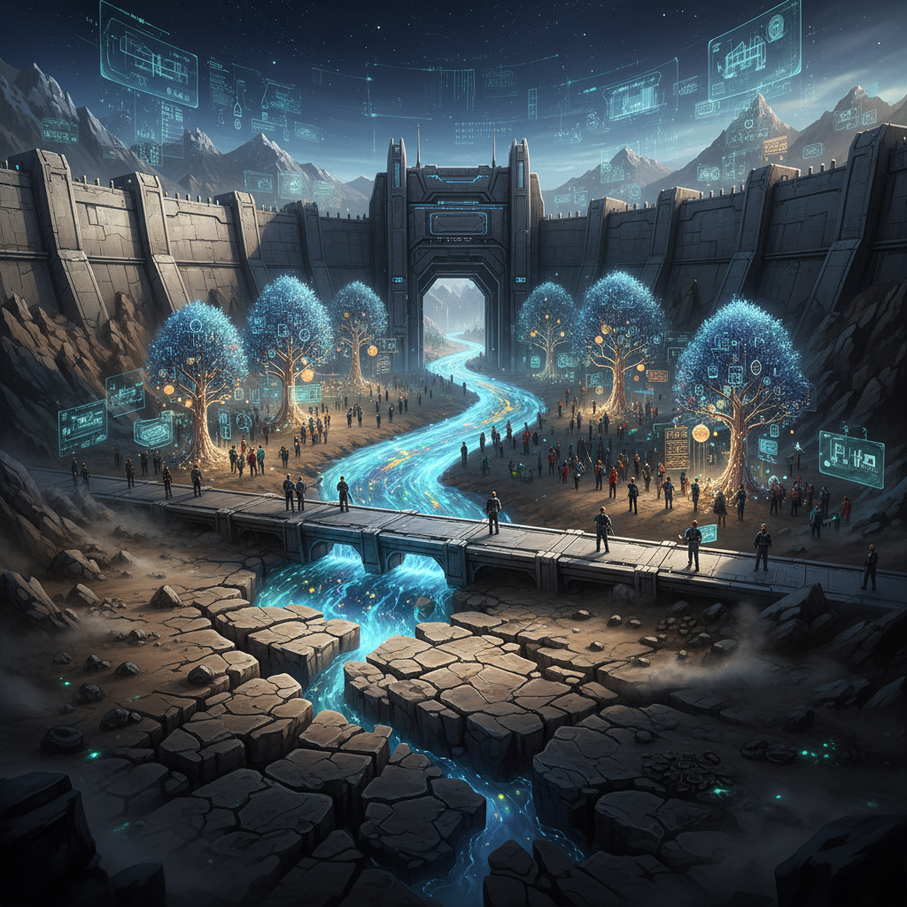

# 电机及其控制器行业的护城河，该换水了

原创 傅存敬 电磁散人 2025-10-18 07:06 广东

> 原文地址: [https://mp.weixin.qq.com/s/RF5YQ5YHnAfbT8zmMevo7Q](https://mp.weixin.qq.com/s/RF5YQ5YHnAfbT8zmMevo7Q)

> 你的图纸和代码，可能正在成为“不动产”。而真正的资产，正以光速在你同事的大脑里奔流。

最近，一位在智能控制器头部企业工作的工程师朋友，和我分享了他的困扰。

他的公司是行业标杆，一举一动都被友商效仿，核心员工也被频频挖角。老板一怒之下，成立了商密保护科室，给所有电脑装上监控软件，加密所有技术文件，特别是源代码。

但他却感到一丝忧虑。他说：“在AI技术大爆发的今天，源代码正变得一文不值。真正值钱的，是我们这些工程师对行业、对客户、对技术的理解。而这些，恰恰是加密软件永远保护不了的。”

这位工程师的思考，非常深刻。他戳中了一个关键趋势：**技术正在“平权”，而认知开始“溢价”。**

#### 1\. 你的护城河，可能正在干涸

过去，一家电机或控制器公司的核心资产是什么？是经过千锤百炼的图纸，反复迭代的源代码，是精密无比的原理图，是独一无二的算法。把这些锁在保险柜里，就守住了公司的命脉。

但这套逻辑，在今天正加速失效。

为什么？因为AI是最强大的“复制机”和“学习机”。很多过去需要资深工程师耗时数月才能搭建的代码框架和基础模块，现在可能通过几句精准的指令（Prompt）就能生成。功能的“实现门槛”正在坍塌。

当友商能通过技术手段，以极低的成本获得与你类似功能的基础代码时，你曾经引以为傲的“代码护城河”，水位正在快速下降。它依然能挡住外行的脚步，但已经挡不住内行的战舰。

#### 2\. 新的水源：从“程序”到“理解”

那么，在新的时代，什么才是无法被轻易复制、真正构成壁垒的资产？

是那位工程师说的“理解”。

-   对客户的“理解”：你的客户在特定工况下，那个让他头疼但未曾明说的抖动问题，你是如何发现并定义的？
    
-   对技术的“理解”：在永磁同步、磁阻、异步电机等多种技术路径中，你为何押注这一条？这背后是对未来成本、性能、供应链长达五年的战略预判。
    
-   对产品的“理解”：如何将客户一句模糊的“想要更稳定”，转化为一个在电磁、热、结构上达到最佳平衡的工程奇迹？这背后是无数次的失败、权衡和Know-How（技术诀窍）。
    

这些存在于工程师、产品经理大脑中的“认知”，是隐性的、场景化的、充满逻辑链条的。它无法被一段代码简单封装，它是你们公司真正的“活水”。

#### 3\. 升级你的防守策略：从“管控”到“经营”

认识到“水源”变了，守护水源的方式就必须改变。那位工程师公司的商密保护科室，就像一支忠诚的军队，但他们还在守卫一片正在盐碱化的土地，而忽略了天上正在下着的“认知雨”。

正确的做法，是进行战略升级，构建一套“立体防护体系”。

**首先，对资产进行分级：**

-   C级资产（躯体）：源代码、原理图等。策略：严防死守。继续用加密、监控等手段进行“底线防御”，其主要价值在于法律取证和防范低级风险。
    
-   B级资产（神经）：产品路线图、核心客户清单、关键技术决策文档。策略：权限管控与溯源。严格限制访问权限，并采用数据水印等技术，确保泄露后可追溯。
    
-   A级资产（灵魂）：工程师的集体智慧、对趋势的判断、失败中总结的教训、企业的创新文化。策略：这是核心战场，不能靠“管”，必须靠“经营”。
    

**如何“经营”你最宝贵的A级资产？**

**答案是：打造“价值共同体”，让活水愿意为你停留。**

-   用文化绑定：建立强大的使命感和工程师文化。让人们为“改变世界”而工作，而不只是为了一份薪水。
    
-   用机制绑定：设计长期的利益共享计划，如股权、项目分红。让员工清楚地知道，“我留下的每一个洞察，都能长成我和公司共同的果树”。
    
-   用成长绑定：提供顶尖的挑战和学习机会。让顶尖人才感到，离开这里，就是离开了行业的最前沿，是对自己才华的浪费。
    
-   用生态绑定：让核心员工参与决策，像合伙人一样思考。当他们从“执行者”转变为“建设者”，他们的洞察就自然与公司融为了一体。
    

这时，商密保护科室的职能，就从单一的“警察”，进化成了“保安”+“导游”。一方面看好家门（C级、B级资产），另一方面，要引导和赋能，与HR、战略部一起，设计和运营好那个能吸引并留住“活水”的生态系统。

#### 最后的话

所以，回到最初的问题。那位工程师的感觉没有错，旧的地图正在失效。

对于所有电机与控制器行业的从业者，无论是企业家还是工程师，现在都需要问自己一个问题：我们公司最大的财富，是保险柜里的图纸和代码，还是办公室里那些最强大脑中对未来的深刻理解？

**保护图纸，你用锁和监控。保护未来，你需要愿景和共同体。**

是时候，为你的护城河，换上新的水源了。

