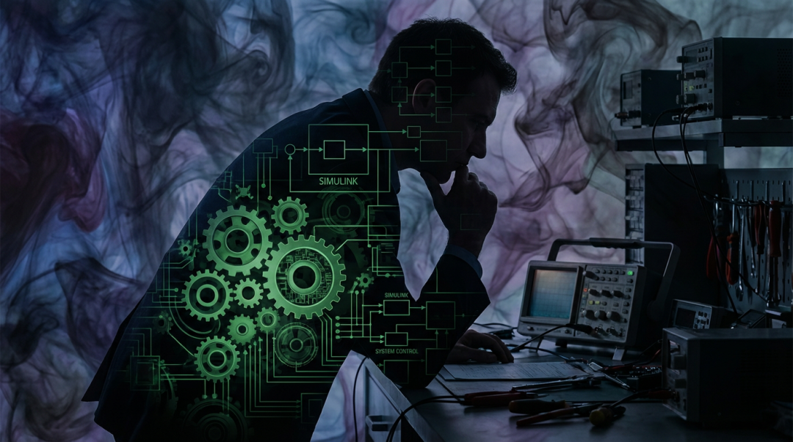
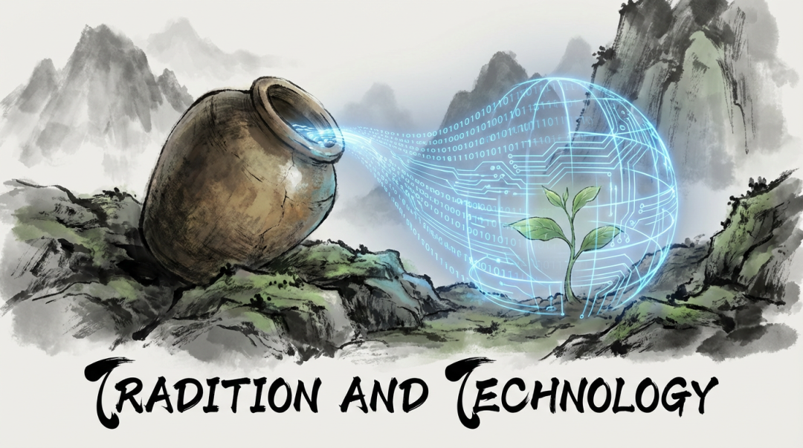
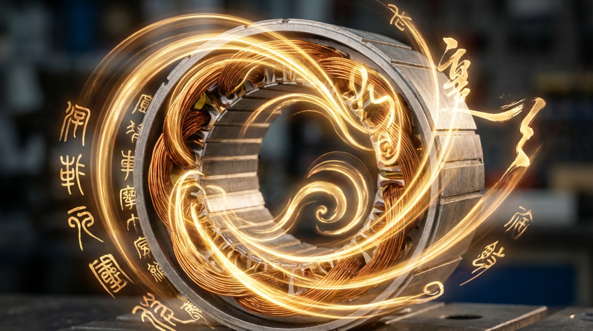

# 电机和电控那最后0.1%的效率，与抱瓮灌园的老人

原创 傅存敬 电磁散人 2026-02-08 07:06 广东

> 原文地址: [https://mp.weixin.qq.com/s/E-9fKZGHDNP1e2SLKgSWxw](https://mp.weixin.qq.com/s/E-9fKZGHDNP1e2SLKgSWxw)

最近，我常常在深夜里，盯着Simulink里那近乎完美的正弦波发呆。

作为一名经常与电机及其控制器打交道的人，我的日常就是与这些波形、与FOC、MTPA算法、与各种开关频率和损耗模型打交道。我的工作，说得好听点，是驯服电磁场的艺术家；说得实在点，是压榨电机性能的“榨汁机”。

我们这个行业，是一个对效率有着宗教般狂热信仰的领域。从最基础的 id = 0 控制，到追求最大转矩电流比的MTPA，再到复杂的弱磁控制。我们把电机的效率从95%推向98%，甚至更高。我们兴奋于每一个小数点后的进步，为了那0.1%的提升，不惜动用最昂贵的仿真软件、搭建复杂的测试平台，甚至引入神经网络去迭代一个我们自己都快无法解释的“最优解”。

团队赞许我，视我为专家。因为我能熟练地运用这些复杂的工具，在数字世界里构建一个又一个效率更高的模型。

**但我，却时常感觉自己像一个怪物。**

一个被工具异化的怪物。我们挥舞着最新、最强的“机巧”——FEA软件、第三代半导体、液冷方案——去追求一个看似无比正确的终极目标：极致的效率。然而，当手段的复杂性远远超过了目的的纯粹性时，一种巨大的荒谬感便会油然而生。

我们投入了顶级工程师团队数月的时间、消耗了大量的电力和材料，去换取那0.1%的效率。这在商业汇报上是亮点，是“技术壁垒”。但在一个更宏大的、关于能源和生命的尺度上看，这是否是一种更高级的“暴殄天物”？

这种感觉，让我想起了《庄子》里的一个故事：抱瓮灌园。

**从“抱瓮”到“机心”的陷阱**

子贡看到一位老人用最笨拙的方式，抱着瓦罐去井里打水，一次次地浇灌菜园。他建议老人使用“桔槔”——一种利用杠杆原理的汲水工具，省时省力。

老人的回答，在两千多年后的今天，依然像一声惊雷在我耳边炸响：

> “有机械者必有机事，有机事者必有机心。机心存于胸中，则纯白不备。”

有了巧妙的工具，就会有效率的算计；有了算计，内心就不再纯粹。

这不就是我们正在经历的吗？

“桔槔”就是我们的Simulink，我们的JMAG，我们的PSIM，我们的神经网络。它们本身是中性的，是伟大的发明。但当我们把“用尽一切手段提升效率”作为唯一准则时，**“机心”就产生了。**

这颗“机心”，让我们看待世界的眼光发生了根本的变化。我们不再关心电机本身旋转的美感，不再关心能量转换的物理本质，我们只关心KPI，只关心在SPEC上那个能压过对手的数字。我们习惯了用投入产出比来衡量一切，甚至包括我们自己的工作与生活。

当“机心”主导一切，人就从工具的主人，沦为了效率的奴隶。那种深夜里的迷茫与空虚，正是内心“纯白不备”后，灵魂发出的警报。我们不是不知道这样做很荒诞，而是像那个老人说的：**“吾非不知，羞而不为也。”** 只是，我们没有“不为”的底气。

**技术之路的第三种可能——“庖丁解牛**”

那么，出路在哪里？难道我们真的要抛弃现代工具，退回去“抱瓮灌园”吗？这显然不现实，我们都有生计，有责任。

庄子其实给了我们另一条路，一个更高级的技术范式——庖丁解牛。

庖丁也是一个技术人员，他的工具是一把刀。但他解牛，十九年如一日，刀刃锋利如新。他的秘诀是什么？

> “以无厚入有间，恢恢乎其于游刃必有余地矣。”

他不是靠蛮力，不是靠更锋利的刀，而是靠**“道”**——他对牛的生理结构有着超越常人的、近乎直觉的理解。他的刀，是顺着骨骼的缝隙、肌肉的纹理游走的。

这给了我巨大的启发。

**我们电机控制工程师，不也应该成为“解牛”的庖丁吗？**

我们手中的“刀”，是PWM波，是控制算法。而我们面对的“牛”，是电机的物理本体——它的磁路、它的绕组、它的机械与热力学特性。

**第一种境界：蛮力解牛。** 这是初学者，靠加大电流，强行驱动，效果粗糙，损耗巨大。

**第二种境界：依“器”解牛。** 这是大多数工程师的状态。我们依赖强大的工具，用MTPA算法去寻找最优解，就像用一把锋利的刀切割牛体，高效，但内心充满了算计（机心）。我们关心的是刀（工具），而不是牛（物理本身）。

**第三种境界：依“道”解牛。** 这是庖丁的境界。在这一层，你不再仅仅是“使用”算法，而是与物理规律本身“共舞”。你对电磁场的理解，让你能直觉般地感知到能量在电机内部最顺畅的流动路径。你的代码，不再是生硬的指令，而是引导能量的诗句。效率的提升，不再是暴力压榨的结果，而是顺应“物理之天理”后，自然而然的美妙副产品。

在“庖丁”的境界里，技术不再是冰冷的“机巧”，而是蕴含着“道”的艺术。你依然在追求效率，但你的内心不再是焦虑的“机心”，而是洞悉规律后的从容与喜悦。

**写给同行的你，也写给行业操盘手**

如果你现在是一位奋斗在一线的工程师，请不要因为内心的迷茫而否定自己的价值。恰恰相反，这种痛苦证明了你的灵魂还没有被工具完全吞噬。在追求技术精进的同时，请留一方“精神的自留地”。

在工作中，试着用“庖丁”的心态去对待你的被控对象——电机，去感受物理规律之美，这能为你的工作注入灵魂。

在生活里，请允许自己做一个“抱瓮灌园”的人。放下效率的执念，去做一些无用的、纯粹为了乐趣的事。去爬山，去钓鱼，去陪伴家人，而不是计算陪伴的“有效时间”。工作是“入世”的手段，而生活是“出世”的归宿。

如果你现在是一位带团队的管理者，甚至是行业的操盘手，我恳请您在制定KPI和技术路线图时，除了关注那最后的0.1%，更能看到背后的人。看到工程师们在“机心”的困境中的挣扎。

请多鼓励那些对底层物理有深刻洞见的“庖丁型”人才，而不仅仅是熟练操作工具的“工匠”。请在团队里，除了讨论“如何实现”，也多讨论“我们为何要这么做”。一个伟大的产品，不仅要有顶尖的性能（术），更要有正确的价值观（道）。

因为，当一个行业只剩下对效率的偏执，而失去了对人本身的关怀时，它的创新源泉，也终将枯竭。

我们都在一条滚滚向前的技术长河里，我们无法让河流停下。但我们可以选择自己是以“机心”被裹挟，还是以“道心”去游弋。

愿我们，都能在深夜的波形里，找到内心的平静。

