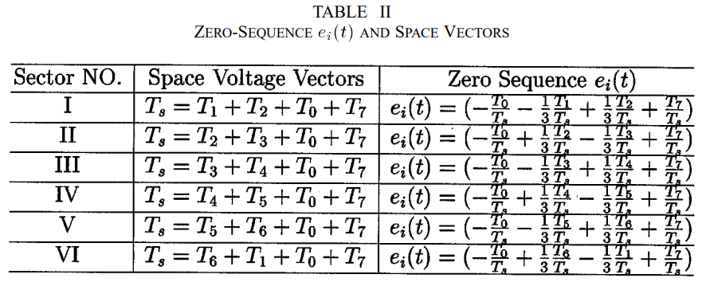
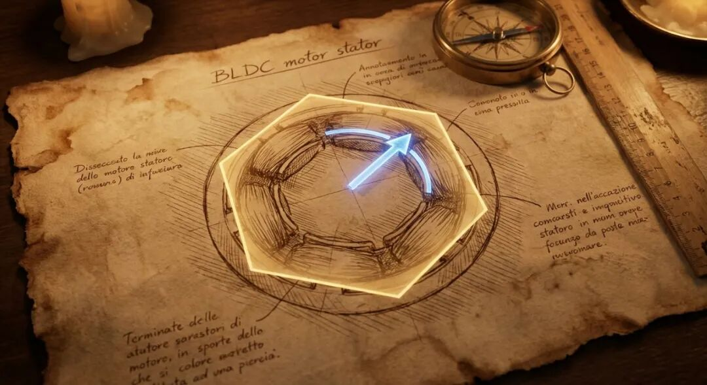
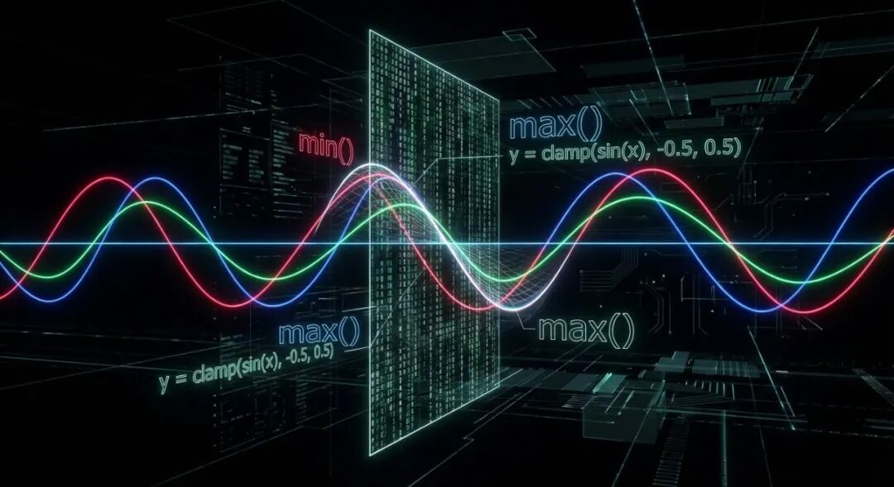
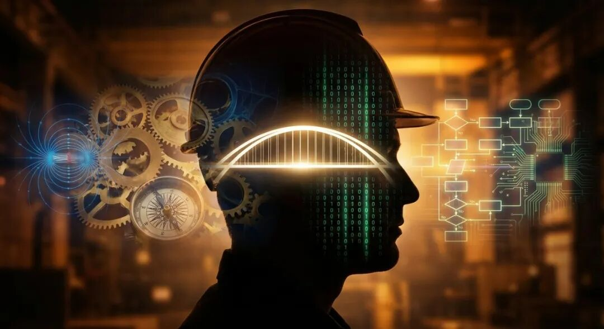
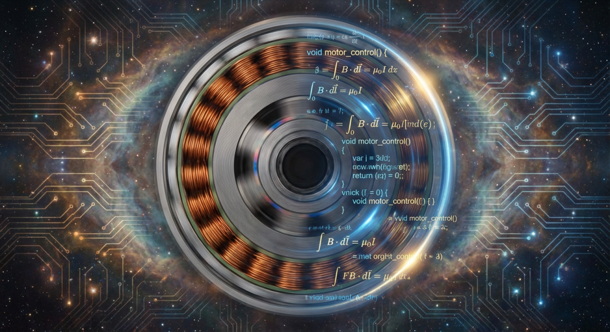

# 电机控制器的两颗“灵魂”：一位电控工程师的沉思

原创 傅存敬 电磁散人 2026-01-31 07:06 广东

> 原文地址: [https://mp.weixin.qq.com/s/mN9BwMKe-I2HM3zYoF2fEg](https://mp.weixin.qq.com/s/mN9BwMKe-I2HM3zYoF2fEg)

最近，我又一头扎进了电机控制最基础的PWM调制技术里。

不是为了解决什么紧急的项目难题，也不是为了应付某个技术评审，就是那种纯粹的、一个工程师在夜深人静时，重新审视自己“手艺活”的冲动。我对着一篇经典的[学术文献](https://mp.weixin.qq.com/s?__biz=MzE5MTYzNjgzOA==&mid=2247485306&idx=1&sn=bf7ba061acfec735abe64e7545c31d6b&scene=21#wechat_redirect)，和一个看似简单的公式，陷入了长时间的思考。

这个公式，就像一个谜题的入口，引着我穿过熟悉的工程代码，回到了那个由物理定律和数学构建的、我们技术世界的原点。而这次回溯，让我对我们每天都在做的工作，有了一点新的感悟。

我想，每一个做电机控制的工程师，内心深处可能都住着两个“自己”。一个，是物理学家；另一个，是数学家。

**物理学家的“自己”，钟爱着鲜活的几何。**

当我们谈论SVPWM时，这个“自己”就苏醒了。他看到的，是一个在定子坐标系下旋转的电压矢量，像一个无形的手，牵引着转子上的磁极，产生我们想要的转矩。

他痴迷于扇区（Sector）的划分，因为那代表着空间；他推算着矢量作用时间（T1, T2, T0），因为那代表着力的持续与合成。每一个开关状态（000到111），在他眼里都是一个明确的、具有大小和方向的力。他用这些“力”的积木，在一个极短的周期内，严丝合缝地搭建出一个等效的、指向任意方向的、大小可控的“合力”。

这是一种“眼见为实”的踏实感，是欧几里得几何般的直观与优雅。这个圆和正六边形，是用圆规和直尺，一步步画出来的。这套语言，是电机的语言，是物理世界的语言。我们这些电气工程专业毕业的人，天生就觉得亲切。

**但我们身体里，还住着另一个“自己”——那个精于计算的数学家。**

当我打开一份业界流传甚广的工程代码，试图寻找SVPWM的踪迹时，却找不到扇区、找不到T1/T2、找不到任何几何的影子。我看到的，是min()、max()，和一堆看似毫无物理意义的加减乘除。

这就是数学家的“自己”登场了。他用一套完全不同的语言——解析几何，来描述同一个世界。

他不管什么空间矢量，他只关心一个问题：三相正弦调制波，如何才能在不“削顶”（过调制）的前提下，获得最大的幅值？

他发现，三相电压并非完全独立，它们之间存在一个“冗余”或者说“自由度”——那个共同的零序分量。只要三相电压同时加上或减去一个相同的值，它们之间的“差值”（线电压）是不会变的。而电机，恰恰只关心线电压。

于是，他施展了一个绝妙的“代数魔法”：在每个瞬间，计算出三相波形中的最大值（u\_max）和最小值（u\_min），然后给三相同时注入一个精心计算的偏置（零序信号），把整个三相波形“托”起来或者“压”下去，确保它们恰好被“夹”在逆变器输出能力的上下限之间。

这个过程，没有扇区，没有矢量合成，只有冰冷的代数运算。x² + y² = r²，这就是他画圆的方式。简洁、高效，没有三角函数，没有复杂的逻辑分支，全是MCU最喜欢的简单指令。这是代码的语言，是效率的语言。

**那么，我们是谁？我们是站在几何与代数交汇处的“翻译官”。**

我们这两颗“灵魂”的对话，构成了我们职业成长的全部。

一个刚入行的电机控制工程师，可能精通其中之一。他或者能画出漂亮的矢量图，却对min/max代码的物理意义感到困惑；或者能熟练地编写高效的零序注入代码，却解释不清它为何等效于SVPWM。

而一个资深的专家，一个真正的技术操盘手，他的价值，就在于能让这两个“自己”在体内和谐共存，无缝切换。

他能从min/max的代数运算中，瞬间“看见”那个正在第一扇区旋转的电压矢量；也能在手绘矢量图时，脑海里已经浮现出等效的、最低开关损耗的零序波形。

他理解，所谓的“底层逻辑”，就是认识到“几何”与“代数”不过是描述同一个物理规律的两种不同语言。**抽象，是效率的来源；而具象，是创新的根基。**

对于一线的工程师而言，这意味着，我们的价值不仅在于写出高效的代码（数学家），更在于深刻理解代码背后的物理世界（物理学家）。这种贯通，能让我们在面对奇异的振动、莫名的谐波时，拥有直抵问题核心的洞察力。

对于一个技术领导者而言，这意味着，你的团队里，既要有“仰望星空”的物理学家，也要有“脚踏实地”的数学家。你需要搭建一座桥梁，让两种语言可以自由交流。你需要告诉大家，我们追求的，不仅仅是让电机“转起来”，更是要以最深刻的理解，去驱动这个世界。

我想，这或许就是工程技术最迷人的地方。它不是非此即彼的选择题，而是在看似矛盾的视角中，发现统一与和谐的无尽旅程。

代码是方程，旋转的电机是那个圆。而我们，有幸能同时看见。

