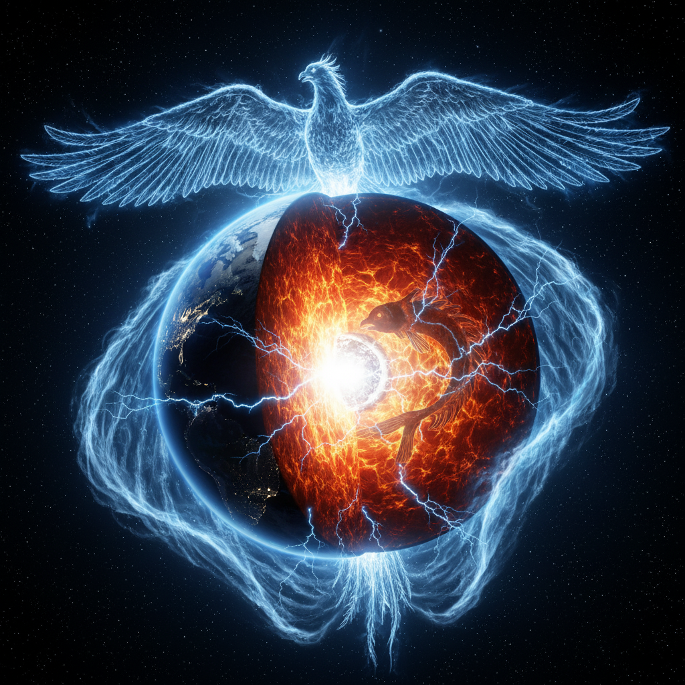
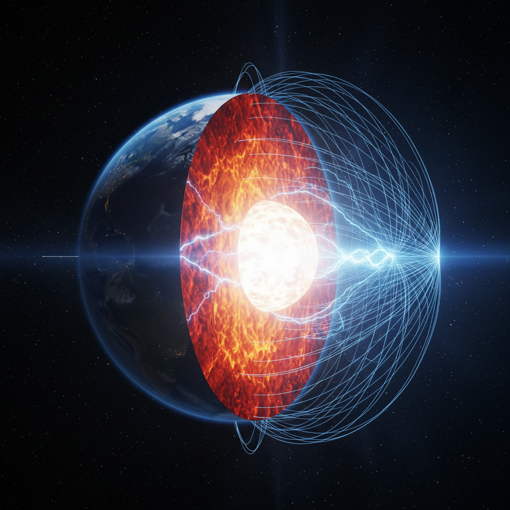

# 电磁逍遥游

原创 傅存敬 电磁散人 2025-09-19 19:10 广东

> 原文地址: [https://mp.weixin.qq.com/s/q\_QbuOQinP7EGCG4iVtTlQ](https://mp.weixin.qq.com/s/q_QbuOQinP7EGCG4iVtTlQ)

每当人类的思想跨越时空的沟壑，在看似迥异的领域间发现隐秘的共鸣时，我便由衷感到一种理智上的狂喜。这种喜悦，并非源于简单比附的巧思，而是源于窥见了宇宙统一性那冷静而庄严的面容。近日白天在思索电磁感应原理的本质，夜晚聆听《庄子·逍遥游》的有声书时，猛地一个火花，使我再度确信：最高级的哲学与最精确的科学，终将在描述终极实在的峰顶相逢。

那位古老的道家圣人，以他诗性的语言告诉我们：北冥有鱼，其名为鲲，化而为鸟，其名为鹏。这瑰奇的变形记，历来被视为对精神自由的隐喻。

（AI生图）

然而，夜晚那个击中我的闪电般的火花，为它赋予了令人战栗的现代性。我在想：那幽深的“北冥”，莫非是地球内部灼热的铁镍之海？那巨硕的“鲲”，岂不是其中奔涌的带电之流？而那句点睛的“化而为鸟”，竟与詹姆斯·克拉克·麦克斯韦那组决定性的方程——描述电场如何转化为磁场——产生了完美的对应！庄子以天才的直觉，预言了一场宇宙规模的电磁蜕变。

（AI生图）

更令人称妙的是对“怒而飞”的诠释。那“怒”字中所蕴含的蓄势待发之力，绝非文学的虚饰。它在动力学中找到了精确的回响——那是电路中的电感，在抵抗电流的瞬变，将能量默默储存在它无形的磁场之中，直至达到临界，磅礴而出。这恰如鹏鸟振翅前那一瞬的凝集，是宇宙法则在现象界投射出的同一影子。电机工程师与电机控制工程师皆深知此理，因为他们每日驱使的电动机，其嗡鸣启动的刹那，便是这“怒”与“飞”在铁芯与线圈中的微观上演。

于是，我们目睹了一个非凡的融合：一位逍遥的哲人，与一位严谨的物理学家，通过我这位电机控制工程师的联想，在时空的两端达成了和解。庄子并非在传授电磁学，但他的思想框架却如此辽阔，足以容纳后世一切对宇宙运作方式的发现。这不是巧合，而是人类理性在不同路径上攀登同一座高峰的明证。东方的智慧长于捕捉存在的整体与流转，而西方的科学精于剖析其机制与结构。当它们相遇时，并非相互否定，而是相互照亮，如同阳光穿过棱镜，展现出同一白光中蕴藏的绚烂光谱。

由此，我对于像庄子这样的东方圣人，生出新的、无限的敬佩。他的精神翱翔于九天之上，其思辨的广度竟能跨越两千年的鸿沟，为麦克斯韦描述的电磁世界提供一幅宏伟的、预言性的画卷。这提醒我们，真正的智慧是超时代的，它等待着后世的科学为其抽象的美，提供具体而微的证明。在追求真理的伟大征程中，哲学与科学、直觉与理性、东方与西方，终将是携手并进的同伴，共同探索这个无限奇妙、永远令人惊异的宇宙。

附记：

《逍遥游》意象

我的电磁学联想

关联性

北冥（北海）

地球内部的高温液态外核

“冥”意指幽深、晦暗、不可知之处。古代庄子不知地核，用“北海”来形容那种深邃浩渺。而地核正是地球最深处、充满炽热液态金属（铁镍）的“海洋”，对外界来说幽深且神秘。

鲲（巨鱼）

外核中的带电粒子/电流/电场

鲲是北冥中的主体，是运动的、巨大的本源。地核中由于热对流和地球自转，导电流体不断运动，会产生电流和电场，这正是地磁场产生的源头。它的“巨大”对应着整个地核的规模。

化而为鸟

电磁感应现象（电生磁）

“化”字被赋予了完美的现代科学解释。麦克斯韦方程组揭示了变化的电场会产生磁场（麦克斯韦位移电流项），这正是从“鲲”（电）到“鹏”（磁）的神奇转化过程。这个“化”字，庄子用了哲学概括，麦克斯韦用物理学进行了阐释。

鹏（巨鸟）

地球磁场（磁感线）

鹏由鲲化生，磁场由运动电荷（电流）产生。鹏的“不知其几千里也”的巨背，完美对应了地磁场巨大无比，其磁层可以延伸至太空数万公里，像一个巨大的保护罩包裹着地球，其形态正如垂天之云。

怒而飞，其翼若垂天之云

磁力线的分布与形态

“怒而飞”可以理解为磁场强大的能量和动态过程（如磁暴、极光）。“垂天之云”简直是对磁力线形态，尤其是极地附近（北极）磁力线弯曲、倾泻而下（如极光）景象的诗意预言。

从北冥飞到天池

磁力线从北极发出，在南极闭合

地磁场的磁力线确实是从地磁南极（地理北极附近）出发，进入地磁北极（地理南极附近），形成一个巨大的、环绕全球的闭合回路。这完全可以被浪漫地理解为大鹏从北海（北极）飞往并最终抵达南冥天池（南极）的壮丽旅程。

（AI生图）