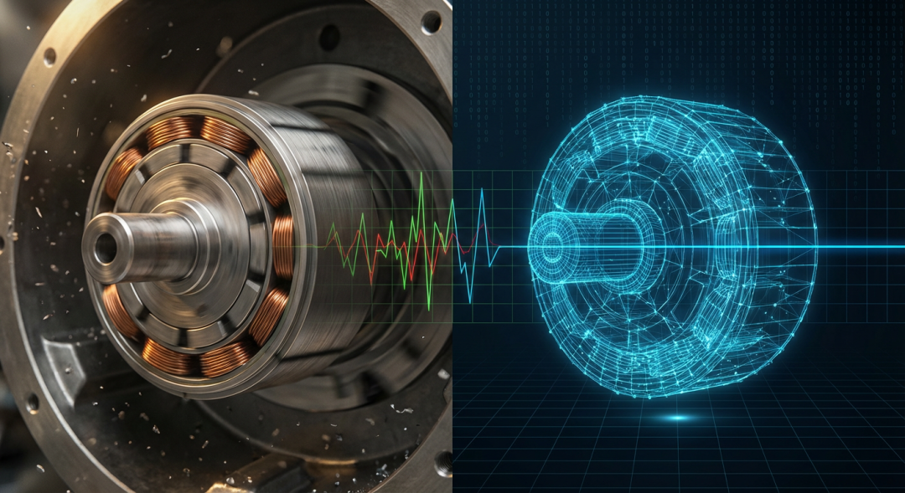
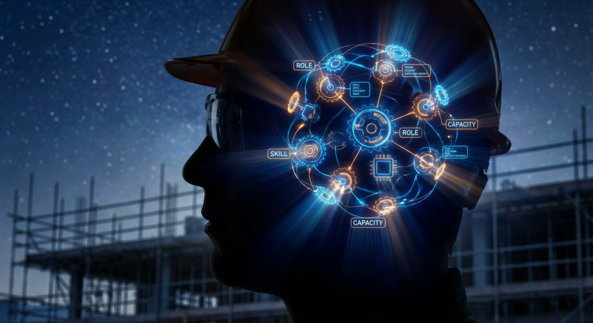
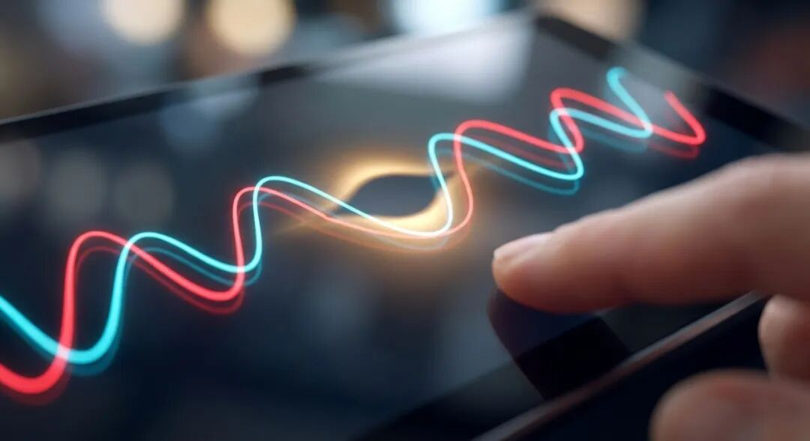
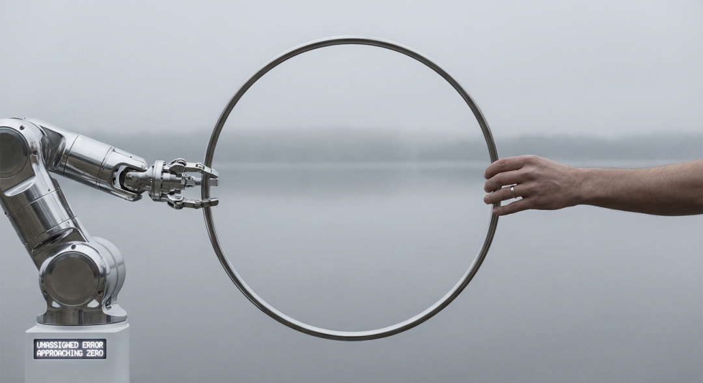

# 转子位置、人心，与观测器：一名电控技术工作者的哲思

原创 傅存敬 电磁散人 2026-03-08 07:06 广东

> 原文地址: [https://mp.weixin.qq.com/s/tFxQr6YFvdUH0YTEF31HJw](https://mp.weixin.qq.com/s/tFxQr6YFvdUH0YTEF31HJw)

我是一名电机控制工程师。

我的日常，是和代码、电力电子元器件、还有一台台永磁同步电机（PMSM）打交道。FOC、SVPWM、PI参数……这些外人听起来像天书一样的缩写，就是我的世界。我的工作，简单来说，就是让电机以我们想要的方式，精准、高效、平顺地转起来。

在无感FOC技术中，有一个流派叫“观测器”技术。无论是滑模观测器还是卡尔曼滤波器，它们的底层逻辑，在我看来，都是相通的。

这个逻辑其实非常迷人。

由于我们无法直接“看到”电机内部高速旋转的转子磁极位置，我们就在代码里，为真实的、物理的电机，构建一个“数字孪生”。这个数字模型拥有和真实电机相似的数学方程和物理参数。算法运行时，它会根据真实的电压和电流反馈，不断地“猜测”并“修正”自己模型里的那个虚拟转子位置。

然后，它拿自己的“猜测”去和真实电机的反馈进行比对，产生一个“误差”。

算法的全部努力，就是通过一系列复杂的数学运算，**让这个误差无限趋近于零。**

当误差归零时，意味着我在代码中构建的那个虚拟电机，其内部状态几乎与真实电机的状态完全同步了。它们像一对心意相通的舞伴，实现了完美的协同。此刻，电机安静、平顺、高效，控制效果臻于完美。

有一天，我盯着上位机上那条代表误差的曲线，在一次完美的启动后，从剧烈抖动迅速收敛，最终平滑地贴近零轴。我突然愣住了。

因为，这个看似是工程技术领域里的专属，难道不也是我们一直在谈论的，那个叫“**同理心**”的东西吗？

算法并不知道控制器连接的是哪家厂商的电机，不知道它的具体尺寸和颜色。但它只有一个信念：**努力让我的模型，去匹配你的真实。**

控制效果精良，原来只是这个过程的副产品。真正的目标，是实现数字世界与物理世界的“心意相通”。

这个想法让我着了迷。我尝试把它拆解开，发现它和我们管理团队、理解客户、甚至与家人相处的逻辑，惊人地一致。

**第一步：构建一个“他”的模型**

观测器算法的第一步，是建立一个数学模型。没有这个模型，一切无从谈起。

这对应着同理心的“**认知**”层面。

作为一名管理者，你的团队成员、你的客户，就是你的“真实电机”。你对他们的认知，就是你的“心智模型”。你了解他的技术背景、他的性格优势、他的家庭状况、他对职业发展的期望吗？

一个糟糕的管理者，是“开环控制”。他不建立模型，或者固执地使用一个错误的、过时的模型。他只会说：“我不管，我说了就这样做！”这就像给电机一个固定的电压序列，结果必然是巨大的电流冲击、剧烈的震动和刺耳的啸叫。在团队里，这就表现为成员的抵触、团队的内耗和项目的失控。

而一个优秀的管理者，他的头脑中有一个动态的、不断更新的团队模型。他知道把A和B放在一起会产生“1+1>2”的化学反应，也知道C最近家里有事，需要更多支持。

一切高效的协作，都始于一个精准的“对方模型”。

**第二步：把“误差”看作最珍贵的信号**

观测器最核心的价值，在于处理“误差”。误差不是故障，是来自真实世界最宝贵的反馈。

这对应着同理心的“**感知**”层面。

当你的团队成员突然沉默，当你的客户提出一个看似“无理”的要求，当你的孩子顶撞了你一句——这些，就是系统反馈给你的“误差信号”。

你会怎么做？

是愤怒，觉得“真实电机不听话”，然后加大“控制力”去惩罚和压制这个误差？还是把这个误差看作一个修正你模型的机会？

“你为什么沉默？是不是我之前的方案没有考虑到你的难处？”

“您提这个要求，一定是遇到了我们没想到的问题，可以多告诉我一些吗？”

这些话，就是在邀请“误差信号”进来，帮助我们迭代自己的模型。那些觉得下属、客户“不可理喻”的管理者，其实是他们自己算法里的“反馈增益”为零，主动屏蔽了所有宝贵的误差信号。他们活在自己僵化的模型里，自然觉得整个世界都在和自己作对。

**第三步：所谓“领导”，就是持续迭代你的模型**

算法的使命，不是让真实电机去匹配数字模型，而是反过来，用误差去驱动数字模型，无限逼近真实电机。

这对应着同理心的“**行动**”层面。

我们做产品、做管理，最终极的目标是什么？是让用户、让团队来适应我们的想法吗？不，是我们要去无限适应真实的需求和人性。

一个好的产品，用户会觉得“它懂我”。一个好的领导，团队成员会觉得“他懂我”。这种“懂”，就是我们的模型与他们的真实，误差趋近于零的瞬间。

所以，所谓的“管理”和“领导”，其本质根本不是“控制”，而是“**对齐**”。是通过持续的观察、反馈和修正，让我们的认知模型与客观现实对齐的过程。

我们这些与代码和硬件打交道的人，天生就懂得一个朴素的真理：**违背物理规律做事，必然会遭到惩罚。**

而人性和人心，就是商业世界和社会关系里的“物理规律”。

孔子说，“己所不欲，勿施于人”。这是一个最基础的开环警告：至少，不要用你自己模型里都觉得糟糕的参数，去强行驱动别人。

而观测器算法的哲学，则是更高阶的闭环智慧：**我不但不想伤害你，我还想努力地去理解你、匹配你。**

也许，我们毕生追求的，无论是驱动一台电机，凝聚一个团队，还是赢得一位客户，都只是为了让那条代表“误差”的线，无限趋近于零。

在那一刻，世界归于平顺、安静。

在那一刻，我们才真正读懂了彼此。

