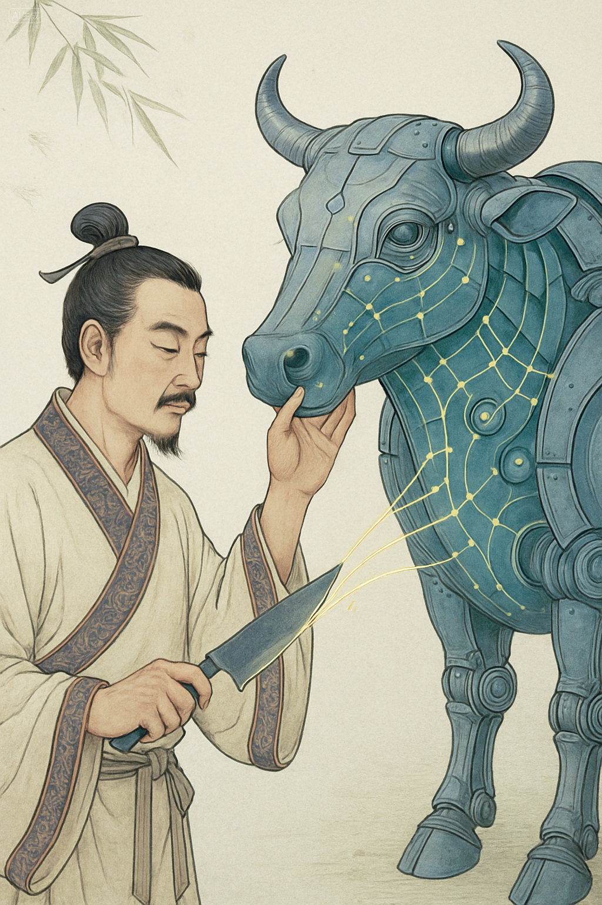

# 铜铁与思的征程：工业庖丁的哲学刀光

原创 付存敬 电磁散人 2025-08-13 20:45 广东

> 原文地址: [https://mp.weixin.qq.com/s/pahdInQbOvmNq4CsaH6xUg](https://mp.weixin.qq.com/s/pahdInQbOvmNq4CsaH6xUg)

题记：官知止而神欲行——庄子《养生主》

* * *

柏林大学图书馆的羊皮卷上，拉丁文“Philosophiae Doctor”的墨迹未干，洪堡兄弟不会想到：两个世纪后，这种追求纯粹智慧的学位，会在遥远的东方被一群身沾机油的人重新诠释。他们手中的刀，不是柏拉图的辩证法，而是示波器的探针；他们解构的牛，不是形而上的理念，而是旋转的钢铁之躯。

2024年初秋，深圳某高新技术企业的实验室里，工程师陈旋磁的指尖在键盘上翻飞。示波器屏幕里，一条失控的电流曲线正疯狂扭动——某新能源车企的驱动电机在极限转速下发出垂死的尖啸。项目总监攥紧报告：“日本专家要求更换耐温等级更高的永磁体，成本增加37%。”

陈旋磁闭目。十四年间处理过1127次电机振动的记忆奔涌而来：车间里烧焦的绝缘漆气味，高原测试时轴承的异常温升，还有三年前那个雪夜，他趴在哈尔滨试验线上用听诊器捕捉电磁谐波的场景。“再给我48小时。”他轻声说。

当日本的工程师们还在翻阅热力学公式时，陈旋磁的“解牛刀”已切入系统缝隙：他在矢量控制算法中注入一组非对称谐波，如同庖丁的刀游走于筋骨之间。次日清晨，电机在20000rpm的极限转速下平稳如静水深流——成本增加：零。

* * *

这是没有博士袍的哲学现场。当中世纪大学将“博士”定义为授课资格时，庄子早已在《养生主》中预言了另一种智慧形态：庖丁的刀刃十九年如新，因其“依乎天理，批大郤，导大窾”。今天的工业庖丁们，正用钢铁书写新的《南华经》。

第一刀：解构系统的天理

陈旋磁的工作台上永远摊开着“电机解剖图”：硅钢片叠成的定子是他的“牛脊骨”，绕组铜线是“筋膜”，气隙磁场则是流动的“气血”。当同行追逐更高控制频率时，他专注研究0.01毫米转子偏心引发的电磁力畸变——这是现代版的“彼节者有间”。

第二刀：扰动中的舞蹈

某次海上风电项目，变流器在台风天集体失效。陈旋磁力排众议要降低电流环响应速度：“让电机自己学会‘卸力’。”这恰似庖丁解牛时“怵然为戒，视为止，行为迟”的韵律。三天后，机组在十级风中摇曳如苇却不断轴，业主惊呼：“你们给钢铁注入了太极！”

* * *

工业史的暗线里，满是这类无名哲人的刻痕。日本电产（Nidec）的匠人提出“十倍法则”：技术改进成本须低于用户十年收益的10%；特斯拉工程师用碳纤维驯服每分钟18000转的离心力，实践着“以无厚入有间”的现代版。他们的论文发表在流水线上，答辩在雷暴夜的故障现场。

2019年，陈旋磁团队挑战高铁牵引电机啸叫难题。当欧洲方案建议增厚机壳时，他们却像解剖神经般追溯振动源：特定转速下，气隙磁导的39阶谐波与定子模态共振。最终用18.5Hz的相位补偿电流化解危机——如同庖丁“謋然已解，如土委地”的瞬间。

* * *

今年秋，陈旋磁站在日内瓦国际电机论坛的讲台。大屏幕展示着基于13000组故障数据构建的“电磁-机械耦合云图”，德国教授追问理论依据。他微笑：“这是庄子说的‘以神遇而不以目视’。”会场静默片刻，随后爆发出雷鸣般的掌声。

在人类认知的远征中，博士方帽与工装帽下的思考本同源而生。当陈旋磁们用纹波反推电流，用算法弥补材料缺陷时，他们手中的示波器曲线，正与公元前330年庖丁刀下的牛脊轮廓在时空深处重叠。

实验室的玻璃窗外，新一批电机即将启程奔赴新疆风场。陈旋磁抚摸着温热的机壳，仿佛触摸到钢铁的呼吸——这里跳动着工业文明最古老的哲学脉搏：真理不在殿堂的经卷中，而在实践者永不卷刃的刀锋之上。

**|注**：文中工程师陈旋磁为虚构人物，其技术案例融合多位中国电机工程师和电机驱动工程师的真实成就。

