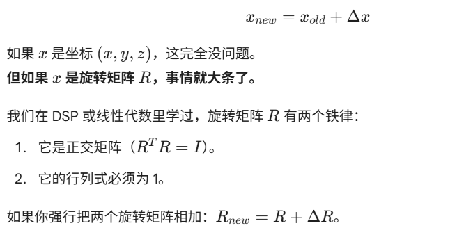
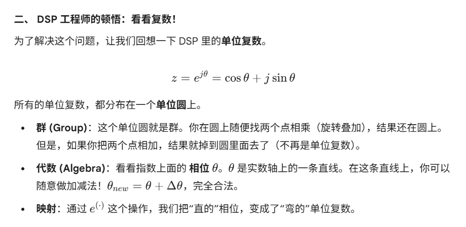
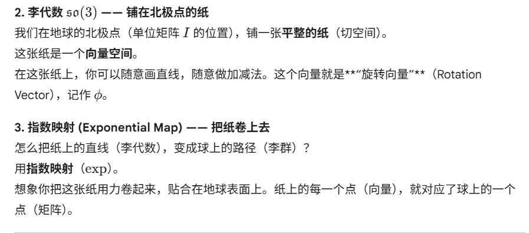
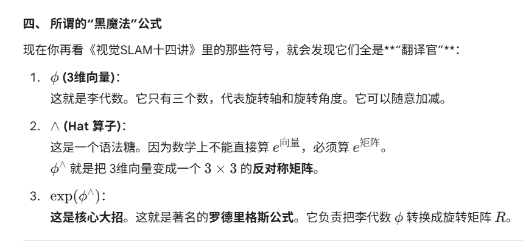
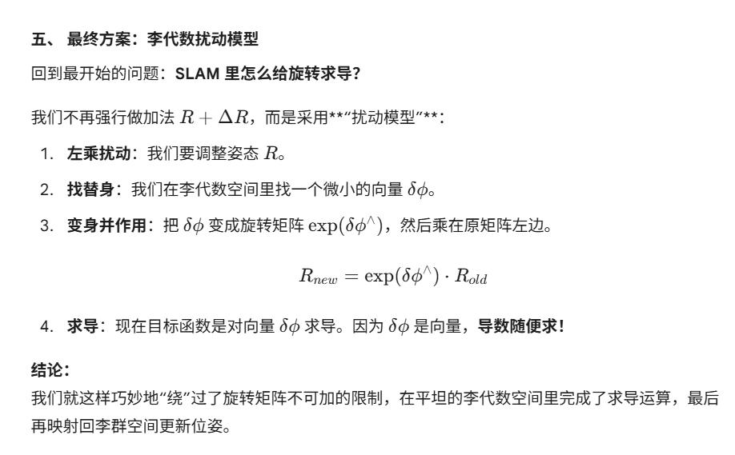
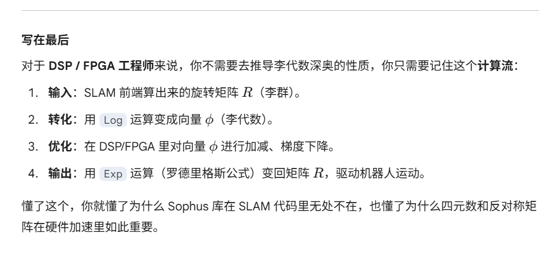

# 【SLAM硬核科普】李群与李代数：为了给“旋转”求导，数学家搞出了什么黑魔法？

原创 Frank 量子电动力学 2026-02-16 15:00 浙江

> 原文地址: [https://mp.weixin.qq.com/s/-VEf7-gO43e8sCzNHiEK5A](https://mp.weixin.qq.com/s/-VEf7-gO43e8sCzNHiEK5A)

**前言：从“一脸懵”到“原来如此”**

在《视觉SLAM十四讲》这本书里，第 4 讲“李群与李代数”通常是读者的第一道鬼门关。哪怕是数学系的学生，第一次听到微分流形、切空间、反对称矩阵这些词堆在一起时，往往也是一脸懵。

作为一名工程师，我们不禁要问：**为什么算个机器人位置，非要引入这么复杂的数学？直接用矩阵算不行吗？**

今天，我们就扔掉那些晦涩的定义，用\*\*“地球仪”**和**“复数”\*\*这两个你熟悉的工具，彻底拆解这个SLAM里的核心黑魔法

### 一、 工程师的噩梦：旋转矩阵不能“加”

SLAM 的本质是\*\*“找茬”\*\*（优化问题）。

我们要根据相机看到的图像，计算出机器人究竟在哪（位姿）。这通常是一个迭代过程：

> “现在的估计有点偏，往左挪一点点，误差能不能变小？”

用数学公式写就是梯度下降：

**恭喜你，结果 Rnew不再是一个旋转矩阵了。** 它会变形，甚至把空间扭曲，完全失去了物理意义。

**结论：** 旋转矩阵所在的那个空间，**没有加法，只有乘法**。

没有加法，就没法定义导数（导数是差值的极限）。没法求导，SLAM 就没法优化。怎么办

**这就是李群与李代数的本质：**

-   **李群** = 那个弯曲的圆（难操作，只能乘）。
    
-   **李代数** = 那条笔直的线（好操作，可以加减求导）。
    

* * *

### 三、 三维世界的“地球仪”与“地图”

把复数推广到三维旋转，逻辑是一模一样的。

**1\. 李群 $SO(3)$ —— 地球仪的表面**

想象所有的旋转矩阵 $R$ 构成了地球的表面。这是一个**弯曲的空间**（流形）。

你想从北极点往南走一点，你不能走直线（切线），否则一步就踏进太空了。你必须沿着球面走

