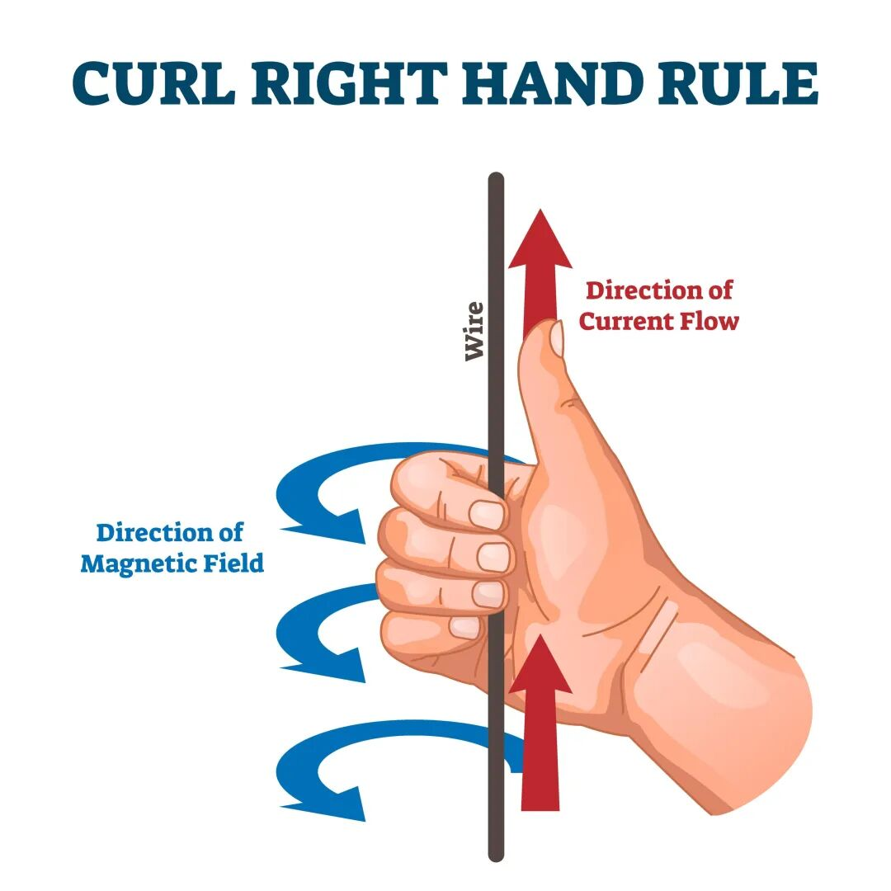

# 带你搞懂线性代数“叉积”到底在算什么

原创 Frank 量子电动力学 2026-05-22 06:38 浙江

> 原文地址: [https://mp.weixin.qq.com/s/DYxkplqU3UCdkE10dckcGg](https://mp.weixin.qq.com/s/DYxkplqU3UCdkE10dckcGg)

如果你还记得我们之前聊过的“点积”，它就像是一个“方向扫描仪”，专门用来算两个力量如果顺着同一个方向，能有多大效果。点积最喜欢平行，越平行它越高兴。

但现实生活中，很多时候**力量并不总是平行的**。比如你要推开一扇门，或者拧开一个瓶盖，如果你只顺着门的方向推，门是打不开的。你需要一个**垂直于门**的力量。

这时候，就轮到“叉积”出场了。

#### 1\. 叉积的本质：它是一台“旋转制造机”

点积算的是“推力”，**叉积算的是“旋转力”**（物理学上叫“力矩”或“扭矩”）。

**生活实例：开门** 想象一下你正在推一扇很重的门。

-   **向量 A**：代表门，从门轴（合页）指向你手推的位置（这就是力臂）。
    
-   **向量 B**：代表你推门的力气。
    

你怎么推门最省力？

-   如果你顺着门的边缘往里推或者往外拉（两个向量平行），门一动不动。这时候，点积最大，但叉积为 0。
    
-   如果你**垂直于门**去推（两个向量垂直），门最容易被推开。这时候，叉积达到最大值。
    

**叉积算出来的结果，就是衡量你这次推门能产生多大的“旋转破坏力”。** 你的推力越垂直，门轴（合页）离你推的位置越远，这个“旋转破坏力”就越大。

#### 2\. 为什么叉积算出来是一个“新方向”？

点积算完之后，结果就是一个单纯的数字（比如算出来做功是 100 焦耳）。 但是叉积算完之后，**结果不仅有大小，还有一个全新的方向（它是一个新向量）**。很多人在这里被绕晕了：为什么两个平面的东西，会生出一个立体的方向？

别急，我们还是回到开门的例子。 你推门的时候，门和你推的手，都在一个平面上。但是，**门在旋转的时候，它是绕着什么转的？** 它是绕着门轴（合页）转的！而这个门轴的方向，是**垂直于地面**的。

也就是说，你用手推门（平面上的两个向量），最终产生的结果是：门绕着一根**垂直于这个平面**的轴转动。 **叉积产生的新向量，其实就是这根“旋转轴”！**

只要有旋转发生，就必然需要一根垂直于旋转平面的“轴”。这就是为什么叉积的结果，必须是一根垂直于原来两个向量的新向量。

#### 3\. 让人头秃的“右手定则”到底是个啥？

课本里最折磨人的就是“右手定则”：伸出右手，四指从向量 A 扫向向量 B，大拇指的指向就是叉积的方向。

听起来像是在练气功，其实它就是现实生活中的“标准螺纹法则”。

**生活实例：拧螺丝/拧水龙头** 想象你拿着一把扳手在拧一颗螺丝。

1.  **向量 A**：扳手（从螺丝中心指向你的手）。
    
2.  **向量 B**：你的手推扳手的力气。
    

当你用力推扳手时，扳手开始旋转。你的右手四指弯曲的方向，就是扳手旋转的方向。这时候，你的**大拇指指向上方**。 那螺丝会怎么动？如果这是一个标准螺丝（生活中 99% 的螺丝都是右旋的），你这样逆时针拧，螺丝就会**往上升（往外退）**！螺丝运动的方向，正好和你大拇指的方向一致。

数学家们为了统一标准，就人为规定了这种“右手螺旋”作为计算方向的通用规则。**叉积的方向（大拇指的方向），就是这个数学世界里“螺丝”前进的方向。**

#### 

#### 4\. 叉积的另一个魔法：算面积

除了算“旋转”，叉积还有一个非常实用的功能，这可能是中学数学老师最爱考的：**算平行四边形的面积**。

如果你把两个向量 A 和 B 画在一个平面上，它们正好可以拼成一个平行四边形。 神奇的是，**叉积算出来的这个新向量，它的长度，恰好等于这个平行四边形的面积！**

为什么？因为算平行四边形面积是“底乘高”。而叉积的计算公式里，恰好包含了求“高”的步骤（也就是把一个向量投影到垂直于另一个向量的方向上）。

这非常实用！在电脑游戏（3D图形学）里，屏幕上每一座山、每一棵树，都是由无数个小三角形拼成的。电脑要计算这些三角形的大小和朝向，每秒钟要进行几千万次叉积运算。

#### 总结一下：点积 vs 叉积，到底有啥区别？

我们把它们放在一起对比，就彻底清楚了：

-   **点积（Dot Product）**：
    

-   **性格**：喜欢“志同道合”。越平行，效果越大。
    
-   **生活场景**：算“推车”的有效力气（做功）。
    
-   **结果**：一个单纯的数字。
    

-   **叉积（Cross Product）**：
    

-   **性格**：喜欢“对着干”。越垂直，威力越大。
    
-   **生活场景**：算“拧螺丝/推门”的旋转力（力矩）。
    
-   **结果**：一根垂直于它们的“旋转轴”（新方向），它的长度等于面积。
    

在三维世界里，点积和叉积就像是一对搭档。一个负责测量事物走向的“一致性”，另一个负责描绘事物碰撞时产生的“旋转”和“空间立体感”。搞懂了它们，很多物理和几何问题就迎刃而解了！