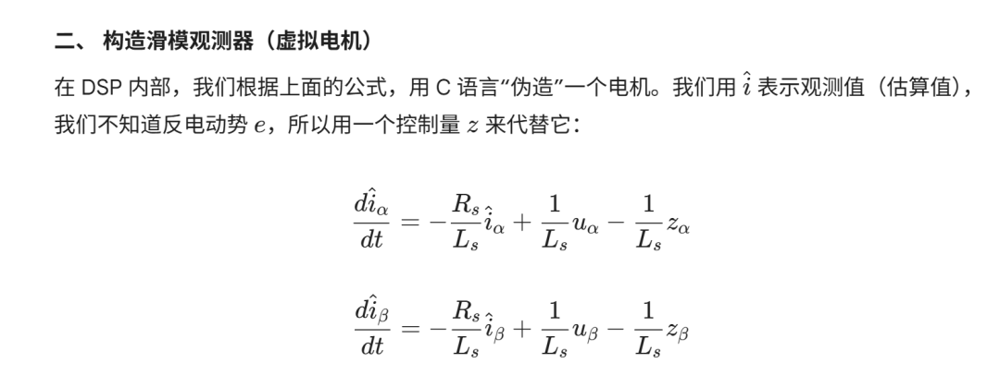
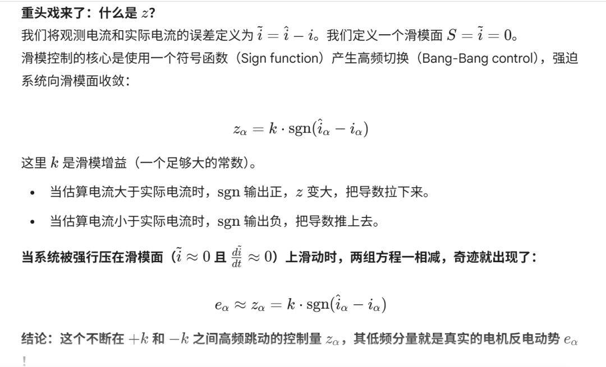
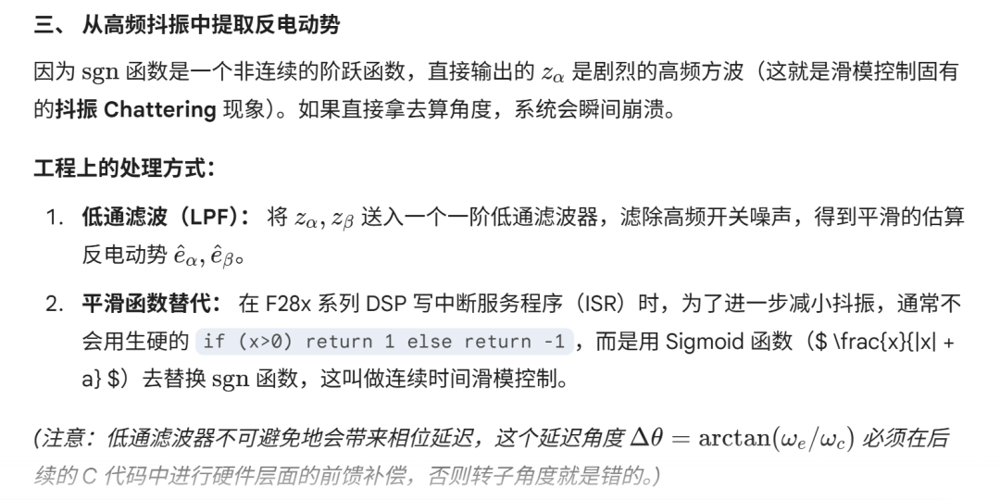
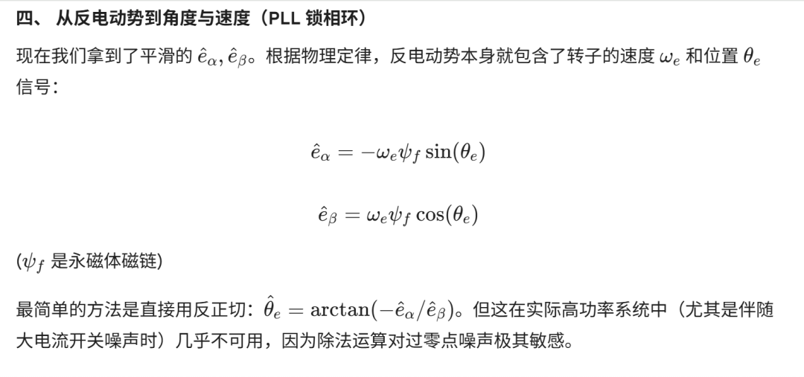
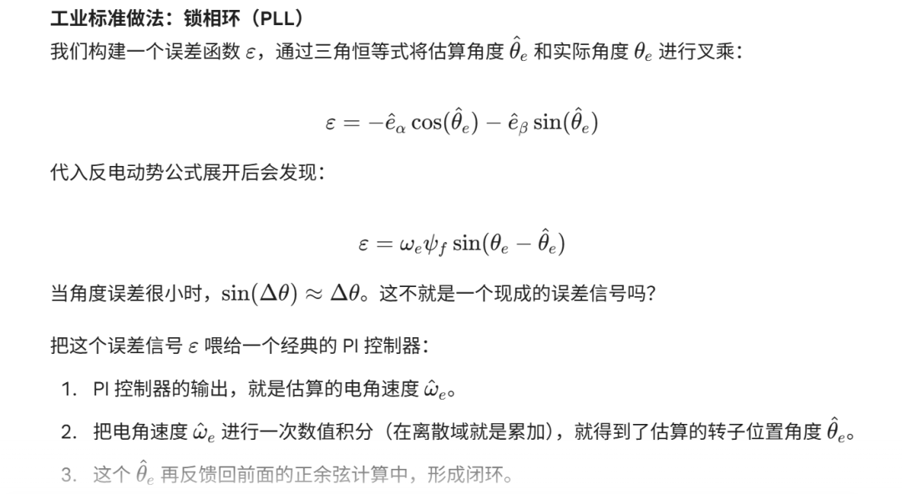

# 滑模观测器（SMO, Sliding Mode Observer）

原创 Frank 量子电动力学 2026-03-14 06:17 浙江

> 原文地址: [https://mp.weixin.qq.com/s/lOAQEnDrkNpf79MCKBwgSQ](https://mp.weixin.qq.com/s/lOAQEnDrkNpf79MCKBwgSQ)

滑模观测器（SMO, Sliding Mode Observer）是永磁同步电机（PMSM）无感控制（Sensorless Control）中最经典、在工业界应用最广泛的算法之一。

它的核心思想非常粗暴但极其有效：**“既然我测不到反电动势，那我就在代码里建一个虚拟电机。我用一个极其强势的控制手段（滑模），强行把虚拟电机的电流误差‘拍’到零。当电流误差为零时，我用来‘拍’电流的那个控制量，就是真实的电机反电动势。”**

下面我们扒开数学外衣，从物理模型到控制逻辑，再到 DSP 代码落地的细节，给你彻底讲透。

* * *

一、 核心数学模型：静止坐标系（）下的 PMSM要做观测器，首先得有被观测对象的数学模型。为了避开转子位置 （因为此时我们还不知道它），我们把电机模型建立在静止的  坐标系下。对于表贴式 PMSM（），定子电压方程可以写为：

其中： 和  是我们可以通过 ADC 采样并经过 Clark 变换算出来的已知量。 是定子电阻， 是定子电感， 是微分算子 。 就是我们梦寐以求的扩展反电动势（Extended Back-EMF）。把公式变形，写成电流导数的形式：

  

###   

* * *

### 五、 核心总结与 DSP 落地建议

1.  **本质：** 滑模观测器是一种基于**误差反馈与高频切换**的观测器结构。
    
2.  **优点：** 对电机参数（特别是电感、电阻的温漂）不敏感，鲁棒性极强，特别适合高压大电流、参数非线性的恶劣工况。
    
3.  **难点：** 抖振抑制和滤波器的相位补偿。
    

**落地实操的重点：**

在 DSP 离散化代码实现中，观测器的运行频率（例如在 ePWM 触发的 ADC 中断中执行）极大地决定了滑模的效果。如果在高频 ISR 中处理计算瓶颈，可以通过一阶前向欧拉法对公式进行离散化，并结合 IQmath 库或 FPU 硬件浮点单元来优化 PI 和三角函数（如 `__sinpuf32` 等内联汇编指令）的运算速度，以确保观测器频率跟得上系统开关频率。