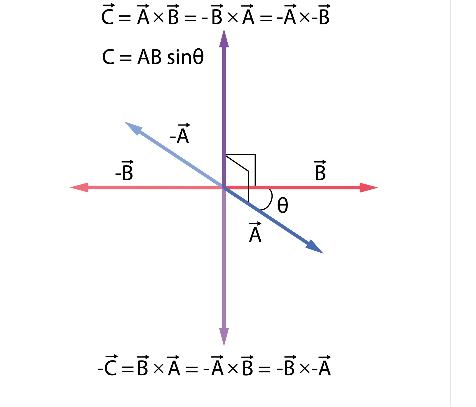

# 点积和叉积在现实世界中到底在干嘛

原创 Frank 量子电动力学 2026-05-08 10:24 中国台湾

> 原文地址: [https://mp.weixin.qq.com/s/8Xjt20-OBIxskiLC\_0WV0Q](https://mp.weixin.qq.com/s/8Xjt20-OBIxskiLC_0WV0Q)

### 1\. 点积的现实作用：算投影、看“有效性”、量相似度

点积的核心是“同向配合度”。在现实中，只要涉及到“两者方向一致才有效”的场景，就是点积的主场。

-   • **物理学：算“有效做功” (Work)**
    

-   • **场景：** 你推一辆装满砖的手推车。你的力气（向量 ）是斜向下的，但车子只能水平前进（位移向量 ）。
    
-   • **作用：** 你往下压的力是白费的，只有水平方向的力才让车前进了。点积就是用来剔除“白费的力”的。
    
-   • **公式：** 做功 。点积直接帮你算出真正产生效果的能量。
    

-   • **3D 游戏与动画：光照计算 (Lighting/Shading)**
    

-   • **场景：** 游戏里的太阳光照在人物角色的脸上，程序怎么知道哪部分亮、哪部分暗？
    
-   • **作用：** 算出光线方向向量和皮肤表面的“法线”（垂直于表面的向量）的点积。如果点积大（光线直射），表面就画得亮；点积是 0 或负数（背光），表面就画上阴影。
    

-   • **人工智能与算法：推荐系统 (Cosine Similarity)**
    

-   • **场景：** 淘宝或抖音怎么知道你和另一个用户的口味相似？
    
-   • **作用：** 把你的喜好变成一个几千维的向量，把另一个人的喜好也变成向量。算一下这两个向量的**点积（余弦相似度）**。点积越大，说明你们俩的方向越一致，系统就会把对方喜欢的商品推荐给你。
    

* * *

### 2\. 叉积的现实作用：找垂直、算扭矩、定正反

叉积的“人话版总结”：

**点积输出的是一个“数”，叉积输出的是一个“全新的向量”，而且这个新向量永远和原来的两个向量垂直（对着干）。**

如果点积是“测相似度”，那叉积就是“无中生有找垂直”。

-   • **物理学：拧螺丝与杠杆原理 (Torque / 力矩)**
    

-   • **场景：** 你用扳手拧螺丝，手握在扳手末端用力。
    
-   • **作用：** 你的力（向量 ）和扳手的长度（向量 ）如果是在同一个平面里，螺丝是怎么转进去的？螺丝是**垂直于**扳手平面往里钻的！
    
-   • **公式：** 力矩 。叉积完美描述了这种“在二维平面里用力，产生垂直于平面的三维转动效果”的现象。
    

-   • **物理学：磁场中的洛伦兹力**
    

-   • **场景：** 电子在磁场中飞过，会被瞬间“拐弯”。
    
-   • **作用：** 电子运动方向和磁场方向的**叉积**，决定了电子受力的方向。它永远垂直于运动方向，所以它只改变方向，不改变速度。
    

-   • **3D 建模与计算机图形学：找“正面”和碰撞检测**
    

-   • **场景：** 在 3D 游戏里，所有的模型都是由无数个小三角形拼成的。当你开枪打中一面墙，程序怎么知道子弹是被弹开了还是穿透了？
    
-   • **作用：** 取三角形的两条边作为向量，做一下叉积，就能得到垂直于这面墙的“法线向量”。有了这条垂直线，电脑才能知道这面墙是“朝向哪里的”，进而来判断子弹反弹的角度，或者判断摄像机该不该渲染这面墙（如果在背后就不用画，省显卡算力）。
    

* * *

### 总结口诀升级版

-   • **点积 (Dot Product)：** 同向为友，垂直为路人，反向为敌。**用于：算做功、算光照明暗、算AI相似度。**
    
-   • **叉积 (Cross Product)：** 寻找第三者，制造垂直，大小是面积。**用于：算扭矩拧螺丝、算磁场受力、找 3D 模型的法线面朝向。**