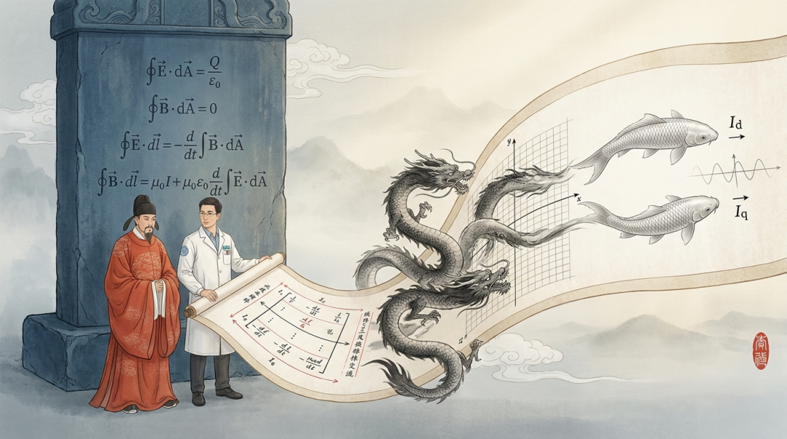
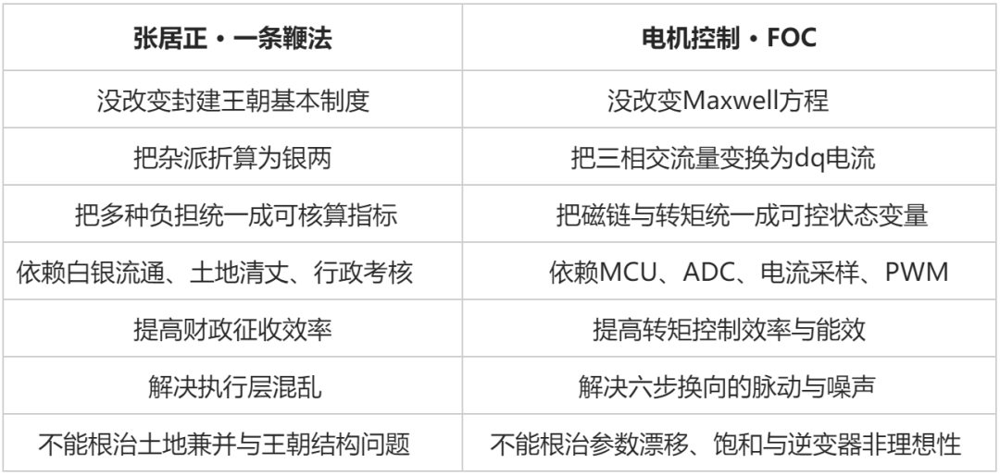
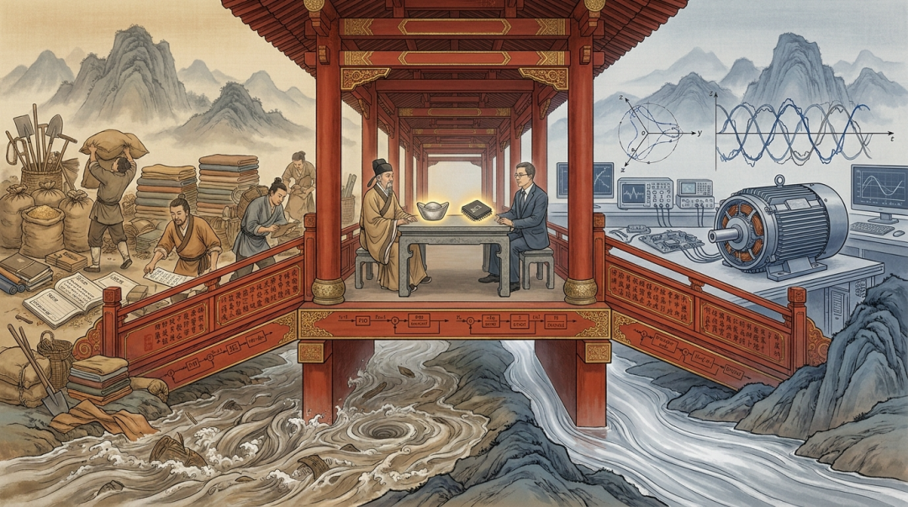
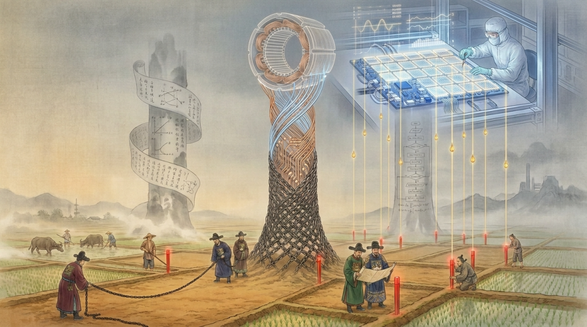
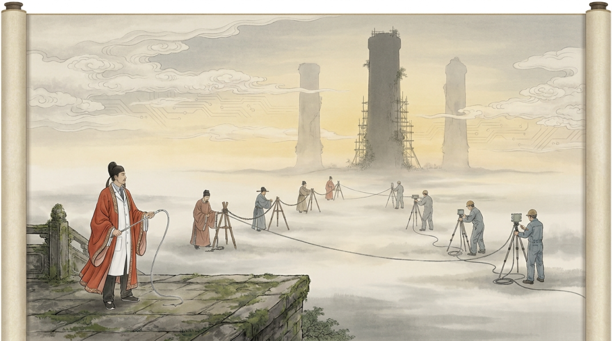

# 从张居正的一条鞭法看FOC控制：电机控制工程师的下一次跃迁在哪里

原创 傅存敬 电磁散人 2026-05-24 07:06 广东

> 原文地址: [https://mp.weixin.qq.com/s/7sr9fkHF4S9YIA01Eya\_Lw](https://mp.weixin.qq.com/s/7sr9fkHF4S9YIA01Eya_Lw)

做BLDC和PMSM控制这些年，我越来越频繁地想一件事：六步换向到FOC，那种级别的跃迁，还会再来一次吗？

这个问题不是凭空冒出来的。每天打开Simulink调模型、在STM32上跑定点代码、盯着示波器上的相电流波形，我越做越觉得——FOC这套东西已经太成熟了。Clarke变换、Park变换、Id/Iq解耦、PI闭环、SVPWM调制，框架就摆在那里，日常能做的事情是在这个框架里打磨细节：MTPA表优化一下，弱磁曲线平滑一下，无感观测器的收敛性改善一下，死区补偿再精细一下。

有用，但像是在同一栋楼里换家具、粉墙壁。楼本身没变。

我开始怀疑——是不是电磁学的源头出了问题？Maxwell方程组摆在那里一百多年了，该推导的推导完了，该用的都用了。如果源头不再涌水，下游还能翻出浪来吗？

带着这个焦虑，我开始翻物理学期刊，想从电磁学的最上游找找答案。

但翻期刊实在是有些枯燥。于是我又去跟已经退休的导师聊天，在聊天时，我把这个困惑一股脑倒了出来。

我问导师说：电磁学领域有哪些权威期刊值得追？我总觉得电磁学已经很难有大突破了，以至于我们做电机控制，也很难再开发出从六步换向到FOC那种级别的颠覆性算法。我想从源头找原因——是不是源头就见底了？

他很认真地听完，然后给了我一个非常干脆的判断——电磁学没有"死"。超材料、拓扑光子学、非互易热光子学，这些前沿方向在Nature Physics和Physical Review Applied上仍然不断有新工作。但是，对我们做BLDC和PMSM控制的人来说，经典电磁学的基本方程确实已经非常稳定了。

然后我的导师说了一句让我印象很深的话：**真正的瓶颈不在Maxwell方程，而在"电磁场—材料—结构—功率器件—采样—控制算法—成本约束"这条耦合链上。**

我听到这句话的时候，心情很复杂。

首先是松了一口气：原来不是电磁学走到尽头了，不用转行去读物理学博士。

但又紧了一口气：如果瓶颈在耦合层，那"下一次跃迁"就不可能只靠某个天才控制工程师写出一篇漂亮论文来实现——它需要在好几个维度上同时发力，比单纯推导一套新控制律要难得多。

我的导师紧接着说了一个判断，我回去反复想了好几天——六步换向到FOC的跃迁，本质上是"模型表达方式 + 实时控制能力 + 功率电子硬件"共同成熟后的结果，而不是Maxwell方程层面的突破。

这话越想越觉得精准。

六步换向看到的是什么？哪一相通电、哪一相悬空、反电势过零、60度电角度换向。相电流大致跟着方波或者梯形波走，转矩有明显脉动，但能转就行。它控制的是电机比较"外在"的现象。

FOC看到的是什么？三相电流通过Clarke变换变成αβ，再通过Park变换变成dq。d轴对应磁链，q轴对应转矩。交流量在旋转坐标系下变成了近似直流量——既然变成了直流量，PI控制器就能派上用场了。

FOC从头到尾，没有在Maxwell方程里添过一个新的项。它做的事情，用一句话概括就是——

**把一个三相交流、时变、耦合、不直观的控制对象，重新表达成两个清晰的直流控制变量：Id管磁链，Iq管转矩。**

各位同仁每天在MCU上跑的那套代码——Clarke变换、Park变换、反Park变换、SVPWM——说到底就是一组坐标变换。这组坐标变换的功劳不在"发现了新物理"，而在"让旧物理变得可控了"。

这就是变量重构。

FOC改写的不是物理定律，而是被控对象的表达方式。

那天听导师讲"变量重构"这个概念的时候，我脑子里突然咯噔了一下。

我跟他说："您先别笑我——我突然想到了张居正。"

他没笑，只是一脸严肃地看着我，示意我说下去。

张居正是明朝万历年间的内阁首辅，是一位了不起的变革家。这个人是好人还是坏人先不论，但有一件事无可争议——他在一个已经相当没落的明朝身上，硬生生又拉出了一段中兴，给大明续命几十年。

他的核心手段，就是推行**一条鞭法**。

万历之前，明朝的税役系统已经乱成了一锅粥：田赋、徭役、力役、杂派、实物征收、地方摊派，名目繁多，标准各异。老百姓搞不清自己到底该交多少，地方上的胥吏和豪强就在这片混乱里上下其手，层层截留。中央政府对自己真实的财政能力几乎是"盲"的。

一条鞭法干了什么？核心动作只有一个：把这些分散的、异构的、难以核算的负担，尽量折算成统一的白银。

张居正没有推翻封建王朝的体制，没有改变皇权结构，没有重写治国的底层逻辑。他做的事情，就是把一个高维、混乱、不透明的财政系统，压缩成一套更容易度量、更容易征收、更容易考核的变量体系。

我当时脱口而出："这不就是FOC吗？"

三相电流的"杂派"，被Clarke/Park变换折成了Id和Iq两锭"银子"。

我的导师不但没说我胡思乱想，反而笑着跟着我的思路把这个类比又往深里推了一层。

他说：这两件事之间确实是同构的，但之所以同构，不是因为"改革"，不是因为"效率"，而是因为一个更底层的关键词——**可治理性**。

细想一下确实如此。

一条鞭法之前，明朝财政的问题不只是"税重"。而是太复杂、太地方化、太不透明、太容易被中间层操纵。中央既搞不清税基真实规模，也管不住征收过程中的损耗。一条鞭法把负担货币化、标准化、流程化，使中央更容易掌握财政、也更容易考核地方官员。

六步换向时代，电机控制的问题也不只是"粗糙"。而是转矩不连续可控、电流和转矩的关系不清晰、动态响应差、噪声振动大、效率优化空间窄、全转速域的精细控制几乎做不到。FOC把控制变量变成Id/Iq之后，软件才真正有了"治理"电机的抓手。

放在一张表里看就更清楚了：

两件事的深层逻辑是一样的：**一个复杂系统要被高效控制，前提是先被重新表达成可观测、可计算、可执行、可反馈的变量系统。**

一条鞭法是大明财政的"变量重构"，FOC是交流电机的"变量重构"。它们都不是革命，但都极大提升了系统的"可治理性"。

和导师聊完之后，我以为这个话题可以结束了。但自己夜来又想了好几天，发现还少了一根支柱。

一条鞭法能落地，靠的不只是张居正的政治魄力和"折银"这个好主意。它还有一个经常被历史叙述一笔带过的前提——**万历初年的全国清丈土地**。

没有那一次大规模的地籍测量，"折银"就是一纸空文。你不知道每户实际有多少地，就无从核算他该交多少银子。税负折算的前提是税基可测。清丈才是一条鞭法能站起来的地基。

想到这里，我突然意识到FOC的故事也是一模一样的。

Clarke/Park变换写得再漂亮，如果没有ADC能准确采到相电流，如果没有编码器或角度估算器给出转子位置，如果PWM同步采样的时序做不对——那Id和Iq就只是Simulink里的数学符号，永远不是MCU里可以闭环的物理量。

FOC从论文走到量产，不只是因为控制理论成熟了，也不只是因为MCU跑得够快了。它依赖一整条测量链路的同步成熟：电流传感器或采样电阻的精度、运放的带宽和共模抑制、ADC的分辨率和同步性、编码器的精度和通信速率、反电势过零检测电路的可靠性……

去掉这条链路里的任何一环，FOC就像一场没有清丈过土地的"折银改革"——制度设计很漂亮，但执行不下去。

所以，我重新理解了"跃迁"这个词。

我们行业里讨论"FOC之后是什么"的时候，注意力往往集中在控制律上——MPC行不行？神经网络观测器行不行？自适应反步控制行不行？强化学习行不行？这些方向我不否认它们的价值，但现在我越来越觉得，只盯着控制律看，只盯到了三根支柱中的一根。

完整的跃迁需要三根支柱同时就位：

**第一根，新的变量表达方式。** 一条鞭法发明了"折银"，FOC发明了dq变换。下一次跃迁，可能需要一种新的方式来重新定义被控对象——把温度、饱和、铁耗、NVH、退磁风险这些现在散落在各个"补丁"里的约束，统一纳入主控制框架，让它们从"保护机制"变成"控制变量"。

**第二根，新的实时控制算法。** 这是目前学术界最热闹的赛道。MPC、自适应、鲁棒控制、数据驱动……论文年产量很大。但算法能走多远，取决于第三根支柱能撑多高。

**第三根，新的测量基础设施。** 这才是我现在最想盯着看的那一根。

各位同仁可以对着自己的产品线判断一下，下面这几个方向，哪些在你们的场景里有落地可能——

**在线磁链观测。**不靠离线标定的查表，而是让控制器实时"看到"磁链的变化，包括温度引起的永磁体退磁、饱和引起的电感漂移。这一步打通了，MTPA和弱磁就可以从静态映射变成动态自适应。

**永磁体温度的实时估计。**目前大多数方案靠电阻法间接推，精度和动态性都不够好。如果有更可靠的温度观测，过温保护就可以从粗暴的限流降额变成精细的热管理控制。

**铁耗与逆变器损耗的在线建模。**目前效率优化大多只算铜耗，因为铜耗好算——三个电阻乘三个电流平方。铁耗和开关损耗牵涉太多非线性因素，大家索性不算。但如果能实时估计这部分损耗，效率优化的空间会打开一大块。

**电流采样的高分辨率与高同步性。**单电阻采样重构的窗口限制、双电阻采样的盲区、ADC的ENOB和采样抖动——这些看似"硬件问题"，但每一个的改善都直接扩大了控制算法的施展空间。

**多物理量融合。**电流、电压、温度、振动、声学信号，过去分属不同的保护或诊断子系统，各管各的。如果它们能被统一引入控制环路，被控对象就不再只是"一台电机"，而是"一台运行在特定工况下的机电热声耦合系统"。

这些方向有一个共同特征：它们解决的不是"控制律写得够不够聪明"，而是"控制器能不能看得见"。

变量没法被测量，就没法被治理。

讲张居正的时候，有一个人绕不开——王安石。

北宋的王安石比张居正早了五百年，胆子也大得多。青苗法、市易法、募役法，一口气铺开，几乎是想把国家和经济的关系彻底重塑。结果呢？阻力太大，执行走样，利益集团疯狂反弹，新旧党争绵延数十年，把北宋的元气折腾掉了一大半。

张居正的高明恰恰在于**克制**。他不碰体制，只在执行层做重构。正因为改的是"变量表达"而不是"底层操作系统"，落地的阻力小得多，执行的可控性也高得多。

我觉得这个对照对一线工程师很有参考价值。

电机控制圈里从来不缺"王安石"。每隔几年就有一波声音，要彻底绕过FOC——纯DTC不要电流环了、端到端神经网络直接从采样到PWM了、强化学习让控制器自己学策略了。在论文里跑仿真、在实验台上做demo，效果常常很惊艳。但一旦要落到1到2美元的MCU上、要过量产一致性的考验、要扛住批量售后的压力，"实施摩擦"往往比预想中大得多。

这不是说激进路线一定错。也许有一天，MCU算力便宜到和沙子一样不值钱，传感器精度高到控制器可以实时重建完整的电磁场分布，那时候确实不再需要dq变换——就像现代税制也早就不靠"折银"了。但那是条件成熟之后的自然结果，不是一腔热血能催熟的。

所以，在低成本量产这个战场上，**张居正式的改良——在FOC框架内重构变量、统一约束、升级测量——历史上的成功率，明显高于王安石式的革命。**

回到开头那个让我焦虑的问题：FOC之后，还有没有下一次跃迁？

我现在的回答是：有，但它大概率不会以我们习惯的方式出现。

我们习惯的方式是——有人写了一篇漂亮的论文，提出一个新的控制律，仿真效果比FOC好50%，然后大家跟进、复现、移植、量产、普及。一个人，一篇论文，一次跃迁。

但回看六步换向到FOC的真实历史，跃迁从来不是一篇论文的事。Blaschke在1972年提出FOC的基本思想，到FOC真正在家电和工具电机上大规模量产，中间隔了二三十年。不是思想不够好，而是MCU不够快、ADC不够准、电流采样不够干净、功率器件不够便宜。三根支柱——变量重构、实时算法、测量基础设施——要在同一个历史窗口里同时到位，跃迁才会发生。

一条鞭法的故事也一样。张居正同时抓住了"折银的思路"和"清丈的执行"，这两件事缺一不可。只有折银没有清丈，那就是空文一道。

所以，各位同仁，当我们站在FOC这栋楼里往窗外张望、寻找"下一次跃迁"的时候，我的建议是——与其整天盯着控制律的花样翻新，不如经常低头看看脚下。测量层的地基，有没有在松动、在长高、在给新的变量腾出位置。

毕竟，**下一条"鞭"，要等下一次"丈"。**

