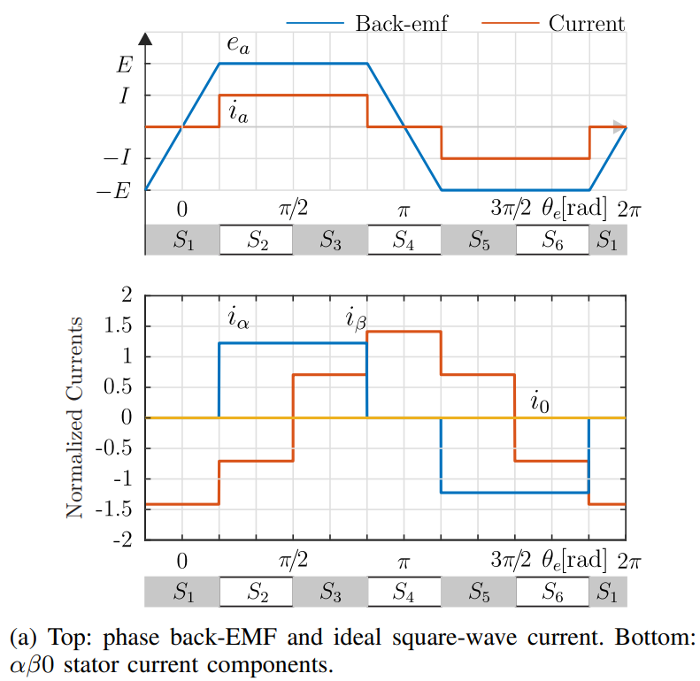
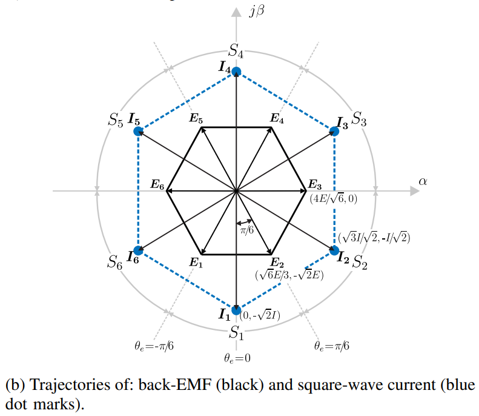
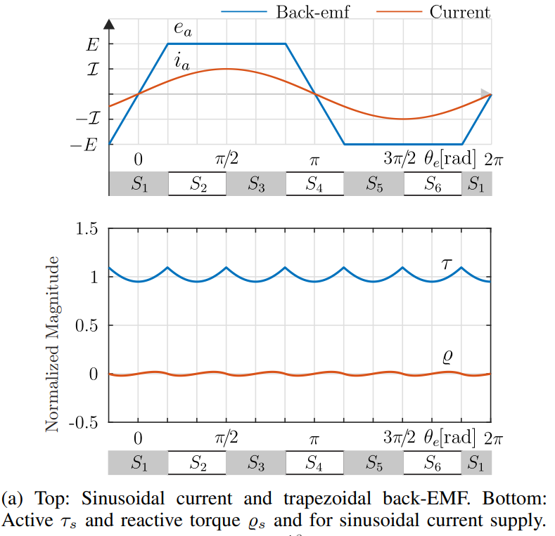
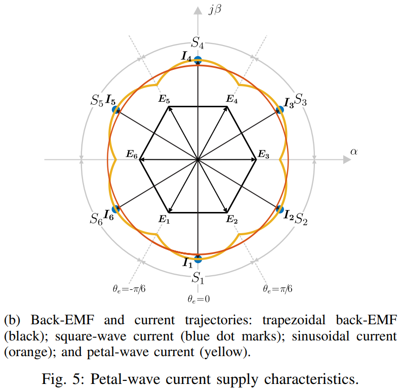
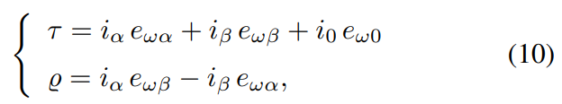
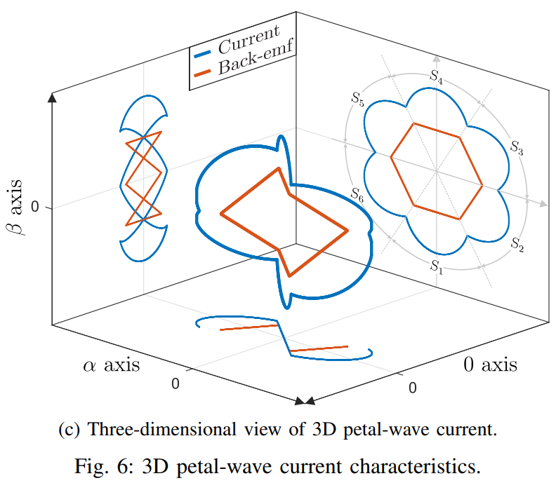
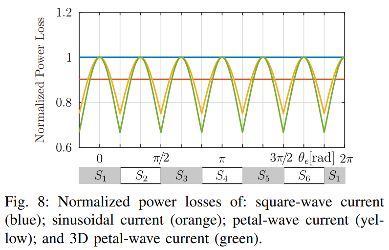
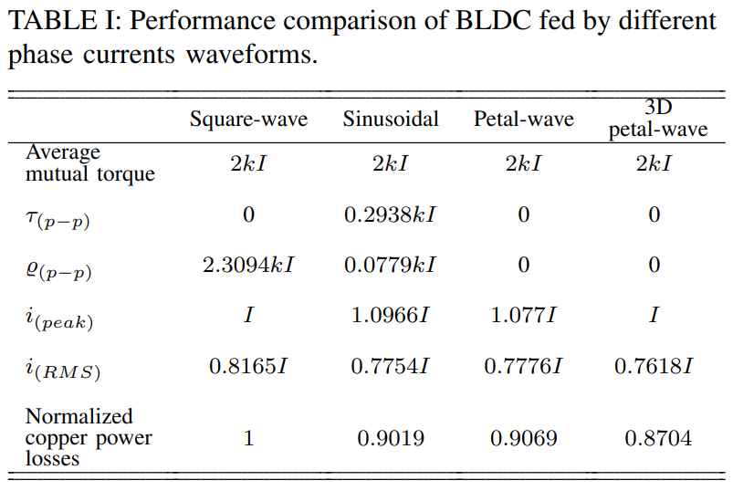

# 当FOC遇上梯形波反电势的BLDC电机：我们是否一直在“错误”的道路上做“正确”的优化？

原创 傅存敬 电磁散人 2025-10-08 07:00 广东

> 原文地址: [https://mp.weixin.qq.com/s/WBg2FZylj3cSTBVNrCUGbg](https://mp.weixin.qq.com/s/WBg2FZylj3cSTBVNrCUGbg)

今、明两天，我们分两次来聊聊，站在控制的角度，如何让无刷直流电机（BLDC）变得更“给力”、更“顺滑”、还更“省电”。

咱们先把这个无刷直流电机想象成一个需要我们去推的“秋千”。我们的目标是什么？当然是让这个秋千荡得又高又稳！

-   电机转矩 (Torque)：就是我们把秋千推起来的那个“劲儿”。“劲儿”越大，秋千荡得越高。
    
-   平滑转矩 (Smooth Torque)：就是我们推得非常稳，秋千一直平稳地荡，而不是一顿一顿的。
    
-   反电动势 (Back-EMF)：这是秋千自己荡回来的那个“势头”。聪明的推手，一定会顺着这个势头去推，才能事半功倍。
    
-   定子电流 (Stator Current)：这就是我们用来推秋千的“手”和我们用的“力”。
    

今天跟大家分享的文献的核心，就是研究怎么用最高明的“推法”（电流波形），去顺应这个秋千的“势头”（反电动势），达到最好的效果。

第一幕：传统推法，总有遗憾

作者上来就给我们展示了几个“老办法”，但都差点意思。

办法一：方波电流（菜鸟推法：大力出奇迹）

你看图3(a)，这个梯形波（Back-emf）就是秋千的“势头”，它有一个很宽的“平台期”，意思是秋千荡到最高点附近，速度最慢，最适合我们发力。

“方波电流”（Current）就是一种简单粗暴的推法：等秋千到了那个点，我咣当一下，用最大的力气猛推一下！你看，这个电流波形像个方块，简单直接。

问题在哪呢？理想很丰满，现实很骨感。你不可能瞬间把力气加到最大，你的胳膊（在电路里就是电感）有惯性啊！所以每次推，都会有个“延迟”和“冲击”，导致秋千一顿一顿的。这就是转矩脉动。

你看图3(b)，在α\-β二维坐标系里，秋千的势头（黑色六边形轨迹）是连续变化的，但我们的推力（蓝色点）却是在几个点之间“瞬移”、“跳跃”。这俩能配合好吗？显然不能。

办法二：正弦波电流（高手推法，但用错了地方）

有人说，那我用一种“丝滑”的力气去推，像推普通秋千一样，用一个完美的正弦波怎么样？

问题又来了！你看，我们的这个BLDC“秋千”，它的“势头”是梯形波，不是标准的正弦波。你用推普通秋千的方法来推这个“特制秋千”，节奏对不上！该发力的时候你力气不够，不该发力的时候你还在使劲。结果呢？秋千还是会晃晃悠悠，产生转矩脉动。如图4(a)下方所示，这个转矩τs波动得很厉害。

第二幕：高手进阶，发现新维度

老办法不行，那怎么办呢？论文的作者们就说了：我们得量身定做一种推法！

办法三：瓣波电流（高级推法：私人订制）

前面的方法，要么是力气（电流）不对，要么是节奏（反电动势）不对。那我们能不能设计一个电流，让它的路径完美地贴合反电动势的路径呢？

必须能啊！你看图5(b)，这个黄色的轨迹，就是“瓣波电流”。它不再是傻傻地跳跃，也不是一个标准的圆，而是像一朵花瓣一样，努力地去追踪那个黑色的六边形轨迹。

这一下，配合默契了！结果就是，转矩平滑了，秋千稳了！

但是，还有没有优化的空间呢？作者们是追求极致的科学家，他们发现，我们之前的分析，都只是在一个“二维平面”（α\-β坐标系）里思考问题。就像我们推秋千，只考虑了前后推。万一，这个秋千还能从别的维度获得能量呢？

第三幕：终极秘籍——“3D瓣波电流”的降维打击！

这就是这篇论文最精华、最牛的地方了！作者引入了一个被大家忽略的“隐藏维度”——零序分量 (Zero Sequence)。

这是什么意思呢？我们把秋千的“势头”（反电动势），用数学工具（克拉克变换）分解一下，会发现它不仅有在α\-β平面上的分量，还有一个垂直于这个平面的零序分量 e₀！这个分量主要是由反电动势里的3次谐波贡献的。

以前大家觉得这个e₀没啥用，都忽略了。但作者说：不！这里面藏着能量！

这就好比，我们推秋千，不仅可以前后推，我们还发现这个秋千的底座有点“松动”（这就是零序分量），如果我们能踩准节奏，连带底座一起晃，竟然能给秋千提供额外的动力！

于是，他们提出了“3D瓣波电流”。顾名思义，这个电流不仅在α\-β平面上运动，它在“0”轴这个第三维度上，也有一个分量i₀。

我们来看全文中最关键的公式，原文的公式(10)：

翻译成人话：

-   τ：这是我们得到的总“推力”（总转矩）。
    
-   iα⋅eωα + iβ⋅eωβ：这是咱们在二维平面上的“常规推力”，就是传统“瓣波电流”干的活。
    
-   i₀⋅eω₀：这就是神来之笔！eω₀是秋千底座的“晃动节奏”（零序反电动势），i₀是我们专门设计用来配合它的那个“踩底座的力”（零序电流）。这一项，就是我们从“隐藏维度”里榨取出来的额外推力！
    

你看图6(c)这张三维图，简直太漂亮了！

橙色的线（Back-emf）是反电动势在三维空间里的轨迹，它一直在α\-β平面和0轴平面来回穿梭。而蓝色的线（Current），就是我们设计的“3D瓣波电流”，它像一条三维空间中的灵蛇，完美地追随并匹配着橙线的每一个动作！这才是真正的“人机合一”啊！

第四幕：是骡子是马，拉出来遛遛！

理论说得再好，得看效果。我们来看一场“省电大赛”和“力量大赛”。

1. 省电大赛（比谁的铜损耗低）

看图8，这个图的纵坐标是“能量损耗”，纵坐标越低越省电。

-   蓝色（方波）：损耗最高，咱们把它设为基准“1”。
    
-   橙色（正弦波）：损耗大约是0.90，省了将近10%。
    
-   黄色（瓣波）：损耗也是0.91左右，也省了9%多。
    
-   绿色（3D瓣波）：你看它，一枝独秀！损耗只有0.87！比最原始的方法省电13%！
    

2. 力量大赛（比谁的转矩密度高）

省电就意味着效率高。效率高意味着什么？在消耗同样多电（发同样多热）的情况下，我能出的“力气”更大！

根据文章的计算（Table I），在保证电机发热情况相同（即RMS电流相同）的前提下，使用“3D瓣波电流”，电机输出的转矩，比使用传统的方波电流能高出大约 7.2%！

这是什么概念？这意味着你的电动车，在电池和电机不变的情况下，光靠升级控制算法，续航就能变长，加速还能变猛！

总结一下

这篇论文的作者们，就像武林高手一样，干了三件事：

1.  看穿本质：他们没有停留在二维的“推秋千”思维里，而是用数学工具看到了电机内部还存在一个“零序”的隐藏维度。
    
2.  独创神功：他们创造了“3D瓣波电流”这门绝学，让电流在三维空间里与反电动势完美共舞。
    
3.  效果炸裂：最终实现了电机转矩平滑无脉动、能耗降低13%、力量提升7.2%的惊人效果。
    

所以你看，科学研究的魅力就在这里。有时候，我们不需要更换更昂贵的硬件，仅仅是改变我们的思维方式，从一个新的维度去审视问题，就能带来巨大的技术突破。

这篇论文只是“第一部分：理论研究”，作者们在“第二部分”里会讲怎么用电路和代码把这个“神功”实现出来。那又是另一个精彩的故事了！明天的文章见分晓。

  

参考文献

\[1\] Castro A G D , Guazzelli R U P , Santos T C A S D ,et al.Zero Sequence Power Contribution on BLDC Motor Drives. Part I: A Theoretical Investigation\[J\].School of Engineering of São Carlos, University of São Paulo, São Carlos, Brazil; School of En\[2025-10-07\].DOI:10.1109/INDUSCON.2018.8627265.

文档链接：https://pan.baidu.com/s/1FohTFmeRReTcF6yU76FzDw?pwd=82f2 提取码: 82f2