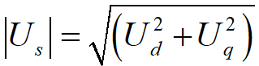

# 电机控制真功夫之“绝境长空”篇：弱磁控制的极限与MTPV的萌芽

原创 傅存敬 电磁散人 2025-11-18 07:06 广东

> 原文地址: [https://mp.weixin.qq.com/s/cYa60EO-Rer2NW3ld7\_iNg](https://mp.weixin.qq.com/s/cYa60EO-Rer2NW3ld7_iNg)

在前几篇文章中，我们亲眼见证了电机控制的弱磁部队战功赫赫，能扩速，能协同，简直是王牌之师！但是，任何一支王牌部队，都有它的作战极限。当战场环境恶劣到极致，当敌人（BEMF）的数量呈指数级增长，我们的“王牌师”还能否守住阵地？

今天，我们就将亲眼见证这支部队最悲壮、也最光辉的一刻。我们将会看到他们在被逼入绝境后，如何在“高天流云、空气稀薄”的极限环境中，流尽最后一滴血，射出最后一支长剑！

来，让我们一同进入这场史诗级的战役！

今天的战场只有一个，就是 `pm_loop_current()` 函数中那段我们已经非常熟悉的 `if (pm->config_WEAKENING == PM_ENABLED)` 代码块。但这一次，我们将用放大镜，甚至是显微镜，去观察在“超高速”这个极限条件下，里面的每一行代码，正在发生怎样微妙而深刻的变化。

#### 战场推演：当速度冲向云霄

想象一个场景：我们的电机正在全速运行，速度环给出了最大的转矩指令，`track_Q` 是一个很大的正值。转速 `pm->lu_wS` 正在不断攀升，已经进入了弱磁区。

此时，弱磁PI控制器 `pm->weak_track_D += eDC * pm->weak_gain_EU;` 正在英勇地奋战，不断注入负`id`，来压制节节攀升的BEMF，维持`vsi_DC`在1.0附近。

一切看起来都还在掌控之中。但是，随着转速`ωe`越来越高，战局开始发生质变！

#### 第一幕：“守护之锤”的异变——`iq`的消亡

让我们再次聚焦那把决定`iq`命运的“守护之锤”：

```
if (pm->weak_track_D < - M_EPSILON) { // 确认进入弱磁区
```

在之前的[文章](https://mp.weixin.qq.com/s?__biz=MzE5MTYzNjgzOA==&mid=2247484592&idx=1&sn=290baa400ffefc2b8b7270edacaee504&scene=21#wechat_redirect)中，我们把上面这段代码理解为“为了给负`id`腾出电压空间，而削减`iq`”。这个理解没错，但不够深刻！今天，我们要看到它更残酷的一面！

-   **当 `ωe` 增加时: 分母 `wLS` (`ωe*Lq`) 线性增大。**
-   **`iMAX`的变化: 分子 `eDC` (`Umax`) 是个常数，所以 `iMAX` 会随着转速的升高而**急剧减小**！**

让我们来做一个简单的思想实验：

-   假设 `Umax`\=30V, `Lq`\=0.1mH。
    
-   当 `ωe`\=1000 rad/s (约9500rpm)时, `iMAX` = 30 / (1000 \* 0.0001) = 300A。此时限制很宽松。
    
-   当 `ωe`\=3000 rad/s (约28600rpm)时, `iMAX` = 30 / (3000 \* 0.0001) = 100A。限制开始变得明显。
    
-   当 `ωe`\=10000 rad/s (约95000rpm, 超高速!)时, `iMAX` = 30 / (10000 \* 0.0001) = **30A**。
    
-   当 `ωe`\=30000 rad/s (约286000rpm, 极限飞车!)时, `iMAX` = 30 / (30000 \* 0.0001) = **10A**！
    

看到了吗？这把“守护之锤”在超高速下，变成了一把无情的“闸刀”！它根本不关心你速度环想要多大的转矩，它只遵循一个冰冷的物理法则：**在这么高的速度下，电压就只够你产生这么点`iq`了，多一安培都没有！**

随着速度飞升，`iMAX` 被无情地压缩，从几百安培，到几十安培，再到几安培...最终，速度高到一定程度，`iMAX`会趋近于0！这意味着，为了维持电压不饱和，系统**被迫放弃了几乎所有的转矩输出能力**！

这，就是**MTPV思想在这份代码中的第一次显现**！它告诉我们，在极限电压约束下，转矩不再是我们可以随意追求的东西，它变成了一种必须被严格限制的“奢侈品”。

#### 第二幕：“破壁之锤”的悲壮——`id`的尽忠

`iq`已经被无情地剥夺，那我们的“破壁之锤”——负`id`在干什么呢？

```
// ...
```

逐行阅读代码，可见：

1.  **持续的“电压赤字”: 在超高速区，即使`iq`已经被砍到接近0，但BEMF（`ωe * λm`）本身可能就已经比`Umax`还要高了！这意味着`vsi_DC`会顽固地停留在1.0以上，`eDC = (1.f - vsi_DC)`会是一个持续的负值。**
2.  **积分器的“尽忠”: PI积分器 `pm->weak_track_D` 感受到持续的负误差，它会忠实地履行自己的使命，不断地累积负值。它的内心独白是：“电压还不够！我必须注入更多的负`id`！我还能压制！我还能战斗！”**
3.  **撞上南墙: 这个累积过程不会无限持续。它最终会撞上那堵由`pm->weak_maximal`定义的“南墙”。`pm->weak_track_D` 的值会被死死地钉在 `pm->weak_maximal` 上。**

这个过程，极其悲壮！弱磁部队在发现`q`轴友军已经全军覆没（`iq`趋近于0）后，并没有放弃阵地。它独自承担起了对抗滔天巨浪（BEMF）的使命，将自己所有的兵力（`id`）都投入到了这场注定失败的战斗中，直到弹尽粮绝（达到`pm->weak_maximal`）。

这一刻，弱磁控制这个算法，已经把它能做的一切，都做到了极致。

#### 第三幕：弱磁的“终点线”——控制权的旁落

现在，我们来到了最关键的临界点。

**战况：**

-   转速`ωe`高到让 `ωe * λm > Umax`。
    
-   iq已经被削减为0。
    
-    id已经被压到最大值`pm->weak_maximal`。
    

此时，我们来看d轴的电压方程 (注意，`Iq`近似0，`Id`是负值)：

Ud = Rs\*Id - ωe\*Ld\*|Id|

还有q轴电压方程 (注意，`Iq`近似0，`Id`是负值)：

Uq ≈ -ωe\*Ld\*|Id| + ωe\*λm = ωe \* (λm - Ld\*|Id|)

此时，合成电压为 。

**弱磁控制的“终点线”在哪里？**

就在于 `Uq` 这一项！`id`的弱磁作用，就是通过 `-ωe*Ld*|Id|` 这一项去抵消 `ωe*λm`。

当转速`ωe`继续升高，高到让 `ωe * (λm - Ld*pm->weak_maximal) > Umax` 时，**游戏就结束了！**

这意味着，**就算我们已经用上了吃奶的力气（`id = pm->weak_maximal`），`q`轴上需要施加的电压，都已经超过了逆变器的最大能力！**

**此时会发生什么？**

-   **电流环彻底饱和: `q`轴的PI控制器无论如何输出，最终的`uQ`都会被硬件削顶。**
-   **电流失控: 真实的`iq`将不再能跟随指令（指令是0），它会变成什么样，取决于复杂的物理过程，但可以肯定的是，它失控了。**
-   **系统状态未知: 控制器已经失去了对电流矢量的精确控制。电机可能会产生非预期的转矩，转速可能会进一步飙升，也可能剧烈振荡。**

**这，就是弱磁控制的极限！他是一个伟大的英雄，但当敌人的箭射穿他的胸膛（转速高到让`Uq`饱和）时，他也只能无力地倒下。**

### 小结

今天这篇“绝境长空”文章，我们跟随弱磁部队，经历了一场从辉煌到悲壮的远征：

1.  **MTPV的萌芽: 我们见证了在超高速下，物理规律（`iMAX = Umax / (ωe * Lq)`）是如何自动将转矩电流`iq`“扼杀”的，这是MTPV思想的初次体现。**
2.  **弱磁的尽忠: 我们看到了在`iq`消亡后，弱磁积分器是如何驱动`id`流尽最后一滴血，战斗到极限`pm->weak_maximal`的。**
3.  **控制的终点: 我们揭示了弱磁控制的理论极限——当最大弱磁电流也无法在`q`轴上对抗BEMF时，系统将不可避免地走向失控。**

弱磁部队已经尽其所能，光荣地完成了他们的使命。他们倒下的那一刻，整个系统看似已经陷入了万劫不复的深渊。

但是，别忘了！在这支“一线作战部队”的身后，还站着一位手持“军法”，不问过程，只看结果的“雷霆守护神”！

下一讲，我们将迎来本系列的最高潮！我们将看到，在这片混乱的战场上，“雷霆守护神”（过压保护）是如何被唤醒，他又是如何以一种截然不同的、甚至可以说“粗暴”的方式，重新夺回控制权，并最终实现MTPV策略的精髓——**在极限下，有控制地生存！**

你准备好迎接这场终极风暴了吗？

参考代码：

https://github.com/rombrew/phobia/blob/master/src/phobia/pm.c