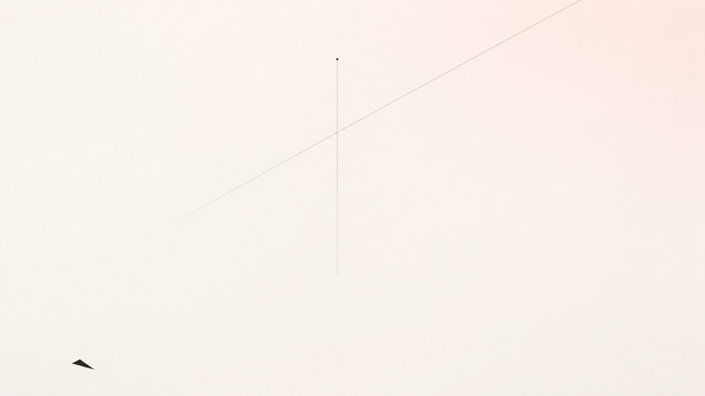

# 黑莓的键盘与FOC的参数：你的十年盲打，正在变成电机及其控制行业的下一块墓碑

原创 傅存敬 电磁散人 2026-07-05 07:06 广东

> 原文地址: [https://mp.weixin.qq.com/s/pVcaxAsQFKI8HBcDbPZPFA](https://mp.weixin.qq.com/s/pVcaxAsQFKI8HBcDbPZPFA)

我们这行私下里流传着一句话，听了让人松一口气。

BLDC 也好，PMSM 也好，装到整机上，无论是家电、电动工具还是新能源汽车，用户根本不在乎你用的是方波还是正弦波，更不在乎有感还是无感。人家只看性能，只看性价比。

这话说出来痛快，像一口憋了很久的气终于吐出去。而且它是对的：稍有功力的工程师，天天都在违反"梯形波反电动势就得方波、正弦波就得 FOC"那条口诀。反电动势长什么形状，和你往里灌什么电流，本就是两根可以分开拧的轴。梯形波的电机照样能跑 FOC，拿一点谐波转矩脉动，换一条连续平滑的电流波形，家电风机里为了把啸叫压下去，这么干的一抓一大把。正弦波的电机也照样能上六步方波，图的是便宜，早年的航模电调、低端家电就这么干，代价是换相那一下的脉动和噪声。

所以那条口诀，不过是写给新人的简化版，是师傅怕你记不住、先塞给你的一根拐杖。

可就是这句让人解脱的话，我后来越咂摸越觉得不对劲。

它太容易让人停在原地了。"反正用户只看性能"，这句话像一颗止痛药，吞下去，"我是不是该学点新东西"的那点隐隐的焦虑就压下去了。焦虑是压住了，可跟着一起被压住的，还有你抬头看路的那个动作。

这个陷阱到底有多深，站在行业里面反而看不清，得绕到外面去看。先把电机搁一搁。

写这篇之前，我刚从美国出差回来，有一桩小事，一路盘在我心里。

美国是个几乎把"多样"奉为信仰的地方，肤色、口音、信仰、活法，怎么不一样都行，没人觉得谁该活成谁的样子。可偏偏在手机这件事上，我撞见的是另一幅景象：走到哪儿，身边人从兜里掏出来的，几乎清一色是 iPhone。开会的、喝咖啡的、机场里候机的，一水儿苹果。手机是这么贴身、这么要紧的东西，一个最讲究"各不相同"的社会，却在它上面达成了近乎百分之百的一致。这反差让我在原地站了好一会儿。

回过神，我忽然想起一件事：往前倒一代人，一统美国江湖的，根本不是苹果。那会儿美国人手里攥着的，尤其是西装革履的商务人士，是另一个牌子，黑莓。

你看，今天这副坚不可摧的样子，苹果当年也是踩着另一座"坚不可摧"爬上来的。我就想，不妨拿这座旧王朝，按我们这行最认的那把"只看性能"的尺子，从头到尾量一遍。

它最风光的年头大约在二〇〇八年，那阵子美国市面上每卖出两台智能手机，就有一台是黑莓。它强在哪？强在一件当年并不简单的事：随时随地、又快又安全地收发邮件，背后还配着一块手感极佳的物理键盘，拇指落下去有回弹、有节奏，敲完一封长邮件，心里是踏实的。政府、银行、律所、咨询公司认它，认的是可靠、可控。它像一件被组织盖过章、准予上岗的工具，没人指望它好玩。

用这把尺子量下来，结果很清楚：单看"收发邮件"这一项，黑莓实打实更强。倘若用户当真只认性能、只认性价比，这家公司本就不该输。

二〇〇七年，乔布斯掏出第一代 iPhone：通体一块玻璃，没有键盘。黑莓，连同当时一大批懂行的人，几乎是同一种反应：不屑。谁会乐意在一块平板玻璃上戳字？

平心而论，这反应放在那个时间点上并不蠢。初代 iPhone 早期连 3G 都没有，企业功能简陋，续航也吊着一口气。你要一个每天处理上百封邮件的人，把吃饭的家伙换成一块毫无反馈的玻璃，他多半先设防，谈不上心动。就那张"邮件性能"的成绩单论，iPhone 输得清清楚楚。

但几年之后，输的却是黑莓。

黑莓的性能并没有掉队。掉队的是"性能"这个词本身，它的内涵，在它眼皮底下被悄悄换了芯。手机不再只是一台收发邮件的机器，它先后长出了相机、浏览器、游戏机、地图、商店，到最后，干脆成了揣在兜里的一整个世界。而这些新本事，没有一样落在黑莓的强项里，全落在它当年嗤之以鼻、认定"不务正业"的那一格。它一直在盘算那块键盘还能怎么再顺手一点，却没察觉用户心里想要的东西早就换了。谁还盯着键盘呢，人家想要的是一扇能通向别处的门。

整件事最关键的地方就在这里。用户确实从不关心方法，这话没错。可用户对"什么算性能"的定义，会一直朝着工程师瞧不上的方向膨胀。

技术参数你守得住，"性能"这个词的边界，你守不住。这条边界从来轮不到你来划，它跟着用户的生活走。手机从"一台收邮件的机器"变成"一个装下生活的入口"，键盘再快，也回答不了"我能不能用它拍照、听歌、看世界"。

回到我们这一行，同样的换芯也在发生。那些被老法师斥为"不够严肃"的东西，正在反过来改写"性能"的定义：NVH，那台半夜运转却几乎听不见声音的电机；手机 App 的互联；把电机本身当成一个传感器，去做预测性维护、做故障诊断。当一台电机从"出力的铁疙瘩"变成"系统里的一个数据节点"，"转矩和效率才是正经事"那把用了几十年的尺子，就开始过期了。你为了多零点几个百分点的效率熬通宵，用户最后记住的，可能是隔壁那台电机有多安静，App 里能不能看见它还能再转几年。

而这件事，老子在两千多年前的《道德经》第九章里，早就写下了判词：

> 持而盈之，不如其已；揣而锐之，不可长保。

"揣而锐之"，是把一把刀反复捶打、磨到极致的锋利。老子说：这样的锋利，保不住。

我们那套调了十年、闭着眼都能盲打的参数整定，就是黑莓那块漂亮的键盘，就是那把被"揣而锐之"的刀。无代码芯片，是触屏；再过两年的 AI 自动整定，是更狠的触屏。手感当然好。但揣而锐之，不可长保。

不过，我们这行比黑莓还多一道更硬的枷锁。黑莓输在心理，舍不得键盘；我们这行，是被一张报价单按在地上。

第九章的下一句正好接上：

> 金玉满堂，莫之能守。

报价单上，铜可以称斤，磁钢可以论两，硅片可以数颗，唯独控制算法的那点精妙，称不出重量，也卖不上价。[这个理我在别处已经唠叨过很多回，这里不展开。](https://mp.weixin.qq.com/s?__biz=MzE5MTYzNjgzOA==&mid=2247486501&idx=1&sn=c64bc0bcd6c4027d5a2ceb7f437c678b&scene=21#wechat_redirect)于是整个行业做了一件完全理性的事：把钱、把人、把注意力，都砸到看得见、能称重、能进 BOM 的地方，让那个看不见的部分慢慢萎缩。

所以"破除教条"根本不是工程师觉不觉悟的问题。在按 BOM 定价的规则下，守着教条反而是最理性的选择：你多花三个月把算法磨漂亮，报价单上那一栏纹丝不动；你换一块更贵的磁钢，客户立刻看得见，也立刻能拿去砍价。真正掀桌子的人，压根不在技术上跟你纠缠，他改的是钱从哪儿收：算法干脆白送，反正也卖不上价，埋进硅片，做成一个 GUI，谁都能点两下配出一个 FOC，再靠芯片走量，把钱从另一个口袋收回来。TI、英飞凌、峰岹那些"无代码"电机芯片，干的就是这个。

这层枷锁，说到这儿就够了。它干的事，无非是让那把"揣而锐之"的刀，磨得更不值钱。可不值钱是一回事，卷刃是另一回事，真正决定命运的，从来是后者。

第九章再往下：

> 富贵而骄，自遗其咎。

到这里，刀该转过来对着自己了。这个故事里，真正站在黑莓位置上的，是手搓 FOC 的资深算法工程师本人。是你，也是我。

富贵而骄，骄的是什么？是那把磨了十年的刀，是"这活儿离了我玩不转"的笃定。这种笃定，庄子在《齐物论》里给它起过一个名字，叫成心：

> 夫随其成心而师之，谁独且无师乎？

成心，是一颗已经定了形的心。人一旦把它当成老师、跟着它走，那就谁都有了自己的"老师"，连最蠢的人都有。这个"老师"，平时是你的底气，关键时刻却是个暴君。它在你耳边说：我是这行的，就得按这行的规矩造东西。这句话一旦从经验凝固成身份，你就被它焊死在了原地。

市面上正流行一句话，扎得人不轻：你那十年经验，未必是带你走出去的地图，倒更像一双你既舍不得脱、又跑不动的旧鞋。穿着它，你站得稳，看着也专业，可真要急转弯，它先拖住你的脚。这话刻薄，却刻薄得在理。自遗其咎，骄兵的祸，从来是自己亲手埋下的。

黑莓当然也挣扎过。它出过一款叫 Storm 的触屏机，思路特别典型：用户要触屏，那就上触屏；可又怕用户离不开键盘那一下"咔哒"的回弹，索性让整块屏幕都能被按下去，按下去再回一声响。听上去是两头讨好，做出来却两头不像，既没有玻璃屏的利落，也没有真键盘的笃定，成了一台谁拿在手里都觉得别扭的折中物。

Storm 输掉的，还真不在哪一处具体的手感。它暴露的是黑莓整个组织的成心：想进新世界，又舍不得旧世界的手感；想拥抱触屏，又打心底不信纯触屏能成。于是它造出来的东西，徒有未来的外壳，骨子里还是个旧灵魂。

这样的"Storm"，我们身边见得还少吗？立项做新东西，考核却还套着老指标；平台都换了代，预算和人手仍旧攥在老部门手里；会上人人把创新挂嘴边，可每一个决定，最后都得回去给旧业务磕个头。这哪里是转型，这是把昨天的内核，换了一层今天的外壳。

第九章的最后一句，是整章的出口：

> 功遂身退，天之道也。

可讲到这儿，你大概要急了：照这么说，十年经验全是包袱，那不如让一个光脚的高中生来干？经验到底还有没有用？

有用。只是"经验"这两个字底下，藏着两样很不一样的东西，认错了是哪一样，才真要命。

这件事，庄子讲得比谁都透，他书里正好也有一把刀，天下最有名的一把：庖丁的刀。

> 良庖岁更刀，割也；族庖月更刀，折也。今臣之刀十九年矣，所解数千牛矣，而刀刃若新发于硎。

好厨子一年换一把刀，因为他用刀去"割"；普通厨子一个月就得换，因为他拿刀去"砍"。可庖丁这把刀，用了十九年，解了几千头牛，刀刃还像刚从磨刀石上下来一样锋利。

你看，这又是一把刀。可它和老子那把"揣而锐之"的刀，恰好相反。

"揣而锐之"那把，赌的是硬度：越磨越薄，越锐越脆，一旦碰上骨头，崩。庖丁这把，赌的是另一样东西，"彼节者有间，而刀刃者无厚；以无厚入有间"。他的刀从不去硬碰骨头，只顺着筋骨之间本来就有的缝隙游走。所以同样是刀、同样靠经验，一把把锋利磨到极致然后崩断，一把把自己磨成"无厚"，于是"恢恢乎其于游刃必有余地"。

这就是经验的两种命运。

第一种，是把一个具体动作磨到极致：这个电机的参数怎么整定、那个寄存器怎么配、PWM 死区给几个纳秒、过调制怎么处理。它是手感，是肌肉记忆，是你引以为傲的"盲打"。可它正是"揣而锐之"，磨得越利，越是 GUI 和 AI 下一个要替代的靶子。一颗无代码芯片，就能把你十年的盲打，变成别人点两下鼠标的事。这把刀，会卷刃。

第二种，是庖丁的"以神遇而不以目视"：你不再死盯着某一个动作，你知道的是这个场景该用什么、为什么、系统层面怎么权衡；知道这台电机装到这台整机上、在这个客户的成本结构里、面对这个用户真正想要的东西时，那条"筋骨之间的缝隙"到底在哪儿。这种经验，GUI 编码不进去，AI 也学不全，因为它本就没有定形。它"无厚"，所以穿得过任何一道窄缝，始终有余地。这把刀，十九年若新发于硎。

逃生的方向，于是清楚了：不必把刀扔了，只须把它往上提一层。从"会调"（一个 GUI 就能替代你），提到"知道该怎么权衡"（没有哪个 GUI 装得下这份判断）。

这恰恰是黑莓最后做的事。它当年靠一块键盘称霸天下的硬件帝国是塌了，可它并没有就此死透。它转身去做 QNX，做车载系统，做安全软件，把"会造一台工作终端"的手艺，换成了"懂什么叫可控、什么叫安全"的判断。功遂身退，原来不是教人认输，是教人赶在刀卷刃之前，先换刀。

孔子说"君子不器"。器，是只配一种用途的东西。黑莓早年把自己做成了一台完美的"器"，一台被组织批准的工作终端，精致，可靠，然后被时代淘汰。一个只"会调"的工程师，也是一件器。功遂身退里那个"退"字，要退出的其实是"器"，退出那个单一用途的壳，变回一个能随物而转、随事赋形的人。

话说回来，前面那个"光脚的高中生"还立在原地，我得反手也给他泼一盆冷水，免得各位同仁刚从"我太爱我的经验"这个坑里跳出来，又一头栽进"经验全是旧鞋"那个更深的坑。

这两年特别流行一类故事：一帮毫无行业背景的年轻人，光着脚，从你深耕十年的赛道上径直冲了过去。被说得最多的，是两个高中生。他们做了个对着食物拍张照、就把卡路里估出来的应用，叫 Cal AI，一头扎进 MyFitnessPal 守了十几年的地盘。那些深耕多年的老手，手握更全的数据库、更讲究的营养模型，却没料到这两个孩子押中的，是一个再朴素不过的判断：绝大多数人根本懒得一笔一笔手输，那就干脆把"手输"这一步整个抹掉。一年出头，做成了千万美金量级的盘子。

这个故事很提神。可它有个地方经不起细看：我们之所以听说这两个孩子，恰恰因为他们成了。在他们身后，是成千上万个同样没有行业包袱、同样光着脚、却什么也没做出来的年轻人。他们沉默地构成了那个分母，而我们只看见了分子。这叫幸存者偏差，把分母忘掉，任何一个分子都像神话。

还有更狠的一件事：光脚的好处，换条赛道就会急剧缩水。

一个高中生可以 vibe-code 一个估算卡路里的 App，因为那条赛道是软的，错了，刷新一下，重来。但没有人能 vibe-code 一台车的牵引逆变器。那条赛道上没有让你光脚狂奔的空地，满地是碎玻璃：dv/dt、死区、直通、退磁、热失控，每一块都是玻璃碴，每一脚踩错都是真的流血，甚至是真的烧机、真的伤人。

在物理不讲情面的地方，光脚谈不上潇洒，只剩鲁莽。那双让你跑不快的旧鞋，换个场景看，可能正是让你不被碎玻璃割穿脚底的那层底子。

所以"经验"和"光脚"，从来就不是非此即彼的一道单选题。真功夫，是同时攥住两件相互矛盾的东西：手里攥紧物理，心里卸掉身份。

攥紧物理，是因为电机控制是一门物理不讲情面的手艺。那些关于磁、关于热、关于功率器件的经验，是庖丁手里"无厚"的那把刀，是你踩过碎玻璃才长出来的脚底板。这部分，越深越好；丢了它，你就是那个会流血的光脚的。

卸掉身份，是因为"我是这行的，就得这么干"这句话，是成心，是暴君，是那双脱不下来的旧鞋。把它卸掉，你才不会被时代焊死在工位上，才能在"性能"这个词又一次被用户偷偷改写的时候，第一个看懂它要往哪儿膨胀。

攥紧的那部分，让你不被碎玻璃割伤；卸掉的那部分，让你不被旧地图困死。

老子第九章那几句，绕了一圈，绕回到最后四个字：功遂身退。要退的不是本事，是对本事的执念。揣而锐之的刀会崩，庖丁那把"无厚"的刀不会。区别只在于，前者把全部身家押在"磨得最利"上，后者懂得让自己始终有余地。

键盘没有错，效率没有错，安全没有错，FOC 更没有错，你磨了十年的那点手艺，一丝一毫都没有错。唯一错的是：你还以为用户要的是一台"把活干完"的机器，可他们想要的，早已是一个"能把日子过开"的东西了。

我在美国街头看见的那一整片 iPhone，将来也会有它自己的"黑莓时刻"。这话倒不是咒它，规律从来如此。古人有一首旧诗，相传是百戏艺人在数丈高竿之上、纵身坠入棘坑之前所念，把这条规律说得比谁都狠：

> 百尺竿头望九州，前人田土后人收。
> 
> 后人收得休欢喜，更有收人在后头。

细想这个画面：一个人立在竿顶，脚下就是扎人的尖坑，临坠之前，他唱的却是"江山轮流坐，收完还有人收"。黑莓收了功能机的天下，苹果又收了黑莓，而苹果头上，迟早也有"收人在后头"。我们手里这点 FOC 的手艺，同在这条链子上。你今天收了别人的活，明天自有 GUI、自有 AI，来收你的。

可这首诗真正压秤的地方，还不在"你终会被收"那半句的苍凉。它逼人想清楚的是另一件事：在被收走之前，你想当哪一种人。是把刀磨到极利、终于在某根硬骨头上"啪"地崩断的那一种；还是把自己练成"无厚"，于是世界怎么换防，你都寻得着那道缝、始终游刃有余的那一种。

揣而锐之的刀，留不住。这把刀怎么换，说实话，我自己也还在摸。只是方向是清楚的：趁竿头还风光，趁刀刃还没崩，把它换成庖丁手里那一柄。以无厚入有间，十九年，刀刃若新发于硎。

