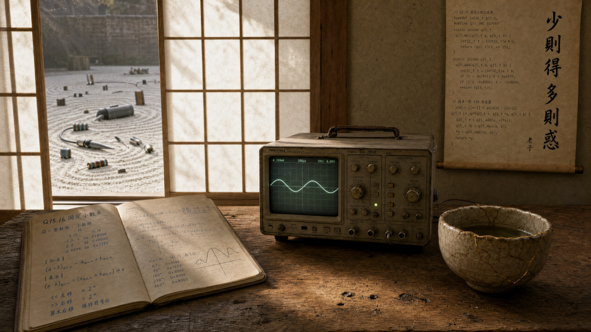

# 从 Q格式到 4bit 量化：电控工程师比 AI 工程师更懂什么叫“降本”

原创 傅存敬 电磁散人 2026-07-19 07:06 广东

> 原文地址: [https://mp.weixin.qq.com/s/TV6Qi5H3XRclC03LDaByWQ](https://mp.weixin.qq.com/s/TV6Qi5H3XRclC03LDaByWQ)

2026年7月，科技圈出了一件怪事。

GitLab裁员14%。Oracle裁掉两万一千人。理由出奇一致——AI提升了效率。但翻开AI公司自己的财报，你看到的却是另一组数字：推理成本在涨，Token消耗在涨，每一轮模型升级带来的算力账单都在涨。用了AI的公司，更穷了。

这不是矛盾。这只是算账的方向反了。

做电机控制的人看到这些新闻，大概只会抬一下眼皮。不是冷漠。是这件事，我们二十年前就经历过。那时候，它不叫Token成本危机。它叫F2812。

2005年前后，电机控制行业的主控芯片是TI的F2812。一块定点DSP。没有硬件浮点单元。做一次Park变换，你得先把角度切成三百六十份，做成查找表塞进Flash。正弦值不是算出来的，是查出来的。一个十六位的定点数，整数部分占几位、小数部分占几位，是用Q格式标定出来的——标错了，波形就散架。

一块F2812几十块钱。你说为什么不直接用浮点DSP？当然有。但那个价格，上不了产线。一台空调控制器省五块钱，一百万台就是五百万。这个账，采购比研发算得清。

于是整个行业接受了一个前提：精度可以丢在小数点后第三位。代价是，每一个工程师都必须学会定点运算——移位、饱和、标幺化、查表。你不能靠编译器替你处理精度，你得自己知道什么时候该左移三位，什么时候该右移五位。你得在写代码之前就想清楚：这个变量的值域是多少，分辨率够不够，溢出会不会炸。

这不是抠门。这是在资源约束下做工程。

二十年后，AI行业正在经历同一件事。

一次大模型推理调用，背后是数以亿计的浮点运算。每一个Token都是真金白银。从2024年到2026年，AI公司的估值曲线还在往上走，但单位经济模型的窟窿越撕越大——用户越多，赔得越多。百度李彦宏说，过去两年大模型推理成本降了90%以上。他没说的是，即使降了90%，大多数AI应用还是亏的。

于是你看到了一连串动作：量化压缩，把32位浮点权重压成4位整数。知识蒸馏，用大模型教小模型，把泛化能力“提纯”进更小的参数空间。投机解码，用小模型先猜几个Token，猜对了省一轮推理，猜错了退回大模型重来。

翻译成电机控制工程师的语言：查表。移位。Q格式标定。

AI行业不是发明了新轮子。它只是在重走二十年前F2812上那条路。

有意思的不在这里。有意思的是，AI行业在走这条路之前，先走了很长一段“多参数崇拜”的弯路。

五百年前，中国有一个年轻人也走过类似的弯路。他叫王守仁。年轻的王阳明守在竹林前，想靠肉眼观察和苦思冥想，从一根竹子里“格”出宇宙天理。三天三夜之后，他病倒了。

很多做仿真的工程师第一次听到这个故事，会心里咯噔一下：我在Simulink里搭的那些模型，不也是一根数字竹子吗？参数越调越多，波形越来越漂亮，但烧进板子跑起来，电机该抖还是抖。

王阳明失败，不是因为不够用功。是因为竹子没有状态方程。天理不可微分、不可观测、不可台架验证。而AI行业犯的是同一个错误——只不过他们的“竹子”叫参数规模。从一代模型到下一代，训练成本翻着跟头往上涨，参数每翻一倍，幻觉率降的那点幅度却越来越像挤牙膏。Google的Gemini在基准测试上刷分如麻，但在真实场景里，稳定性还不如一个搭了二十年电路的老师傅随手画的框图。

模型从来不是岸。模型只是船。

这个道理，王阳明是病倒之后才想通的。他后来的答案只有四个字：知行合一。

对电机控制工程师来说，知，是你写的算法、跑的仿真、搭的模型。行，是示波器探针夹上去的那一刻，是台架轰鸣声里你突然听懂的那一声异响，是电流波形第一次稳定下来的那个瞬间。

真正的控制算法，不诞生在Simulink里。它诞生在知与行的交界面上——诞生在PWM载波频率和死区时间的那个微小间隙里，诞生在电阻随温度漂移了零点几欧姆而你依然能稳住电流环的那次调试里。

定点工程师之所以对Token成本危机毫不意外，不是因为先见之明。是因为他们每天都在知与行的交界面上工作。他们知道，任何模型——不管是Simulink里的传递函数，还是大模型的上千亿参数——最终都要接受同一场考试：现实。

而现实从来不是浮点的。

写到这里，你应该已经看出了那条暗线。

西方管理学界有一个定律叫Gall定律：所有运转良好的复杂系统，都必然是从运转良好的简单系统演化而来的。反过来——从一个复杂的、未经现实校验的系统开始，它永远不会运转。

东方智慧把同一件事讲得更短：少则得，多则惑。老子两千多年前就写好了注脚。

AI行业正在从“多参数崇拜”走向“少Token智慧”。这不是倒退。这是成人礼。就像电机控制行业从浮点幻想走向定点现实，不是技术退步——是技术成熟。一个行业只有承认自己活在资源约束里，才真正开始解决真问题。

但有一个问题，比AI行业的走向更值得你关心。

你自己的技能栈，是浮点豪华版还是定点精简版？

做了十五年，你积累的那些知识、经验、手感——哪些是真值钱的定点核心算法？哪些只是占地方的浮点冗余库？从F2812迁移到下一代平台的时候，每个工程师都被迫做过同一件事：把代码里真正跑高频的部分挑出来，用汇编手写优化；剩下的，能用C就用C。

职业定点化的本质是一样的。找出你的高频路径，把精力押在上面。剩下的，该砍就砍。

我见过一个工程师，电机间歇性抖动。他在三分钟内完成了整个诊断链：上示波器，看到相电流波形在过零点附近出现锯齿状畸变；锁定观测器在电流过零点发散；一步追到根因——MCU的ADC在低电流区信噪比不够。三分钟，从现象到根因到方案。

他的知识栈非常窄。但那个三分钟，值一个博士学位。

这就是定点化生存的核心：不是知道得多，是知道得准。定点数的精度只到小数点后第三位——但在那三位之内，每一个比特都可靠。浮点数能表示的动态范围大得多，但低有效位的精度，是薛定谔的——有和没有之间，取决于你的工况。

AI行业正在交的学费，电机工程行业在二十年前就交过了。学费不便宜，但学到的道理只有一句话。

**资源受限不是过渡期，是常态。**

