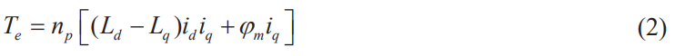
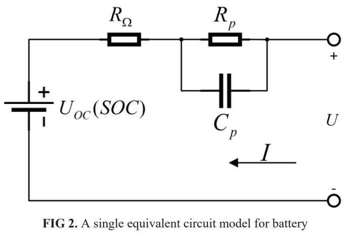
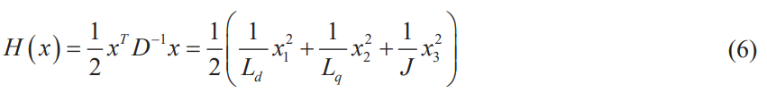
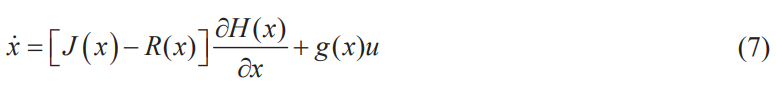
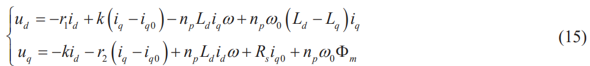
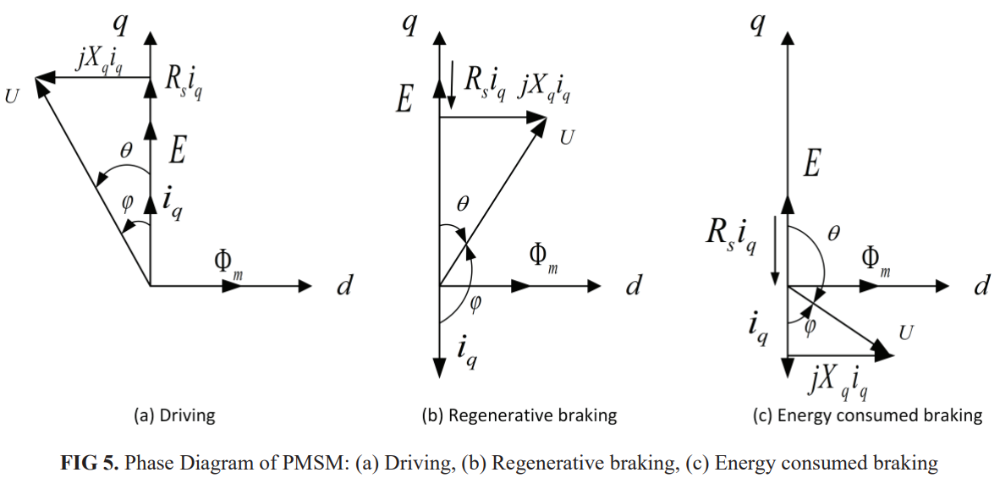
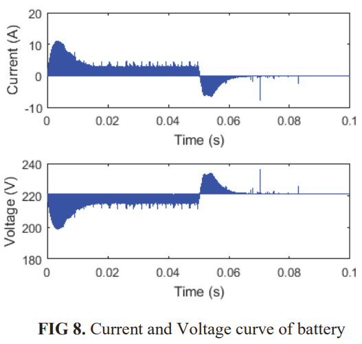
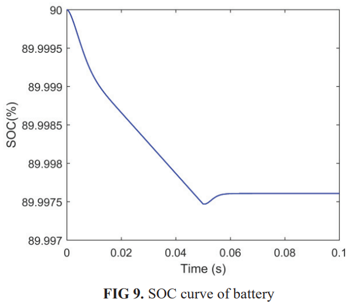

# 从玩家到游戏管理员！——以上帝视角掌控PMSM刹车能量流

原创 傅存敬 电磁散人 2025-10-22 07:06 广东

> 原文地址: [https://mp.weixin.qq.com/s/f2ix94B24Ayhf1uCUkJVfA](https://mp.weixin.qq.com/s/f2ix94B24Ayhf1uCUkJVfA)

上周的两次分享，咱们聊了再生制动的“[思想](https://mp.weixin.qq.com/s?__biz=MzE5MTYzNjgzOA==&mid=2247484282&idx=1&sn=5fb4dedc03362013960062e2dab8dba4&scene=21#wechat_redirect)”和“[实战摸底](https://mp.weixin.qq.com/s?__biz=MzE5MTYzNjgzOA==&mid=2247484291&idx=1&sn=2e4e3d458adcad8099476103253d4a82&scene=21#wechat_redirect)”，大家都成了半个武林高手了。但是，你们有没有想过一个更深层次的问题：我们能不能不只是一个“使用者”，而是成为一个“规则制定者”？

以前的控制方法，像PID，就像咱们在玩一个别人设计好的游戏，我们只能调整几个参数，尽力去通关。但今天这篇论文，作者直接掀了桌子！他说：“我不玩你的游戏了，我自己来写游戏规则！”

他用的这套神功，叫“端口控制哈密顿（PCH）”。听着名字是不是就感觉一股学霸的气息扑面而来？

好！今天咱们就学习如何成为一个掌控雷电的“电机控制游戏管理员(GM——Game Manager)”！

第一章：GM的野心——为电机世界建立“创世模型”

想当GM，你得先彻底搞懂你这个游戏世界（电机系统）的底层规则。作者做的第一件事，就是用数学语言，把这个世界的一切都描述出来。

第一节：认识你的“游戏角色”——电机和电池

-   主角：永磁同步电机(PMSM)
    

作者首先用公式(2) 给咱们的主角电机画了个像：

哎呀，看着头大？别怕，给大家翻译一下！这篇论文用的是一种叫“表贴式”的永磁同步电机，它的直轴Ld和交轴电感Lq差不多大，所以前面那一大坨 (Ld - Lq)idiq就约等于0了！

所以，这个公式瞬间就简化成了：

Te≈ np \* Φm \* iq

这是什么意思呢？

-   Te: 电机的力气（转矩）。
    
-   np \* Φm: 一个由电机自身结构决定的常数，可以看作是电机的“天生神力指数”。
    
-   iq: 这就是我们唯一能控制的“魔法值”——q轴电流！
    

结论：对于这种电机，它的力气大小，就只跟你的“魔法值iq”成正比！简单不简单？id这个“废柴”电流，出工不出力，对力气没贡献，所以我们以后就让它等于0，别让它瞎掺和！

-   后勤：电池
    

GM还得关心后勤仓库（电池）。作者用图2这个电路模型，把电池的脾气摸得透透的。这个模型告诉我们，电池不只是一个简单的电压源，它有内阻Ro（会发热），还有“极化效应”Rp、Cp（充电或放电时电压会慢慢变化）。

第二节：创世法则——哈密顿能量模型

这是今天最硬核，也最酷炫的部分！作者把整个电机系统，看成一个封闭的“小宇宙”，然后用一个叫哈密顿函数H(x)的东西，来定义这个宇宙的总能量。

GM创世公式 H(x) :

大白话翻译：这就是咱们电机宇宙里的“能量守恒定律”！

宇宙总能量 H(x) = 磁场能量1 + 磁场能量2 + 轮子转动的动能

有了总能量，作者又用了一个更牛的公式，PCH模型，来描述这个宇宙是怎么运转的。

这个公式看起来能吓跑99%的同仁，但你只要跟紧着我，就能看懂它的本质！

-   ẋ (系统状态的变化): 你的电机从快到慢，从不转到转，就是状态在变。
    
-   J(x) (内部能量交换): 这部分掌管着“动能”和“磁能”之间的相互转化。它就像宇宙里的“太极图”，能量在里面转来转去，但不增加也不减少（舍利子，是诸法空相，不生不灭，不垢不净，不增不减）。
    
-   R(x) (能量损耗): 这部分就是电阻发热，是宇宙里不断漏气的“小破洞”，能量只会减少。
    
-   g(x)u (GM的能量注入): u就是我们的控制指令（电压），g(x)是“能量通道”。这部分就是我们作为GM，往这个游戏世界里充钱（注入能量）或者抽水（抽取能量）的唯一手段！
    

给工程师的启示：

-   算法工程师：你看懂了吗？你写的程序，就是那个u！你的工作，就是通过g(x)这个唯一的“端口”，精确地给系统注入或抽出能量，让它按照你的剧本演！
    
-   硬件工程师 & 电机设计师：R(x)这个“破洞”的大小，就是你们的责任！你们设计的电路和电机如果损耗小，R(x)就小，那这个宇宙的能量利用率就高！
    

第二章：GM的权杖——设计“外科手术式”的控制器

好了，现在我们有了这个世界的“创世模型”，我们就可以为所欲为了！

作者的目标就是：当刹车指令一来，我要让系统从“驱动状态”平滑、快速地变成“制动状态”，而且能量回收效率最高！

他用的方法叫IDA-PBC，咱们可以把它理解成一种“能量整形手术”。通过一系列复杂的数学推导，作者最终算出了我们作为GM，应该下达什么样的指令。

GM的终极指令——控制器公式(15):

这一对复杂的ud和uq公式，就是我们GM权杖上发出的魔法咒语！我们不需要去手算它，我们只需要知道：

-   这个公式，是根据我们想让系统达到的目标能量状态，反推出来的最优控制指令。
    
-   它综合考虑了当前状态、目标状态、能量损耗等所有因素。
    
-   它能实现最快、最平顺的能量调节。
    

算法工程师同仁请看：你的任务，就是把这个公式(15)，变成你嵌入式系统里的代码！k, r1, r2这些参数，就是留给你微调“手术”风格的旋钮。

第三章：见证奇迹的时刻——仿真结果分析

作者设计好了这套“GM系统”，然后就在电脑里模拟运行了一下。结果惊为天人！

请全体同仁，将目光聚焦在最后几张图上！

图5的矢量图：这就是能量流动的方向图！

(a) 驱动时：iq是正的，力气向前，从电池“吸”能量。

(b) 再生制动时：iq变成负的，力气向后（刹车），开始往电池“吐”能量！我们的GM成功地逆转了能量流！

图8的电池电流/电压图：这是最直接的证据！

当时间t=0.05秒，GM下达了“刹车！”指令。

你们看上面那根电流线，瞬间从正数（放电），跳水到了负数（充电）！钱，真的被我们从系统里抽回来了！

图9的电池SOC图：这是“国库”的账本！

(a) 在0.05秒之后，代表电池电量的SOC曲线，那根线是不是微微地往上翘了一点点？

(b) 虽然翘得不多，但它雄辩地证明了：我们的国库（电池），真的因为刹车而变充实了！“刹车回血”在GM的掌控下，完美实现！

总结：从“调参侠”到“架构师”

同仁们，本次分享，我们接触到了电机控制领域最前沿、最深刻的思想之一。

-   对于新入门的算法工程师：你可能暂时还写不出这么复杂的模型，但你一定要理解这种“从能量出发”的思想。这会让你在未来看待控制问题时，站得更高，看得更远。你不再是一个只会调PID参数的“调参侠”，而是一个思考系统能量流动的“架构师”。
    
-   对于硬件和电机工程师：你们设计的每一个元件，都在这个“哈密顿能量宇宙”中扮演着角色。你们的工作，就是让能量交换（J(x)）更顺畅，让能量损耗（R(x)）更小，为“GM”提供一个更完美的游戏世界！
    

这篇论文告诉我们，最高级的控制，不是头痛医头、脚痛医脚，而是建立一个能描述事物本质的统一模型，然后在规则的层面上，优雅地解决问题。

这就是数学和物理带给工程学的无与伦比的魅力！

参考文献：

\[1\] Gao Q , Lv C , Zhao N ,et al.Regenerative braking system of PM synchronous motor\[J\].American Institute of Physics Conference Series, 2018.DOI:10.1063/1.5033775.

文档链接：https://pan.baidu.com/s/1orPXIEMT2OtvPdov8rTnbw?pwd=fd81 提取码: fd81